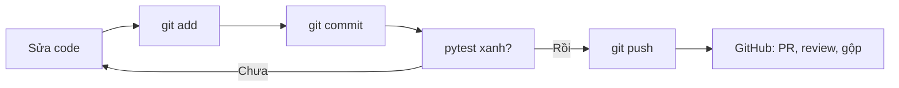
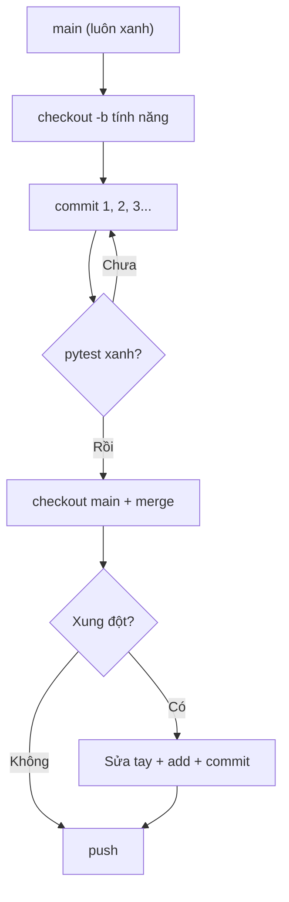

<!-- TỰ ĐỘNG ĐỒNG BỘ từ 03-Thuc-Chien/14-Git/bai.md — đừng sửa trực tiếp, sửa bản chính rồi chạy tools/sync_tracks.py -->

# Bài 14 — Git & GitHub

> 🚀 **Nhánh 03 — Thực Chiến (API / Package / Project)**

---

## 🧠 Điều kiện tiên quyết

- [Bài 11 — Mini Project](../11-Mini-Project/bai.md) (có project để quản lý bằng git)
- [Bài 13 — Pytest](../13-Pytest/bai.md) (test xanh rồi mới commit — quy trình chuẩn)

---

## 🎯 Mục tiêu

Sau bài học này, học viên sẽ:

* ✅ Hiểu git là gì: máy ảnh chụp toàn bộ thư mục theo thời gian, quay lại được.
* ✅ Cài đặt, khai báo tên/email, tạo repo, commit đúng chuẩn.
* ✅ Đọc `status/log/diff` để biết chính xác mình đã đổi gì.
* ✅ Đẩy lên GitHub (`push`), lấy về (`pull/clone`) và xử lý khi bị từ chối.
* ✅ Làm việc bằng nhánh (branch), gộp (merge) và giải quyết xung đột tay.
* ✅ Viết `.gitignore` để không commit rác/mật khẩu, và biết KHÔNG BAO GIỜ đẩy token/API key.
* ✅ Mở Pull Request theo đúng quy trình đóng góp của repo này.

---

## 📖 Mở đầu

Code không có git giống như viết văn không bao giờ bấm lưu: sửa hỏng là mất,
muốn xem lại bản hôm qua thì chịu, 2 người cùng sửa 1 file thì đè nhau.
Git giải cả 3 bài toán — và GitHub là nơi cất các bản chụp đó lên mạng để
chia sẻ, sao lưu, phối hợp.

Bài này thực hành 100%: gõ theo từng lệnh, nhìn output thật.

---

## 💡 Ý tưởng trực quan

* **Commit:** bấm máy ảnh chụp toàn bộ thư mục (trừ đồ bỏ qua trong
  `.gitignore`). Mỗi ảnh có mã số (hash), lời chú thích (message), ảnh trước đó
  (cha) — nối thành chuỗi lịch sử.
* **Branch:** vũ trụ song song — rẽ nhánh thử nghiệm, hỏng thì xóa nhánh (vũ trụ
  chính an toàn), ổn thì gộp về.
* **Merge conflict:** 2 người cùng sửa 1 dòng — máy không biết nghe ai nên hỏi
  bạn (đánh dấu `<<<<<<<` / `>>>>>>>`), bạn chọn tay.
* **Push/pull:** đồng bộ album ảnh giữa máy mình và GitHub.



---

## 📚 Kiến thức

### 1. Cài đặt và khai báo danh tính (làm 1 lần duy nhất)

```bash
git --version
git config --global user.name "Ten Cua Ban"
git config --global user.email "ban@vidu.vn"
```

Mọi commit sau này đều đóng dấu tên/email này — sai thì sửa bằng 2 lệnh trên
(chỉ ảnh hưởng commit mới, không sửa được commit cũ đã push).

### 2. Tạo repo, commit đầu tiên

```bash
cd cua-hang-sach
git init
git status --short        # ?? main.py  (?? = file mới, git chưa theo dõi)
git add main.py           # đưa vào "khu vực chờ chụp"
git status --short        # A  main.py  (A = đã add, chờ commit)
git commit -m "bai dau tien: in loi chao"
git log --oneline         # 8a52a48 bai dau tien: in loi chao
```

Ba trạng thái file phải thuộc lòng:

| Ký hiệu `status` | Nghĩa | Việc tiếp theo |
|---|---|---|
| `??` | Mới, git chưa biết | `git add` nếu muốn giữ |
| `A` / `M` (cột trái) | Đã add, chờ commit | `git commit` |
| `M` (cột phải) / `D` | Đổi nhưng chưa add | `git add` rồi commit |
| (trống) | Sạch — khớp commit cuối | Yên tâm làm tiếp |

### 3. Quy tắc commit message (nhìn log là hiểu cả project)

```bash
git commit -m "them: chuc nang tim sach theo ten"
git commit -m "sua: tim khong phan biet hoa thuong"
git commit -m "test: them test cho luu_file"
```

Công thức: **động từ + việc làm, chữ thường, ngắn gọn** (`them/sua/xoa/test/docs`).
Tránh: `update`, `fix`, `xong`, `asdfgh` — 1 tháng sau đọc lại không hiểu gì.

### 4. Đẩy lên GitHub và lấy về

```bash
git remote add origin https://github.com/BAN/cua-hang-sach.git
git branch -M main
git push -u origin main
```

> ⚠️ **Bẫy `master` vs `main`:** `git init` ở máy bạn có thể tạo nhánh `master`,
> nhưng GitHub mặc định `main`. Lệch nhau là push lỗi — `git branch -M main`
> đổi tên cho khớp rồi push lại. (Chính repo này cũng dùng `main`.)

Bị từ chối push (ai đó push trước):

```bash
git pull --no-rebase origin main   # lấy về + gộp, giải quyết xung đột nếu có
git push origin main               # đẩy lại
```

**Không bao giờ** `--force` lên nhánh chung khi chưa hiểu rõ — đè mất code
người khác.

### 5. Nhánh: thử nghiệm không sợ hỏng

```bash
git checkout -b them-chuc-nang   # tạo nhánh mới + nhảy sang
# ... sửa code, commit thoải mái ...
git checkout main                # về nhánh chính
git merge them-chuc-nang         # gộp vào
git branch -d them-chuc-nang     # xong thì xóa nhánh
```

Quy tắc: `main` luôn chạy được (test xanh). Mọi thử nghiệm làm trên nhánh.

### 6. Xung đột merge — đọc dấu, chọn tay, commit

Khi 2 nhánh sửa cùng dòng, `git merge` dừng lại và đánh dấu trong file:

```python
<<<<<<< HEAD
print("Dong tu main")
=======
print("Them dong moi")
>>>>>>> them-chuc-nang
```

`git status --short` hiện `UU` (cả 2 bên cùng sửa). Giải quyết:

1. Mở file, **xóa hết dấu** `<<<<<<<`, `=======`, `>>>>>>>`, giữ lại nội dung
   muốn (1 bên hoặc cả 2).
2. `git add <file>` (báo "xong, tôi đã chọn").
3. `git commit` (không `-m` cũng được — git tự ghi message gộp).

> 💡 Xung đột không phải lỗi — là git **hỏi ý kiến** khi không tự quyết được.
> Sợ nhất là thấy dấu lạ rồi `checkout --ours` bừa — mất code nhánh kia.

### 7. `.gitignore` — đừng commit rác và TUYỆT ĐỐI không commit mật khẩu

File `.gitignore` (đặt ở gốc repo), mỗi dòng một mẫu bỏ qua:

```text
__pycache__/
*.pyc
.venv/
*.db
*.log
kho.json
.env
```

Hai nhóm bắt buộc phải có:

* **Rác máy:** `__pycache__/`, `.venv/`, `*.log`, file `.db`/`.json` dữ liệu test.
* **Bí mật:** `.env`, mọi file chứa **token, API key, mật khẩu**.

> 🔒 **Luật sắt:** token/API key đã push lên GitHub công khai thì coi như **lộ** —
> phải thu hồi (revoke) ngay trên trang quản lý, xóa commit không cứu được
> (người ta đã fork/copy). Viết code đọc key từ biến môi trường
> (`os.environ["API_KEY"]`), không bao giờ ghi cứng key vào file.

### 8. Đóng góp qua Fork + Pull Request (dùng ngay cho repo này!)

1. **Fork** repo về tài khoản mình (nút Fork trên GitHub).
2. `git clone` bản fork về máy.
3. Tạo nhánh: `git checkout -b content/sua-loi-chinh-ta`.
4. Sửa, test (`pytest`), commit rõ ràng, `git push` lên fork.
5. Mở **Pull Request** về repo gốc, mô tả thay đổi.
6. Chờ review, sửa theo góp ý, được gộp (merge). 🎉

---

## 💻 Ví dụ

### Ví dụ 1 — Dễ: vòng đời 5 lệnh (chạy theo!)

```bash
mkdir shop-dien-tu && cd shop-dien-tu
git init -q
git config user.name "Ban Hoc"
git config user.email "ban@vidu.vn"
echo 'print("Chao")' > main.py
git add main.py
git commit -m "bai dau tien: in loi chao"
git log --oneline
```

Output cuối:

```
8a52a48 (mã khác nhau mỗi máy là bình thường) bai dau tien: in loi chao
```

### Ví dụ 2 — Thực tế: nhánh tính năng + PR mini (2 người giả lập 1 máy)

```bash
git checkout -b tinh-nang-giam-gia
# sửa kho.py: thêm hàm giam_gia + test, pytest xanh
git add kho.py test_kho.py
git commit -m "them: giam_gia + test"
git checkout main
git merge tinh-nang-giam-gia
git branch -d tinh-nang-giam-gia
git push origin main
```

Trên GitHub: so sánh nhánh → mở PR → tự review diff của chính mình
(thói quen vàng: **đọc lại diff trước khi gộp**, bắt được debug thừa,
`print` quên xóa, key vô tình lọt vào).

### Ví dụ 3 — Khó: giải quyết xung đột thật (đã kiểm chứng output)

Hai nhánh cùng sửa dòng cuối `main.py`:

```bash
git merge them-chuc-nang
# Auto-merging main.py
# CONFLICT ... (rc = 1)
git status --short   # UU main.py
```

Mở file, thấy dấu `<<<<<<< HEAD ... ======= ... >>>>>>>`, sửa thành giữ cả hai:

```python
print("Chao")
print("Dong tu main")
print("Them dong moi")
```

```bash
git add main.py
git commit -m "gop nhanh: giu ca hai"
git log --oneline
```

```
4f250f6 gop nhanh: giu ca hai
657545d dong tu master
2d974a5 them dong moi
```

Commit gộp có **2 cha** — lịch sử giữ nguyên cả 2 nhánh, không mất gì.

---

## 🔍 Phân tích từng bước (đọc `status` như đọc tin nhắn)

```
UU main.py   → cả 2 bên cùng sửa → mở file giải quyết tay
A  test.py   → mới add, chờ commit
M  kho.py    → (cột phải) đổi nhưng chưa add → git add kho.py
M  main.py   → (cột trái) đã add → git commit
?? todo.txt  → file mới, git chưa biết → add nếu cần, không thì ignore
```

---

## 📊 Minh họa



---

## ⚠️ Những lỗi thường gặp

### Lỗi 1: Commit cả `.venv`, `__pycache__`, file `.db` nặng hàng trăm MB

* **Cách sửa:** viết `.gitignore` **trước** commit đầu tiên. Lỡ rồi thì
  `git rm -r --cached .venv __pycache__` rồi commit (giữ file ở máy, xóa khỏi git).

### Lỗi 2: Push bị từ chối, cố `--force`

* **Cách sửa:** `pull` gộp trước rồi push. `--force` chỉ dùng trên nhánh cá nhân
  khi chắc chắn không ai khác dùng nhánh đó.

### Lỗi 3: Lộ API key/token lên GitHub công khai

* **Cách sửa:** revoke key ngay, chuyển sang biến môi trường + `.env` +
  `.gitignore`. Không có cách "xóa cho chắc" sau khi đã public.

### Lỗi 4: Nhánh `main` đỏ (test fail) vì commit thẳng

* **Cách sửa:** luật sắt — thử nghiệm trên nhánh, `main` chỉ nhận code đã
  `pytest` xanh + review diff.

### Lỗi 5: Cảnh báo LF/CRLF trên Windows

```
warning: in the working copy of 'x.py', LF will be replaced by CRLF...
```

* Đây chỉ là **cảnh báo**, không phải lỗi — Git tự đổi xuống dòng cho hợp
  từng hệ điều hành. Muốn hết hẳn: thêm `* text=auto` vào `.gitattributes`.

---

## 🧪 Trường hợp đặc biệt

* **Quên `git add` mà commit:** commit trống/rỗng — kiểm tra `git status`
  trước mọi commit (thói quen 3 giây cứu cả buổi).
* **Commit nhầm message:** chưa push → `git commit --amend -m "đúng"`.
  Đã push → đừng amend, commit mới sửa (tránh rối lịch sử chung).
* **Xóa nhầm nhánh chưa gộp:** `git reflog` tìm lại hash rồi `git checkout -b`
  từ hash đó — git hiếm khi mất dữ liệu thật nếu chưa `gc`.
* **Repo quá nặng do file lớn:** dùng Git LFS cho dataset/model, hoặc để data
  ngoài repo (link tải). Quy tắc: repo code < vài chục MB.

---

## 🚀 Ứng dụng thực tế

* Mọi bài tập sau này: làm trên nhánh → `pytest` xanh → commit → push.
  Portfolio GitHub xanh commit + lịch sử sạch chính là CV của lập trình viên.
* Nối thẳng Bài 13: CI chạy `pytest` mỗi lần push (GitHub Actions — tự học tiếp).

---

## 🧩 Bài tập

### 🟢 Cơ bản (1–3)

**Bài 1 — 5 lệnh đầu đời.** Tạo thư mục mới, `init`, khai báo tên/email, tạo
`hello.py`, `add`, `commit`, `log`. Chụp (chép) output `log --oneline` và
`status --short` (phải trống = sạch).

**Bài 2 — .gitignore.** Tạo `.venv/`, `__pycache__/`, `data.db`, `key.txt`
giả. Viết `.gitignore` để `git status` không hiện chúng. Kiểm tra bằng
`git status --short` (phải trống).

**Bài 3 — Đọc status.** Cho output: `M  kho.py`, ` M main.py`, `?? ghi.txt`.
Giải thích từng dòng và lệnh tiếp theo cho mỗi file.

### 🟡 Hiểu sâu (4–6)

**Bài 4 — Commit message.** Viết lại 3 message xấu (`update`, `fix bug`, `xong`)
thành chuẩn động-từ + việc-làm. Giải thích vì sao message tốt giúp `log` có ích.

**Bài 5 — Nhánh an toàn.** Tạo nhánh `thu-nghiem`, xóa 1 hàm trong `kho.py`,
commit, quay về `main` kiểm tra hàm còn nguyên. Giải thích vì sao (nhánh là
con trỏ tới commit, không phải bản copy thư mục).

**Bài 6 — Push bị từ chối.** Giả lập: 2 bản clone cùng repo, A push trước,
B push sau (bị reject). B `pull`, giải quyết (không xung đột), push lại.
Ghi lại toàn bộ lệnh đã dùng.

### 🔴 Vận dụng (7–8)

**Bài 7 — Xung đột tay.** Làm lại ví dụ 3: 2 nhánh sửa cùng dòng, `merge`
báo `UU`, giải quyết giữ cả 2, commit gộp. Chụp `log --oneline --graph`
(hoặc chép) chứng minh commit gộp có 2 cha.

**Bài 8 — PR thật.** Fork repo HyperHub-Python, sửa 1 lỗi chính tả bất kỳ,
push nhánh, mở PR đúng quy trình mục 8. Dán link PR vào vở (đây là đóng góp
thật cho cộng đồng!).

---

## ✅ Đáp án

> 💡 **Hãy tự làm bài tập trước** rồi mới mở đáp án.

<details>
<summary>✅ Bài 1: 5 lệnh đầu đời</summary>

```bash
mkdir demo && cd demo
git init -q
git config user.name "Ban Hoc"
git config user.email "ban@vidu.vn"
echo 'print("Chao")' > hello.py
git add hello.py
git commit -m "bai dau tien"
git log --oneline    # <mã-hash> bai dau tien
git status --short   # (trống = sạch ✔)
```

Mã hash mỗi máy khác nhau là bình thường — quan trọng là message đúng.

</details>

<details>
<summary>✅ Bài 2: .gitignore</summary>

```text
.venv/
__pycache__/
*.db
key.txt
```

`git status --short` trống trơn là đạt. Kiểm tra ngược: `git check-ignore -v key.txt`
in ra dòng rule nào đã chặn file đó.

</details>

<details>
<summary>✅ Bài 3: Đọc status</summary>

* `M  kho.py` (M cột trái): đã add, chờ commit → `git commit -m "..."`.
* ` M main.py` (M cột phải): đổi nhưng chưa add → `git add main.py` rồi commit.
* `?? ghi.txt`: file mới git chưa biết → `git add` nếu muốn giữ, hoặc thêm vào
  `.gitignore` nếu là rác.

</details>

<details>
<summary>✅ Bài 4: Commit message</summary>

* `update` → `them: ham tim sach theo tac gia`
* `fix bug` → `sua: tim khong thay khi ten co dau cach thua`
* `xong` → `test: them 3 test cho sua_gia`
* Vì sao: `git log --oneline` là nhật ký project — message rõ giúp tìm lại
  "hôm đó sửa gì" trong 1 giây, message rác thì log vô dụng.

</details>

<details>
<summary>✅ Bài 5: Nhánh an toàn</summary>

Nhánh trong git chỉ là **con trỏ tới 1 commit** (file 41 byte trong
`.git/refs/heads/`), không copy code. Commit trên nhánh mới không động tới
`main` — quay về là mọi thứ nguyên vẹn. Xóa nhánh (`-d`) cũng chỉ xóa con trỏ
(nếu đã gộp), code đã gộp vẫn còn.

</details>

<details>
<summary>✅ Bài 6: Push bị từ chối</summary>

```bash
# Máy B sau khi A đã push:
git push origin main
# ! [rejected] (fetch first)
git pull --no-rebase origin main   # lấy + gộp (không xung đột thì tự xong)
git push origin main               # giờ thì được
```

Nguyên tắc: remote đi trước thì mình phải "đuổi theo" (pull) rồi mới đẩy.

</details>

<details>
<summary>✅ Bài 7: Xung đột tay</summary>

Đúng quy trình ví dụ 3: `merge` báo lỗi (rc = 1), `status` hiện `UU main.py`,
mở file xóa dấu `<<<<<<<`/`=======`/`>>>>>>>` giữ cả 2 đoạn, `add`, `commit`.
Kiểm tra: `git log --oneline --graph` thấy commit gộp nối 2 nhánh:

```
* 4f250f6 gop nhanh: giu ca hai
|\
| * 2d974a5 them dong moi
* | 657545d dong tu master
```

</details>

<details>
<summary>✅ Bài 8: PR thật</summary>

Không có đáp án mẫu — làm đúng quy trình mục 8 là đạt:
Fork → clone → nhánh mới → sửa + test → push → mở PR với mô tả rõ ràng.
PR đầu tiên được gộp là cột mốc đáng nhớ, chúc mừng trước! 🎉

</details>

---

## 🧠 Thử thách

**Thử thách project:** Bật GitHub Actions chạy `pytest` tự động mỗi lần push
cho project cửa hàng sách: tạo `.github/workflows/test.yml` chạy
`pip install pytest` + `pytest -q`. Push thử 1 commit đỏ (làm hỏng 1 test cố ý)
xem CI báo đỏ, rồi sửa cho xanh. Đây là chuẩn công nghiệp thu nhỏ.

---

## 📝 Tóm tắt

| Khái niệm | Nội dung |
|---|---|
| 📸 Commit | Ảnh chụp thư mục + message rõ nghĩa |
| 📋 status/log/diff | Biết chính xác mình đã đổi gì |
| ⬆️⬇️ push/pull | Đồng bộ với GitHub; reject thì pull trước |
| 🌿 Nhánh | Thử nghiệm an toàn; `main` luôn xanh |
| ⚔️ Xung đột | `UU` → sửa tay, xóa dấu, add, commit |
| 🚫 .gitignore | Chặn rác + TUYỆT ĐỐI chặn key/token |
| 🤝 PR | Fork → nhánh → push → PR → review → gộp |

---

## ➡️ Điều hướng

**Vị trí:** `04-Full/Phan-3-Thuc-Chien/14-Git/bai.md`

🏆 **Bạn đã hoàn thành lộ trình Thực chiến!** Muốn luyện tư duy giải thuật, quay lại
[02 — Thuật Toán](../../Phan-2-Thuat-Toan/01-Tu-Duy-Thuat-Toan/bai.md). Muốn đào sâu,
học tiếp [Bài 13 — Pytest](../13-Pytest/bai.md) để test bao phủ toàn project.
