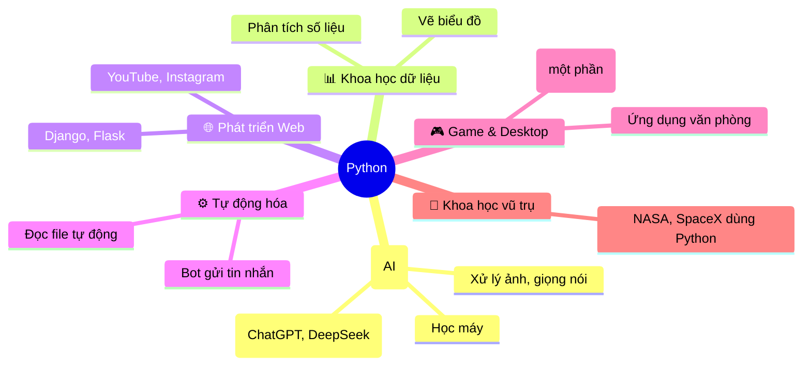
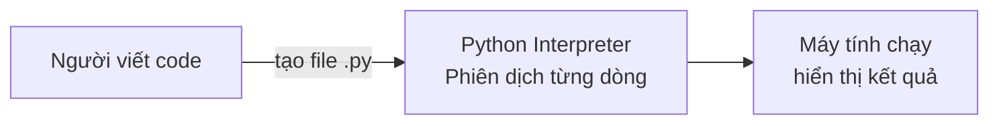

# 🐍 Bài 1: Giới Thiệu Python

> 🎓 **Chương 1 – Khởi đầu hành trình lập trình**

---

## 🎯 Mục tiêu

Sau bài học này, học viên sẽ:

* ✅ Hiểu **Python là gì**, vì sao nó phổ biến nhất thế giới hiện nay.
* ✅ Biết được **lịch sử hình thành** và ai đã tạo ra Python.
* ✅ Nắm được các **lĩnh vực ứng dụng** thực tế của Python (AI, Web, Khoa học dữ liệu...).
* ✅ Phân biệt được **ngôn ngữ thông dịch** với ngôn ngữ biên dịch.
* ✅ Viết được **chương trình đầu tiên** in ra màn hình dòng chữ "Xin chào".
* ✅ Biết nơi **luyện tập code online** khi chưa cài đặt Python.

---

## 📖 Kiến thức

### 1. Python là gì?

> 💬 **Nói đơn giản:** Python là một **ngôn ngữ lập trình bậc cao** — nghĩa là nó gần với ngôn ngữ con người (tiếng Anh) hơn là ngôn ngữ máy tính (0 và 1).

**Ví dụ đời thực:**
Giống như bạn học một **ngôn ngữ giao tiếp** để nói chuyện với người nước ngoài, bạn học Python để "nói chuyện" với máy tính. Thay vì ra lệnh bằng cách bật/tắt dòng điện (0/1), bạn ra lệnh bằng các từ tiếng Anh dễ hiểu như:

```python
print("Xin chào")
```

### 2. Lịch sử ra đời

| Năm | Sự kiện |
|---|---|
| **1989** | **Guido van Rossum** (người Hà Lan) bắt đầu viết Python như một dự án giải trí dịp Giáng sinh |
| **1991** | Phát hành phiên bản **Python 1.0** đầu tiên |
| **2000** | Phát hành **Python 2.0** |
| **2008** | Phát hành **Python 3.0** — phiên bản cách mạng, vẫn được dùng đến nay |
| **Hiện nay** | Python nằm trong **top 3 ngôn ngữ phổ biến nhất thế giới** |

> 🐍 **Tên gọi "Python"** — không phải do con rắn, mà Guido đặt tên theo chương trình hài *Monty Python's Flying Circus* mà ông yêu thích.

### 3. Vì sao Python được yêu thích?

| Đặc điểm | Giải thích dễ hiểu |
|---|---|
| ✏️ **Cú pháp ngắn gọn** | Code gần giống tiếng Anh, dễ đọc như sách giáo khoa |
| 🧠 **Dễ học** | Phù hợp làm ngôn ngữ **đầu tiên** cho người mới |
| 📦 **Kho thư viện khổng lồ** | Hơn **400.000+** thư viện miễn phí sẵn sàng dùng |
| 🌍 **Đa nền tảng** | Chạy được trên Windows, macOS, Linux |
| 🆓 **Miễn phí** | Tải về và dùng thoải mái, không tốn tiền |
| 🔥 **Cộng đồng lớn** | Hàng triệu lập trình viên sẵn sàng giúp đỡ |

### 4. Python được dùng ở đâu?



> 💡 **Bạn có biết:** **YouTube**, **Instagram**, **Dropbox**, **Reddit** đều dùng Python cho hệ thống của mình. **NASA** và **SpaceX** cũng dùng Python để tính toán quỹ đạo tàu vũ trụ!

### 5. Thông dịch hay biên dịch?

Python là ngôn ngữ **thông dịch (interpreted)**. Hãy tưởng tượng:

* 🗣️ **Ngôn ngữ thông dịch** (Python): giống như bạn **phiên dịch trực tiếp** từng câu — phiên dịch tới đâu, nói ra tới đó. Sửa lỗi nhanh, chạy ngay.
* 📖 **Ngôn ngữ biên dịch** (C/C++): giống như dịch **cả quyển sách** trước khi đọc — chạy nhanh hơn nhưng sửa lỗi lâu hơn.



### 6. Chương trình đầu tiên của bạn

Hãy tạo file `hello.py` và gõ:

```python
# Chương trình đầu tiên: in dòng chữ chào hỏi
print("Xin chào mừng bạn đến với Python!")
```

Kết quả chạy:

```
Xin chào mừng bạn đến với Python!
```

**Giải thích từng dòng:**

| Dòng code | Ý nghĩa |
|---|---|
| `# Chương trình đầu tiên...` | Dòng **chú thích** — để con người đọc, máy tính bỏ qua |
| `print("...")` | Lệnh **in ra màn hình** nội dung bên trong cặp ngoặc kép |
| `"Xin chào..."` | **Chuỗi ký tự** — đoạn chữ cần hiển thị |

> ⚠️ **Lưu ý:** Trong code Python, **không được dùng dấu nháy kiểu Unicode "..." hoặc '...'** — phải dùng dấu nháy **thẳng** `"` `'` mà bàn phím tiếng Anh gõ ra. Nếu dùng sai, chương trình báo `SyntaxError`.

---

## 💡 Ví dụ minh họa

### Ví dụ 1: In nhiều dòng chữ

```python
# In từng dòng chữ
print("Họ tên: Nguyễn Văn An")
print("Trường: THPT Python")
print("Lớp: 10A1")
```

Kết quả:

```
Họ tên: Nguyễn Văn An
Trường: THPT Python
Lớp: 10A1
```

### Ví dụ 2: In số và phép tính

```python
# In ra số
print(2026)

# In ra kết quả phép tính
print(10 + 5)
print(10 - 5)
```

Kết quả:

```
2026
15
5
```

> 💡 Python làm toán hộ bạn luôn! Lệnh `print(10 + 5)` in ra `15` chứ không phải dòng chữ `10 + 5`.

### Ví dụ 3: Vẽ chữ nghệ thuật

```python
# Vẽ dấu * ra màn hình
print("  *  ")
print(" *** ")
print("*****")
```

Kết quả:

```
  *
 ***
*****
```

---

## 🔬 Ví dụ nâng cao

### Ví dụ: Máy chào hỏi thông minh (cần kiến thức bài 7)

> Khi học xong bài về nhập dữ liệu, bạn sẽ viết được chương trình này:

```python
# Chương trình chào hỏi có tương tác
ten = input("Bạn tên gì? ")
print("Chào mừng", ten, "đến với khóa học Python!")
```

Kết quả chạy:

```
Bạn tên gì? Mai
Chào mừng Mai đến với khóa học Python!
```

---

## ⚠️ Lỗi thường gặp

### Lỗi 1: Quên dấu ngoặc

```python
print "Xin chào"   # ❌ SAI
print("Xin chào")  # ✅ ĐÚNG
```

* **Nguyên nhân:** Python 3 yêu cầu `print` phải có dấu ngoặc tròn.
* **Kết quả báo:** `SyntaxError: Missing parentheses in call to 'print'`

### Lỗi 2: Dùng dấu nháy Unicode

```python
print(“Xin chào”)   # ❌ SAI — dấu nháy cong
print("Xin chào")   # ✅ ĐÚNG — dấu nháy thẳng
```

* **Nguyên nhân:** Máy tính phân biệt dấu nháy thẳng và cong; code chỉ nhận dấu nháy thẳng `"`.
* **Cách khắc phục:** Tắt tính năng *Smart Quotes* trong trình soạn thảo hoặc gõ lại bằng tay.

### Lỗi 3: Nhầm lẫn `Print` với `print`

```python
Print("Xin chào")   # ❌ SAI — chữ P viết hoa
print("Xin chào")   # ✅ ĐÚNG — chữ thường
```

* **Nguyên nhân:** Python **phân biệt chữ hoa, chữ thường**.
* **Kết quả báo:** `NameError: name 'Print' is not defined`

---

## 💎 Mẹo

* ✨ **Mẹo ghi nhớ:** `print()` là **bộ loa** của chương trình — muốn máy "nói" ra điều gì, đưa vào loa!
* 📝 **Tên file:** Đặt tên có nghĩa như `hello.py`, `bai1.py`. Phần mở rộng `.py` là dấu hiệu file Python.
* 🔤 **Chỉ dùng chữ thường** khi gõ lệnh Python (trừ khi lệnh yêu cầu viết hoa).
* 🧪 **Luyện online ngay** (chưa cần cài đặt):
  * [Replit](https://replit.com/)
  * [Google Colab](https://colab.research.google.com/)
  * [Python Tutor](https://pythontutor.com/) — xem từng bước chạy, cực kỳ tốt cho người mới.
* 📖 **Đọc thêm:** [Python.org – About](https://www.python.org/about/)

---

## 📝 Tóm tắt

| Khái niệm | Nội dung |
|---|---|
| 🐍 Python | Ngôn ngữ lập trình bậc cao, dễ học, phổ biến nhất thế giới |
| 👨‍💻 Tác giả | Guido van Rossum, phát hành lần đầu năm 1991 |
| 🗣️ Thông dịch | Chạy từng dòng lệnh, sửa lỗi nhanh |
| 🌍 Ứng dụng | AI, khoa học dữ liệu, web, tự động hóa, game, vũ trụ |
| 🖨️ `print()` | Lệnh in dữ liệu ra màn hình |
| ✍️ `#` | Dấu chú thích trong Python |
| ❗ Điểm quan trọng | Code phân biệt hoa – thường, chỉ dùng dấu nháy thẳng |

---

## 🧪 Kiểm tra nhanh

1. ❓ Python do ai sáng tạo ra?
2. ❓ Python ra đời vào năm nào và thuộc loại ngôn ngữ gì?
3. ❓ Lệnh nào dùng để in dữ liệu ra màn hình?
4. ❓ Kể tên 3 lĩnh vực ứng dụng của Python.
5. ❓ Viết chương trình in ra tên trường của bạn.
6. ❓ Dấu `#` trong Python dùng để làm gì?
7. ❓ Đúng hay sai: `Print("Xin chao")` chạy được bình thường?
8. ❓ `print(10 + 5)` in ra màn hình kết quả nào?
9. ❓ Trong cặp ngoặc của `print()`, ta cần dùng dấu nháy gì để bọc chữ?
10. ❓ Vì sao Python được chọn làm ngôn ngữ đầu tiên cho người mới?

<details>
<summary>🔍 Xem đáp án</summary>

1. Guido van Rossum.
2. Năm 1991, ngôn ngữ thông dịch (interpreted).
3. `print()`.
4. AI, khoa học dữ liệu, phát triển web, tự động hóa, game (nêu 3 là đủ).
5. `print("Trường THPT của tôi")`.
6. Dấu chú thích — máy tính bỏ qua.
7. Sai — Python phân biệt chữ hoa, lệnh đúng là `print`.
8. In ra `15`.
9. Dấu nháy thẳng `"` hoặc `'`.
10. Cú pháp ngắn gọn, gần với ngôn ngữ tự nhiên, cộng đồng lớn, nhiều tài liệu.

</details>

---

## 📚 Bài đọc thêm

* [Python.org – Giới thiệu](https://www.python.org/about/)
* [Wikipedia – Python (ngôn ngữ lập trình)](https://vi.wikipedia.org/wiki/Python_(ng%C3%B4n_ng%E1%BB%AF_l%E1%BA%ADp_tr%C3%ACnh))
* [W3Schools – Python Introduction](https://www.w3schools.com/python/python_intro.asp)
* [Python Tutor – học bằng hình ảnh](https://pythontutor.com/)

---

## 🏁 Kết thúc bài

🎉 **Tuyệt vời!** Bạn đã hiểu Python là gì và viết được chương trình đầu tiên. Giờ đây, điều quan trọng nhất là **cài đặt Python** lên máy tính của bạn để thực hành — hãy sang:

👉 **[Bài 2: Cài đặt Python](../02_Cai_dat_Python/bai_giang.md)**