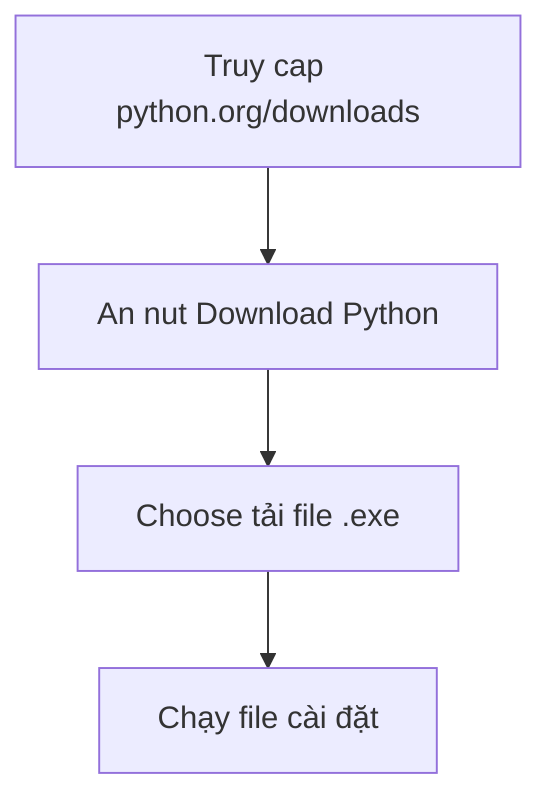

# 🐍 Bài 2: Cài Đặt Python

> 🎓 **Chương 1 – Khởi đầu hành trình lập trình**

---

## 🎯 Mục tiêu

Sau bài học này, học viên sẽ:

* ✅ Tải được bộ cài Python **mới nhất** từ trang chủ của Python.
* ✅ Cài đặt Python thành công trên Windows, đặc biệt là **tích chọn "Add Python to PATH"**.
* ✅ Kiểm tra phiên bản Python đã cài bằng lệnh `python --version`.
* ✅ Hiểu được **PATH là gì** và vì sao nó quan trọng.
* ✅ Viết và chạy thử chương trình Python đầu tiên từ dòng lệnh (`Command Prompt` / `Terminal`).

---

## 📖 Kiến thức

### 1. PowerShell / Command Prompt / Terminal là gì?

Đây là **cửa sổ dòng lệnh** — nơi bạn **gõ lệnh chữ** thay vì bấm nút để điều khiển máy tính.

> 💬 **Ví dụ đời thực:** Cửa sổ dòng lệnh giống như **sân ga xe lửa** — thay vì mua vé qua cửa sổ, bạn gõ lệnh để "đặt vé" trực tiếp. Lập trình viên dùng dòng lệnh mỗi ngày.

### 2. Chọn hướng cài đặt

| Cách | Phù hợp với | Ưu điểm |
|---|---|---|
| 🪟 Cài **Python trực tiếp** (bài này) | Tất cả người học | Đơn giản, kiểm soát rõ |
| 📦 Dùng **Anaconda** | Khoa học dữ liệu | Kèm sẵn nhiều thư viện |
| ☁️ Dùng online (Replit, Colab) | Làm quen ban đầu | Không cần cài |

> Trong giáo trình này chúng ta dùng cách **cài trực tiếp** — đơn giản và phổ biến nhất.

### 3. Bước 1 – Tải bộ cài Python

1. Mở trình duyệt, vào trang chính thức: **https://www.python.org/downloads/**
2. Bấm nút **Download Python 3.x.x** (phiên bản mới nhất hiển thị to màu vàng).
3. Đợi file `.exe` tải xong.

> ⚠️ Luôn tải từ **python.org** — tránh tải từ trang lạ vì có thể chứa mã độc.



### 4. Bước 2 — Cài đặt

1. Mở file `.exe` vừa tải.
2. **QUAN TRỌNG NHẤT:** Tích chọn ô **"Add Python to PATH"** nằm ở cuối màn hình đầu tiên. 3. Màn hình đầu tiên sẽ hiện 2 lựa chọn:
   * `Install Now` — cài nhanh với thiết lập mặc định (khuyên dùng cho người mới).
   * `Customize installation` — tùy chỉnh (nâng cao).

> ⚠️ **Nếu quên chọn "Add Python to PATH",** về sau bạn không thể gõ `python` trong dòng lệnh. Cách khắc phục ở phần "Lỗi thường gặp".

### 5. PATH là gì?

**PATH** là một danh sách các thư mục mà máy tính sẽ tìm kiếm **khi bạn gõ lệnh**.

> 💬 **Ví dụ đời thực:** Giống như danh bạ điện thoại — khi bạn gõ tên "python", máy tính lục trong PATH để tìm file `python.exe` và chạy nó. Không có PATH → máy nói "không tìm thấy lệnh".

### 6. Bước 3 — Kiểm tra cài đặt thành công

Mở cửa sổ dòng lệnh:

* **Windows:** nhấn `Windows + R`, gõ `cmd`, Enter. (Hoặc tìm "Command Prompt".)
* **macOS / Linux:** mở Terminal.

Gõ lệnh:

```bash
python --version
```

Kết quả mong đợi (con số có thể khác):

```
Python 3.14.2
```

> ✔️ Nếu thấy chữ Python kèm số là **đã cài thành công**.

### 7. Viết chương trình đầu tiên bằng dòng lệnh

Có hai kiểu làm việc Python: **chế độ tương tác** và **chạy file**.

**a) Chế độ tương tác (Interactive Shell / REPL):**

Gõ lệnh `python` trong Command Prompt:

```bash
python
```

Bạn sẽ thấy dấu nhắc `>>>`. Giờ gõ từng dòng:

```python
>>> print("Xin chào Python")
Xin chào Python
>>> 5 + 3
8
>>> exit()
```

* Mỗi lần gõ xong, Python "trả lời" ngay lập tức.
* Gõ `exit()` để thoát.

**b) Chạy file `.py`:**

Tạo file `hello.py` với nội dung:

```python
print("Hello, Python!")
```

Chạy trong Command Prompt (nhớ di chuyển đúng thư mục chứa file):

```bash
python hello.py
```

Kết quả:

```
Hello, Python!
```

---

## 💡 Ví dụ minh họa

### Ví dụ 1: Câu chuyện "không tìm thấy python"

Gõ `python` trong Command Prompt và thấy:

```
'python' is not recognized as an internal or external command
          (tiếng Việt: không tìm thấy lệnh python)
```

* **Nguyên nhân:** Bạn quên chọn **"Add Python to PATH"** khi cài.
* **Cách khắc phục:** Làm lại phần "Lỗi thường gặp" dưới đây.

### Ví dụ 2: Chạy trong thư mục khác

Giả sử file `hello.py` nằm ở `D:\hoc_python`. Trong Command Prompt:

```bash
cd D:\hoc_python
python hello.py
```

> `cd` (change directory) = đổi thư mục.

---

## 🔬 Ví dụ nâng cao

### Ví dụ: Kiểm tra cấu hình Python đầy đủ

```bash
python --version
python --help
```

* `python --version` → xem phiên bản.
* `python --help` → xem toàn bộ lệnh hỗ trợ.

### Ví dụ: Sử dụng pip cơ bản (học kỹ ở bài 31)

```bash
python -m pip --version
```

Kết quả dạng:

```
pip 26.1.2 from C:\Python314\Lib\site-packages\pip
```

> `pip` là công cụ cài thư viện — mặc định đi kèm khi cài Python.

---

## ⚠️ Lỗi thường gặp

### Lỗi 1: `'python' is not recognized`

* **Nguyên nhân:** Quên tích **Add Python to PATH**.
* **Cách sửa:**
  1. Mở Menu Start → gõ "path" → chọn **Edit the system environment variables**.
  2. Bấm **Environment Variables**.
  3. Trong **System variables**, chọn `Path` → **Edit** → **New**.
  4. Dán đường dẫn thư mục chứa `python.exe` (ví dụ `C:\Users\...\AppData\Local\Programs\Python\Python314\`).
  5. Bấm OK và **mở lại** Command Prompt.
* **Cách sửa nhanh hơn:** Cài lại Python và nhớ **tích "Add Python to PATH"**.

### Lỗi 2: Cài xong nhưng lệnh `python` mở Microsoft Store

* **Nguyên nhân:** Windows "App execution aliases" chặn lệnh `python`.
* **Cách sửa:** Settings → Apps → Advanced app settings → App execution aliases → **tắt** `python.exe` và `python3.exe`.

### Lỗi 3: Nhập `python3` thay vì `python`

* **Nguyên nhân:** Trên Windows, lệnh đúng là `python` (không có số 3).
* **Cách sửa:** Gõ `python`, không gõ `python3` (trên Linux mới dùng `python3`).

### Lỗi 4: Cài hai phiên bản Python bị loạn

* **Nguyên nhân:** Cài nhiều phiên bản, không biết lệnh `python` trỏ tới bản nào.
* **Cách sửa:** Gõ `python --version` để cóểu. Dùng `py -3 --version` (Windows) để chọn bản 3 cụ thể.

---

## 💎 Mẹo

* ✅ **Luôn tích "Add Python to PATH"** — ghi nhớ như "chìa khóa" để mở được Python.
* 📁 Đặt file `.py` trong một thư mục riêng để dễ quản lý (ví dụ `D:\Python_Bai`).
* 🔄 Sau khi sửa PATH, **phải đóng và mở lại** cửa sổ dòng lệnh mới có hiệu lực.
* 📚 Mọi bài học về sau đều chạy theo cú pháp: `python ten_file.py`.
* 🔍 Gõ `where python` (Windows) để xem Python đang nằm ở đâu.

---

## 📝 Tóm tắt

| Bước | Thao tác |
|---|---|
| 1 | Vào python.org → Download |
| 2 | Chạy file `.exe` → **tích Add to PATH** → Install Now |
| 3 | Mở cmd/terminal → `python --version` |
| 4 | Tạo file `hello.py` → `python hello.py` |

* Bạn có 2 chế độ làm việc: **REPL tương tác** (`>>>`) và **chạy file**.
* `cd` để di chuyển thư mục, `python tên_file.py` để chạy.

---

## 🧪 Kiểm tra nhanh

1. ❓ Trang web chính thức để tải Python là gì?
2. ❓ Câu nói nào quan trọng nhất phải chọn trong lúc cài?
3. ❓ PATH dùng để làm gì?
4. ❓ Lệnh kiểm tra phiên bản Python?
5. ❓ Lệnh để chạy file `hello.py`?
6. ❓ Lỗi 'python' is not recognized nghĩa là gì và cách sửa?
7. ❓ REPL (chế độ `>>>`) dùng để làm gì?
8. ❓ Trên Windows lệnh đúng là `python` hay `python3`?
9. ❓ Pip là gì?
10. ❓ Sau khi sửa PATH, điều gì cần làm trước khi dùng lại?

<details>
<summary>🔍 Xem đáp án</summary>

1. https://www.python.org/downloads/
2. "Add python.exe to PATH".
3. Danh sách thư mục máy tính tìm kiếm khi bạn gõ lệnh.
4. `python --version`.
5. `python hello.py`.
6. Chưa thêm PATH; sửa bằng Environment Variables hoặc cài lại và tích PATH.
7. Gõ từng lệnh và Python trả lời ngay — thử nghiệm nhanh.
8. `python`.
9. Công cụ cài thư viện đi kèm Python.
10. Đóng lại và mở lại cửa sổ dòng lệnh.

</details>

---

## 📚 Bài đọc thêm

* [Python.org – Downloads](https://www.python.org/downloads/)
* [Real Python – Installing Python](https://realpython.com/installing-python/)
* [Python documentation – Using Python on Windows](https://docs.python.org/3/using/windows.html)
* [Video: Cách cài Python cho người mới (tìm trên YouTube)](https://www.youtube.com/results?search_query=cach+cai+dat+python+cho+nguoi+moi)

---

## 🏁 Kết thúc bài

🎉 Đã cài xong Python! Giờ bạn cần một **nơi viết code** thoải mái, có màu sắc, gợi ý thông minh — đó chính là **Visual Studio Code**. Hãy sang:

👉 **[Bài 3: Visual Studio Code – Môi trường viết code](../03_VSCode/bai_giang.md)**