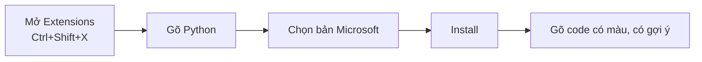

# 🖥️ Bài 3: Visual Studio Code – Môi Trường Viết Code

> 🎓 **Chương 1 – Khởi đầu hành trình lập trình**

---

## 🎯 Mục tiêu

Sau bài học này, học viên sẽ:

* ✅ Hiểu **IDE / Text Editor là gì** và vì sao lập trình viên cần nó.
* ✅ Tải và cài đặt **Visual Studio Code** về máy.
* ✅ Cài **Extension Python** để có gợi ý code, tô màu, chạy và gỡ lỗi.
* ✅ **Tạo file Python, viết code, chạy chương trình** ngay trong VSCode.
* ✅ Làm quen với **bảng điều khiển Terminal** bên trong VSCode.
* ✅ Biết các phím tắt quan trọng: `Ctrl + S`, `Ctrl + Shift + P`, `F5`.

---

## 📖 Kiến thức

### 1. Text Editor và IDE là gì?

* **Text Editor (trình soạn thảo):** phần mềm để viết văn bản/code (Notepad, VSCode...).
* **IDE (Integrated Development Environment):** môi trường phát triển tích hợp — gồm soạn thảo + chạy + sửa lỗi trong một công cụ.

> 💬 **Ví dụ đời thực:** Viết code bằng Notepad giống **viết thư bằng tay rồi gửi bưu điện**. Viết bằng VSCode giống **viết trong phần mềm soạn thảo hiện đại** — có gạch lỗi, gợi ý từ, auto lưu. Hiệu quả hơn gấp nhiều lần.

**So sánh nhanh:**

| Tiêu chí | Notepad | VSCode |
|---|---|---|
| Tô màu cú pháp | ❌ | ✅ |
| Gợi ý code (IntelliSense) | ❌ | ✅ |
| Chạy code | ❌ | ✅ |
| Sửa lỗi (debug) | ❌ | ✅ |
| Miễn phí | ✅ | ✅ |

### 2. Tại sao chọn VSCode

* 🆓 Miễn phí, mã nguồn mở.
* ⚡ Nhẹ, chạy nhanh.
* 🧩 Hàng nghìn **Extension** cho mọi ngôn ngữ.
* 🐍 Hỗ trợ Python tuyệt vời.
* 🔥 Cộng đồng rất lớn.

> 💡 VSCode không phải là IDE đúng nghĩa — nó là **trình soạn thảo siêu hiện đại**, nhờ Extension mà trở thành IDE "mọi thứ trong một".

### 3. Bước 1 – Tải VSCode

1. Vào: **https://code.visualstudio.com/**
2. Bấm nút **Download for Windows** (chọn đúng hệ điều hành của bạn).
3. Mở file tải về → chọn **I accept the agreement** → **Next** → **Install**.

> 💡 Khi cài, bạn có thể tích thêm tùy chọn **"Add 'Open with Code' action to Windows Explorer"** để mở thư mục bằng chuột phải — tiện lợi!

### 4. Bước 2 – Cài Extension Python

1. Mở VSCode.
2. Nhấn `Ctrl + Shift + X` (hoặc bấm biểu tượng 4 khối vuông trong thanh bên trái) để mở **Extensions**.
3. Gõ `Python` vào ô tìm kiếm.
4. Chọn bản của **Microsoft** → bấm **Install**.



### 5. Bước 3 – Mở một thư mục làm việc

Nguyên tắc quan trọng: **Mở Thư mục chứ không mở file**.

1. Mở VSCode.
2. Vào menu **File → Open Folder** (hoặc bấm `Ctrl+K Ctrl+O`).
3. Chọn thư mục (hoặc tạo mới, ví dụ `D:\PythonCourse`) → **Select Folder**.
4. Ở thanh **Explorer** (biểu tượng giống 2 trang giấy) bạn nhìn thấy nội dung thư mục.

> ⚠️ Nếu mở **file** riêng lẻ, VSCode không nhận diện thư mục → khó quản lý nhiều file và chạy lệnh.

### 6. Bước 4 – Tạo file Python

1. Bấm vào biểu tượng **New File** (hoặc `Ctrl + N`).
2. Nhấn `Ctrl + S` để lưu, đặt tên **kết thúc bằng `.py`**, ví dụ `bai1.py`.
3. Lưu vào thư mục đang mở.

> 🔑 Tên file có đuôi `.py` giúp VSCode nhận diện là code Python để gợi ý và tô màu.

### 7. Bước 5 – Viết và chạy chương trình

**Viết code** (bài giảng sẽ viết chương trình đầu tiên):

```python
# Chương trình đầu tiên trong VSCode
print("Hello, Visual Studio Code!")
```

**Chạy chương trình — có 3 cách:**

| Cách | Thao tác | Khi nào dùng |
|---|---|---|
| 1️⃣ Chạy nhanh | Bấm biểu tròn ▶ **(Run Python File)** góc phải trên | Thường xuyên |
| 2️⃣ Dùng Terminal | Mở Terminal `Ctrl + `` `` → gõ `python bai1.py` | Khi cần đối số |
| 3️⃣ Chạy + gỡ lỗi | Bấm `F5` | Khi cần sửa lỗi từng bước |

Kết quả hiển thị ở **panel bên dưới** (Terminal):

```
Chào Visual Studio Code!
```

### 8. Terminal bên trong VSCode

* Nhấn `` Ctrl + ` `` để mở/đóng Terminal.
* Bạn có thể gõ lệnh `python hello.py` ngay tại đó — giống Command Prompt nhưng gọn hơn.
* Nếu Terminal bị đóng, mở lại bằng menu **Terminal → New Terminal**.

---

## 💡 Ví dụ minh họa

### Ví dụ 1: Tạo một dự án có 2 file

1. Thư mục `baitap/` chứa:
   * `gioi_thieu.py` — in họ tên.
   * `tinh_tong.py` — in phép cộng.
2. Chạy từng file bằng nút ▶️.
3. Xem kết quả hiện trong **Terminal**.

**File `gioi_thieu.py`:**

```python
# Giới thiệu bản thân
print("Toi ten la An")
print("Toi 15 tuoi")
```

**File `tinh_tong.py`:**

```python
# Tính tổng
print("Tong cua 12 va 8 la:", 12 + 8)
```

---

### Ví dụ 2: Sửa nhanh dòng trong Terminal

Mở Terminal (`Ctrl + ~`), gõ:

```bash
python gioi_thieu.py
```

Dùng **phím mũi tên ↑** gọi lại lệnh cũ rồi Enter — lệnh vẫn còn trong lịch sử, không phải gõ lại thủ công.

---

## 🔬 Ví dụ nâng cao

### Ví dụ: Bật Auto Save để không lo quên lưu

1. Nhấn `Ctrl + Shift + P` (Command Palette).
2. Gõ `auto save`.
3. Chọn **Toggle Auto Save** → bật.

> Từ giờ VSCode tự lưu mỗi khi bạn tạm dừng gõ — bớt một nỗi lo "quên Ctrl+S".

### Ví dụ: Gợi ý code (IntelliSense)

* Khi gõ `pri`, bảng gợi ý hiện `print` → bấm `Tab` để chọn.
* Gõ được nửa từ, VSCode đã gợi ý phần còn lại — đỡ sai chính tả lệnh.
* Gõ `impo` → gợi ý `import`, gõ tiếp `math` → gợi ý tên thư viện.

---

## ⚠️ Lỗi thường gặp

### Lỗi 1: Bấm Run nhưng không ra kết quả

* **Nguyên nhân:** Chưa cài Extension **Python** (phần Bước 2) hoặc chưa chọn đúng file đang mở.
* **Cách sửa:**
  * Cài Extension Python (Microsoft).
  * Chọn tab code đang mở chính là file `.py`.
  * Nhấn `Ctrl + Shift + P` → gõ `Python: Select Interpreter` → chọn phiên bản đã cài (bài 2).

### Lỗi 2: Terminal báo "not recognized"

* **Nguyên nhân:** Python chưa được thêm vào PATH hoặc terminal trong VSCode đang ở thư mục khác.
* **Cách sửa:**
  * Xem lại bài 2 về PATH.
  * Gõ `cd đường_dẫn` để tới thư mục chứa file, rồi chạy lại.

### Lỗi 3: Chữ không có màu code

* **Nguyên nhân:** File chưa lưu đuôi `.py` (VSCode không nhận Python).
* **Cách sửa:** Lưu với tên file kết thúc bằng `.py`.

### Lỗi 4: Tạo file trong nhánh Explorer mà hiển thị ở chỗ khác

* **Nguyên nhân:** Đang mở file lẻ chứ không phải mở thư mục.
* **Cách sửa:** File → Open Folder, chọn đúng thư mục dự án.

---

## 💎 Mẹo

* ⚡ `Ctrl + Shift + P` — **Command Palette**: mọi lệnh VSCode đều có thể gõ tìm ở đây.
* 💾 Bật **Auto Save** để khỏi lo quên lưu.
* 🧩 Dùng thêm extension `indent-rainbow` (màu lề), `Brackets` (màu dấu ngoặc).
* 👁️ Chế độ Explorer phía trái để xem file; `.py` đầu tiên chính là tab đang mở.
* 🎯 Thêm extension "Python" giúp gợi ý, kiểm tra PEP 8 (theo chuẩn code).

---

## 📝 Tóm tắt

| Thành phần | Thao tác | Phím tắt |
|---|---|---|
| Mở Terminal | Menu or nút | `Ctrl + `` `` |
| Mở Command Palette | Tìm mọi lệnh | `Ctrl + Shift + P` |
| Tạo file mới | File → New File | `Ctrl + N` |
| Lưu file | File → Save | `Ctrl + S` |
| Chạy nhanh code | Nút Run ▶ hoặc F5 | — |
| Gợi ý code | Gõ code, có bảng hiện | — |

* Luôn **Open Folder** chứ không mở file lẻ.
* File Python phải `.py`.
* Extension Python của Microsoft cho gợi ý, chạy, gỡ lỗi.

---

## 🧪 Kiểm tra nhanh

1. ❓ VSCode là gì và tại sao cần nó để học Python?
2. ❓ Phím tắt mở Extensions?
3. ❓ Extension Python phải của hãng (publisher) nào?
4. ❓ Tạo file Python lưu phải có phần mở rộng gì?
5. ❓ Nên bấm Open **File** hay Open **Folder**? vì sao?
6. ❓ Nút nào chạy nhanh file Python trong VSCode?
7. ❓ Phím tắt lưu file?
8. ❓ Terminal mở/đóng bằng phím tắt nào, để làm gì?
9. ❓ Lỗi "not recognized python" khi chạy là do đâu?
10. ❓ Bật Auto Save để làm gì?

<details>
<summary>🔍 Xem đáp án</summary>

1. Trình soạn thảo + IDE nhờ extension: gợi ý code, chạy, gỡ lỗi.
2. `Ctrl + Shift + X`.
3. Microsoft.
4. `.py`.
5. Open Folder — để VSCode quản lý thư mục dự án, chạy đúng terminal.
6. Nút Run Python ▶ (hoặc F5).
7. `Ctrl + S`.
8. `` Ctrl + `` ` `` — gõ lệnh không ra khỏi cửa sổ.
9. PATH chưa đúng hoặc chưa chọn interpreter.
10. Tự động lưu file khi dừng gõ — không lo quên lưu.

</details>

---

## 📚 Bài đọc thêm

* [Hướng dẫn chính thức – Code.visualstudio.com](https://code.visualstudio.com/docs/languages/python)
* [VSCode – Download trang chủ](https://code.visualstudio.com/download)
- [Real Python – Python in VS Code](https://realpython.com/python-development-visual-studio-code/)

---

## 🏁 Kết thúc bài

🎉 Giờ bạn đã có cả 2 "vũ khí": **Python** (trình thông dịch code) và **VSCode** (trình soạn code). Từ bài sau chúng ta chính thức **khởi đầu lập trình** với khái niệm quan trọng nhất — **biến (variable)**:

👉 **[Bài 4: Biến trong Python](../04_Bien/bai_giang.md)**