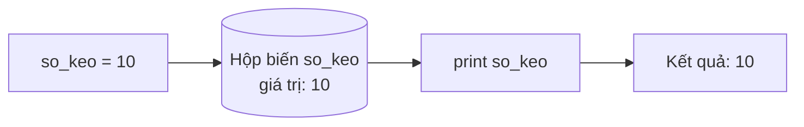

# 🐍 Bài 4: Biến Trong Python

> 🎓 **Chương 2 – Nền tảng lập trình**

---

## 🎯 Mục tiêu

Sau bài học này, học viên sẽ:

* ✅ Hiểu **biến là gì** — "chiếc hộp có tên" dùng để lưu trữ dữ liệu trong chương trình.
* ✅ Gán giá trị cho biến bằng dấu `=` và **gán lại giá trị mới** cho biến.
* ✅ Nắm vững **quy tắc đặt tên biến** (chữ cái, số, `_`, không bắt đầu bằng số, không trùng từ khóa).
* ✅ Đặt được **tên biến có nghĩa** theo chuẩn `snake_case`.
* ✅ Dùng hàm `id()` để kiểm tra vùng nhớ của biến.
* ✅ **Gán nhiều biến cùng lúc** và **đổi giá trị 2 biến** (hoán vị).

---

## 📖 Kiến thức

### 1. Biến là gì?

> 💬 **Nói đơn giản:** Biến (variable) là một **chiếc hộp có tên** dùng để **cất giữ dữ liệu tạm thời** trong lúc chương trình chạy.

**Ví dụ đời thực:** Bạn có một chiếc hộp quà ghi nhãn `so_keo`. Bạn bỏ vào đó 10 viên kẹo. Mỗi lần cần biết có bao nhiêu kẹo, bạn chỉ cần nhìn nhãn `so_keo` — không cần mở hộp ra đếm lại. Trong Python cũng vậy:

```python
so_keo = 10   # mở "hộp" tên là so_keo, bỏ vào 10
print(so_keo) # nhìn nhãn so_keo => in ra 10
```



* **Trước khi có biến:** muốn dùng số 10 ở nhiều nơi, bạn phải gõ đi gõ lại số 10.
* **Sau khi có biến:** chỉ cần gõ tên biến — và khi giá trị thay đổi, mọi nơi dùng biến đều tự động cập nhật.

### 2. Gán giá trị cho biến

Cú pháp gán giá trị:

```python
ten_bien = gia_tri
```

> ⚠️ Dấu `=` ở đây **KHÔNG phải "bằng"** trong toán học. Nó có nghĩa là **"gán"** — đưa giá trị bên phải vào hộp tên bên trái. Nói cách khác: **"hộp bên trái nhận giá trị bên phải"**.

| Viết | Nghĩa |
|---|---|
| `tuoi = 15` | Hộp `tuoi` nhận giá trị 15 |
| `ten = "Mai"` | Hộp `ten` nhận chuỗi chữ "Mai" |
| `diem = 8.5` | Hộp `diem` nhận số thực 8.5 |

Python rất "thông minh": bạn **không cần khai báo kiểu dữ liệu** trước như các ngôn ngữ khác (C, Java). Cứ gán là có.

### 3. Gán lại giá trị — hộp có thể đổi nội dung

Điểm đặc biệt của biến: giá trị bên trong hộp **có thể thay đổi**:

```python
diem = 7          # hộp diem chứa 7
print(diem)       # 7
diem = 9          # đổ hộp ra, bỏ giá trị mới vào
print(diem)       # 9
```

Chú ý thứ tự các lệnh: Python chạy từ trên xuống, lệnh nào ở sau sẽ ghi đè lệnh trước.

### 4. Quy tắc đặt tên biến

Python quy định **tên biến chỉ được phép** gồm:

| Được dùng | Ví dụ |
|---|---|
| ✅ Chữ cái (a–z, A–Z) | `ten`, `Tuoi`, `x` |
| ✅ Chữ số (0–9) — **không được đứng đầu** | `lop10` ✅, `10lop` ❌ |
| ✅ Dấu gạch dưới `_` | `so_dien_thoai` |

**Các quy tắc bắt buộc:**

1. **Không bắt đầu bằng chữ số:** `2ten` ❌ → `ten2` ✅
2. **Không chứa dấu cách:** `ho va ten` ❌ → `ho_va_ten` ✅
3. **Không trùng từ khóa của Python:** `if`, `for`, `while`, `class`, `def`, `print`... đều là từ khóa dành riêng.
4. **Không dùng ký tự đặc biệt:** `$`, `%`, `@`, `-`, dấu `đ`... đều không được.
5. **Phân biệt chữ hoa – chữ thường:** `Ten` và `ten` là **hai biến khác nhau**.

**Danh sách từ khóa (một số từ khóa hay gặp):**

```text
False  None  True  and  as  assert  break  class  continue  def
del  elif  else  except  finally  for  from  global  if  import
in  is  lambda  not  or  pass  raise  return  try  while  with  yield
```

> 🧪 **Mẹo kiểm tra:** gõ `import keyword; print(keyword.kwlist)` để xem toàn bộ từ khóa.

### 5. Đặt tên có nghĩa và chuẩn snake_case

* **Tên có nghĩa:** thay vì `a = 15`, hãy viết `tuoi = 15`. Sau 1 tuần đọc lại code, bạn vẫn hiểu `tuoi` là gì, còn `a` thì không ai biết.
* **snake_case:** nhiều từ thì nối nhau bằng dấu gạch dưới, **tất cả chữ thường**:

| ❌ Tên xấu | ✅ Tên đẹp (snake_case) |
|---|---|
| `tbt` | `trung_binh_cong` |
| `HoVaTen` | `ho_va_ten` |
| `SODU` | `so_du_tai_khoan` |
| `tongtien2nguoi` | `tong_tien_2_nguoi` |

### 6. Kiểm tra vùng nhớ bằng id()

Mỗi biến được máy tính cấp một **vùng nhớ riêng**. Hàm `id(bien)` trả về **địa chỉ vùng nhớ** của biến đó:

```python
a = 100
b = a          # b sao chép giá trị của a
print(id(a))   # ví dụ: 2387456344528
print(id(b))   # giống hệt id(a) vì b cùng trỏ tới giá trị 100
```

> 💡 **Lưu ý quan trọng:** `b = a` nghĩa là **sao chép giá trị** của `a` cho `b`. Sau đó sửa `b` thì `a` **không đổi** — vì là hai hộp riêng biệt.

### 7. Gán nhiều biến cùng lúc

Python cho phép gán nhiều biến trên **một dòng duy nhất**:

```python
a, b, c = 1, 2, 3        # a=1, b=2, c=3
x = y = z = 0            # cả 3 biến cùng bằng 0
print(a, b, c)           # 1 2 3
```

### 8. Đổi giá trị 2 biến (hoán vị)

Tình huống: `a = 3`, `b = 5`, muốn đổi cho `a = 5`, `b = 3`.

**Cách thủ công — dùng biến tạm** (giống mượn cốc thứ 3 để rót nước):

```python
a = 3
b = 5
tam = a     # 1. đổ a vào cốc tạm
a = b       # 2. đổ b vào a
b = tam     # 3. đổ cốc tạm vào b
print(a, b) # 5 3
```

**Cách thần tốc của Python:**

```python
a = 3
b = 5
a, b = b, a
print(a, b) # 5 3
```

> Python tự làm việc "mượn cốc" giúp bạn — một câu lệnh ngắn gọn mà cực kỳ hữu dụng.

---

## 💡 Ví dụ minh họa

### Ví dụ 1: Chiếc hộp lưu điểm số

```python
# Lưu điểm 3 môn học vào 3 biến
toan = 8
van = 7
anh = 9
# In ra từng điểm
print("Điểm Toán:", toan)
print("Điểm Văn:", van)
print("Điểm Anh:", anh)
```

Kết quả:

```
Điểm Toán: 8
Điểm Văn: 7
Điểm Anh: 9
```

**Giải thích từng dòng:**

| Dòng code | Ý nghĩa |
|---|---|
| `toan = 8` | Tạo hộp `toan`, bỏ số 8 vào |
| `van = 7`, `anh = 9` | Tương tự cho hai môn còn lại |
| `print("Điểm Toán:", toan)` | In nhãn "Điểm Toán:" rồi in giá trị trong hộp `toan` |

### Ví dụ 2: Biến thay đổi theo thời gian

```python
# Một ngày "vật lộn" với ví tiền
tien = 100000           # Sáng có 100.000 đồng
tien = tien - 35000     # Mua bánh mì trứng
print("Sau bữa sáng:", tien, "đồng")
tien = tien - 20000     # Mua trà sữa
print("Sau trà sữa:", tien, "đồng")
tien = tien + 50000     # Mẹ cho thêm
print("Cuối ngày:", tien, "đồng")
```

Kết quả:

```
Sau bữa sáng: 65000 đồng
Sau trà sữa: 45000 đồng
Cuối ngày: 95000 đồng
```

**Giải thích từng dòng:**

* `tien = tien - 35000` — lấy giá trị hiện tại (100000) trừ 35000, rồi **gán kết quả ngược về hộp** `tien`. Hộp bây giờ chứa 65000.
* Mỗi lần gán mới, giá trị cũ **bị thay thế hoàn toàn** — hộp chỉ chứa được một giá trị tại một thời điểm.

### Ví dụ 3: Hoán đổi hai "cốc nước"

```python
# Hai cốc nước: cốc a có trà, cốc b có sữa
a = "trà"
b = "sữa"
print("Trước:", a, "-", b)
# Dùng một cốc tạm để hoán đổi
tam = a
a = b
b = tam
print("Sau:", a, "-", b)
```

Kết quả:

```
Trước: trà - sữa
Sau: sữa - trà
```

---

## 🔬 Ví dụ nâng cao

### Ví dụ 1: Máy tính điểm trung bình môn

Chương trình dùng biến để lưu điểm, tính tổng và trung bình — tình huống quen thuộc của học sinh:

```python
# Lưu điểm 3 môn học
diem_toan = 8
diem_ly = 7
diem_hoa = 6
# Tính tổng điểm bằng biến trung gian
tong = diem_toan + diem_ly + diem_hoa
# Trung bình = tổng chia cho số môn
trung_binh = tong / 3
# In kết quả
print("Tổng điểm:", tong)
print("Trung bình:", trung_binh)
```

Kết quả: `Tổng điểm: 21` và `Trung bình: 7.0`.

* Nhờ có biến, nếu điểm đổi thì chỉ cần sửa **một chỗ** — mọi tính toán phía sau tự cập nhật.

### Ví dụ 2: Hóa đơn quán trà sữa

Tính tiền cho khách mua nhiều ly — tình huống thực tế ở cửa hàng:

```python
# Giá mỗi ly trà sữa và số lượng
gia_ly = 30000
so_ly = 3
# Tính thành tiền
thanh_tien = gia_ly * so_ly
# Giảm giá 10% cho học sinh
giam_gia = thanh_tien * 0.1
# Tiền phải trả = thành tiền - giảm giá
tien_phai_tra = thanh_tien - giam_gia
# In hóa đơn
print("Thành tiền:", thanh_tien)
print("Giảm giá:", giam_gia)
print("Phải trả:", tien_phai_tra)
```

Kết quả:

```
Thành tiền: 90000
Giảm giá: 9000.0
Phải trả: 81000.0
```

### Ví dụ 3: Tính vận tốc xe máy

Dùng biến lưu quãng đường và thời gian (công thức quen thuộc: `v = s / t`):

```python
# Quãng đường (km) và thời gian (giờ)
quang_duong = 120
thoi_gian = 2.5
# Vận tốc trung bình (km/h)
van_toc = quang_duong / thoi_gian
print("Vận tốc trung bình:", van_toc, "km/h")
```

Kết quả: `Vận tốc trung bình: 48.0 km/h`.

> 💡 Cả 3 ví dụ trên đều theo công thức chung của lập trình: **dữ liệu → biến → xử lý → in kết quả**.

---

## ⚠️ Lỗi thường gặp

### Lỗi 1: Dùng biến chưa được gán

```python
print(so_keo)   # ❌ chưa gán so_keo bao giờ
```

* **Kết quả báo:** `NameError: name 'so_keo' is not defined`
* **Nguyên nhân:** Python không tìm thấy "hộp" tên `so_keo` — bạn quên gán `so_keo = ...` trước đó.
* **Cách sửa:** gán giá trị trước khi dùng: `so_keo = 10` rồi mới `print(so_keo)`.

### Lỗi 2: Tên biến bắt đầu bằng số

```python
2ten = "Mai"   # ❌ SAI
```

* **Kết quả báo:** `SyntaxError: invalid decimal literal`
* **Nguyên nhân:** tên biến không được bắt đầu bằng chữ số.
* **Cách sửa:** `ten2 = "Mai"` — đưa số về cuối tên.

### Lỗi 3: Trùng từ khóa Python

```python
if = 5   # ❌ SAI — if là từ khóa
```

* **Kết quả báo:** `SyntaxError: invalid syntax`
* **Nguyên nhân:** `if` là từ khóa dành riêng cho câu lệnh điều kiện.
* **Cách sửa:** đổi tên: `dieu_kien = 5` hoặc `if_so = 5`.

### Lỗi 4: Nhầm lẫn chữ hoa – chữ thường

```python
Diem = 8
print(diem)   # ❌ SAI — dùng sai chữ hoa
```

* **Kết quả báo:** `NameError: name 'diem' is not defined`
* **Nguyên nhân:** Python coi `Diem` và `diem` là hai biến khác nhau.
* **Cách sửa:** dùng nhất quán một kiểu viết: tất cả chữ thường theo chuẩn `snake_case`.

### Lỗi 5: Dùng một dấu `=` để so sánh

```python
a = 5
if a = 5:   # ❌ SAI — một dấu = là gán, so sánh phải là ==
    print("Đúng")
```

* **Kết quả báo:** `SyntaxError: invalid syntax`
* **Nguyên nhân:** `=` là toán tử **gán**, toán tử **so sánh bằng** là `==` (sẽ học kỹ ở Bài 6).
* **Cách sửa:** viết `if a == 5:`.

---

## 💎 Mẹo

* 📦 **Hình dung biến như chiếc hộp:** mỗi hộp có nhãn (tên biến), chứa một giá trị; gán lại là "đổ hộp, bỏ đồ mới vào".
* 🏷️ **Đặt tên có nghĩa:** `diem_toan` tốt hơn `x`; sau này đọc lại code sẽ không phải "giải mã".
* 🐍 **Chuẩn snake_case:** chữ thường + gạch dưới: `tong_tien`, `so_luong_hoc_sinh`.
* 🔢 **Không bao giờ viết hoa đầu tên biến** — chuẩn đó dành riêng cho lớp (học ở Bài 23 OOP).
* 🧪 **Debug bằng print():** khi kết quả sai, hãy in giá trị biến ra để xem từng bước — kỹ thuật của mọi lập trình viên.
* 📝 **Gán một lần mỗi biến khi mới bắt đầu:** chia code thành "đọc → gán → in" sẽ dễ hiểu hơn.

---

## 📝 Tóm tắt

| Khái niệm | Nội dung |
|---|---|
| 🏷️ Biến | Chiếc hộp có tên lưu dữ liệu tạm thời |
| ✍️ Gán giá trị | `ten_bien = gia_tri` — dấu `=` là gán, không phải so sánh |
| 🔄 Gán lại | Giá trị mới ghi đè giá trị cũ |
| 📛 Quy tắc tên | Chữ cái, số (không đứng đầu), `_`; không trùng từ khóa; không dấu cách |
| 🔤 Hoa – thường | Phân biệt: `Ten` ≠ `ten` |
| 🐍 snake_case | `ho_va_ten`, `so_du` — dễ đọc, chuẩn Python |
| 📍 `id()` | Trả về địa chỉ vùng nhớ của biến |
| ✌️ Nhiều biến | `a, b, c = 1, 2, 3` hoặc `x = y = 0` |
| 🔁 Hoán đổi | `a, b = b, a` — đổi giá trị 2 biến |

---

## 🧪 Kiểm tra nhanh

1. ❓ Biến là gì? Vì sao cần dùng biến?
2. ❓ Dấu `=` trong Python có nghĩa là gì?
3. ❓ Viết lệnh gán số 2026 cho biến `nam_hien_tai`.
4. ❓ Tên biến nào sau đây hợp lệ: `lop10`, `10lop`, `ho va ten`, `ho_va_ten`?
5. ❓ Vì sao không thể đặt tên biến là `for` hay `if`?
6. ❓ `Ten` và `ten` có phải là một biến không?
7. ❓ Lệnh `a, b, c = 1, 2, 3` cho kết quả gì?
8. ❓ Viết một dòng lệnh hoán đổi giá trị 2 biến `x` và `y`.
9. ❓ `id()` dùng để làm gì?
10. ❓ Khi gán `b = a` rồi sửa `b`, giá trị của `a` có thay đổi không? Vì sao?

<details>
<summary>🔍 Xem đáp án</summary>

1. Biến là "hộp có tên" lưu dữ liệu; dùng để tái sử dụng và cập nhật dữ liệu một chỗ.
2. Dấu gán — đưa giá trị bên phải vào hộp tên bên trái.
3. `nam_hien_tai = 2026`.
4. `lop10` và `ho_va_ten` hợp lệ; `10lop` sai (bắt đầu bằng số), `ho va ten` sai (có dấu cách).
5. Vì chúng là từ khóa dành riêng của Python.
6. Không — Python phân biệt chữ hoa chữ thường.
7. `a = 1`, `b = 2`, `c = 3`.
8. `x, y = y, x`.
9. Trả về địa chỉ vùng nhớ của biến.
10. Không thay đổi — `b = a` chỉ sao chép giá trị, hai biến là hai hộp độc lập.

</details>

---

## 📚 Bài đọc thêm

* [Python.org – Hướng dẫn chính thức: khai báo biến (W3Schools)](https://www.w3schools.com/python/python_variables.asp)
* [Python.org – Từ khóa dành riêng](https://docs.python.org/3/reference/lexical_analysis.html#keywords)
* [PEP 8 – Quy ước đặt tên biến (section Naming Conventions)](https://peps.python.org/pep-0008/#naming-conventions)
* [Python Tutor – chạy từng bước để xem "hộp biến" thay đổi](https://pythontutor.com/)

---

## 🏁 Kết thúc bài

🎉 Bạn đã biết cách "đóng hộp" dữ liệu vào biến! Câu hỏi tiếp theo là: **bên trong hộp có những "loại đồ vật" nào?** Số nguyên, số thập phân, chữ, đúng/sai... — đó chính là **kiểu dữ liệu**. Hãy sang:

👉 **[Bài 5: Kiểu Dữ Liệu Cơ Bản](../05_Kieu_du_lieu/bai_giang.md)**
