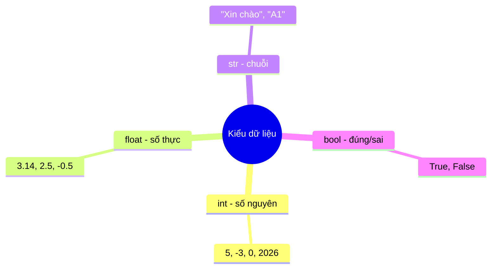

# 🐍 Bài 5: Kiểu Dữ Liệu Cơ Bản

> 🎓 **Chương 2 – Nền tảng lập trình**

---

## 🎯 Mục tiêu

Sau bài học này, học viên sẽ:

* ✅ Nhận biết 4 kiểu dữ liệu cơ bản: `int`, `float`, `str`, `bool`.
* ✅ Dùng hàm `type()` để **kiểm tra kiểu dữ liệu** của một giá trị.
* ✅ **Ép kiểu** (chuyển đổi) giữa các kiểu bằng `int()`, `float()`, `str()`, `bool()`.
* ✅ Phân biệt rõ **`"5"` và `5`** — số hay chữ, cái nào tính được.
* ✅ Biết vì sao phải ép kiểu và tránh được các lỗi `TypeError`, `ValueError`.

---

## 📖 Kiến thức

### 1. Vì sao cần "kiểu dữ liệu"?

Ở bài 4, biến là **chiếc hộp** lưu dữ liệu. Nhưng dữ liệu không chỉ có một loại: số nguyên, số thập phân, đoạn chữ, câu trả lời đúng/sai... Python cần **phân loại dữ liệu** để biết cách xử lý: số thì cộng trừ được, chữ thì nối lại được, chứ không thể trộn lung tung.

> 💬 **Ví dụ đời thực:** Kho đồ vật cũng phân khu: kệ đựng sách, tủ lạnh đựng thực phẩm, két sắt đựng tiền. Nếu nhét sách vào két sắt thì không sao, nhưng "cộng" một quyển sách với một cái bánh thì vô nghĩa — Python cũng vậy!



### 2. Bốn kiểu dữ liệu cơ bản

| Kiểu | Tên gọi | Ví dụ | Dùng khi nào |
|---|---|---|---|
| `int` | Số nguyên | `5`, `-3`, `0`, `2026` | Đếm, số thứ tự, tuổi, số lượng |
| `float` | Số thực (thập phân) | `3.14`, `2.5`, `-0.75` | Đo lường, điểm số, giá tiền |
| `str` | Chuỗi ký tự (chữ) | `"Xin chào"`, `"A1"` | Tên, địa chỉ, câu chữ |
| `bool` | Đúng / Sai | `True`, `False` | Kết quả so sánh, cờ trạng thái |

**Vài lưu ý nhỏ:**

* Số thực viết dấu chấm, không viết dấu phẩy: `3.14` chứ không phải `3,14`.
* Chuỗi phải nằm trong dấu nháy thẳng `"..."` hoặc `'...'`.
* `True` và `False` — viết hoa chữ cái đầu tiên, không có dấu nháy.

```python
so_nguyen = 5        # int
so_thuc = 3.14       # float
chuoi = "Xin chào"   # str
dung_sai = True      # bool
```

### 3. Kiểm tra kiểu bằng type()

Hàm `type(gia_tri)` trả về **kiểu dữ liệu** của giá trị đó:

```python
print(type(5))         # <class 'int'>
print(type(3.14))      # <class 'float'>
print(type("Xin chào"))# <class 'str'>
print(type(True))      # <class 'bool'>
```

> 💡 Đọc kết quả: `'int'`, `'float'`, `'str'`, `'bool'` là tên kiểu. Khi muốn biết biến chứa kiểu gì, hãy gõ `type(bien)`.

```python
so = 10
print(type(so))        # <class 'int'>
so = "mười"            # gán kiểu khác - Python cho phép!
print(type(so))        # <class 'str'>
```

> ⚠️ Python là ngôn ngữ **định kiểu động**: biến không bị khóa vào một kiểu, bạn có thể gán kiểu khác cho nó sau đó (khác với C/Java).

### 4. Phân biệt `"5"` và `5` — chữ khác số!

Nhìn giống nhau, nhưng bản chất khác hẳn:

| | `5` | `"5"` |
|---|---|---|
| Kiểu | `int` | `str` |
| Ý nghĩa | Số năm | Ký tự số 5 |
| Tính toán? | ✅ `5 + 3 = 8` | ❌ `"5" + 3` → `TypeError` |
| Cộng với chữ | ❌ | ✅ `"5" + "3" = "53"` |

**Thí nghiệm trực tiếp:**

```python
a = 5
b = "5"
print(type(a))          # <class 'int'>
print(type(b))          # <class 'str'>
print(a + 3)            # 8  - số thì cộng được
print(b + "3")          # 53 - chữ thì nối được
# print(b + 3)          # ❌ TypeError: can only concatenate str
```

> 💬 **Ví dụ đời thực:** "5" là chữ số bạn viết lên bảng, còn 5 là số lượng bạn đếm được. Viết "5" + "3" thành "53" giống như ghép hai chữ; còn 5 + 3 = 8 là cộng hai số lượng.

### 5. Ép kiểu — "dịch" dữ liệu sang kiểu khác

Đôi khi dữ liệu không đúng kiểu như mong muốn, ta dùng hàm **ép kiểu**:

| Hàm | Chuyển thành | Ví dụ |
|---|---|---|
| `int(x)` | Số nguyên | `int("5")` → `5`; `int(3.9)` → `3` |
| `float(x)` | Số thực | `float("2.5")` → `2.5`; `float(5)` → `5.0` |
| `str(x)` | Chuỗi | `str(5)` → `"5"`; `str(3.14)` → `"3.14"` |
| `bool(x)` | Đúng/Sai | `bool(0)` → `False`; `bool(5)` → `True` |

**Một số quy tắc cần nhớ:**

* `int("3.9")` → **lỗi `ValueError`** — chuỗi có dấu chấm không ép trực tiếp thành int được; phải `int(float("3.9"))`.
* `int(3.9)` → `3` (cắt phần thập phân, không làm tròn).
* `bool` của `0`, `0.0`, `""`, `None` → `False`; mọi giá trị khác → `True`.

```python
# Ép kiểu số thành chuỗi để nối chữ
tuoi = 15
cau = "Nam nay toi " + str(tuoi) + " tuoi"
print(cau)              # Nam nay toi 15 tuoi

# Ép chuỗi thành số để tính toán
diem = "8.5"
diem_moi = float(diem) + 0.5
print(diem_moi)         # 9.0
```

### 6. Khi nào cần ép kiểu?

Nếu bạn nhập liệu từ bàn phím (Bài 7), `input()` luôn trả về **chuỗi** — muốn tính toán phải ép kiểu. Nhưng ngay bây giờ, bạn sẽ thấy ép kiểu xuất hiện ở 3 tình huống:

1. **Nối chuỗi với số:** `"Tôi " + str(15) + " tuổi"`.
2. **Tính toán với dữ liệu dạng chữ:** chuỗi `"8.5"` phải thành `float` mới cộng được.
3. **Làm tròn kiểu lỏng:** `int(3.99)` cho `3` khi cần số nguyên.

---

## 💡 Ví dụ minh họa

### Ví dụ 1: Điều tra "kiểu dữ liệu"

```python
# Lần lượt kiểm tra kiểu của các giá trị
print(type(10))            # int
print(type(10.0))          # float - có dấu chấm là số thực
print(type("10"))          # str - nằm trong dấu nháy là chữ
print(type(True))          # bool
print(type(10 > 5))        # bool - kết quả so sánh
```

**Giải thích từng dòng:**

| Dòng code | Ý nghĩa |
|---|---|
| `print(type(10))` | `10` không có dấu chấm, không nháy → `int` |
| `print(type(10.0))` | Có dấu chấm → `float` |
| `print(type("10"))` | Có dấu nháy → `str`, dù bên trong là số |
| `print(type(True))` | `bool` — hai giá trị `True`/`False` |
| `print(type(10 > 5))` | Phép so sánh trả về `bool` |

### Ví dụ 2: "5" với 5 — một phen bối rối

```python
so = 5
chu = "5"
# Thử cộng số
print(so + 5)          # 10 - số cộng số bình thường
# Thử cộng chữ
print(chu + "5")       # 55 - chữ nối chữ
# Ép chữ thành số rồi mới cộng
print(int(chu) + 5)    # 10 - đã "dịch" chữ ra số
```

**Giải thích từng dòng:**

* `so + 5` — phép cộng số, kết quả `10`.
* `chu + "5"` — phép **nối chuỗi**, kết quả `"55"` (không phải 10!).
* `int(chu) + 5` — ép `"5"` thành số `5` rồi cộng, kết quả `10`.

### Ví dụ 3: Xưởng chế tạo số

```python
# Ép kiểu theo nhiều hướng khác nhau
a = int("2026")        # chuỗi số nguyên -> số 2026
b = float("3.14")      # chuỗi thập phân -> số 3.14
c = str(99)            # số -> chuỗi "99"
d = bool("")           # chuỗi rỗng -> False
e = int(7.99)          # số thực -> 7 (cắt phần lẻ)
print(a, b, c, d, e)
```

Kết quả: `2026 3.14 99 False 7`.

---

## 🔬 Ví dụ nâng cao

### Ví dụ 1: Tính BMI — câu chuyện của các loại dữ liệu

Công thức: `BMI = cân nặng (kg) / chiều cao² (m)`. Chương trình kết hợp `float`, `str`, phép lũy thừa:

```python
# Cân nặng (kg) và chiều cao (m) - số thực
can_nang = 60.5
chieu_cao = 1.65
# Tính BMI: chiều cao bình phương
bmi = can_nang / (chieu_cao ** 2)
# Ép kết quả về chuỗi để nối vào câu thông báo
thong_bao = "BMI cua ban la: " + str(round(bmi, 2))
print(thong_bao)
```

Kết quả: `BMI cua ban la: 22.22`.

* `round(bmi, 2)` — làm tròn 2 chữ số thập phân (giá trị vẫn là số).
* `str(...)` — bắt buộc ép thành chuỗi trước khi `+` với chuỗi thông báo, nếu không bị `TypeError`.

### Ví dụ 2: Phòng khám "điều tra" kiểu dữ liệu

Một chương trình nhỏ kiểm tra xem biến đang mang kiểu gì sau từng bước gán:

```python
# Một biến, nhiều kiểu qua các lần gán
du_lieu = 100
print(type(du_lieu))        # int
du_lieu = 100.5
print(type(du_lieu))        # float
du_lieu = "100"
print(type(du_lieu))        # str
du_lieu = 100 == 100
print(type(du_lieu))        # bool
print(du_lieu)              # True
```

> 💡 Điều này chứng minh Python **định kiểu động**: biến có thể "đổi kiểu" sau mỗi lần gán.

### Ví dụ 3: Máy đếm điểm chữ trong chuỗi (dùng str + int)

```python
# Số ký tự trong một chuỗi (kể cả khoảng trắng)
chuoi = "Python la tuyet voi"
do_dai = len(chuoi)             # len() trả về số nguyên int
print("So ky tu:", do_dai)      # 21
print("Kieu du lieu:", type(do_dai))  # int
```

---

## ⚠️ Lỗi thường gặp

### Lỗi 1: Cộng chuỗi với số

```python
tuoi = 15
print("Toi " + tuoi + " tuoi")   # ❌ SAI
```

* **Kết quả báo:** `TypeError: can only concatenate str (not "int") to str`
* **Nguyên nhân:** không thể nối chuỗi với số trực tiếp.
* **Cách sửa:** ép số thành chuỗi: `print("Toi " + str(tuoi) + " tuoi")`.

### Lỗi 2: Ép chuỗi thập phân sang int

```python
x = int("3.9")   # ❌ SAI
```

* **Kết quả báo:** `ValueError: invalid literal for int() with base 10: '3.9'`
* **Nguyên nhân:** `int()` chỉ chấp nhận chuỗi dạng số nguyên.
* **Cách sửa:** qua trung gian: `int(float("3.9"))` → `3`.

### Lỗi 3: Ép chuỗi không phải số

```python
so = int("xin chao")   # ❌ SAI
```

* **Kết quả báo:** `ValueError: invalid literal for int()`
* **Nguyên nhân:** chuỗi chữ không chứa số thì không ép được.
* **Cách sửa:** chỉ ép kiểu khi chắc chắn dữ liệu hợp lệ; kiểm tra trước bằng `isnumeric()` nếu cần.

### Lỗi 4: Viết hoa sai tên kiểu

```python
print(type(5))      # ✅
print(Type(5))      # ❌ SAI
```

* **Kết quả báo:** `NameError: name 'Type' is not defined`
* **Nguyên nhân:** tên hàm đúng là `type` — viết thường; `Type` là tên khác.
* **Cách sửa:** gõ đúng `type(...)`; tương tự `int`, `float`, `str`, `bool` đều viết thường.

### Lỗi 5: Viết `True` / `False` sai cách

```python
dung = true    # ❌ SAI
dung = True    # ✅ ĐÚNG
```

* **Kết quả báo:** `NameError: name 'true' is not defined`
* **Nguyên nhân:** hai giá trị bool phải viết hoa chữ cái đầu.
* **Cách sửa:** `True` và `False` — đúng chuẩn.

---

## 💎 Mẹo

* 🏷️ **Hỏi `type()` bất cứ lúc nào nghi ngờ:** gõ `print(type(x))` là cách nhanh nhất biết x đang là gì.
* 🧮 **Số thập phân viết bằng dấu chấm:** `3.5` đúng, `3,5` sai.
* 🔤 **Chuỗi luôn có dấu nháy:** nhìn dấu nháy là biết ngay đó là chữ.
* 🧪 **`int(3.9)` cắt chứ không làm tròn:** muốn làm tròn dùng `round(3.9)` → `4`.
* 🚦 **Bool là "cờ hiệu":** dùng `bool` để đánh dấu trạng thái như "đã đăng nhập", "số dư âm"...
* 💡 **Ép kiểu khi nghi ngờ:** trước phép toán, hãy chắc cả hai vế cùng kiểu số, hoặc cùng kiểu chuỗi.

---

## 📝 Tóm tắt

| Kiểu | Tên | Ví dụ | Ép kiểu |
|---|---|---|---|
| `int` | Số nguyên | `5`, `-3`, `2026` | `int(x)` |
| `float` | Số thực | `3.14`, `2.5` | `float(x)` |
| `str` | Chuỗi chữ | `"Xin chào"` | `str(x)` |
| `bool` | Đúng/Sai | `True`, `False` | `bool(x)` |
| 🔍 `type(x)` | Kiểm tra kiểu | `type(5)` → `<class 'int'>` | — |
| ⚠️ Ghi nhớ | `"5"` là chữ, `5` là số | `"5"+"3"` = `"53"`, `5+3` = `8` | — |

---

## 🧪 Kiểm tra nhanh

1. ❓ Kể tên 4 kiểu dữ liệu cơ bản của Python.
2. ❓ `type(3.14)` trả về kết quả gì?
3. ❓ `"5"` là kiểu gì? `5` là kiểu gì?
4. ❓ Kết quả của `"5" + "3"` và `5 + 3` là bao nhiêu?
5. ❓ Viết lệnh ép chuỗi `"2026"` thành số nguyên.
6. ❓ Vì sao `int("3.9")` bị lỗi? Cách sửa?
7. ❓ `int(7.9)` cho kết quả nào — 7 hay 8?
8. ❓ `bool(0)` và `bool(5)` cho kết quả gì?
9. ❓ Lỗi gì xảy ra khi nối chuỗi với số bằng `+`?
10. ❓ Viết biểu thức in ra chuỗi `"Toi 15 tuoi"` từ biến `tuoi = 15`.

<details>
<summary>🔍 Xem đáp án</summary>

1. `int`, `float`, `str`, `bool`.
2. `<class 'float'>`.
3. `"5"` là chuỗi `str`, `5` là số nguyên `int`.
4. `"53"` (nối chữ) và `8` (cộng số).
5. `int("2026")`.
6. Vì chuỗi chứa dấu chấm không phải dạng số nguyên; sửa bằng `int(float("3.9"))`.
7. `7` — `int()` cắt phần thập phân.
8. `False` và `True`.
9. `TypeError: can only concatenate str (not "int") to str`.
10. `print("Toi " + str(tuoi) + " tuoi")` hoặc `print(f"Toi {tuoi} tuoi")` (f-string học ở Bài 7).

</details>

---

## 📚 Bài đọc thêm

* [Python.org – Kiểu dữ liệu có sẵn (Built-in Types)](https://docs.python.org/3/library/stdtypes.html)
* [Python.org – Hàm dựng sẵn: type, int, float, str, bool](https://docs.python.org/3/library/functions.html)
* [W3Schools – Python Data Types](https://www.w3schools.com/python/python_datatypes.asp)
* [Real Python – Basic Data Types in Python](https://realpython.com/python-data-types/)

---

## 🏁 Kết thúc bài

🎉 Giờ bạn đã biết "trong hộp có những loại đồ vật nào" và cách "dịch" giữa chúng! Tiếp theo, hãy học cách **chế biến** các con số và giá trị bằng **toán tử** — cộng, trừ, so sánh, kết hợp logic. Đi nào:

👉 **[Bài 6: Toán Tử](../06_Toan_tu/bai_giang.md)**
