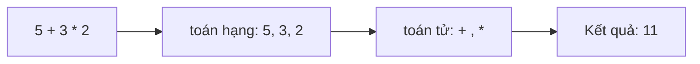
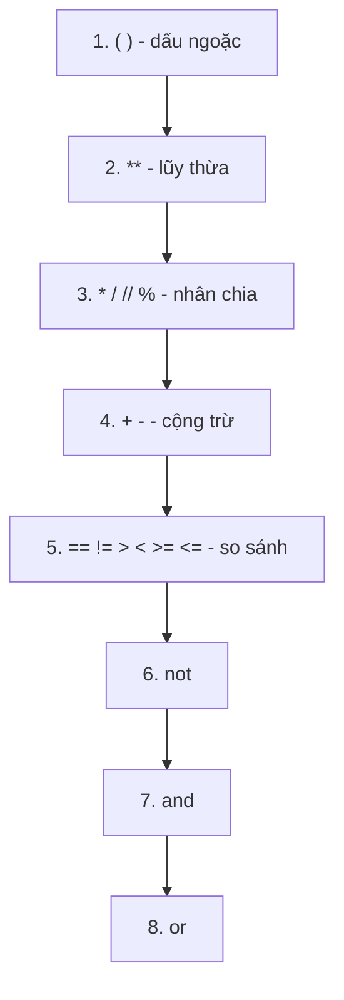

# 🐍 Bài 6: Toán Tử Trong Python

> 🎓 **Chương 2 – Nền tảng lập trình**

---

## 🎯 Mục tiêu

Sau bài học này, học viên sẽ:

* ✅ Sử dụng thành thạo **toán tử số học**: `+ - * / // % **`.
* ✅ Nắm vững **toán tử gán** đơn và gán kết hợp: `= += -= *= /= //= %= **=`.
* ✅ Dùng **toán tử so sánh** để so sánh số và chuỗi: `== != > < >= <=`.
* ✅ Dùng **toán tử logic** `and`, `or`, `not` để kết hợp điều kiện.
* ✅ Hiểu **thứ tự ưu tiên** phép toán để viết biểu thức đúng.
* ✅ Vận dụng giải bài toán thực tế: tính tiền, chia tiền, kiểm tra chẵn lẻ.

---

## 📖 Kiến thức

### 1. Toán tử là gì?

> 💬 **Nói đơn giản:** Toán tử (operator) là những **ký hiệu thực hiện tính toán** trên dữ liệu. Bạn đã dùng `=` (gán) và `+`, `-`, `*`, `/` từ các bài trước — bài này sẽ trọn bộ "bộ dụng cụ" của người làm toán với Python.



### 2. Toán tử số học

| Toán tử | Ý nghĩa | Ví dụ `a = 10, b = 3` | Kết quả |
|---|---|---|---|
| `+` | Cộng | `a + b` | `13` |
| `-` | Trừ | `a - b` | `7` |
| `*` | Nhân | `a * b` | `30` |
| `/` | Chia (luôn ra số thực) | `a / b` | `3.333...` |
| `//` | Chia lấy **phần nguyên** | `a // b` | `3` |
| `%` | Chia lấy **phần dư** | `a % b` | `1` |
| `**` | Lũy thừa | `a ** 3` | `1000` |

**Hai toán tử "mới toanh" cần chú ý:**

* `//` — **chia lấy phần nguyên**: `17 // 5 = 3` (bỏ phần dư 2).
* `%` — **chia lấy phần dư**: `17 % 5 = 2`.
* `%` cực kỳ hữu ích để **kiểm tra chẵn lẻ**: số chẵn khi `so % 2 == 0`.

> 💬 **Ví dụ đời thực của `//` và `%`:** Có 17 viên kẹo chia đều cho 5 bạn: mỗi bạn được `17 // 5 = 3` viên, còn dư `17 % 5 = 2` viên. Hai câu hỏi "mỗi người mấy phần" và "còn thừa mấy" chính là `//` và `%`!

```python
# Kiểm chứng nhanh bằng Python
print(17 // 5)   # 3
print(17 % 5)    # 2
print(2 ** 10)   # 1024
```

### 3. Toán tử gán

Ngoài dấu `=` cơ bản, Python có các **toán tử gán kết hợp** — viết ngắn gọn cho phép "lấy giá trị hiện tại, biến đổi, gán lại":

```python
x = 10
x += 5    # x = x + 5   -> 15
x -= 3    # x = x - 3   -> 12
x *= 2    # x = x * 2   -> 24
x /= 4    # x = x / 4   -> 6.0
x //= 2   # x = x // 2  -> 3.0
x %= 2    # x = x % 2   -> 1.0
x **= 3   # x = x ** 3  -> 1.0
```

| Viết tắt | Tương đương | Ý nghĩa |
|---|---|---|
| `x += 5` | `x = x + 5` | Cộng thêm 5 vào x |
| `x -= 5` | `x = x - 5` | Trừ đi 5 |
| `x *= 5` | `x = x * 5` | Nhân lên 5 lần |
| `x /= 5` | `x = x / 5` | Chia cho 5 |
| `x //= 5` | `x = x // 5` | Chia nguyên cho 5 |
| `x %= 5` | `x = x % 5` | Lấy dư chia cho 5 |
| `x **= 2` | `x = x ** 2` | Bình phương |

> 💡 `+=` là toán tử được dùng **nhiều nhất** trong lập trình — đếm 1 đơn vị, cộng dồn điểm...

### 4. Toán tử so sánh

So sánh trả về kết quả **`True` hoặc `False`** (kiểu `bool`):

| Toán tử | Ý nghĩa | Ví dụ (`a = 5, b = 3`) |
|---|---|---|
| `==` | Bằng | `a == b` → `False` |
| `!=` | Khác | `a != b` → `True` |
| `>` | Lớn hơn | `a > b` → `True` |
| `<` | Nhỏ hơn | `a < b` → `False` |
| `>=` | Lớn hơn hoặc bằng | `a >= b` → `True` |
| `<=` | Nhỏ hơn hoặc bằng | `a <= b` → `False` |

> ⚠️ **Bẫy kinh điển:** dấu `==` (hai dấu bằng) mới là **so sánh**; một dấu `=` là **gán**. `a = 5` đặt a bằng 5; `a == 5` hỏi "a có bằng 5 không?"

**So sánh chuỗi:** Python so sánh chuỗi theo **thứ tự từ điển** (a < b < c ...):

```python
print("apple" < "banana")   # True - a đứng trước b
print("An" == "an")         # False - phân biệt hoa thường
print("abc" < "abd")        # True - so từng ký tự
```

### 5. Toán tử logic

Kết hợp nhiều điều kiện để tạo điều kiện phức hợp:

| Toán tử | Ý nghĩa | Kết quả |
|---|---|---|
| `and` | **Và** — đúng khi cả hai đều đúng | `True and True` → `True` |
| `or` | **Hoặc** — đúng khi ít nhất một đúng | `True or False` → `True` |
| `not` | **Phủ định** — đảo ngược | `not True` → `False` |

**Bảng chân trị (rút gọn):**

| A | B | `A and B` | `A or B` | `not A` |
|---|---|---|---|---|
| True | True | True | True | False |
| True | False | False | True | False |
| False | True | False | True | True |
| False | False | False | False | True |

```python
tuoi = 16
print(tuoi > 12 and tuoi < 18)   # True - tuổi "teen"
print(tuoi == 15 or tuoi == 16)  # True
print(not tuoi > 20)             # True
```

> 💬 **Ví dụ đời thực:** Đi chơi khi **và** bố mẹ đồng ý (and) — phải đủ cả hai; Được thưởng khi điểm cao **hoặc** có thành tích (or) — chỉ cần một.

### 6. Thứ tự ưu tiên phép toán

Python tính toán theo thứ tự ưu tiên từ **cao đến thấp**:



**Ví dụ kiểm chứng:**

```python
print(2 + 3 * 4)        # 14 - nhân trước, cộng sau
print((2 + 3) * 4)      # 20 - ngoặc đổi thứ tự
print(2 ** 3 ** 2)      # 512 - lũy thừa tính từ phải sang trái!
print(10 + 5 > 12 and 10 % 2 == 0)   # True and True = True
```

> 💡 **Mẹo thép:** Khi biểu thức phức tạp, đừng học thuộc thứ tự — cứ **dùng ngoặc tròn** cho phần muốn tính trước. Code dễ đọc hơn và không thể sai thứ tự.

---

## 💡 Ví dụ minh họa

### Ví dụ 1: Bộ sưu tập toán tử số học

```python
a = 10
b = 3
print("Cộng:", a + b)        # 13
print("Trừ:", a - b)         # 7
print("Nhân:", a * b)        # 30
print("Chia:", a / b)        # 3.3333333333333335
print("Chia nguyên:", a // b) # 3
print("Chia dư:", a % b)     # 1
print("Lũy thừa:", a ** b)   # 1000
```

**Giải thích từng dòng:**

| Dòng code | Ý nghĩa |
|---|---|
| `a / b` | Chia thường — kết quả luôn là số thực `3.33...` |
| `a // b` | Phần nguyên của thương: `3` |
| `a % b` | Phần dư: `10 = 3*3 + 1` nên dư `1` |
| `a ** b` | `10³ = 1000` |

### Ví dụ 2: Kiểm tra số chẵn lẻ

```python
# Số chẵn khi chia hết cho 2 (phần dư bằng 0)
so = 42
la_so_chan = so % 2 == 0
print("42 chia 2 du:", so % 2)
print("La so chan:", la_so_chan)   # True
```

**Giải thích từng dòng:**

* `so % 2` — lấy phần dư khi chia cho 2: chẵn → 0, lẻ → 1.
* `so % 2 == 0` — biểu thức so sánh trả về `bool` (`True` nếu chẵn).
* Đây là "câu thần chú" kiểm tra chẵn lẻ dùng ở rất nhiều bài toán sau này.

### Ví dụ 3: Chia đều bánh kẹo cho cả lớp

```python
# Lớp có 34 học sinh, cô giáo có 150 chiếc bánh
hoc_sinh = 34
banh = 150
moi_ban = banh // hoc_sinh      # mỗi bạn được bao nhiêu
con_lai = banh % hoc_sinh       # còn dư bao nhiêu
print("Moi ban duoc:", moi_ban, "chiec")
print("Con du:", con_lai, "chiec")
```

Kết quả: `Moi ban duoc: 4 chiec` và `Con du: 14 chiec`.

---

## 🔬 Ví dụ nâng cao

### Ví dụ 1: Tính tiền quán cà phê (có khuyến mãi)

```python
# Giá ly cà phê và số lượng
gia_ly = 35000
so_ly = 3
# Tổng trước khi giảm giá
tong = gia_ly * so_ly
# Giảm 15% cho đơn từ 100.000 trở lên
khuyen_mai = tong >= 100000
print("Khuyen mai:", khuyen_mai)
# Tiền phải trả: nếu đủ điều kiện thì trừ 15%
tien_phai_tra = tong - tong * 0.15 * int(khuyen_mai)
print("Tong:", tong, "-> Phai tra:", tien_phai_tra)
```

* `tong >= 100000` — phép so sánh ra `bool`.
* `int(khuyen_mai)` — đổi `True`/`False` thành `1`/`0` để toán học dễ dàng: đúng thì trừ 15%, sai thì trừ 0%.
* Cách này gọn nhưng có thể dùng `if` (Bài 8) cho rõ ràng hơn.

### Ví dụ 2: Máy tính quy đổi điểm thang 10

```python
# Điểm thang 10 -> thang 4 (đại học): diem_4 = diem_10 * 4 / 10
diem_10 = 8.5
diem_4 = diem_10 * 4 / 10
print("Diem thang 4:", round(diem_4, 2))   # 3.4
# Làm tròn lên 1 chữ số thập phân để xếp hạng
print("Lam tron:", round(diem_4, 1))       # 3.4
```

### Ví dụ 3: Kiểm tra điều kiện "tuổi teen và có thẻ"

```python
tuoi = 15
co_the = True
# and: cả hai điều kiện đều phải đúng
duoc_vao_cung = tuoi >= 13 and tuoi <= 19 and co_the
# or: chỉ cần một trong hai
duoc_uu_tien = tuoi == 15 or tuoi == 16
# not: phủ định
khong_duoc_vao = not duoc_vao_cung
print("Duoc vao cung:", duoc_vao_cung)     # True
print("Duoc uu tien:", duoc_uu_tien)       # True
print("Khong duoc vao:", khong_duoc_vao)   # False
```

---

## ⚠️ Lỗi thường gặp

### Lỗi 1: Nhầm `=` với `==`

```python
a = 5
print(a = 5)   # ❌ SAI
print(a == 5)  # ✅ ĐÚNG
```

* **Kết quả báo:** `SyntaxError: invalid syntax` (một dấu = trong biểu thức).
* **Nguyên nhân:** `=` là gán, không phải so sánh.
* **Cách sửa:** dùng `==` khi muốn hỏi "bằng nhau không?".

### Lỗi 2: Chia cho 0

```python
x = 10 / 0   # ❌ SAI
```

* **Kết quả báo:** `ZeroDivisionError: division by zero`.
* **Nguyên nhân:** toán học không có phép chia cho 0, Python cũng vậy (áp dụng cho `/`, `//`, `%`).
* **Cách sửa:** kiểm tra mẫu số khác 0 trước khi chia.

### Lỗi 3: So sánh sai kiểu

```python
print("5" > 3)   # ❌ SAI
```

* **Kết quả báo:** `TypeError: '>' not supported between instances of 'str' and 'int'`.
* **Nguyên nhân:** so sánh số với chuỗi vô nghĩa.
* **Cách sửa:** ép kiểu cho cùng loại: `int("5") > 3` hoặc dùng `5 > 3`.

### Lỗi 4: Nhầm toán tử `and` với dấu `&`

```python
print(5 > 3 & 2 < 4)   # ❌ SAI - & không phải "và" trong Python
print(5 > 3 and 2 < 4) # ✅ ĐÚNG
```

* **Kết quả báo:** `TypeError` hoặc kết quả sai lệch.
* **Nguyên nhân:** `&` là toán tử bit, dành riêng cho số nhị phân.
* **Cách sửa:** logic "và" phải dùng từ khóa `and`.

### Lỗi 5: Dùng dấu phẩy trong số thập phân

```python
pi = 3,14    # ❌ SAI - trở thành bộ dữ liệu (3, 14)
pi = 3.14    # ✅ ĐÚNG
```

* **Kết quả:** chương trình chạy nhưng `pi` lại là một tuple `(3, 14)` — mọi phép tính về sau sai bét.
* **Nguyên nhân:** dấu phẩy trong số không phải cách viết số thập phân của Python.
* **Cách sửa:** viết dấu chấm `3.14`.

---

## 💎 Mẹo

* 🧮 **`//` và `%` đi cặp với nhau:** `a = (a // b) * b + a % b` luôn đúng — "nguyên" và "dư" bổ sung nhau.
* ⚖️ **`==` để hỏi, `=` để gán:** đọc thành "bằng?" khi thấy hai dấu, "gán" khi thấy một dấu.
* 🔢 **Kiểm tra chẵn lẻ:** `x % 2 == 0` — thuộc lòng công thức này.
* 🧾 **Dùng `+=` khi cộng dồn:** `tong += diem` gọn và ít lỗi hơn `tong = tong + diem`.
* 📦 **Ngoặc tròn là bạn thân:** biểu thức khó hiểu thì thêm ngoặc, không cần nhớ thứ tự ưu tiên.
* 🔍 **`bool` là kết quả mọi phép so sánh:** cứ thấy `==`, `>`, `and`, `or` thì kết quả thuộc kiểu `bool`.

---

## 📝 Tóm tắt

| Nhóm | Toán tử | Ghi nhớ |
|---|---|---|
| ➕ Số học | `+ - * / // % **` | `//` nguyên, `%` dư, `**` lũy thừa |
| ✍️ Gán | `= += -= *= /= //= %= **=` | `x += 1` là cộng dồn |
| ⚖️ So sánh | `== != > < >= <=` | Trả về `True`/`False` |
| 🧠 Logic | `and or not` | Và / Hoặc / Phủ định |
| 🏗️ Ưu tiên | `( )` → `**` → `* / // %` → `+ -` → so sánh → `not` → `and` → `or` | Khi lưỡng lự, dùng ngoặc |

---

## 🧪 Kiểm tra nhanh

1. ❓ `17 // 5` và `17 % 5` bằng bao nhiêu?
2. ❓ `2 ** 3` bằng bao nhiêu? Còn `3 ** 2`?
3. ❓ Viết lệnh tăng biến `diem` thêm 2 đơn vị bằng toán tử gán kết hợp.
4. ❓ `10 / 4` khác `10 // 4` thế nào?
5. ❓ Kết quả của `5 == "5"` là gì?
6. ❓ `5 > 3 and 10 < 8` cho kết quả gì? Giải thích.
7. ❓ Dùng toán tử nào để kiểm tra một số là số chẵn?
8. ❓ Kết quả `2 + 3 * 4` là bao nhiêu? Muốn ra 20 phải viết sao?
9. ❓ Lỗi gì xảy ra khi viết `x = 10 / 0`?
10. ❓ `not (5 > 3)` bằng bao nhiêu?

<details>
<summary>🔍 Xem đáp án</summary>

1. `3` và `2`.
2. `8` và `9`.
3. `diem += 2`.
4. `10 / 4 = 2.5` (số thực), `10 // 4 = 2` (bỏ phần dư).
5. `False` — một số, một chuỗi.
6. `False` — vế sau `10 < 8` sai, `and` cần cả hai đúng.
7. `so % 2 == 0`.
8. `14` (nhân trước); viết `(2 + 3) * 4` để ra 20.
9. `ZeroDivisionError: division by zero`.
10. `False`.

</details>

---

## 📚 Bài đọc thêm

* [Python.org – Toán tử và biểu thức (đầy đủ, chính thức)](https://docs.python.org/3/reference/expressions.html)
* [Python.org – Thứ tự ưu tiên toán tử](https://docs.python.org/3/reference/expressions.html#operator-precedence)
* [W3Schools – Python Operators](https://www.w3schools.com/python/python_operators.asp)
* [Real Python – Python Operators and Expressions](https://realpython.com/python-operators-expressions/)

---

## 🏁 Kết thúc bài

🎉 Bạn đã có cả "bộ dụng cụ tính toán" trong tay! Giờ đến lúc **trò chuyện hai chiều với máy tính**: hỏi người dùng nhập dữ liệu và in kết quả đẹp mắt — đó là **nhập xuất dữ liệu**. Hãy sang:

👉 **[Bài 7: Nhập Xuất Dữ Liệu](../07_Input_Output/bai_giang.md)**
