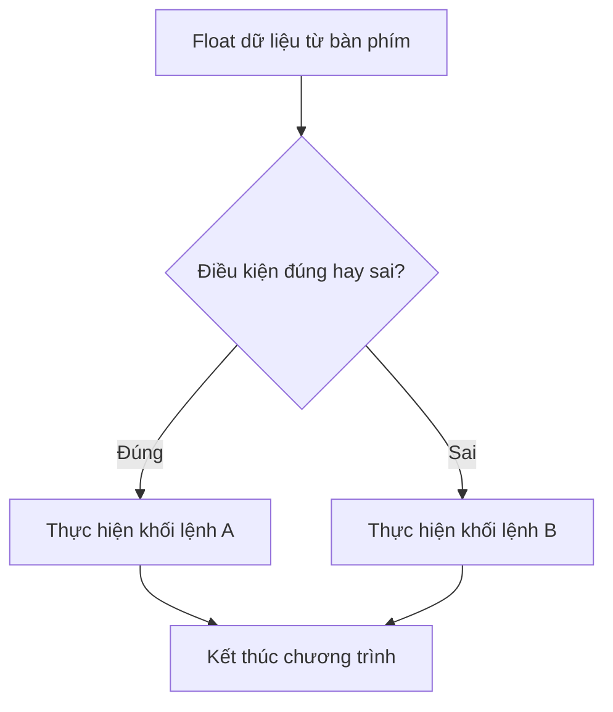
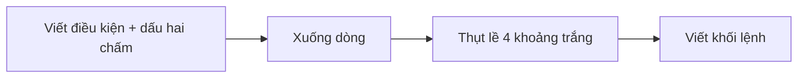
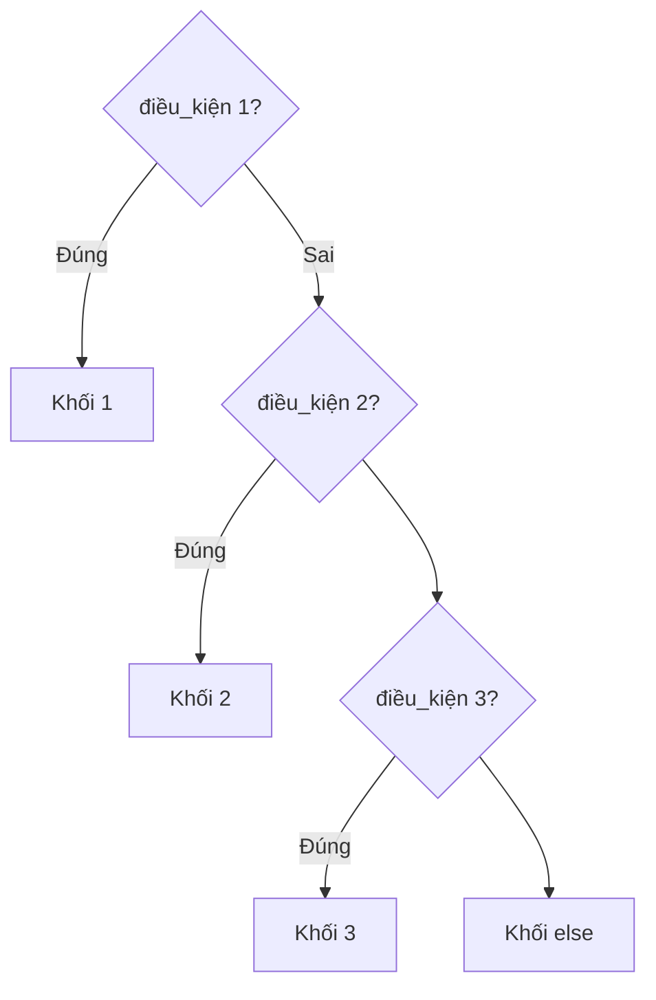

# 🚦 Bài 8: Câu Lệnh If – Cấu Trúc Rẽ Nhánh

> 🎓 **Chương 2 – Nền tảng lập trình**

---

## 🎯 Mục tiêu

Sau bài học này, học viên sẽ:

* ✅ Hiểu vì sao cần **rẽ nhánh** — cho máy tính tự đưa ra quyết định.
* ✅ Viết được câu lệnh `if` đơn giản để xử lý một điều kiện.
* ✅ Dùng `if - else` cho **hai** tình huống ngược nhau.
* ✅ Dùng `if - elif - else` cho **nhiều** tình huống theo thứ tự.
* ✅ Nắm vững quy tắc **thụt lề** (indentation) — bắt buộc và cực kỳ quan trọng trong Python.
* ✅ Vận dụng giải bài toán thực tế: xếp loại điểm, tiền điện bậc thang, máy ATM, kiểm tra chẵn lẻ, tuổi...

---

## 📖 Kiến thức

### 1. Vì sao cần rẽ nhánh?

Các chương trình bạn viết từ bài 1 đến bài 7 chạy **thẳng một mạch từ trên xuống** — mọi dòng lệnh đều được thực hiện. Nhưng cuộc sống không phải lúc nào cũng vậy:

> 💬 **Ví dụ đời thực:** Buổi sáng, bạn nhìn ra ngoài:
> * Nếu trời mưa → mang ô.
> * Nếu không mưa → đi không.
>
> Máy tính cũng cần đúng "khả năng" đó: đọc dữ liệu, **kiểm tra điều kiện**, rồi chọn đường đi phù hợp. Đó gọi là **cấu trúc rẽ nhánh**.



### 2. Điều kiện là gì?

**Điều kiện** là một biểu thức mà kết quả thuộc kiểu `bool` — `True` (đúng) hoặc `False` (sai). Ta đã học ở bài 6:

```python
diem = 8.5
so = 6
tuoi = 15
diem >= 5     # True  - biểu thức so sánh
so % 2 == 0   # True  - kiểm tra chẵn
tuoi < 18     # ...   - tùy giá trị tuoi
```

Các điều kiện thường được tạo từ **toán tử so sánh** (`== != > < >= <=`) và **toán tử logic** (`and or not`).

### 3. Thụt lề — "ngôn ngữ cơ thể" của Python

Khác với C/Java (dùng dấu `{}`), Python dùng **thụt lề** để xác định **khối lệnh** (block).

```python
if diem >= 5:
    print("Đậu")          # thụt lề -> thuộc khối if
    print("Chúc mừng!")   # vẫn thụt lề -> vẫn trong khối if
print("Kết thúc")         # không thụt lề -> ngoài khối if
```

* Tiêu chuẩn dùng **4 khoảng trắng** (hoặc **1 phím Tab**) cho một cấp.
* **KHÔNG được trộn lẫn** Tab và dấu cách trong cùng một khối.
* Thụt lề sai → chương trình báo `IndentationError` hoặc chạy sai ý nghĩa.



### 4. `if` — kiểm tra điều kiện đơn

```python
if điều_kiện:
    # khối lệnh chạy khi điều kiện đúng
```

Chỉ có **một nhánh**: đúng thì chạy khối lệnh bên trong, sai thì **bỏ qua** và chạy tiếp phía sau.

```python
# Nhập: 75
tuoi = int(input("Nhập tuổi của bạn: "))
if tuoi >= 18:
    print("Bạn đủ tuổi lái xe máy.")
print("Chương trình kết thúc.")
```

Nếu nhập 75 → in cả hai dòng. Nếu nhập 15 → chỉ in dòng cuối, dòng trong `if` bị bỏ qua.

### 5. `if - else` — hai nhánh ngược nhau

Khi cần xử lý cả trường hợp đúng **và** sai:

```python
if điều_ki:
    # khối lệnh khi đúng
else:
    # khối lệnh khi SAI
```

> **Nếu** điều kiện đúng → chạy nhánh `if`. **Ngược lại (else)** → chạy nhánh `else`. Không bao giờ cả hai cùng chạy.

```python
# Kiểm tra chẵn lẻ
so = int(input("Nhập một số nguyên: "))
if so % 2 == 0:
    print(f"{so} là số chẵn.")
else:
    print(f"{so} là số lẻ.")
```

### 6. `if - elif - else` — nhiều nhánh theo thứ tự

Khi có **nhiều khả năng**, dùng `elif` (viết tắt của *else if*):

```python
if cond_1:
    # khi cond_1 đúng
elif cond_2:
    # khi cond_1 SAI nhưng cond_2 đúng
elif cond_3:
    # khi cond_1, cond_2 sai nhưng cond_3 đúng
else:
    # khi tất cả đều sai
```

> ⚠️ **Nguyên tắc vàng:** Python duyệt **từ trên xuống**, chỉ chạy **nhánh đầu tiên có điều kiện đúng** — nhánh nào đúng trước thì thắng, các nhánh sau không được xét nữa.



**Ví dụ xếp loại điểm theo thang phổ thông:**

```python
diem = int(input("Nhập điểm trung bình: "))
if diem >= 8:
    loai = "Giỏi"
elif diem >= 6.5:
    loai = "Khá"
elif diem >= 5:
    loai = "Trung bình"
else:
    loai = "Yếu"
print(f"Xếp loại: {loai}")
```

> 🌳 **Mẹo ghi nhớ thứ tự:** xếp loại luôn đi từ **cao xuống thấp**. Khi đã lọt vào `elif diem >= 6.5`, nghĩa là `diem < 8` chắc chắn đúng — không cần viết lại `and diem < 8`.

### 7. `if` lồng bên trong `if`

Một câu `if` có thể nằm bên trong nhánh của câu `if` khác — gọi là **if lồng nhau**:

```python
tuoi = 16
co_the = True
if tuoi >= 15:                  # ngoài: tuổi đủ chưa?
    if co_the:                  # trong: có thẻ không?
        print("Vào cổng VIP.")
    else:
        print("Vào cổng thường.")
else:
    print("Chưa đủ tuổi.")
```

> 💬 **Khi nào dùng?** Khi điều kiện phụ chỉ **có nghĩa** khi điều kiện chính đã đúng. Nếu điều kiện độc lập, nên dùng `and` cho gọn hơn: `if tuoi >= 15 and co_the:`.

### 8. Nhận diện đầu vào nhờ `if`

Ở bài 7, ta gán dữ liệu ngay sau khi nhập. Kết hợp với `if`, chương trình trở nên thông minh: **kiểm tra tính hợp lệ của dữ liệu** trước khi xử lý.

```python
diem = float(input("Nhập điểm (0 - 10): "))
if diem >= 0 and diem <= 10:
    print(f"Điểm hợp lệ: {diem}")
else:
    print("Điểm không hợp lệ!")
```

---

## 💡 Ví dụ minh họa

### Ví dụ 1: Kiểm tra chẵn lẻ (`if - else`)

```python
# Nhập một số nguyên từ bàn phím
so = int(input("Nhập một số nguyên: "))
# Số chẵn chia hết cho 2 (phần dư bằng 0)
if so % 2 == 0:
    print("Đây là số chẵn.")
else:
    print("Đây là số lẻ.")
```

**Giải thích từng dòng:**

| Dòng code | Ý nghĩa |
|---|---|
| `if so % 2 == 0:` | Kiểm tra "phần dư khi chia cho 2 có bằng 0 không" — nếu đúng là chẵn |
| `print("Đây là số chẵn.")` | Chỉ chạy khi điều kiện đúng |
| `else:` | Nhánh ngược lại — số lẻ |

### Ví dụ 2: Kiểm tra tuổi xem phim (`if - else`)

```python
tuoi = int(input("Nhập tuổi của bạn: "))
if tuoi >= 18:
    print("Bạn được xem phim người lớn.")
else:
    print("Bạn cần người lớn đi kèm.")
```

**Giải thích từng dòng:**

* `tuoi >= 18` — biểu thức so sánh trả về `True` hoặc `False`.
* Nhánh `if` — chỉ một trong hai nhánh được chọn, cả hai không bao giờ cùng chạy.
* Đây là mẫu "rẽ hai ngả" đơn giản nhất mà bạn sẽ gặp đi gặp lại.

### Ví dụ 3: Xếp loại điểm theo 4 mức (`if - elif - else`)

```python
diem = float(input("Nhập điểm trung bình: "))
if diem >= 8.5:
    loai = "Giỏi"
elif diem >= 6.5:
    loai = "Khá"
elif diem >= 5:
    loai = "Trung bình"
else:
    loai = "Yếu"
print(f"Học lực: {loai}")
```

**Giải thích từng dòng:**

* Điều kiện được kiểm tra **từ trên xuống**: 8.5 → 6.5 → 5.
* Giả sử `diem = 7.2`: lần lượt rơi vào nhánh `eloif diem >= 6.5` → `"Khá"`.
- Nếu tất cả đều sai (`diem < 5`) → `else` luôn chạy.

---

## 🔬 Ví dụ nâng cao

### Ví dụ 1: Xếp loại học lực đầy đủ + kiểm tra điểm hợp lệ

> 💡 Bài toán từ PDF: nhập điểm 0–10, xếp loại Xuất sắc/Giỏi/Khá/TB/Yếu; nếu điểm ngoài 0–10 thì báo lỗi.

```python
# Nhập điểm trung bình (thang 10)
diem = float(input("Nhập điểm trung bình (0 - 10): "))

# Bước 1: kiểm tra điểm có hợp lệ không
if diem < 0 or diem > 10:
    print("Điểm không hợp lệ.")
else:
    # Bước 2: điểm hợp lệ mới xếp loại
    if diem >= 9:
        loai = "Xuất sắc"
    elif diem >= 8:
        loai = "Giỏi"
    elif diem >= 6.5:
        loai = "Khá"
    elif diem >= 5:
        loai = "Trung bình"
    else:
        loai = "Yếu"
    print(f"Xếp loại: {loai}")
```

> 💡 **Cấu trúc tổng quát:** kiểm tra **đầu vào** (input validation) trước, rồi mới xử lý chuyển nhánh bên trong — đây là thói quen tốt của lập trình viên chuyên nghiệp.

### Ví dụ 2: Tiền điện bậc thang

> 💡 Bài toán từ PDF: 0–50 kWh giá 2000đ/kWh; 51–100 kWh giá 2500đ/kWh; trên 100 kWh giá 3000đ/kWh.

```python
# Nhập số kWh đã tiêu thụ
kwh = float(input("Nhập số điện tiêu thụ (kWh): "))
# Xác định đơn giá theo bậc
if kwh <= 50:
    don_gia = 2000          # bậc 1
elif kwh <= 100:
    don_gia = 2500          # bậc 2
else:
    don_gia = 3000          # bậc 3
# Tính tiền theo đơn giá của bậc tương ứng
tien = kwh * don_gia
print(f"Số tiền phải trả: {tien} đồng")
```

> 💬 Chạy thử `65 kWh`: không đạt điều kiện `<= 50`, lọt vào `elif kwh <= 100` → giá 2500 → `162.500đ`, khớp đúng với ví dụ trong giáo trình.

### Ví dụ 3: Máy ATM cơ bản

> 💬 Bài toán từ PDF: chương trình nhận mã chức năng, thực hiện xem số dư / nạp tiền / rút tiền. (Đây là phiên bản một lượt — vòng lặp sẽ học ở bài 10, 11.)

```python
# Số dư khởi tạo
so_du = 1000000
# Nhập lựa chọn chức năng
lua_chon = int(input("1. Xem số dư | 2. Nạp tiền | 3. Rút tiền\nChọn: "))
if lua_chon == 1:
    print(f"Số dư hiện tại: {so_du} VND")
elif lua_chon == 2:
    so_nap = float(input("Nhập số tiền muốn nạp: "))
    so_du += so_nap          # dùng toán tử += của bài 6
    print(f"Nạp thành công. Số dư mới: {so_du} VND")
elif lua_chon == 3:
    so_rut = float(input("Nhập số tiền muốn rút: "))
    if so_rut <= so_du:        # if lồng: kiểm tra đủ tiền không
        so_du -= so_rut
        print(f"Rút thành công. Số dư còn lại: {so_du} VND")
    else:
        print("Số dư không đủ để rút!")
else:
    print("Lựa chọn không hợp lệ.")
```

> 💡 Bạn thấy sức mạnh tổng hợp của 3 bài học: **nhập - ép kiểu** (bài 7), **toán tử** (bài 6), và **rẽ nhánh** (bài này). Chỉ cần thêm vòng lặp (bài 10, 11) là có một cây ATM hoàn chỉnh!

---

## ⚠️ Lỗi thường gặp

### Lỗi 1: Quên dấu hai chấm

```python
if so > 10   # ❌ SAI - thiếu ':'
```

* **Kết quả báo:** `SyntaxError: invalid syntax`.
* **Cách sửa:** mọi `if`, `elif`, `else` đều kết thúc dòng bằng dấu hai chấm `:`.

### Lỗi 2: Thụt lề sai / trộn lẫn Tab và khoảng trắng

```python
if so > 5:
print("Lớn hơn 5")      # ❌ SAI: không thụt
```

* **Kết quả báo:** `IndentationError: expected an indented block`.
* **Cách sửa:** thống nhất **4 dấu cách** cho mỗi cấp thụt lề; không trộn Tab với khoảng trắng.

### Lỗi 3: Dùng `=` thay vì `==` trong điều kiện

```python
if lua_chon = 1:       # ❌ SAI: gán chứ không so sánh
```

* **Kết quả báo:** `SyntaxError` (một dấu `=` trong điều kiện).
* **Cách sửa:** hỏi "có bằng không" phải dùng `==`.

### Lỗi 4: Thứ tự `elif` sai làm kết quả sai ngầm

```python
diem = 9
if diem >= 6.5:     # nhánh NÀY đúng 9 >= 6.5
    loai = "Khá"
elif diem >= 8:     # ⚠️ không bao giờ chạy!
    loai = "Giỏi"
```

* **Nguyên nhân:** Python chạy nhánh **đầu tiên** đúng; viết điều kiện rộng trước sẽ "nuốt" các trường hợp hẹp phía sau.
* **Cách sửa:** xếp điều kiện từ **chặt/hẹp trước, rộng sau** (Giỏi → Khá → TB → Yếu).

### Lỗi 5: Thụt lề sai làm đổi ý nghĩa chương trình

```python
# Dòng "Chúc mừng" không thụt lề - nằm NGOÀI khối if
if tuoi >= 18:
    print("Đủ tuổi")
print("Chúc mừng!")     # LUÔN chạy, dù tuổi có dưới 18!
```

* **Nguyên nhân:** Python dựa vào thụt lề để biết lệnh "thuộc về ai"; mất thụt lề = tách khỏi khối `if`.
* **Cách sửa:** trước khi viết lệnh kế tiếp, hãy nhìn kỹ căp lề — lệnh muốn nằm trong khối `if` phải thụt đúng 4 khoảng trắng.

---

## 💎 Mẹo

* 🧠 **Thứ tự `elif` từ chặt - rộng:** đếm "Xuất sắc → Giỏi → Khá → ..." nghe như thang điểm tự nhiên.
* 🔢 **Kiểm tra đầu vào trước:** dùng `if diem < 0 or diem > 10` để chặn dữ liệu rác sớm.
* 🥓 **`if ... and ...` thay cho if lồng** khi hai điều kiện độc lập — gọn hơn.
* ✏️ **Khối lệnh ngắn gọn:** mỗi nhánh chỉ 1-3 dòng là lý tưởng; dài quá nghĩ cách tách hàm (bài 12).
* 🔍 **Tự in **test** với các giá trị biên:** 49, 50, 51, 100, 101 kWh để chắc chắn ranh giới bậc tiền điện không sai.
* ☝️ **Dấu hai chấm là "mạch điện":** dòng nào kết thúc bằng `:` thì dòng kế tiếp **nhất định** phải thụt vào.

---

## 📝 Tóm tắt

| Cấu trúc | Khi nào dùng | Ghi nhớ |
|---|---|---|
| `if` | Chỉ cần kiểm tra 1 điều kiện, phải sai thì bỏ qua | Đúng → chạy, sai → nhảy tiếp |
| `if ... else` | Hai khả năng ngược nhau | Đúng → không sai thì `else` |
| `if ... elif ... else` | Nhiều khả năng | Chỉ nhánh đầu tiên đúng được chạy |
| `if` lồng nhau | Điều kiện phụ chỉ có ý nghĩa khi điều chính | Thụt lề thêm 1 cấp |

* Thụt lề = **khối lệnh** trong Python — bắt buộc, thống nhất 4 khoảng trắng.
* Điều kiện luôn là biểu thức `bool` — tạo từ so sánh và `and`/`or`/`not`.

---

## 🧪 Kiểm tra nhanh

1. ❓ Python dùng gì để xác định khối lệnh? Dấu `{}` hay thụt lề?
2. ❓ Sau dòng `if diem >= 5` phải có ký tự gì?
3. ❓ Viết điều kiện kiểm tra một số âm hay không (*nhỏ hơn 0*).
4. ❓ Trong `if - elif - else`, khi `elif 1` đúng, các `elif` sau có chạy không?
5. ❓ Lỗi gì khi viết `if so > 10` mà không có `:`?
6. ❓ Trong Python, thụt lề thường là bao nhiêu khoảng trắng?
7. ❓ `if a == b` và `if a = b` khác nhau thế nào?
8. ❓ Với `diem = 9.2`, theo ví dụ xếp loại: `>= 8.5` → Giỏi, `>= 6.5` → Khá... kết quả sẽ là gì?
9. ❓ Điều kiện "điểm hợp lệ từ 0 đến 10" viết bằng bạn `and` như thế nào?
10. ❓ Khi muốn kiểm tra 5 thể loại mức, ta dùng `if - elif - else` hay nhiều `if` rời nhau thích hợp hơn? Vì sao?

<details>
<summary>🔍 Xem đáp án</summary>

1. Thụt lề (indentation).
2. Dấu hai chấm `:`.
3. `if so < 0:` (hoặc `if so < 0 and True` — không cần thêm).
4. Không — chỉ nhánh đầu tiên có điều kiện đúng được chạy.
5. `SyntaxError`.
6. 4 khoảng trắng (hoặc 1 Tab nhất quán).
7. `==` so sánh bằng; `=` là gán — trong điều kiện dùng `==`.
8. `"Giỏi"`.
9. `if diem >= 0 and diem <= 10:`.
10. `if - elif - else`: kiểm tra tuần tự, dừng ở nhánh đúng như đầu — nhiều `if` sẽ chạy tất cả, rối và dễ sai.

</details>

---

## 📚 Bài đọc thêm

* [Python.org – Control Flow (if statements)](https://docs.python.org/3/tutorial/controlflow.html)
* [W3Schools – Python If ... Else](https://www.w3schools.com/python/python_conditions.asp)
* [Real Python – Conditional Statements in Python](https://realpython.com/python-conditional-statements/)
* [Python.org – Operator precedence (so sánh trong điều kiện)](https://docs.python.org/3/reference/expressions.html#operator-precedence)

---

## 🏁 Kết thúc bài

🎉 Bây giờ chương trình của bạn đã biết **suy nghĩ và quyết định** dựa trên dữ liệu đầu vào — rẽ hướng, xếp loại, kiểm tra lỗi. Nhưng `if - elif` dài có thể rất khó đọc khi kiểm tra **nhiều giá trị cố định** (như menu 0–4 của ATM). Python có một câu lệnh gọn đẹp hơn cho việc đó — hãy đến bài kế:

👉 **[Bài 9: Match Case – Cấu Trúc Phân Rẽ Mẫu](../09_Match_case/bai_giang.md)**