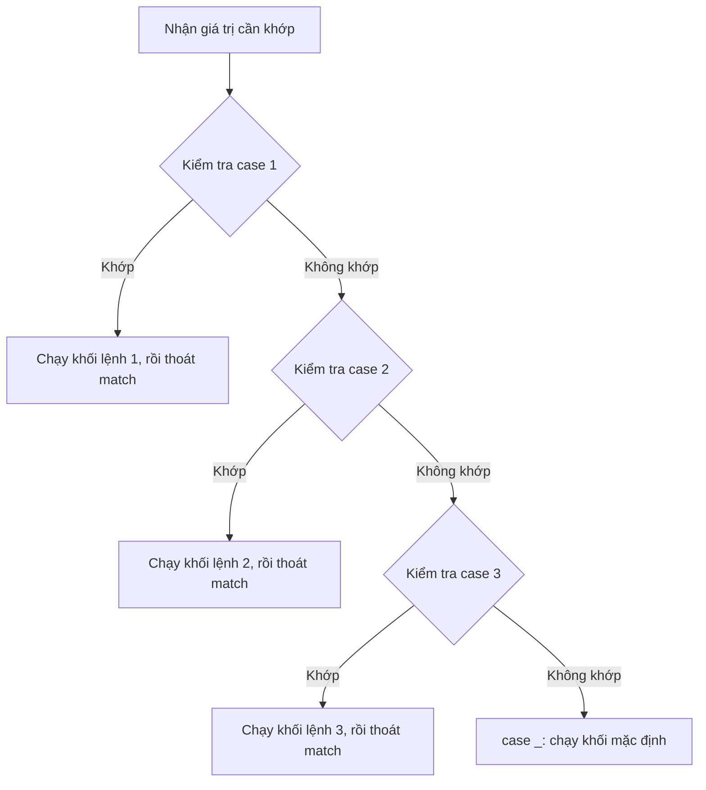

# 🔀 Bài 9: Câu Lệnh Match – Case

> 🎓 **Chương 3 – Ra quyết định với câu lệnh điều kiện**

---

## 🎯 Mục tiêu

Sau bài học này, học viên sẽ:

* ✅ Hiểu **match-case là gì** và khi nào nên dùng nó thay cho `if-elif-else`.
* ✅ Viết được câu lệnh `match ... case ...` cơ bản với đúng cú pháp.
* ✅ Dùng **`case _`** để xử lý trường hợp "không khớp gì cả" (mặc định).
* ✅ Dùng dấu **`|`** để khớp **một case với nhiều giá trị**.
* ✅ So sánh được ưu – nhược điểm của `match-case` với `if-elif-else` để chọn đúng công cụ.
* ✅ Biết **`match-case` chỉ chạy được trên Python 3.10 trở lên** và cách kiểm tra phiên bản.
* ✅ Vận dụng vào các bài toán thực tế: menu máy tính, số ngày trong tháng, trò oẳn tù tì.

> ⚠️ **Lưu ý quan trọng:** `match-case` là tính năng **mới từ Python 3.10**. Nếu bạn dùng Python 3.9 trở xuống, hãy cài bản mới hơn theo [Bài 2: Cài đặt Python](../02_Cai_dat_Python/bai_giang.md) hoặc kiểm tra bằng lệnh `python --version`.

---

## 📖 Kiến thức

### 1. Ôn nhanh bài trước: `if-elif-else`

Ở bài 8, chúng ta đã biết cách kiểm tra điều kiện bằng `if`, `elif`, `else`:

```python
thu = 3
if thu == 2:
    print("Thứ Hai")
elif thu == 3:
    print("Thứ Ba")
else:
    print("Ngày khác")
```

Cách này **linh hoạt** vì so sánh được mọi biểu thức (`>`, `<`, `and`, `or`...), nhưng khi phải kiểm tra **một biến với rất nhiều giá trị cụ thể**, chuỗi `if-elif` trở nên dài dòng và khó đọc.

### 2. Đặt vấn đề: vì sao cần match-case?

> 💬 **Ví dụ đời thực:** Điều tra viên nhận một **thẻ căn cước** và phải xác định tỉnh/thành theo mã số. Có 63 mã — nếu viết bằng 63 lệnh `if-elif` thì bảng điều tra dày như cuốn danh bạ điện thoại! `match-case` giống như một **bảng tra cứu** được thiết kế riêng cho việc này.

`match-case` (còn gọi là **structural pattern matching** — khớp mẫu cấu trúc) ra đời để giải quyết chính xác tình huống đó: **so khớp một giá trị với danh sách các mẫu cố định**, code gọn gàng hơn, dễ đọc hơn.

### 3. Cú pháp cơ bản

```python
gia_tri = 1          # giá trị bất kỳ để thử
match gia_tri:
    case 1:
        pass  # Khối lệnh khi gia_tri == 1
    case 2:
        pass  # Khối lệnh khi gia_tri == 2
    case _:
        pass  # Khối lệnh khi không khớp mẫu nào ở trên
```

**Giải thích các thành phần:**

| Thành phần | Ý nghĩa |
|---|---|
| `match gia_tri:` | Giá trị cần so khớp (số, chuỗi, biến...) — có thể là biểu thức |
| `case mau:` | Mỗi `case` là một **mẫu** (pattern) cần kiểm tra |
| `case _:` | Mẫu **mặc định** — khớp mọi giá trị, đặt **cuối cùng** như `else` |
| Thụt lề | Giống `if`, khối lệnh sau `case` phải thụt lề (1 tab hoặc 4 dấu cách) |

> 💡 **Không giống C/Java:** Python `match-case` **không cần `break`** ở cuối mỗi `case` — sau khi thực hiện xong khối lệnh, chương trình **tự động thoát khỏi câu match**. Điều này giúp tránh lỗi "tràn case" kinh điển của `switch` trong ngôn ngữ khác.



### 4. `case _` — mẫu mặc định

`case _` đóng vai trò như `else` trong `if-else`: chạy khi **không có mẫu nào ở trên khớp**.

> 💬 **Ví dụ đời thực:** Trong câu hỏi trắc nghiệm, đáp án nằm trong A, B, C, D — chọn X thì máy báo "Đáp án không hợp lệ". `case _` chính là câu báo đó.

```python
lua_chon = "X"
match lua_chon:
    case "A":
        print("Bạn chọn A")
    case "B":
        print("Bạn chọn B")
    case _:
        print("Lựa chọn không hợp lệ!")
```

### 5. Một case khớp nhiều giá trị bằng dấu `|`

Nếu nhiều giá trị cùng chung một hành động, gộp chúng lại bằng dấu **`|`** (đọc là "hoặc"):

```python
ky_tu = "a"          # Ví dụ: ký tự cần kiểm tra
match ky_tu:
    case "a" | "e" | "i" | "o" | "u":
        print("Đây là nguyên âm")
    case _:
        print("Đây là phụ âm")
```

> ⚠️ **Chú ý:** Dùng dấu `|` (dấu sổ thẳng trên bàn phím, phím `\` giữ `Shift`), **không phải** từ `or` của Python! `case "a" or "e":` sẽ **sai** và báo lỗi.

### 6. So sánh `if-elif` với `match-case`

| Tiêu chí | `if-elif-else` | `match-case` |
|---|---|---|
| Điều kiện | Mọi biểu thức so sánh (`>`, `<`, `and`...) | So khớp giá trị với mẫu cụ thể |
| Nhiều giá trị cùng nhánh | Phải viết `x == 2 or x == 3` hoặc `x in (2, 3)` | Gọn: `case 2 \| 3:` |
| Trường hợp mặc định | `else:` | `case _:` |
| Đọc code khi nhiều lựa chọn | Dài, dễ rối | Ngắn, "bảng tra cứu" trực quan |
| Phiên bản | Mọi Python 3 | **Chỉ Python 3.10+** |
| Ưu thế | Linh hoạt cho điều kiện phức tạp | Nhanh viết, dễ đọc khi so giá trị cố định |

> 💡 **Quy tắc vàng:** Nếu bạn đang viết **từ 3 `elif` trở lên** chỉ để so một biến với các **giá trị cụ thể** (số, chuỗi), hãy nghĩ đến `match-case`. Nếu điều kiện là khoảng giá trị (`x > 5`, `60 <= diem < 80`) thì cứ dùng `if-elif` — `match-case` không giỏi việc này (trừ khi dùng "guard", xem phần Ví dụ nâng cao).

### 7. Kiểm tra phiên bản Python của bạn

Gõ lệnh sau trong Command Prompt / Terminal:

```bash
python --version
```

* Nếu hiển thị `Python 3.10.x` trở lên → **dùng được** `match-case`.
* Nếu hiển thị `Python 3.9.x` hoặc thấp hơn → hãy cài đặt lại bản mới nhất theo bài 2.

---

## 💡 Ví dụ minh họa

### Ví dụ 1: Xác định thứ trong tuần

Nhập một số từ 1 đến 7, in ra thứ tương ứng (1 = Chủ nhật, 2 = Thứ Hai, ..., 7 = Thứ Bảy).

```python
# Nhập số thứ trong tuần (bài 7 đã học input + int)
so = int(input("Nhập số thứ trong tuần (1-7): "))

# So khớp số vừa nhập với các mẫu
match so:
    case 1:
        print("Chủ nhật")
    case 2:
        print("Thứ Hai")
    case 3:
        print("Thứ Ba")
    case 4:
        print("Thứ Tư")
    case 5:
        print("Thứ Năm")
    case 6:
        print("Thứ Sáu")
    case 7:
        print("Thứ Bảy")
    case _:
        print("Số không hợp lệ!")
```

**Giải thích từng dòng:**

| Dòng code | Ý nghĩa |
|---|---|
| `so = int(input(...))` | Nhập chữ từ bàn phím rồi đổi thành số nguyên |
| `match so:` | Bắt đầu khớp giá trị của biến `so` |
| `case 1: ... case 7:` | Mỗi số từ 1–7 có một mẫu và một câu trả lời riêng |
| `case _:` | Số ngoài 1–7 (ví dụ 0, 9) sẽ rơi vào đây |

> 💡 Nếu nhập `4`, Python kiểm tra `case 1`? Không khớp. `case 2`? Không. ... `case 4`? **Khớp** → in "Thứ Tư" → **thoát ngay**, không kiểm tra tiếp.

### Ví dụ 2: Số ngày trong tháng

In ra số ngày của tháng đã nhập (không tính năm nhuận).

```python
# Nhập tháng
thang = int(input("Nhập tháng (1-12): "))

# So khớp tháng với số ngày tương ứng
match thang:
    case 2:
        print("Tháng 2 có 28 ngày")
    case 4 | 6 | 9 | 11:   # Các tháng 30 ngày
        print(f"Tháng {thang} có 30 ngày")
    case 1 | 3 | 5 | 7 | 8 | 10 | 12:   # Các tháng 31 ngày
        print(f"Tháng {thang} có 31 ngày")
    case _:
        print("Tháng không hợp lệ!")
```

**Giải thích từng dòng:**

| Dòng code | Ý nghĩa |
|---|---|
| `case 4 \| 6 \| 9 \| 11:` | Gộp 4 tháng 30 ngày vào **một** case bằng dấu `\|` |
| `case 1 \| 3 \| 5 \| 7 \| 8 \| 10 \| 12:` | Gộp 7 tháng 31 ngày vào một case |
| `f"Tháng {thang}..."` | Chuỗi f-string — tự chèn giá trị `thang` vào trong chữ |
| `case _:` | Tháng 0 hoặc 13, 14... → báo lỗi |

> 💡 Nếu không có `|`, bài này cần **11 lệnh elif** — đúng lúc thấy sức mạnh của match-case!

### Ví dụ 3: Phân loại kích cỡ áo

```python
# Người dùng nhập tên kích cỡ
size = input("Nhập kích cỡ (S, M, L, XL, XXL): ").upper()

# So khớp chuỗi nhập vào
match size:
    case "S":
        print("Kích cỡ nhỏ — dành cho người gầy")
    case "M":
        print("Kích cỡ trung bình")
    case "L":
        print("Kích cỡ lớn")
    case "XL" | "XXL":
        print("Kích cỡ rất lớn")
    case _:
        print("Không có kích cỡ này trong kho!")
```

**Giải thích từng dòng:**

| Dòng code | Ý nghĩa |
|---|---|
| `.upper()` | Chuyển chữ thành **in hoa** để nhận cả `s`, `S` |
| `case "S":` | So khớp **chuỗi** — match-case làm việc tốt với cả số lẫn chữ |
| `case "XL" \| "XXL":` | Hai kích cỡ "rất lớn" dùng chung một nhánh |

---

## 🔬 Ví dụ nâng cao

### Ví dụ 1: Menu máy tính mini

Chương trình nhận phép toán `+`, `-`, `*`, `/` và hai số, in ra kết quả:

```python
# Nhập hai số và phép toán
a = float(input("Nhập số thứ nhất: "))
b = float(input("Nhập số thứ hai: "))
phep_toan = input("Nhập phép toán (+, -, *, /): ")

# So khớp ký tự phép toán
match phep_toan:
    case "+":
        print(f"{a} + {b} = {a + b}")
    case "-":
        print(f"{a} - {b} = {a - b}")
    case "*":
        print(f"{a} * {b} = {a * b}")
    case "/":
        if b == 0:  # Kiểm tra chia cho 0 bằng if bên trong case
            print("Không thể chia cho 0!")
        else:
            print(f"{a} / {b} = {a / b}")
    case _:
        print("Phép toán không hợp lệ!")
```

**Giải thích:**
* Mỗi `case` ứng với một phép toán — đọc menu như một "bảng điều khiển".
* Trong `case "/":` ta vẫn được **kết hợp với `if`** để chặn lỗi chia cho 0 — match-case không cấm dùng `if` bên trong khối lệnh.
* `case _` bắt mọi ký tự khác như `^`, `%`, chữ...

### Ví dụ 2: Trò oẳn tù tì (kéo – búa – bao)

Luật: `kéo` thắng `bao`, `bao` thắng `búa`, `búa` thắng `kéo`; chọn giống nhau là hòa.

```python
# Người chơi chọn; máy chọn cố định là "búa" để dễ kiểm tra
nguoi_choi = input("Bạn chọn: kéo, búa hay bao? ").lower()
may_choi = "búa"

print(f"Bạn chọn: {nguoi_choi} — Máy chọn: {may_choi}")

# So khớp cặp lựa chọn (bộ giá trị) để tìm người thắng
match (nguoi_choi, may_choi):
    case ("kéo", "búa") | ("búa", "bao") | ("bao", "kéo"):
        print("Bạn thua!")
    case ("kéo", "bao") | ("búa", "kéo") | ("bao", "búa"):
        print("Bạn thắng!")
    case ("kéo", "kéo") | ("búa", "búa") | ("bao", "bao"):
        print("Hòa nhau!")
    case _:
        print("Bạn nhập không đúng kéo/búa/bao!")
```

**Giải thích:**
* `match (nguoi_choi, may_choi):` — đây là **so khớp bộ giá trị (tuple)** — Python ghép hai biến thành một cặp rồi so mẫu.
* `case ("kéo", "búa")` — mẫu khớp đúng khi người chơi chọn kéo **và** máy chọn búa.
* Dấu `|` gộp 3 trường hợp thua / thắng / hòa lại — code chỉ 4 case mà giải quyết đủ 9 khả năng!
* Đây là kỹ thuật **so khớp cấu trúc** — điều mà `if-elif` viết rất rối (`if nguoi == "kéo" and may == "búa" or ...`).

### Ví dụ 3: Xếp loại điểm kèm "guard" (bộ lọc)

`case` có thể kèm điều kiện bổ sung bằng từ khóa `if` — gọi là **guard** (bộ lọc):

```python
# Nhập điểm trung bình
diem = float(input("Nhập điểm trung bình (0-10): "))

# Dùng match-case kèm guard để xử lý khoảng giá trị
match diem:
    case _ if diem >= 9:
        print("Xếp loại: Xuất sắc")
    case _ if diem >= 8:
        print("Xếp loại: Giỏi")
    case _ if diem >= 6.5:
        print("Xếp loại: Khá")
    case _ if diem >= 5:
        print("Xếp loại: Trung bình")
    case _ if diem >= 0:
        print("Xếp loại: Yếu")
    case _:
        print("Điểm không hợp lệ!")
```

**Giải thích:**
* `case _ if diem >= 9:` — mẫu `_` khớp mọi giá trị, nhưng **guard** `if diem >= 9` kiểm tra thêm; chỉ khi cả hai đều "đúng" thì case mới được chọn.
* Các case được xét **từ trên xuống**: điểm 8.5 không đạt guard đầu (≥9), rơi xuống guard `>= 8` → "Giỏi".
* Nhờ guard, match-case xử lý được cả **khoảng giá trị** — khi đó nó là cách viết gọn hơn của `elif` đơn giản.
* `case _` cuối cùng bắt điểm âm (dưới 0) hoặc trên 10.

> ⚠️ **Khi nào KHÔNG nên dùng match-case:** với điều kiện phức tạp kết hợp nhiều biến như `if tuoi >= 18 and gioi_tinh == "Nu"`, dùng `if-elif` vẫn sáng sủa hơn. Match-case tỏa sáng khi **một giá trị so với nhiều giá trị cố định** hoặc **so khớp cấu trúc**.

---

## ⚠️ Lỗi thường gặp

### Lỗi 1: Chạy trên Python 3.9 trở xuống

```python
match x:   # ❌ LỖI trên Python 3.9
    case 1:
        print("Một")
```

* **Nguyên nhân:** `match-case` chỉ xuất hiện từ **Python 3.10**.
* **Kết quả báo:** `SyntaxError: invalid syntax` ngay tại dòng `match`.
* **Cách sửa:** Cập nhật Python lên 3.10+ (xem lại bài 2), kiểm tra bằng `python --version`.

### Lỗi 2: Quên dấu hai chấm hoặc thụt lề sai

```python
match x     # ❌ Thiếu dấu :
    case 1   # ❌ Sai chỗ case
    print("Một")   # ❌ Thiếu thụt lề so với case
```

* **Nguyên nhân:** Cũng như `if`, `match` và `case` bắt buộc có `:` và khối lệnh con phải thụt lề đều.
* **Kết quả báo:** `SyntaxError: expected ':'` hoặc `IndentationError`.
* **Cách sửa:** Viết đúng:

```python
x = 1          # Giá trị cần kiểm tra
match x:
    case 1:
        print("Một")
```

### Lỗi 3: Dùng `or` thay vì `|`

```python
case "a" or "e":   # ❌ SAI — match-case không hiểu từ or
```

* **Nguyên nhân:** Trong mẫu, từ `or` không có ý nghĩa; phải dùng dấu **`|`** (phím sổ thẳng, giữ Shift + `\`).
* **Cách sửa:** `case "a" | "e":`

### Lỗi 4: Nhầm tưởng `case x:` so sánh với biến `x`

```python
tieu_chuan = 5
match so:
    case tieu_chuan:   # ❌ KHÔNG so sánh so == 5
        print("Đúng!")
```

* **Nguyên nhân:** Trong match-case, một **tên thường đứng một mình** là **biến mẫu (capture)** — nó *bắt lấy* giá trị bất kỳ và gán vào biến đó, chứ không so sánh!
* **Kết quả:** Case này khớp **mọi giá trị** — chương trình chạy sai lặng lẽ.
* **Cách sửa:** Nếu muốn so sánh với giá trị cố định, viết hằng số trực tiếp `case 5:` hoặc dùng guard `case _ if so == tieu_chuan:`.

### Lỗi 5: Quên `case _` khi giá trị không hợp lệ

```python
match thang:
    case 2:
        print("28 ngày")
    case 4 | 6 | 9 | 11:
        print("30 ngày")
    # ❌ Thiếu case _ — nhập tháng 13 sẽ "im lặng", không làm gì
```

* **Nguyên nhân:** Không có `case _` thì giá trị không khớp bị **bỏ qua âm thầm**.
* **Cách sửa:** Luôn đặt `case _:` ở cuối để báo lỗi hoặc xử lý mặc định — thói quen tốt như luôn viết `else`.

---

## 💎 Mẹo

* 🎯 **Đặt `case _` ở vị trí cuối cùng** — đặt sai giữa chừng thì các case phía sau không bao giờ chạy.
* 🔤 **Chuẩn hóa dữ liệu trước khi khớp:** dùng `.lower()` / `.upper()` / `.strip()` cho chuỗi nhập từ bàn phím để khớp chính xác.
* 🗂️ **Gộp nhóm bằng `|`:** từ 2 giá trị trở lên có cùng hành động → gộp một case, code giảm một nửa.
* 🧩 **Nghĩ đến bộ giá trị:** khi kết quả phụ thuộc **hai** yếu tố (người chơi & máy, tháng & ngày), hãy `match (a, b):` — mạnh hơn nhiều chuỗi `if and`.
* 📏 **Guard cho khoảng giá trị:** cần so sánh `>=`, `<` với match-case thì dùng `case _ if ...:`.
* ❓ **Hỏi mình trước khi viết:** "Mình có đang so một biến với nhiều giá trị cố định không?" Nếu **có** → match-case. Nếu là điều kiện phức tạp → if-elif.
* 🏷️ **Phân biệt:** `match` là *từ khóa mềm* — nó chỉ có nghĩa khi đứng đầu câu lệnh khối, vì vậy vẫn đặt được tên biến `match` (nhưng đừng lạm dụng cho dễ nhầm!).

---

## 📝 Tóm tắt

| Khái niệm | Nội dung |
|---|---|
| 🔀 `match gtri:` | Bắt đầu so khớp giá trị với các mẫu |
| 📦 `case mau:` | Một mẫu cần kiểm tra; khớp thì chạy khối lệnh rồi **thoát ngay** |
| ⬛ `case _:` | Mẫu mặc định (như `else`) — đặt cuối cùng |
| 🔗 `a \| b` | Một case khớp **nhiều giá trị** ("hoặc") |
| 🧱 `match (a, b):` | So khớp bộ giá trị (tuple) — kết hợp nhiều biến |
| 🚦 `case _ if đk:` | **Guard** — case chỉ chạy khi điều kiện bổ sung đúng |
| 🐍 Phiên bản | **Chỉ Python 3.10+** — kiểm tra bằng `python --version` |
| ⚖️ So với if-elif | Dùng khi so giá trị cố định; if-elif dùng khi điều kiện phức tạp |

---

## 🧪 Kiểm tra nhanh

1. ❓ `match-case` được giới thiệu từ phiên bản Python nào?
2. ❓ Viết cú pháp `match` cho biến `luachon` với 2 case `"A"`, `"B"` và 1 case mặc định.
3. ❓ `case _` có vai trò gì? Nó nên đặt ở đâu?
4. ❓ Dấu nào dùng để gộp nhiều giá trị trong một case?
5. ❓ Đúng hay sai: Sau mỗi case phải ghi `break` như trong C/Java?
6. ❓ `case "a" or "e":` đúng hay sai? Vì sao?
7. ❓ Lệnh nào kiểm tra phiên bản Python đang dùng?
8. ❓ Khi nào nên dùng `if-elif` thay vì `match-case`?
9. ❓ Điều gì xảy ra nếu nhập giá trị không khớp case nào mà không có `case _`?
10. ❓ Viết một case khớp các tháng có 30 ngày.

<details>
<summary>🔍 Xem đáp án</summary>

1. Python 3.10 (năm 2021).
2. `match luachon: case "A": ... case "B": ... case _: ...`
3. Xử lý "không khớp gì cả" (giống `else`); đặt ở cuối cùng.
4. Dấu `|` (sổ thẳng), ví dụ `case 2 | 4 | 6:`.
5. Sai — Python tự động thoát sau khi khối case chạy xong.
6. Sai — phải viết `case "a" | "e":`; từ `or` không có nghĩa trong mẫu.
7. `python --version`.
8. Khi điều kiện phức tạp (so sánh khoảng, kết hợp nhiều biến như `and`/`or`).
9. Chương trình không làm gì — im lặng bỏ qua.
10. `case 4 | 6 | 9 | 11:`.

</details>

---

## 📚 Bài đọc thêm

* [Python.org – PEP 634: Structural Pattern Matching (tài liệu gốc)](https://peps.python.org/pep-0634/)
* [Python.org – Tutorial: match statement](https://docs.python.org/3/tutorial/controlflow.html#match-statements)
* [Real Python – Structural Pattern Matching in Python](https://realpython.com/python310-new-features/#structural-pattern-matching)
* [GeeksforGeeks – Python match-case](https://www.geeksforgeeks.org/python-match-case-statement/)
* [Wikipedia – Structural pattern matching](https://en.wikipedia.org/wiki/Pattern_matching)

---

## 🏁 Kết thúc bài

🎉 Bạn đã biết cách viết **bảng tra cứu** bằng `match-case`: xử lý nhiều lựa chọn gọn gàng với `case`, `|`, `case _`, thậm chí khớp cả cấu trúc bộ giá trị. Nhưng các chương trình thực tế hiếm khi hỏi người dùng **đúng một lần** — thường phải làm đi làm lại nhiều lần (như máy ATM hỏi cho đến khi khách nhấn "Thoát"). Kỹ thuật **lặp lại** đó chính là nội dung bài sau:

👉 **[Bài 10: Vòng Lặp For – Lặp lại một số lần biết trước](../10_Vong_lap_for/bai_giang.md)**
