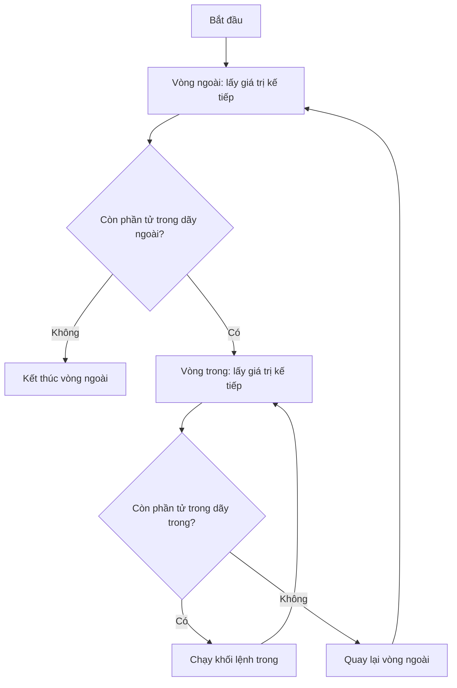

# 🔁 Bài 10: Vòng Lặp For – Lặp Lại Một Số Lần Biết Trước

> 🎓 **Chương 4 – Vòng lặp trong Python**

---

## 🎯 Mục tiêu

Sau bài học này, học viên sẽ:

* ✅ Hiểu **vòng lặp là gì** và khi nào chương trình cần lặp lại công việc.
* ✅ Viết được vòng lặp `for` với **`range(start, stop, step)`** — cả đếm tăng lẫn đếm ngược.
* ✅ **Duyệt qua từng phần tử** của chuỗi và danh sách bằng `for`.
* ✅ Dùng **`enumerate`** để lấy cả vị trí lẫn giá trị trong vòng lặp.
* ✅ Điều khiển vòng lặp bằng **`break`** (dừng ngay) và **`continue`** (bỏ qua lượt hiện tại).
* ✅ Viết được **vòng lặp lồng nhau** — ví dụ bảng cửu chương.
* ✅ Giải quyết bài toán thực tế: tổng 1..n, giai thừa, tổng số chẵn, tính tiền hóa đơn.

---

## 📖 Kiến thức

### 1. Vòng lặp là gì? Vì sao cần nó?

Máy tính mạnh nhất ở chỗ **làm đi làm lại một việc thật nhanh**. Nếu bạn cần in "Xin chào" 10 lần, bạn sẽ không viết 10 lệnh `print`:

> 💬 **Ví dụ đời thực:** Giống việc nhân viên kho đếm 100 thùng hàng — thay vì viết sẵn 100 dòng "đếm thùng 1", "đếm thùng 2"... anh ta có một **quy trình lặp**: *đếm thùng hiện tại → sang thùng kế tiếp → đến khi hết*. Vòng lặp trong lập trình chính là quy trình đó.

```python
# Cách "dở tệ" — viết tay 10 lần
print("Xin chào")
print("Xin chào")
# ... viết đến 10 lần 😫

# Cách của lập trình viên — vòng lặp
for i in range(10):
    print("Xin chào")   # Chỉ cần 1 dòng lệnh
```

**Hai loại vòng lặp chính trong Python:**

| Loại | Dùng khi | Số lần lặp |
|---|---|---|
| 🔁 `for` (bài này) | **Biết trước** số lần hoặc lặp qua một dãy | Do dãy quyết định |
| 🔄 `while` (bài 11) | **Chưa biết trước**, lặp tới khi điều kiện sai | Do điều kiện quyết định |

### 2. Cú pháp `for` và hàm `range`

```python
for bien in day:
    # Khối lệnh lặp — chạy với mỗi phần tử của day
```

* `bien` — biến tạm, mỗi lượt được gán một giá trị trong dãy.
* `day` — dãy cần duyệt: `range(...)`, chuỗi, danh sách...
* Khối lệnh thụt lề phía dưới được chạy lặp lại — hết dãy thì tự dừng.

**Hàm `range` — nhà máy sản xuất dãy số:**

| Cách viết | Dãy sinh ra | Ghi chú |
|---|---|---|
| `range(5)` | `0, 1, 2, 3, 4` | Bắt đầu từ **0**, đến **stop - 1** |
| `range(1, 6)` | `1, 2, 3, 4, 5` | Từ `start`, đến `stop - 1` |
| `range(2, 8, 2)` | `2, 4, 6` | Bước nhảy `step = 2` |
| `range(10, 0, -2)` | `10, 8, 6, 4, 2` | `step` **âm** → đếm ngược |

> ⚠️ **Quy tắc vàng:** `range(stop)` **không bao giờ sinh ra `stop`** — `range(5)` cho 0,1,2,3,4. Muốn có số 5 thì viết `range(6)`.

### 3. Đếm ngược bằng `step` âm

`step` có thể là số âm — vòng lặp đi **lùi**:

```python
# Đếm ngược từ 5 về 1
for i in range(5, 0, -1):
    print(i)
print("Hết giờ!")
```

> 💡 `range(5, 0, -1)` — bắt đầu 5, mỗi bước bớt 1, dừng trước khi xuống tới 0.

### 4. Duyệt chuỗi và danh sách

`for` duyệt được **từng ký tự** của chuỗi, **từng phần tử** của danh sách:

```python
# Duyệt chuỗi: in từng chữ cái
for chu in "Python":
    print(chu)

# Duyệt danh sách: in từng môn học
mon_hoc = ["Toán", "Văn", "Anh"]
for mon in mon_hoc:
    print("Môn:", mon)
```

> 💬 **Ví dụ đời thực:** Vòng lặp duyệt danh sách giống **giáo viên điểm danh**: lần lượt gọi tên từng học sinh trong danh sách — hết danh sách thì dừng.

### 5. `enumerate` — lấy cả "số thứ tự" lẫn giá trị

Khi cần **vị trí** (0, 1, 2...) đi kèm **giá trị**, dùng `enumerate`:

```python
mon_hoc = ["Toán", "Văn", "Anh"]
# enumerate trả về cặp (vị trí, giá trị)
for vi_tri, mon in enumerate(mon_hoc):
    print(f"Vị trí {vi_tri}: {mon}")
```

Kết quả:

```
Vị trí 0: Toán
Vị trí 1: Văn
Vị trí 2: Anh
```

> 💡 Muốn số thứ tự bắt đầu từ 1, viết `enumerate(mon_hoc, start=1)`.

### 6. `break` và `continue` — điều khiển vòng lặp

| Lệnh | Tác dụng | Ví dụ đời thực |
|---|---|---|
| `break` | **Dừng hẳn** vòng lặp ngay lập tức | Gọi điện thoại: gặp đúng người cần thì **cúp máy**, không gọi tiếp |
| `continue` | **Bỏ qua lượt hiện tại**, sang lượt kế | Xếp hàng: gặp người không mua hàng thì **nhường qua người sau**, không rời hàng |

```python
# break: dừng khi tìm thấy số 5
for i in range(1, 11):
    if i == 5:
        break          # Gặp 5 là thoát vòng lặp ngay
    print(i)           # In: 1 2 3 4

# continue: bỏ qua số chẵn
for i in range(1, 8):
    if i % 2 == 0:
        continue       # Số chẵn → bỏ qua lượt này
    print(i)           # In: 1 3 5 7
```

### 7. Vòng lặp lồng nhau

Vòng lặp bên trong vòng lặp — với mỗi lượt của vòng ngoài, vòng trong chạy **đủ hết** các lượt của nó:

```python
# In bảng tọa độ 3x3
for i in range(1, 4):        # Vòng ngoài: i = 1, 2, 3
    for j in range(1, 4):    # Vòng trong: j = 1, 2, 3
        print(f"({i},{j})", end=" ")
    print()                  # Xuống dòng sau mỗi vòng ngoài
```

Kết quả:

```
(1,1) (1,2) (1,3)
(2,1) (2,2) (2,3)
(3,1) (3,2) (3,3)
```

> 💬 **Ví dụ đời thực:** Vòng lặp lồng nhau giống **lịch trình huấn luyện**: mỗi ngày (vòng ngoài) bạn chạy đủ 3 hiệp (vòng trong) — hết hiệp mới sang ngày kế tiếp.



### 8. Khi nào dùng `for`?

* Đếm từ A đến B (biết trước số lần).
* Xử lý từng phần tử của danh sách / chuỗi / bảng.
* Lặp n lần bất kỳ: `for i in range(n):`.

---

## 💡 Ví dụ minh họa

### Ví dụ 1: Tổng các số từ 1 đến n

```python
# Nhập n (ví dụ: 5)
n = int(input("Nhập n: "))

tong = 0  # Biến tích lũy — ban đầu bằng 0

# Cộng dồn từng số từ 1 đến n
for i in range(1, n + 1):
    tong = tong + i

print(f"Tổng 1 + 2 + ... + {n} = {tong}")
```

**Giải thích từng dòng:**

| Dòng code | Ý nghĩa |
|---|---|
| `tong = 0` | **Biến tích lũy** — hộp cộng dồn, bắt đầu trống (0) |
| `for i in range(1, n + 1):` | i lần lượt nhận 1, 2, ..., n (nhớ `n + 1` vì range không bao gồm điểm dừng) |
| `tong = tong + i` | Lấy hộp cộng thêm i, bỏ lại vào hộp |

> 💡 Với n = 5: hộp trải qua 0 → 1 → 3 → 6 → 10 → 15. Kết quả `Tổng = 15`.

### Ví dụ 2: Giai thừa n! (ví dụ 5! = 120)

```python
# Nhập n (ví dụ: 5)
n = int(input("Nhập n: "))

giai_thua = 1  # Biến nhân dồn — bắt đầu bằng 1 (không phải 0!)

# Nhân dồn từ 1 đến n
for i in range(1, n + 1):
    giai_thua = giai_thua * i

print(f"{n}! = {giai_thua}")
```

**Giải thích từng dòng:**

| Dòng code | Ý nghĩa |
|---|---|
| `giai_thua = 1` | Nhân dồn nên khởi tạo **1** — khởi tạo 0 thì kết quả mãi bằng 0 |
| `giai_thua = giai_thua * i` | Nhân dồn: 1×1 → ×2 → ×3 → ×4 → ×5 = 120 |
| `print(f"{n}! = {giai_thua}")` | In đúng định dạng `5! = 120` |

> ⚠️ **Lỗi cổ điển:** biến nhân dồn khởi tạo bằng 0 → kết quả luôn 0. Nhớ quy tắc: **cộng dồn khởi tạo 0, nhân dồn khởi tạo 1**!

### Ví dụ 3: Số lẻ từ 1 đến 20 và số chẵn giảm dần từ 20 về 0

```python
# In các số lẻ từ 1 đến 20
print("Các số lẻ từ 1 đến 20:")
for i in range(1, 21, 2):   # 1, 3, 5, ..., 19 (bước nhảy 2)
    print(i)

# In các số chẵn giảm dần từ 20 về 0
print("Các số chẵn giảm dần từ 20 về 0:")
for i in range(20, -1, -2):   # 20, 18, ..., 0 (step âm)
    print(i)
```

**Giải thích từng dòng:**

| Dòng code | Ý nghĩa |
|---|---|
| `range(1, 21, 2)` | Bắt đầu 1, mỗi bước +2 → toàn số lẻ; dừng trước 21 để có 19 |
| `range(20, -1, -2)` | Bắt đầu 20, mỗi bước −2 → số chẵn; viết `-1` để dừng đúng tại 0 |

> 💡 Mẹo nhớ: `range(start, stop, step)` luôn **không bao gồm `stop`** — muốn in tới 0 thì `stop` phải là `-1`.

---

## 🔬 Ví dụ nâng cao

### Ví dụ 1: Bảng cửu chương đầy đủ (vòng lặp lồng nhau)

```python
# In bảng cửu chương từ 2 đến 9
for so in range(2, 10):            # Vòng ngoài: từng bảng nhân
    print(f"=== BẢNG NHÂN {so} ===")
    for nhan in range(1, 11):      # Vòng trong: 1 x 1 đến 1 x 10
        print(f"{so} x {nhan} = {so * nhan}")
    print()                        # Dòng trống ngăn cách các bảng
```

**Giải thích:**
* Vòng ngoài chọn bảng (2 → 9); với mỗi bảng, vòng trong in đủ 10 phép tính.
* `f"{so} x {nhan} = {so * nhan}"` — f-string ghép 3 thông tin vào một dòng.
* Tổng số lần in: 8 bảng × 10 dòng = 80 dòng — viết tay thì không tưởng, vòng lặp chỉ vài dòng code.

### Ví dụ 2: Tổng các số chẵn từ 0 đến n

```python
n = int(input("Nhập n: "))   # Ví dụ: 10

tong = 0
# Duyệt tất cả số 0..n nhưng chỉ cộng số chẵn
for i in range(n + 1):
    if i % 2 == 0:      # i chia hết cho 2 → chẵn
        tong = tong + i

print(f"Tổng các số chẵn từ 0 đến {n} là: {tong}")
```

**Giải thích:**
* `i % 2 == 0` — phép chia lấy dư (bài 6): dư 0 nghĩa là số chẵn.
* Với n = 10: 0+2+4+6+8+10 = 30 — khớp ví dụ giáo trình.
* **Cách gọn hơn:** `for i in range(0, n + 1, 2):` — sinh thẳng dãy số chẵn, khỏi cần `if`.

### Ví dụ 3: Tính tiền hóa đơn siêu thị

```python
# Danh sách giá các món hàng (nghìn đồng)
don_gia = [15, 25, 10, 40, 8]

tong = 0
# Duyệt từng giá rồi cộng dồn
for gia in don_gia:
    print(f"  + {gia} nghìn đồng")
    tong = tong + gia

print(f"Tổng hóa đơn: {tong} nghìn đồng")
```

Kết quả:

```
  + 15 nghìn đồng
  + 25 nghìn đồng
  + 10 nghìn đồng
  + 40 nghìn đồng
  + 8 nghìn đồng
Tổng hóa đơn: 98 nghìn đồng
```

**Giải thích:**
* `for gia in don_gia:` — duyệt **trực tiếp danh sách**, không cần chỉ số.
* Biến tích lũy `tong` hoạt động y như ví dụ tổng 1..n — cùng một ý tưởng, áp dụng cho dữ liệu thật.
* Nếu sau này siêu thị thêm 100 món, danh sách dài ra nhưng code **không đổi** — sức mạnh của vòng lặp.

### Ví dụ 4: Đếm nguyên âm trong chuỗi (dùng `enumerate` + `continue`)

```python
cau = "Hoc lap trinh Python"
nguyen_am = "aeiouAEIOU"
dem = 0

# Duyệt từng ký tự kèm vị trí
for vi_tri, ky_tu in enumerate(cau):
    if ky_tu not in nguyen_am:
        continue               # Không phải nguyên âm → bỏ qua lượt này
    dem = dem + 1
    print(f"Nguyên âm thứ {dem} ở vị trí {vi_tri}: {ky_tu}")

print(f"Tổng số nguyên âm: {dem}")
```

**Giải thích:**
* `enumerate(cau)` trả về cặp (vị trí, ký tự) — biết chính xác nguyên âm nằm ở đâu.
* `continue` giúp bỏ qua phụ âm, chỉ xử lý nguyên âm — code trong vòng lặp sạch hơn.
* `ky_tu not in nguyen_am` — kiểm tra ký tự có thuộc chuỗi nguyên âm hay không.

---

## ⚠️ Lỗi thường gặp

### Lỗi 1: `range(n)` thiếu số n cuối cùng

```python
for i in range(1, 5):   # ❌ chỉ in 1, 2, 3, 4
    print(i)

for i in range(1, 6):   # ✅ muốn in tới 5 phải ghi 6
    print(i)
```

* **Nguyên nhân:** `range(start, stop)` không bao gồm `stop`.
* **Cách khắc phục:** Nhớ quy tắc: muốn đếm tới n thì ghi `range(1, n + 1)`.

### Lỗi 2: Quên dấu hai chấm sau `for`

```python
for i in range(5)    # ❌ thiếu dấu :
    print(i)
```

* **Kết quả báo:** `SyntaxError: expected ':'`.
* **Cách khắc phục:** Luôn viết đủ `for i in range(5):` — dấu `:` là "bộ khởi động" của khối lệnh.

### Lỗi 3: Thụt lề không đều

```python
for i in range(5):
print(i)     # ❌ lệnh này không thuộc vòng lặp (hoặc báo IndentationError)
```

* **Nguyên nhân:** Python dùng **thụt lề để nhận biết khối lệnh**.
* **Cách khắc phục:** Mọi lệnh trong vòng lặp phải thụt vào **cùng một mức** (1 tab hoặc 4 dấu cách).

### Lỗi 4: `range` với step bằng 0

```python
for i in range(1, 5, 0):   # ❌ step = 0
    print(i)
```

* **Kết quả báo:** `ValueError: range() arg 3 must not be zero`.
* **Cách khắc phục:** Step phải khác 0; muốn đếm ngược dùng step âm như `range(5, 0, -1)`.

### Lỗi 5: Sửa danh sách ngay trong lúc đang duyệt

```python
so = [1, 2, 3, 4, 5]
for x in so:
    if x == 3:
        so.remove(x)   # ❌ kết quả khó lường: phần tử bị "nhảy cóc"
```

* **Nguyên nhân:** Vòng lặp đang duyệt theo chỉ số ban đầu, xóa phần tử làm lệch vị trí.
* **Cách khắc phục:** Thu thập phần tử cần xóa trước, xóa sau vòng lặp; hoặc duyệt bản sao `for x in so[:]:` (sẽ học sâu ở bài List).

### Lỗi 6: Nhầm lẫn `break` và `continue`

* `break` → **thoát hẳn** vòng lặp. `continue` → **bỏ qua lượt**, vẫn còn lặp tiếp.
* Nhầm lẫn điển hình: dùng `continue` khi muốn dừng tìm kiếm → vòng lặp vẫn chạy đến hết, kết quả in thừa.

---

## 💎 Mẹo

* 🎯 **Quy tắc vàng `range`:** muốn in 1..n thì `range(1, n + 1)` — "một cộng" ghi nhớ suốt đời.
* 🏁 **`break` dùng trong tìm kiếm:** tìm thấy rồi thì dừng ngay, đừng duyệt tiếp làm lãng phí thời gian.
* 🚦 **`continue` làm code gọn:** kiểm tra điều kiện "loại trừ" trước rồi `continue`, phần việc chính nằm gọn phía dưới.
* 🔢 **Nghĩ tới step:** cần dãy cách quãng (số lẻ, số chẵn) → dùng step thay vì `if` bên trong.
* 🧮 **Biến tích lũy:** cộng dồn khởi tạo `0`, nhân dồn khởi tạo `1` — ghi lên giấy dán bàn!
* 📏 **Vòng lặp lồng nhau:** vòng trong chạy hết **một chu kỳ đầy đủ** cho mỗi lượt của vòng ngoài — vẽ bảng 3×3 để hiểu ngay.
* 🏷️ **`_` thay cho biến tạm:** nếu không dùng biến đếm, viết `for _ in range(n):` để báo "tôi chỉ cần lặp n lần".

---

## 📝 Tóm tắt

| Khái niệm | Nội dung |
|---|---|
| 🔁 `for bien in day:` | Lặp qua từng phần tử của dãy; hết dãy thì tự dừng |
| 🔢 `range(stop)` | `0, 1, ..., stop-1` — không bao gồm stop |
| 🔢 `range(start, stop)` | Từ start đến stop-1 |
| 🔢 `range(start, stop, step)` | Bước nhảy step; step âm để đếm ngược |
| 📜 Duyệt chuỗi/list | `for x in "Python":` / `for x in [1, 2, 3]:` |
| 🔖 `enumerate(day)` | Trả cặp (vị trí, giá trị); có `start=` để đổi điểm đầu |
| ⏹️ `break` | Dừng hẳn vòng lặp |
| ⏭️ `continue` | Bỏ qua lượt hiện tại, sang lượt kế |
| 🪆 Lồng nhau | Vòng trong chạy đủ hết rồi mới quay lại vòng ngoài |
| 🧮 Tích lũy | Cộng dồn bắt đầu `0`; nhân dồn bắt đầu `1` |

---

## 🧪 Kiểm tra nhanh

1. ❓ `range(5)` sinh ra dãy số nào?
2. ❓ Muốn in các số 1, 2, ..., 10 thì viết `range` thế nào?
3. ❓ `range(2, 10, 2)` cho dãy nào?
4. ❓ Viết câu lệnh in các số 5, 4, 3, 2, 1 bằng range.
5. ❓ `break` và `continue` khác nhau thế nào?
6. ❓ Sau vòng `for i in range(3): for j in range(3):`, khối trong chạy tổng cộng bao nhiêu lần?
7. ❓ `enumerate(["a", "b"])` trả về những cặp nào?
8. ❓ Vì sao biến nhân dồn phải khởi tạo bằng 1 thay vì 0?
9. ❓ `range(1, 5, 0)` có chạy được không? Vì sao?
10. ❓ Dùng vòng lặp viết code in "Xin chào" đúng 7 lần.

<details>
<summary>🔍 Xem đáp án</summary>

1. `0, 1, 2, 3, 4`.
2. `range(1, 11)`.
3. `2, 4, 6, 8`.
4. `for i in range(5, 0, -1): print(i)`.
5. `break` thoát hẳn vòng lặp; `continue` chỉ bỏ qua lượt hiện tại.
6. 9 lần (3 × 3).
7. `(0, "a")`, `(1, "b")`.
8. Vì nhân với 0 kết quả luôn bằng 0.
9. Không — `ValueError`, vì step không được bằng 0.
10. `for _ in range(7): print("Xin chào")`.

</details>

---

## 📚 Bài đọc thêm

* [Python.org – For Statements](https://docs.python.org/3/tutorial/controlflow.html#for-statements)
* [Python.org – The range() Function](https://docs.python.org/3/tutorial/controlflow.html#the-range-function)
* [W3Schools – Python For Loops](https://www.w3schools.com/python/python_for_loops.asp)
* [Real Python – Loops in Python](https://realpython.com/python-for-loop/)
* [Programiz – Python for Loop](https://www.programiz.com/python-programming/for-loop)

---

## 🏁 Kết thúc bài

🎉 Bạn đã làm chủ `for` — vòng lặp "biết trước số lần". Nhưng nhiều tình huống thực tế **không biết trước** lặp bao nhiêu lần: game đoán số — người chơi đoán đến khi nào đúng mới thôi; máy ATM — hỏi đến khi khách bấm "Thoát". Đó là lúc cần vòng lặp **điều kiện** — hãy sang:

👉 **[Bài 11: Vòng Lặp While – Lặp Cho Đến Khi Điều Kiện Sai](../11_Vong_lap_while/bai_giang.md)**
