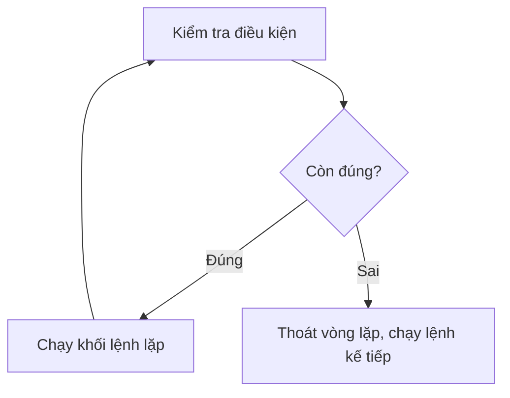

# 🔄 Bài 11: Vòng Lặp While – Lặp Cho Đến Khi Điều Kiện Sai

> 🎓 **Chương 4 – Vòng lặp trong Python**

---

## 🎯 Mục tiêu

Sau bài học này, học viên sẽ:

* ✅ Hiểu **cú pháp `while`** và sự khác biệt với `for` (lặp "không biết trước số lần").
* ✅ Biết **vòng lặp vô hạn là gì**, vì sao xảy ra và **cách tránh** (nhớ cập nhật biến điều kiện!).
* ✅ Dùng **`break`** và **`continue`** để điều khiển vòng lặp linh hoạt.
* ✅ Dùng **`else` với `while`** để chạy code khi vòng lặp kết thúc tự nhiên.
* ✅ Viết được **`while True:` + `break`** — khuôn mẫu cho menu chương trình.
* ✅ Kiểm tra **đầu vào hợp lệ** bằng vòng lặp (nhập sai phải nhập lại).
* ✅ Xây dựng ứng dụng thực tế: game đoán số, đếm ngược, máy ATM.

---

## 📖 Kiến thức

### 1. Vòng lặp while là gì?

`while` lặp lại một khối lệnh **chừng nào điều kiện còn đúng**:

```python
while dieu_kien:
    # Khối lệnh lặp
```

> 💬 **Ví dụ đời thực:** Đi bộ leo cầu thang — mỗi bước kiểm tra *"còn bậc thang không?"*; còn thì bước tiếp, hết thì dừng. Bạn không biết trước có bao nhiêu bậc — chỉ dừng khi **điều kiện sai**.



**Ví dụ đầu tiên:**

```python
i = 1            # Bước 1: khởi tạo biến đếm
while i <= 5:    # Bước 2: kiểm tra điều kiện
    print(f"Lần lặp thứ {i}")   # Bước 3: khối lệnh lặp
    i = i + 1    # Bước 4: cập nhật biến đếm — QUAN TRỌNG!
```

| Dòng | Ý nghĩa |
|---|---|
| `i = 1` | Khởi tạo biến đếm trước vòng lặp |
| `while i <= 5:` | Kiểm tra điều kiện **trước khi chạy** — sai ngay từ đầu thì không chạy lần nào |
| `i = i + 1` | **Cập nhật biến** — quên dòng này là vòng lặp chạy mãi mãi! |

### 2. `while` so với `for` — dùng cái nào?

| Tiêu chí | `for` | `while` |
|---|---|---|
| Số lần lặp | **Biết trước** (đếm 1..n, duyệt dãy) | **Chưa biết**, phụ thuộc điều kiện |
| Điều kiện dừng | Hết phần tử của dãy | Điều kiện trở thành sai |
| Biến đếm | Tự động qua `range` | Tự bạn khởi tạo + cập nhật |
| Ví dụ | In 10 lần, bảng cửu chương | Nhập đến khi đúng, game đoán số |
| Rủi ro | Thấp — không thể vô hạn | **Cao — dễ vòng lặp vô hạn** |

> 💡 **Quy tắc nhanh:** đếm được trước số lần → `for`. Không đếm được, chỉ biết "đến khi nào thì dừng" → `while`.

### 3. ⚠️ Vòng lặp vô hạn — "con quỷ" của while

Vòng lặp vô hạn chạy **mãi không dừng**, khiến chương trình "treo":

```python
i = 1
while i <= 5:
    print(i)      # ❌ Quên i = i + 1 → i luôn bằng 1 → lặp vô tận!
```

> 💬 **Ví dụ đời thực:** Cửa tự động nhận diện: *"nếu còn người thì mở cửa"* — nhưng quên cập nhật *"hết người"*, cửa mở mãi mãi, điện giật thùng!

**Cách tránh — "bộ ba bất tử":**

```python
i = 1                  # 1. KHỞI TẠO biến điều kiện
while i <= 5:          # 2. KIỂM TRA điều kiện
    print(i)
    i = i + 1          # 3. CẬP NHẬT biến — hướng tới điều kiện sai
```

Nếu chương trình vô tình bị treo vì lặp vô hạn, nhấn **`Ctrl + C`** trong Terminal để dừng khẩn cấp.

### 4. `break` và `continue` trong while

Giống `for` (bài 10), nhưng trong `while` chúng còn quan trọng hơn — đôi khi là "phao cứu sinh" thoát vòng lặp:

```python
# break: thoát hẳn khi gặp số 3
i = 1
while i <= 10:
    if i == 3:
        break          # Dừng hẳn vòng lặp
    print(i)
    i = i + 1          # Kết quả in: 1 2

# continue: bỏ qua số chẵn
i = 0
while i < 7:
    i = i + 1          # Cập nhật TRƯỚC continue — tránh vô hạn!
    if i % 2 == 0:
        continue
    print(i)           # In: 1 3 5 7
```

> ⚠️ **Bẫy continue:** nếu viết `continue` trước lệnh cập nhật biến, vòng lặp sẽ không bao giờ cập nhật → **vô hạn**. Luôn đặt lệnh cập nhật **trước** `continue` (hoặc đảm bảo nó luôn được chạy).

### 5. `else` với while — chạy khi kết thúc "tự nhiên"

Python cho phép `while ... else`: khối `else` chạy khi vòng lặp **kết thúc bình thường** (điều kiện tự sai) — nhưng **KHÔNG chạy** nếu thoát bằng `break`:

```python
# Tìm số 7 trong dãy
i = 1
while i <= 5:
    if i == 7:
        print("Tìm thấy 7!")
        break
    i = i + 1
else:
    print("Đã duyệt hết dãy mà không thấy 7")   # Chạy vì không có break
```

> 💬 **Ví dụ đời thực:** Khối `else` giống câu thông báo *"đã hết hàng chưa thấy sản phẩm"* — chỉ đọc khi bạn đi hết quầy mà **không** gặp sản phẩm. Nếu gặp rồi (break) thì không cần thông báo nữa.

### 6. `while True:` — vòng lặp "vĩnh cửu" có chủ đích

Nhiều chương trình thực tế chạy **mãi cho đến khi người dùng muốn thoát** (máy ATM, menu game...). Khuôn mẫu chuẩn:

```python
while True:
    lua_chon = input("Chọn chức năng (0 để thoát): ")
    if lua_chon == "0":
        break           # Người dùng thoát → break ra ngoài
    # ... xử lý chức năng khác
print("Tạm biệt!")
```

> 💡 `while True:` **cố ý** tạo vòng lặp vô hạn, nhưng có `break` bên trong làm "lối thoát". Không bao giờ viết `while True:` mà không có `break` (hoặc cách thoát khác)!

### 7. Kiểm tra đầu vào hợp lệ — "hỏi lại cho đến khi đúng"

Tình huống rất thực tế: người dùng nhập sai → chương trình phải **hỏi lại**, không được "chết" giữa chừng:

```python
# Nhập điểm cho tới khi nằm trong khoảng 0-10
while True:
    diem = float(input("Nhập điểm (0-10): "))
    if 0 <= diem <= 10:   # Hợp lệ → thoát vòng lặp
        break
    print("Điểm không hợp lệ! Vui lòng nhập lại.")
print(f"Điểm đã nhận: {diem}")
```

> 💬 **Ví dụ đời thực:** Ngân hàng yêu cầu nhập mã PIN — nhập sai, màn hình báo *"Mã sai, nhập lại"* cho tới khi đúng (hoặc hết lượt). Không bao giờ để khách "bơ vơ" vì nhập sai một ký tự.

---

## 💡 Ví dụ minh họa

### Ví dụ 1: Đếm ngược pháo hoa

```python
# Đếm ngược từ 10 đến 1 rồi bắn pháo hoa
dem = 10                       # 1. Khởi tạo

while dem > 0:                 # 2. Điều kiện: còn số dương
    print(dem)
    dem = dem - 1              # 3. Cập nhật — mỗi lượt giảm 1

print("🎆 Pháo hoa!")          # Chạy sau khi vòng lặp kết thúc
```

**Giải thích từng dòng:**

| Dòng code | Ý nghĩa |
|---|---|
| `dem = 10` | Khởi tạo biến đếm — phần "số lần còn lại" |
| `while dem > 0:` | Kiểm tra trước mỗi lượt; dem = 0 là dừng |
| `dem = dem - 1` | Cập nhật — đưa điều kiện dần về sai, không vô hạn |

### Ví dụ 2: Cộng dồn đến khi nhập số 0

```python
# Nhập các số, cộng dồn; nhập 0 thì dừng và in tổng
tong = 0

while True:
    so = float(input("Nhập số (0 để dừng): "))
    if so == 0:
        break           # Số 0 là tín hiệu dừng
    tong = tong + so

print(f"Tổng các số đã nhập: {tong}")
```

**Giải thích từng dòng:**

| Dòng code | Ý nghĩa |
|---|---|
| `while True:` | Vòng lặp vô hạn có chủ đích — người dùng quyết định khi dừng |
| `if so == 0: break` | Quy ước "nhập 0 để dừng" — lối thoát duy nhất |
| `tong = tong + so` | Chỉ cộng khi chưa nhập 0 (dòng break đã thoát) |

> 💡 Mô hình này giống **máy tính tiền chợ**: gõ từng món, gõ 0 khi hết hàng, máy báo tổng.

### Ví dụ 3: Kiểm tra số dương

```python
# Nhập số cho tới khi nhận được số dương
so = -1                         # Khởi tạo giá trị "chưa hợp lệ"

while so <= 0:                  # Còn sai thì cứ hỏi lại
    so = float(input("Nhập số dương: "))
    if so <= 0:
        print("Sai rồi! Số phải lớn hơn 0.")

print(f"Đã nhận số dương: {so}")
```

**Giải thích từng dòng:**

| Dòng code | Ý nghĩa |
|---|---|
| `so = -1` | Khởi tạo để điều kiện `so <= 0` đúng ngay lần đầu — vòng lặp chắc chắn chạy ít nhất 1 lần |
| `while so <= 0:` | Số không hợp lệ thì vòng lặp tiếp tục |
| `print(...)` | Sau khi thoát, `so` chắc chắn hợp lệ — vòng lặp kiểm soát chất lượng đầu vào |

---

## 🔬 Ví dụ nâng cao

### Ví dụ 1: Game đoán số

Máy "nghĩ" một số bí mật, người chơi đoán đến khi đúng:

```python
so_bi_mat = 7   # Số bí mật (cố định để dễ kiểm tra)
so_lan = 0      # Đếm số lần đoán

print("Máy đang nghĩ một số từ 1 đến 10...")

while True:
    so_lan = so_lan + 1
    doan = int(input(f"Lần đoán {so_lan}: "))
    if doan == so_bi_mat:
        print(f"Chúc mừng! Bạn đoán đúng sau {so_lan} lần.")
        break           # Đúng rồi thì thoát
    elif doan < so_bi_mat:
        print("Số của bạn nhỏ hơn số bí mật.")
    else:
        print("Số của bạn lớn hơn số bí mật.")
```

**Giải thích:**
* Số lần đoán **không biết trước** — đây chính là tình huống "sinh ra cho while".
* Lời gợi ý "lớn hơn / nhỏ hơn" giúp người chơi đoán gần dần — game 9+ đoán đúng số trong 7.
* `so_lan = so_lan + 1` là lệnh cập nhật — vòng lặp tiến dần về đích.

> 🎲 **Nâng cấp:** muốn số bí mật ngẫu nhiên, dùng `import random` rồi `so_bi_mat = random.randint(1, 10)` — thư viện chuẩn của Python.

### Ví dụ 2: Máy ATM mini (menu vòng lặp)

```python
# Số dư ban đầu
so_du = 1000000.0

print("===== MÁY ATM =====")

while True:
    # In menu mỗi lượt
    print("0. Thoát chương trình")
    print("1. Xem số dư hiện tại")
    print("2. Nạp tiền")
    print("3. Rút tiền")
    lua_chon = input("Nhập lựa chọn: ")

    if lua_chon == "0":
        print("Cảm ơn bạn đã sử dụng ATM!")
        break                       # Thoát chương trình
    elif lua_chon == "1":
        print(f"Số dư hiện tại: {so_du} VND")
    elif lua_chon == "2":
        tien = float(input("Nhập số tiền muốn nạp: "))
        so_du = so_du + tien
        print(f"Nạp tiền thành công. Số dư mới: {so_du} VND")
    elif lua_chon == "3":
        tien = float(input("Nhập số tiền muốn rút: "))
        if tien > so_du:
            print("Số dư không đủ!")
        else:
            so_du = so_du - tien
            print(f"Rút tiền thành công. Số dư mới: {so_du} VND")
    else:
        print("Lựa chọn không hợp lệ!")
```

**Giải thích:**
* `while True:` bao quanh menu — máy ATM chạy mãi cho tới khi khách chọn `0`.
* Sau mỗi thao tác, vòng lặp **quay lại đầu** và in lại menu — trải nghiệm đúng như máy thật.
* Kiểm tra `tien > so_du` trước khi rút — ngân hàng không bao giờ để tài khoản âm.
* Lựa chọn là **chuỗi** (`"0"`, `"1"`) — so sánh trực tiếp với input, không cần ép kiểu.

### Ví dụ 3: Nhập điểm hợp lệ (bắt buộc trong khoảng 0–10)

```python
# Bắt buộc nhập điểm trong khoảng 0-10
while True:
    diem = float(input("Nhập điểm môn Toán (0-10): "))
    if 0 <= diem <= 10:
        break                       # Hợp lệ → chấp nhận
    print("⚠️ Điểm phải từ 0 đến 10. Vui lòng nhập lại!")

# Xếp loại sau khi điểm đã chắc chắn hợp lệ
if diem >= 9:
    print("Xuất sắc")
elif diem >= 8:
    print("Giỏi")
elif diem >= 6.5:
    print("Khá")
elif diem >= 5:
    print("Trung bình")
else:
    print("Yếu")
```

**Giải thích:**
* Vòng lặp đảm bảo `diem` nằm trong 0–10 **trước khi** xếp loại — phần sau vòng lặp yên tâm xử lý dữ liệu "sạch".
* `0 <= diem <= 10` — cú pháp so sánh kép của Python (tương đương `diem >= 0 and diem <= 10`).
* Kết hợp kiến thức bài 8 (if-elif) với while — một chuỗi xử lý hoàn chỉnh.

### Ví dụ 4: `else` với while — tìm kiếm trong dãy

```python
# Tìm số chẵn đầu tiên trong khoảng bắt đầu từ 7
i = 7
while i <= 10:
    if i % 2 == 0:
        print(f"Tìm thấy số chẵn: {i}")
        break
    i = i + 1
else:
    print("Không có số chẵn nào trong khoảng này")   # Không break → chạy
```

**Giải thích:**
* Với `i = 7`: 7 lẻ → i = 8; 8 chẵn → in và `break` → khối `else` **không** chạy.
* Nếu bắt đầu từ 9: 9, 10 → thấy 10. Nếu khoảng không có số chẵn, vòng lặp kết thúc tự nhiên → `else` chạy.

---

## ⚠️ Lỗi thường gặp

### Lỗi 1: Vòng lặp vô hạn — quên cập nhật biến

```python
i = 1
while i <= 5:
    print(i)      # ❌ Không có i = i + 1 → in 1 mãi mãi
```

* **Nguyên nhân:** Điều kiện `i <= 5` luôn đúng vì i không bao giờ đổi.
* **Kết quả:** Chương trình treo, cửa sổ "đơ".
* **Cách sửa:** Thêm `i = i + 1` vào cuối khối lệnh — "bộ ba: khởi tạo – kiểm tra – cập nhật".

### Lỗi 2: Điều kiện sai ngay từ đầu — vòng lặp không chạy lần nào

```python
i = 6
while i <= 5:     # ❌ 6 <= 5 là sai → không in gì cả
    print(i)
```

* **Nguyên nhân:** `while` kiểm tra điều kiện **trước** khi chạy.
* **Cách khắc phục:** Nếu muốn chạy ít nhất một lần, dùng `while True:` + `break`, hoặc khởi tạo biến đúng giá trị.

### Lỗi 3: `continue` đặt trước lệnh cập nhật

```python
i = 1
while i <= 5:
    if i % 2 == 0:
        continue      # ❌ Cập nhật i bị nhảy qua → vô hạn
    print(i)
    i = i + 1
```

* **Nguyên nhân:** `continue` đưa vòng lặp về đầu ngay, lệnh `i = i + 1` không bao giờ chạy với số chẵn.
* **Cách sửa:** Cập nhật biến **trước** `continue`:

```python
i = 1
while i <= 5:
    if i % 2 == 0:
        i = i + 1
        continue
    print(i)
    i = i + 1
```

### Lỗi 4: `while True:` mà không có lối thoát

```python
while True:
    print("Chạy mãi...")     # ❌ Không break, không cách thoát
```

* **Nguyên nhân:** Quên thiết kế lối thoát.
* **Cách sửa:** Luôn có `break` khi điều kiện dừng thỏa mãn, hoặc biến điều kiện thay đổi để thoát.

### Lỗi 5: So sánh sai kiểu dữ liệu

```python
while True:
    so = input("Nhập số: ")        # Chuỗi
    if so > 5:                      # ❌ So chuỗi với số → TypeError
        break
```

* **Nguyên nhân:** `input()` trả về **chuỗi**, không thể so sánh với số.
* **Cách sửa:** Ép kiểu: `so = float(input("Nhập số: "))` trước khi so sánh.

---

## 💎 Mẹo

* 🔁 **Bộ ba của while:** khởi tạo → kiểm tra → cập nhật. Thiếu một chân là hỏng.
* 🛑 **`Ctrl + C`** trong Terminal để dừng chương trình đang lặp vô hạn.
* 🚪 **`while True` + break** là khuôn mẫu chuẩn cho menu, game, máy ATM — nhớ luôn có lối thoát.
* ✅ **Kiểm tra đầu vào:** mọi dữ liệu từ bàn phím đều "đáng ngờ" — vòng lặp nhập lại giúp chương trình không bao giờ "chết" vì dữ liệu xấu.
* 📏 **Chọn vòng lặp:** biết trước số lần → `for`; "đến khi nào thì dừng" → `while`.
* 🔍 **`else` với while** dùng cho tìm kiếm: chạy khi không tìm thấy (không break) — gọn hơn biến cờ.
* 🧪 **Debug nhanh:** in biến điều kiện ngay đầu vòng lặp (`print(i)`) để xem nó có đang tiến về điều kiện sai hay không.

---

## 📝 Tóm tắt

| Khái niệm | Nội dung |
|---|---|
| 🔄 `while dk:` | Lặp chừng nào điều kiện còn đúng; kiểm tra trước khi chạy |
| ♾️ Vòng lặp vô hạn | Điều kiện không bao giờ sai — tránh bằng bộ ba: khởi tạo, kiểm tra, **cập nhật** |
| ⏹️ `break` | Thoát hẳn vòng lặp ngay lập tức |
| ⏭️ `continue` | Bỏ qua lượt hiện tại (cập nhật biến **trước** continue!) |
| 🔵 `while ... else` | `else` chạy khi kết thúc tự nhiên, **không** chạy khi break |
| 🔁 `while True:` | Vòng lặp vô hạn có chủ đích — bắt buộc có `break` bên trong |
| 🎛️ Menu vòng lặp | In menu → nhận chọn → xử lý → quay lại (đến khi chọn "Thoát") |
| ✅ Nhập hợp lệ | `while True:` hỏi lại cho tới khi dữ liệu hợp lệ mới `break` |
| ⚖️ So với `for` | `for` đếm biết trước; `while` lặp theo điều kiện |

---

## 🧪 Kiểm tra nhanh

1. ❓ `while` khác `for` ở điểm cơ bản nào?
2. ❓ Viết 3 bước cần thiết để while không bị vô hạn.
3. ❓ Điều gì xảy ra nếu điều kiện while sai ngay từ đầu?
4. ❓ `break` trong while có tác dụng gì?
5. ❓ Vì sao `continue` đặt trước lệnh cập nhật biến lại gây vô hạn?
6. ❓ Khối `else` của `while` chạy khi nào? Khi nào không chạy?
7. ❓ `while True:` dùng cho tình huống nào? Yêu cầu gì bắt buộc?
8. ❓ Khi chương trình bị treo vì lặp vô hạn, nhấn phím gì để dừng?
9. ❓ Viết vòng lặp nhập số dương (hỏi lại nếu nhập sai).
10. ❓ Muốn số lần lặp biết trước (1..10), nên dùng `for` hay `while`?

<details>
<summary>🔍 Xem đáp án</summary>

1. `for` lặp theo dãy/số lần biết trước; `while` lặp theo điều kiện, số lần có thể chưa biết.
2. Khởi tạo biến → kiểm tra điều kiện → cập nhật biến trong khối lặp.
3. Vòng lặp không chạy lần nào.
4. Thoát hẳn vòng lặp ngay lập tức.
5. Lệnh cập nhật bị bỏ qua nên điều kiện không bao giờ sai.
6. Chạy khi vòng lặp kết thúc tự nhiên; không chạy khi thoát bằng `break`.
7. Vòng lặp vô hạn có chủ đích (menu, game...); bắt buộc có `break` bên trong.
8. `Ctrl + C`.
9. `while True: so = float(input("Nhập số dương: ")); if so > 0: break`.
10. `for` — vì số lần lặp đã biết.

</details>

---

## 📚 Bài đọc thêm

* [Python.org – while Statements](https://docs.python.org/3/reference/compound_stmts.html#the-while-statement)
* [W3Schools – Python While Loops](https://www.w3schools.com/python/python_while_loops.asp)
* [Real Python – Python "while" Loops](https://realpython.com/python-while-loop/)
* [Programiz – Python while Loop](https://www.programiz.com/python-programming/while-loop)
* [GeeksforGeeks – Python While Loop](https://www.geeksforgeeks.org/python-while-loop/)

---

## 🏁 Kết thúc bài

🎉 Bạn đã làm chủ **cả hai vòng lặp** — `for` cho việc lặp biết trước, `while` cho việc lặp theo điều kiện, kèm `break`, `continue`, `else`, `while True` và menu vòng lặp. Giờ bạn có thể viết những chương trình "biết lặp lại" thực thụ! Đã đến lúc nâng cấp chương trình lên cấp độ cao hơn: **đóng gói các đoạn code thành hàm** để tái sử dụng — hãy sang:

👉 **[Bài 12: Hàm – Đóng gói code để tái sử dụng](../12_Ham/bai_giang.md)**
