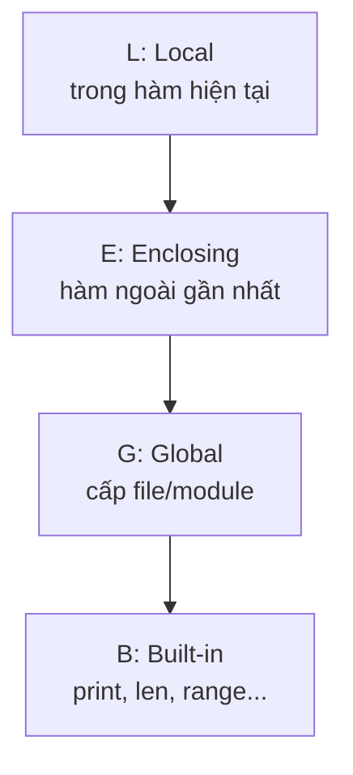

# 🐍 Bài 13: Phạm Vi Biến (Scope) Trong Python

> 🎓 **Chương 4 – Tự động hóa công việc lặp lại**

---

## 🎯 Mục tiêu

Sau bài học này, học viên sẽ:

* ✅ Hiểu **phạm vi biến (scope)** là gì — biến "sống" ở đâu trong chương trình.
* ✅ Phân biệt được **biến local** (trong hàm) và **biến global** (ngoài hàm).
* ✅ Biết cách dùng từ khóa **`global`** và **`nonlocal`** khi thực sự cần.
* ✅ Nắm vững **quy tắc LEGB** để biết biến được tìm theo thứ tự nào.
* ✅ Hiểu **khi nào nên dùng** và **tránh lạm dụng** biến global.
* ✅ Viết được chương trình nhiều hàm chạy đúng và an toàn về biến.

---

## 📖 Kiến thức

### 1. Phạm vi biến là gì?

> 💬 **Nói đơn giản:** Phạm vi biến là **"khu vực"** trong chương trình mà một biến **tồn tại và được nhìn thấy**.

**Ví dụ đời thực:** Mỗi phòng ngủ có **tủ quần áo riêng** của chủ nhân. Quần áo trong tủ phòng bạn thì **chỉ bạn lấy được** — người khác đứng ở phòng bên cạnh không lấy được. Biến trong hàm cũng vậy: nó "đóng khung" trong hàm, không tự dưng tràn ra ngoài.

Nhìn lại **Bài 12 (Hàm):** bạn đã dùng biến bên trong hàm. Câu hỏi lớn: nếu viết biến trùng tên ở chỗ khác thì Python lấy cái nào? Bài này giải đáp.

### 2. Hai phạm vi chính

| Phạm vi | Nằm ở đâu | Đặc điểm |
|---|---|---|
| 🏠 **Global** | Ngoài mọi hàm (đầu file) | Nhìn thấy ở toàn bộ chương trình |
| 🚪 **Local** | Bên trong một hàm | Chỉ tồn tại bên trong hàm đó |

```python
x = 10                  # x là biến GLOBAL

def ham_demo():
    y = 5               # y là biến LOCAL — chỉ trong ham_demo

print(x)                # ✅ 10 — global dùng được khắp nơi
# print(y)              # ❌ NameError — y không tồn tại ngoài hàm
```

> ⚠️ **Cách nhớ:** Biến tạo trong hàm là **local** — "ở đâu sinh ra, ở đó tồn tại", hết hàm là biến "chết".

### 3. Hàm có thể ĐỌC biến global

Biến global nằm "ngoài cùng", nên hàm **đọc được** giá trị của nó mà không cần làm gì đặc biệt:

```python
phi_giao_hang = 20000          # biến global

def tinh_tien(so_mon):
    return so_mon * 15000 + phi_giao_hang   # ✅ đọc được phi_giao_hang

print(tinh_tien(2))    # 50000
```

### 4. Hàm GÁN biến thì tạo biến local MỚI (bẫy kinh điển!)

Đây là **điểm gây lú nhất** với người mới: nếu trong hàm bạn **gán** giá trị cho một tên biến, Python coi đó là **biến local mới** — **không liên quan** gì tới biến global cùng tên:

```python
x = 10

def gan_moi():
    x = 99            # ✅ Đây là biến local x, KHÔNG sửa biến global x

gan_moi()
print(x)              # vẫn 10 — biến global KHÔNG bị đổi!
```

Và nếu bạn gán **sau khi đọc**, sẽ gặp lỗi:

```python
x = 10

def sai_roi():
    print(x)          # ❌ UnboundLocalError!
    x = 99            # Python đã biết x là local từ dòng này

sai_roi()
```

> 🧠 **Quy tắc:** Trong một hàm, chỉ cần **một lần gán** cho biến `x` → toàn bộ hàm coi `x` là local. Muốn sửa biến global phải khai báo `global`.

### 5. Từ khóa `global` — khai báo dùng biến toàn cục

Để gán/sửa giá trị của biến global từ bên trong hàm, dùng từ khóa `global`:

```python
diem = 0

def cong_diem(so):
    global diem      # "Nói" với Python: diem chính là biến toàn cục bên ngoài
    diem += so

cong_diem(5)
cong_diem(3)
print(diem)          # 8 — biến global đã bị hàm sửa
```

### 6. Hàm lồng trong hàm — từ khóa `nonlocal`

Python cho phép viết **hàm bên trong hàm**. Khi đó biến của hàm ngoài là biến **enclosing**, muốn gán cho nó từ hàm trong phải dùng `nonlocal`:

```python
def ham_ngoai():
    dem = 0

    def ham_trong():
        nonlocal dem   # sửa biến dem của hàm ngoài
        dem += 1

    ham_trong()
    ham_trong()
    print(dem)         # 2 — hàm trong đã sửa được biến dem

ham_ngoai()
```

### 7. Quy tắc LEGB

Khi Python cần tìm một tên biến, nó tìm theo thứ tự **LEGB** — từ trong ra ngoài, dừng ở mức đầu tiên tìm thấy:



| Viết tắt | Tên | Phạm vi tìm |
|---|---|---|
| **L** | Local | Biến khai báo trong hàm hiện tại |
| **E** | Enclosing | Biến của hàm ngoài (hàm lồng nhau) |
| **G** | Global | Biến khai báo ở cấp file |
| **B** | Built-in | Các hàm có sẵn như `print`, `len` |

```python
x = "global"

def ham_ngoai():
    x = "enclosing"

    def ham_trong():
        x = "local"
        print(x)    # tìm thấy "local" ở L → in "local"

    ham_trong()

ham_ngoai()
```

### 8. Khi nào dùng `global`? Vì sao tránh lạm dụng?

**Nên dùng khi:**
* Cần một **biến đếm / cấu hình chung** cho toàn chương trình (ví dụ hệ số phụ thu bán hàng).
* Viết các chương trình ngắn, script nhỏ, không quá phức tạp.

**Tránh lạm dụng vì:**
* Chương trình **khó theo dõi** — biến global bị sửa ở bất kỳ đâu, khó tìm chỗ gây lỗi.
* Hàm mất **tính độc lập** — kết quả phụ thuộc trạng thái bên ngoài, khó kiểm thử.
* Khi gọi cùng một hàm 2 lần, kết quả có thể **khác nhau** vì biến global đã đổi.

> 💡 **Nguyên tắc vàng:** **Ưu tiên truyền dữ liệu qua tham số và nhận lại qua `return`** thay vì `global`. Hàm giống **máy xay sinh tố**: đưa trái cây vào (tham số), bấm nút, nhận sinh tố ra (return) — không nên để máy tự "mò" xoài ngoài bàn.

```python
# ✅ CÁCH NÊN DÙNG: truyền qua tham số + return
def cong_vao(tong, so):
    return tong + so

tong = 0
tong = cong_vao(tong, 5)
tong = cong_vao(tong, 3)
print(tong)   # 8

# ❌ CÁCH DỄ LỖI: dùng global
tong_g = 0
def cong_vao_2(so):
    global tong_g
    tong_g += so
```

---

## 💡 Ví dụ minh họa

### Ví dụ 1: Đọc biến global trong hàm

```python
phu_thu = 2000                    # global

def tinh_tien(so_coc, gia_coc):
    """Tính tiền nước + phụ thu cốc."""
    return so_coc * gia_coc + phu_thu

print(tinh_tien(2, 15000))   # 32000
```

**Giải thích từng dòng:**

| Dòng | Ý nghĩa |
|---|---|
| `phu_thu = 2000` | Biến global, hàm đọc được |
| `return ... + phu_thu` | Hàm **chỉ đọc** nên không cần `global` |
| `tinh_tien(2, 15000)` | 2×15000 + 2000 = 32000 |

### Ví dụ 2: Gán biến trong hàm tạo local

```python
luong = 5000000    # global

def tinh_thuong(hang_xuat_sac):
    luong = 3000000          # local — trùm lên biến global cùng tên!
    if hang_xuat_sac:
        return luong + 1000000
    return luong

print(tinh_thuong(True))     # 4000000 (dùng local)
print(luong)                 # 5000000 — global vẫn nguyên vẹn
```

**Giải thích từng dòng:**

| Dòng | Ý nghĩa |
|---|---|
| `luong = 3000000` | Gán trong hàm → Python tạo biến **local** mới |
| `return luong + 1000000` | Dùng biến local = 4000000 |
| `print(luong)` cuối file | Vẫn in 5000000 — global không đổi |

### Ví dụ 3: `global` sửa biến toàn cục

```python
so_lan_chay = 0

def chay_buoi_tap():
    global so_lan_chay
    so_lan_chay += 1
    print(f"Hoàn thành buổi tập thứ {so_lan_chay}")

chay_buoi_tap()
chay_buoi_tap()
```

```
Hoàn thành buổi tập thứ 1
Hoàn thành buổi tập thứ 2
```

---

## 🔬 Ví dụ nâng cao

### Ví dụ 1: Bộ đếm theo lượt đúng cách — trả về để tránh global

```python
def doi_xu(hang):
    """Đổi 1.000đ thành 4 đồng xu 250đ. Trả về số xu nhận được."""
    return hang * 4

# Người chơi mỗi ngày nạp thêm và cộng dồn
tong_xu = 0
tong_xu += doi_xu(3)    # ngày 1: 12
tong_xu += doi_xu(2)    # ngày 2: +8 = 20
print("Tổng xu tích lũy:", tong_xu)
```

> Dùng `return` giúp mỗi hàm **không phụ thuộc trạng thái ngoài** — kết quả luôn tái lập, dễ kiểm tra.

### Ví dụ 2: Rút tiền ATM an toàn (khai báo `global` có chủ đích)

```python
so_du = 500000

def rut_tien(so_tien):
    """Rút tiền, cập nhật số dư toàn cục nếu đủ."""
    global so_du
    if so_tien > so_du:
        return "Số dư không đủ!"
    so_du -= so_tien
    return f"Rút {so_tien} — số dư còn: {so_du}"

print(rut_tien(200000))   # Rút 200000 — số dư còn: 300000
print(rut_tien(900000))   # Số dư không đủ!
print("Số dư cuối:", so_du)
```

### Ví dụ 3: Hàm lồng nhau với `nonlocal`

```python
def tao_so_ngau_nhien_co_nho():
    """Hàm trả về hàm trong — biến nhớ nằm ở hàm ngoài."""
    so_gan_day = 0

    def ra_so():
        nonlocal so_gan_day
        # Mô phỏng lấy số ngẫu nhiên, đơn giản là đếm lên
        so_gan_day = (so_gan_day * 7 + 3) % 10
        return so_gan_day

    return ra_so

may = tao_so_ngau_nhien_co_nho()
print(may())   # 3
print(may())   # 4
print(may())   # 1
```

> `nonlocal` cho phép hàm trong **ghi nhớ và cập nhật** biến của hàm ngoài — nền tảng của kỹ thuật *closure* mà bạn sẽ gặp ở bài **28_Decorator**.

### Ví dụ 4: LEGB qua ví dụ thực tế đặt món

```python
giam_gia = 0.1              # G: global

def tinh_hoa_don():
    giam_gia_them = 0.05    # E: dành cho hàm trong

    def chi_tiet(mon, gia):
        giam_gia_them = 0.0  # L: local được gán lại trong hàm trong
        return gia - gia * (giam_gia + giam_gia_them)

    return chi_tiet

tinh = tinh_hoa_don()
print(tinh("pho", 35000))   # 35000 - 10% = 31500
```

---

## ⚠️ Lỗi thường gặp

### Lỗi 1: `NameError: name 'x' is not defined` — dùng biến local ngoài hàm

```python
def tinh():
    ket_qua = 5 * 5

print(ket_qua)     # ❌ NameError — ket_qua là local, đã "chết" khi hết hàm
```

* **Nguyên nhân:** Biến tạo trong hàm chỉ tồn tại trong hàm.
* **Cách sửa:** Trả về bằng `return` rồi gán ra ngoài: `ket_qua = tinh()`.

### Lỗi 2: `UnboundLocalError` — gán biến sau khi đọc trong hàm

```python
x = 10
def ham():
    print(x)   # ❌ UnboundLocalError
    x = 5
```

* **Nguyên nhân:** Python thấy có lệnh gán `x = 5` nên coi `x` là local từ đầu; `print(x)` đọc biến local chưa gán.
* **Cách sửa:** Khai báo `global x` ở đầu hàm, hoặc đặt tên khác cho biến local.

### Lỗi 3: Tưởng hàm sửa được biến global khi không khai báo

```python
so_du = 100
def rut():
    so_du -= 50   # ❌ UnboundLocalError

rut()
```

* **Nguyên nhân:** Gán cho biến global trong hàm mà không khai báo `global`.
* **Cách sửa:** Thêm `global so_du`, hoặc dùng `return so_du - 50` và gán lại ở ngoài.

### Lỗi 4: Lạm dụng `global` — chương trình khó hiểu

```python
dem = 0
def r1():
    global dem
    dem += 1

def r2():
    global dem
    dem += 2

r1()
r2()
# Khi dem bất ngờ bằng 3, bạn không biết hàm nào đã sửa
```

* **Nguyên nhân:** Nhiều hàm cùng sửa biến global khiến việc tìm lỗi rất khó.
* **Cách sửa:** Ưu tiên truyền tham số và nhận `return`.

### Lỗi 5: Quên `nonlocal` trong hàm lồng nhau

```python
def ngoai():
    a = 1
    def trong():
        a += 1   # ❌ UnboundLocalError
    trong()

ngoai()
```

* **Nguyên nhân:** Gán `a` trong hàm trong mà không khai báo.
* **Cách sửa:** Thêm `nonlocal a` vào đầu hàm `trong`.

---

## 💎 Mẹo

* 🎯 **Mẹo ghi nhớ LEGB:** hình dung 4 chiếc hộp chồng lên nhau — nhìn trong hộp nhỏ nhất trước.
* 📦 **Mặc định "local-safe"**: Python tự bảo vệ biến global khỏi bị hàm "vô tình" sửa — đó là tính năng, không phải lỗi.
* 🔑 **Dùng `global` tối thiểu**: hằng số cấu hình (không sửa) thì không cần; chỉ khi hàm phải **cập nhật** biến toàn cục mới cần.
* 🔁 **Quy tắc "in – out"**: dữ liệu đi vào hàm qua **tham số**, đi ra qua **`return`**. Hàm đẹp = đọc như công thức nấu ăn.
* 🧪 **Kiểm thử dễ hơn**: hàm không dùng global gọi 2 lần ra 2 kết quả giống nhau — dễ kiểm tra, dễ chia sẻ.
* 📚 Nhớ lại bài 12: biến bên trong hàm không bao giờ "tràn ra" ngoài — muốn lấy kết quả phải `return`.

---

## 📝 Tóm tắt

| Khái niệm | Nội dung |
|---|---|
| Scope (phạm vi) | "Khu vực" biến tồn tại và được nhìn thấy |
| Biến local | Khai báo trong hàm, chỉ tồn tại trong hàm |
| Biến global | Khai báo ngoài hàm, dùng được khắp nơi |
| Đọc global | Hàm đọc tự nhiên, không cần khai báo |
| Gán trong hàm | Tạo biến local mới — KHÔNG sửa global |
| `global` | Cho phép hàm gán/sửa biến toàn cục |
| `nonlocal` | Cho phép hàm trong sửa biến của hàm ngoài |
| LEGB | Thứ tự tìm: Local → Enclosing → Global → Built-in |
| Nguyên tắc | Truyền tham số + `return`, hạn chế `global` |

---

## 🧪 Kiểm tra nhanh

1. ❓ Biến khai báo trong hàm gọi là biến gì?
2. ❓ Hàm gán biến trùng tên với biến global thì biến global có bị đổi không?
3. ❓ Từ khóa nào dùng để hàm được phép gán biến global?
4. ❓ Vì sao gán biến trong hàm sau khi `print` biến đó lại báo `UnboundLocalError`?
5. ❓ LEGB nghĩa là gì và thứ tự tìm như thế nào?
6. ❓ Trong hàm lồng nhau, muốn hàm trong sửa biến của hàm ngoài dùng từ khóa gì?
7. ❓ Kể 2 nhược điểm của việc lạm dụng `global`.
8. ❓ Cách "sạch sẽ" nhất để hàm cập nhật một con số toàn cục?
9. ❓ Biến khai báo ở đầu file (ngoài hàm) thuộc phạm vi nào?
10. ❓ `print` và `len` nằm ở mức nào trong LEGB?

<details>
<summary>🔍 Xem đáp án</summary>

1. Biến local.
2. Không — hàm tạo biến local mới, biến global giữ nguyên giá trị cũ.
3. `global`.
4. Vì Python xác định `x` là local ngay từ đầu hàm (do có lệnh gán phía dưới), nên dòng `print(x)` đọc biến local chưa có giá trị.
5. Thứ tự tìm tên: Local → Enclosing → Global → Built-in.
6. `nonlocal`.
7. Khó theo dõi/tìm lỗi; hàm mất tính độc lập, kết quả phụ thuộc trạng thái ngoài.
8. Truyền giá trị qua tham số và nhận kết quả mới qua `return`.
9. Phạm vi global.
10. Mức Built-in (B).

</details>

---

## 📚 Bài đọc thêm

* [Python.org – Naming and Binding (scope rules)](https://docs.python.org/3/reference/executionmodel.html#naming-and-binding)
* [Python.org – Nonlocal statement](https://docs.python.org/3/reference/simple_stmts.html#the-nonlocal-statement)
* [Real Python – Python Scope & the LEGB Rule](https://realpython.com/python-scope-legb-rule/)
* [W3Schools – Python Global Variables](https://www.w3schools.com/python/python_scope.asp)
* [Python Tutor – xem từng bước biến thay đổi](https://pythontutor.com/)

---

## 🏁 Kết thúc bài

🎉 Bạn đã hiểu biến "sống" ở đâu và cách kiểm soát chúng. Vấn đề nảy sinh: quản lý **nhiều dữ liệu cùng lúc** (danh sách học sinh, bảng điểm...) bằng biến rời rạc là bất khả thi — Python có cấu trúc dữ liệu tuyệt vời để xử lý việc này. Hãy sang:

👉 **[Bài 14: List (Danh Sách)](../14_List/bai_giang.md)**
