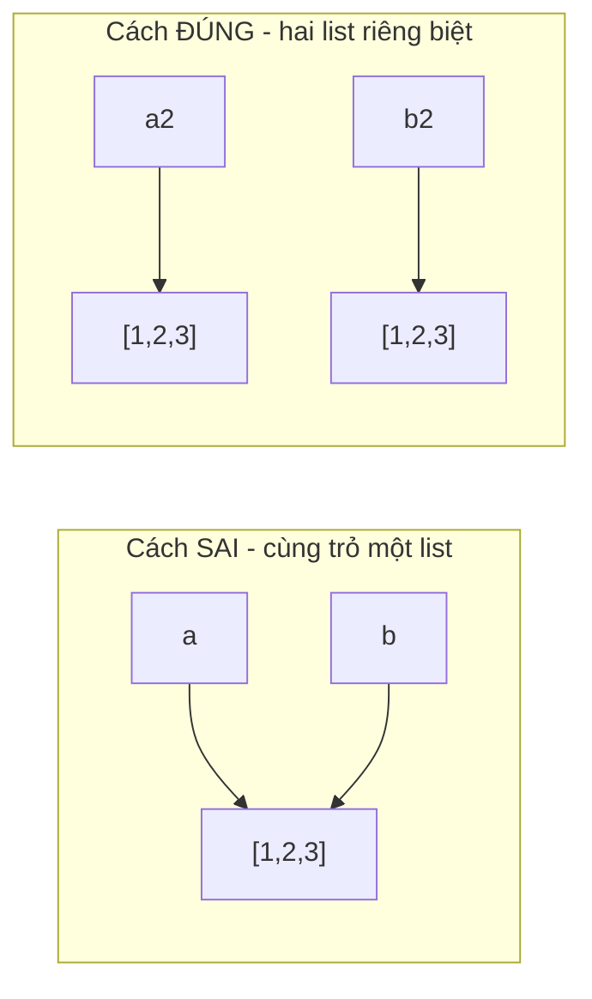

# 📋 Bài 14: Danh Sách (List) Trong Python

> 🎓 **Chương 5 – Cấu trúc dữ liệu: List, Tuple, Set và Dictionary**

Ở bài **13 (Scope)** bạn đã biết cặn kẽ về **biến** — nơi lưu **MỘT** giá trị. Nhưng trong thực tế, bạn thường cần lưu **NHIỀU** giá trị cùng một lúc: danh sách học sinh, bảng điểm, giỏ hàng... Vậy làm sao đây? Câu trả lời là **List (danh sách)** — cấu trúc dữ liệu quan trọng bậc nhất của Python!

---

## 🎯 Mục tiêu

Sau bài học này, học viên sẽ:

* ✅ Hiểu **List là gì**, vì sao cần nó thay vì nhiều biến rời rạc.
* ✅ **Tạo** list bằng `[]` và hàm `list()`.
* ✅ **Truy cập** phần tử bằng **index dương** (0, 1, 2...) và **index âm** (-1, -2...).
* ✅ **Cắt** list bằng slice `[start:stop:step]`.
* ✅ **Thêm** phần tử với `append`, `extend`, `insert`.
* ✅ **Xóa** phần tử với `remove`, `pop`, `clear`, `del`.
* ✅ **Tìm kiếm, sắp xếp, đảo** list và tính toán với `len/min/max/sum`.
* ✅ **Duyệt** list bằng vòng lặp, xử lý **list lồng nhau** và **copy** list an toàn.

---

## 📖 Kiến thức

### 1. List là gì?

> 💬 **Nói đơn giản:** List là **cái kệ nhiều ngăn có đánh số** — mỗi ngăn chứa một giá trị, và bạn gọi tên **vị trí** ngăn để lấy giá trị ra.

**Ví dụ đời thực:** 🛒 danh sách đồ mua sắm, 🏫 danh sách tên học sinh trong lớp, 📊 bảng điểm 10 môn của bạn.

```python
hoc_sinh = ["An", "Binh", "Chi"]   # cái kệ 3 ngăn: ngăn 0, 1, 2
```

**Vì sao không cần list?** Hãy thử tưởng tượng lưu 50 cái tên bằng biến sẽ thế nào:

```python
hs1 = "An"; hs2 = "Binh"; ...   # ❌ viết 50 dòng, không thể duyệt bằng vòng lặp
```

```mermaid
mindmap
  root((List))
    Đặc điểm
      Có THỨ TỰ (cố định)
      Có THỂ thay đổi (mutable)
      Được phép TRÙNG giá trị
      Chứa mọi kiểu dữ liệu
    Thao tác chính
      Tạo: ds = [ ... ]
      Truy cập: ds[0], ds[-1]
      Cắt: ds[1:4]
      Thêm: append, extend, insert
      Xóa: remove, pop, del, clear
      Sắp xếp: sort, sorted
```

> 💡 **Điểm mạnh cốt lõi của list** so với biến đơn: bạn có thể **duyệt bằng vòng lặp `for`** để xử lý 50, 500, hay 5.000 phần tử chỉ với vài dòng code.

### 2. Tạo list

| Cách | Cú pháp | Ví dụ |
|---|---|---|
| Có sẵn dữ liệu | `[giá_trị, ...]` | `diem = [8.5, 7.0, 9.0]` |
| Chuỗi chữ sang list | `list("abc")` | `list("xin")` → `['x', 'i', 'n']` |
| List rỗng | `[]` hoặc `list()` | `gio_hang = []` |

```python
# List chứa số, chuỗi, thậm chí lẫn lộn nhiều kiểu
ten = ["An", "Binh"]          # list chuỗi
diem = [8.5, 7.0, 9.0]        # list số
hon_hop = ["An", 15, True]    # list lẫn lộn kiểu — Python cho phép!
rong = []                     # list rỗng, sẵn sàng nhận dữ liệu sau
```

> ⚠️ **Lưu ý quan trọng:** các giá trị trong list phân cách nhau bởi **dấu phẩy `,`** — quên dấu phẩy là bị `SyntaxError`.

### 3. Truy cập phần tử — Index (chỉ số)

Mỗi phần tử trong list có một **số thứ tự gọi là index**, bắt đầu đếm từ **0**:

```python
trai_cay = ["tao", "chuoi", "cam"]
# index dương: 0       1        2
# index âm:  -3      -2       -1

print(trai_cay[0])    # tao   — phần tử đầu tiên
print(trai_cay[2])    # cam   — phần tử thứ 3
print(trai_cay[-1])   # cam   — phần tử CUỐI (index âm)
print(trai_cay[-2])   # chuoi — phần tử kế cuối
```

> 💡 **Index âm rất tiện:** `trai_cay[-1]` luôn lấy phần tử **cuối cùng** dù list dài bao nhiêu — không cần đếm độ dài.

> ⚠️ **Bẫy:** điều chỉ số ngoài phạm vi như `trai_cay[10]` → lỗi `IndexError: list index out of range`.

### 4. Cắt list — Slice `[start:stop:step]`

Slice là cách lấy ra **một đoạn (mảng con)** của list — kết quả trả về **list mới**:

```python
so = [0, 1, 2, 3, 4, 5]

print(so[1:4])     # [1, 2, 3]  — từ index 1 tới TRƯỚC index 4
print(so[:3])      # [0, 1, 2]  — từ đầu tới trước index 3
print(so[3:])      # [3, 4, 5]  — từ index 3 tới hết
print(so[::2])     # [0, 2, 4]  — bước nhảy 2 (lấy phần tử chẵn)
print(so[::-1])    # [5, 4, 3, 2, 1, 0] — bước -1: ĐẢO NGƯỢC list!
```

| Thành phần | Ý nghĩa | Ghi chú |
|---|---|---|
| `start` | Vị trí **bắt đầu** (mặc định 0) | Giá trị **được lấy** |
| `stop` | Vị trí **kết thúc** (mặc định cuối) | Giá trị **KHÔNG được lấy** |
| `step` | **Bước nhảy** (mặc định 1) | Âm để đi ngược |

### 5. Thêm phần tử

| Phương thức | Công dụng | Ví dụ |
|---|---|---|
| `ds.append(x)` | Thêm **1** giá trị vào **cuối** | `ds.append(10)` |
| `ds.extend(other)` | Nối toàn bộ **list khác** vào cuối | `ds.extend([1, 2])` |
| `ds.insert(vị_trí, x)` | **Chèn** giá trị vào vị trí bất kỳ | `ds.insert(0, "dau")` |

```python
# append: thêm 1 phần tử vào cuối (như đẩy món vào cuối kệ)
mon_an = ["pho", "bun"]
mon_an.append("com")          # → ["pho", "bun", "com"]

# extend: nối cả một danh sách — KHÔNG nên dùng append để nối!
mon_an.extend(["mi xao", "cha gio"])   # → ["pho", "bun", "com", "mi xao", "cha gio"]

# insert: chèn vào vị trí xác định, các phần tử sau bị đẩy lùi
mon_an.insert(1, "banh mi")   # → ["pho", "banh mi", "bun", ...]
```

> ⚠️ **Lỗi phổ biến:** `mon_an.append(["mi xao", "cha gio"])` sẽ chèn **cả list** làm **một** phần tử → tạo *list lồng nhau* không mong muốn. Muốn nối các phần tử rời rạc thì phải dùng `extend`.

### 6. Xóa phần tử

| Cách | Công dụng | Hành vi khi không tìm thấy |
|---|---|---|
| `ds.remove(x)` | Xóa phần tử **đầu tiên** có giá trị `x` | `ValueError` |
| `ds.pop()` | Xóa phần tử **cuối** và **trả về** nó | list rỗng → `IndexError` |
| `ds.pop(i)` | Xóa phần tử ở vị trí `i` và **trả về** nó | -- |
| `del ds[i]` | Xóa phần tử ở vị trí `i` (không trả về) | `IndexError` |
| `ds.clear()` | Xóa **toàn bộ** list | -- |

```python
diem = [6, 9, 7, 9]
diem.remove(9)                  # xóa số 9 ĐẦU TIÊN → [6, 7, 9]
phan_tu_bi_xoa = diem.pop()     # pop() trả về 9, diem còn [6, 7]
last = diem.pop(0)              # pop(0) trả về 6, diem còn [7]
del diem[0]                     # xóa luôn phần tử 0 → []
diem.clear()                    # diem = [] (xóa sạch)
```

> 💡 **`pop` vs `del`:** `pop` vừa xóa vừa **trả về** giá trị — hữu ích khi cần lưu lại thứ bị xóa (ví dụ hủy món khỏi giỏ hàng và trả tiền vào ví); `del` xóa thẳng không cần dùng lại.

### 7. Tìm kiếm và đếm

```python
trai_cay = ["tao", "chuoi", "cam", "chuoi"]

print(trai_cay.count("chuoi"))   # 2  — đếm số lần xuất hiện
print(trai_cay.index("cam"))     # 2  — vị trí ĐẦU TIÊN của "cam"
print("cam" in trai_cay)         # True — kiểm tra tồn tại
print("xoai" in trai_cay)        # False
```

> ⚠️ `index(x)` mà không có giá trị `x` → `ValueError: 'xoai' is not in list`. Hãy kiểm tra `in` trước khi gọi `index`.

### 8. Sắp xếp và đảo ngược

```python
diem = [9, 5, 7]

diem.sort()          # sắp xếp NGAY TRÊN list gốc → [5, 7, 9]
diem.sort(reverse=True)   # giảm dần → [9, 7, 5]

moi = sorted(diem)   # sorted() TRẢ VỀ list mới, list gốc KHÔNG đổi
print(diem)          # [9, 7, 5] (không đổi)
print(moi)           # [5, 7, 9] (list mới sau khi sắp tăng dần)

diem.reverse()       # đảo ngược thứ tự list
print(diem[::-1])    # đảo ngược bằng slice — trả về list mới
```

| Hàm | Tác động list gốc | Trả về |
|---|---|---|
| `ds.sort()` | ✅ Thay đổi | Không (None) |
| `sorted(ds)` | ❌ Không đổi | 📦 List mới |
| `ds.reverse()` | ✅ Thay đổi | Không |
| `ds[::-1]` | ❌ Không đổi | 📦 List mới |

> 💡 **Mẹo:** muốn giữ list gốc nguyên vẹn để so sánh, dùng `sorted()` / `ds[::-1]`; muốn tiết kiệm bộ nhớ và sửa ngay list gốc, dùng `sort()` / `reverse()`.

### 9. `len`, `min`, `max`, `sum`

```python
diem = [8, 9, 10, 7, 6]

print(len(diem))            # 5  — số phần tử
print(min(diem))            # 6  — nhỏ nhất
print(max(diem))            # 10 — lớn nhất
print(sum(diem))            # 40 — tổng (chỉ áp dụng cho list số)

print(sum(diem) / len(diem))  # 8.0 — trung bình cộng
```

> ⚠️ `sum()` yêu cầu list **toàn số**; list lẫn chuỗi như `["An", 15]` → `TypeError`. Khi list rỗng, `min()`/`max()` → `ValueError`.

### 10. Duyệt list bằng vòng lặp

```python
hoc_sinh = ["An", "Binh", "Chi"]

# Cách 1: duyệt TỪNG GIÁ TRỊ — đơn giản, hay dùng
for ten in hoc_sinh:
    print("Chao", ten)

# Cách 2: duyệt theo VỊ TRÍ — cần index khi muốn sửa hoặc đếm thứ tự
for i in range(len(hoc_sinh)):
    print(i, "-", hoc_sinh[i])

# Cách 3: enumerate — vừa có index vừa có giá trị, gọn nhất
for i, ten in enumerate(hoc_sinh):
    print(f"{i}. {ten}")
```

### 11. List lồng nhau (nested list)

List có thể chứa... list khác, giống **bảng** nhiều hàng nhiều cột:

```python
bang_diem = [          # hàng là mỗi học sinh
    ["An", 8, 9],      #    tên, điểm Toán, điểm Văn
    ["Binh", 7, 8],
    ["Chi", 9, 10],
]

print(bang_diem[0])      # ["An", 8, 9]  — hàng đầu tiên
print(bang_diem[0][1])   # 8 — hàng 0, cột 1

for hang in bang_diem:            # duyệt theo từng hàng
    print(hang[0], "Toan:", hang[1], "Van:", hang[2])
```

### 12. Copy list và BẪY THAM CHIẾU (siêu quan trọng!)

> ⚠️⛔ **Bẫy kinh điển:** viết `ds_moi = ds_cu` **KHÔNG hề tạo bản sao** — cả hai biến cùng *trỏ về một list*:

```python
a = [1, 2, 3]
b = a                # ❌ CHƯA copy gì cả — b và a trỏ về CÙNG một list!
b.append(99)
print(a)             # [1, 2, 3, 99] — a cũng bị đổi theo! Ngạc nhiên chưa?
```



**Cách copy an toàn:**

```python
goc = [1, 2, 3]

sao1 = goc.copy()        # ✅ Cách 1: copy()
sao2 = list(goc)         # ✅ Cách 2: list()
sao3 = goc[:]            # ✅ Cách 3: slice toàn bộ

sao1.append(100)
print(goc)               # [1, 2, 3] — an toàn!
```

> 💡 **Lưu ý thêm:** `copy()` và `[:]` là **copy nông (shallow)** — với list lồng nhau, hàng bên trong vẫn dùng chung. Muốn copy sâu toàn bộ thì hoặc tự duyệt, hoặc dùng `import copy; bản_sao = copy.deepcopy(goc)` (đọc thêm ở bài cuối).

---

## 💡 Ví dụ minh họa

### Ví dụ 1: Danh sách mua sắm — thêm, xóa, duyệt

```python
# Tạo danh sách mua sắm ban đầu
gio_hang = ["táo", "sữa", "bánh mì"]

# Thêm 2 món mới
gio_hang.append("trứng")
gio_hang.append("cà phê")

# Bánh mì hết trong tủ → bỏ khỏi giỏ
gio_hang.remove("bánh mì")

# In danh sách cuối cùng theo thứ tự
print("Số món:", len(gio_hang))
for mon in gio_hang:
    print("-", mon)
```

Kết quả:

```
Số món: 4
- táo
- sữa
- trứng
- cà phê
```

| Dòng code | Ý nghĩa |
|---|---|
| `gio_hang = [...]` | Tạo list 3 phần tử |
| `gio_hang.append("trứng")` | Thêm món mới vào **cuối** |
| `gio_hang.remove("bánh mì")` | Xóa phần tử **theo giá trị** |
| `len(gio_hang)` | Lấy **số lượng** phần tử đang có |
| `for mon in gio_hang` | Duyệt lần lượt và in từng món |

### Ví dụ 2: Quản lý bảng điểm — cộng, tìm max, trung bình

```python
diem = [8, 9, 7, 10, 6]

tong = sum(diem)                      # tổng điểm
so_mon = len(diem)                    # số môn
trung_binh = tong / so_mon            # trung bình
diem_cao_nhat = max(diem)             # điểm cao nhất
diem_thap_nhat = min(diem)            # điểm thấp nhất

print(f"Tổng điểm: {tong}")
print(f"Trung bình: {round(trung_binh, 2)}")
print(f"Cao nhất: {diem_cao_nhat}, thấp nhất: {diem_thap_nhat}")
```

Kết quả:

```
Tổng điểm: 40
Trung bình: 8.0
Cao nhất: 10, thấp nhất: 6
```

### Ví dụ 3: Cắt và đảo list

```python
# 10 số ngẫu nhiên từ 1 tới 10
so = [1, 2, 3, 4, 5, 6, 7, 8, 9, 10]

print(so[:5])       # năm số đầu
print(so[5:])       # năm số sau
print(so[1::2])     # các vị trí lẻ (index 1, 3, 5, 7, 9)
print(so[::3])      # cứ 3 số lấy 1
print(so[::-1])     # đảo ngược toàn bộ
```

Kết quả:

```
[1, 2, 3, 4, 5]
[6, 7, 8, 9, 10]
[2, 4, 6, 8, 10]
[1, 4, 7, 10]
[10, 9, 8, 7, 6, 5, 4, 3, 2, 1]
```

---

## 🔬 Ví dụ nâng cao

### Ví dụ 1: Quản lý danh sách học sinh 🏫

```python
# Lớp có 5 học sinh, thêm 1 bạn mới chuyển đến
lop = ["An", "Binh", "Chi", "Dung", "Em"]
lop.append("Phuc")                        # bạn mới vào cuối

for i, ten in enumerate(lop, start=1):    # đánh số thứ tự từ 1
    print(f"{i}. {ten}")

# Bạn Dung chuyển trường → xóa
lop.remove("Dung")
print("Sau khi Dung chuyển đi:")
for ten in lop:
    print("-", ten)
```

### Ví dụ 2: Giỏ hàng siêu thị có giá 🛒

```python
# Danh sách [tên, giá] — list lồng nhau
gio = [
    ["Sữa", 35],
    ["Trứng", 28],
    ["Bánh mì", 20],
]

tong_tien = 0
for ten, gia in gio:                  # unpacking pair khi duyệt
    print(f"{ten}: {gia}k")
    tong_tien += gia

print("=" * 15)
print(f"Tổng tiền: {tong_tien}k")
```

### Ví dụ 3: Đảo điểm số ngược — minigame hồi máu 💊

```python
# Danh sách máu của 4 nhân vật, lấy theo thứ tự ưu tiên (nhân vật 1 có máu thấp nhất rồi tăng dần)
mau = [50, 80, 120, 200]

# Nhân vật đang hồi sinh → thêm máu của nhân vật MỚI nhất vào cuối
mau.append(90)

# Lấy 2 nhân vật có máu cao nhất để đi tiên phong
mau.sort()
tien_phong = mau[-2:]
print("Đội tiên phong (2 máu cao nhất):", tien_phong)
```

### Ví dụ 4: Lọc số chẵn — kết hợp vòng lặp và append 🔢

```python
so = [4, 7, 2, 9, 10, 3]
so_chan = []                      # list rỗng để thu thập kết quả

for x in so:
    if x % 2 == 0:                # số chẵn
        so_chan.append(x)

print("Số chẵn:", so_chan)        # [4, 2, 10]
print("Trung bình số chẵn:", sum(so_chan) / len(so_chan))
```

> 💡 Đây là mẫu hình **"collect"** cực kỳ phổ biến: duyệt → lọc → `append` vào list kết quả. Bạn sẽ dùng lại kỹ thuật này ở rất nhiều bài sau.

---

## ⚠️ Lỗi thường gặp

### Lỗi 1: Truy cập quá phạm vi — IndexError

```python
ds = [1, 2, 3]
print(ds[5])   # ❌ SAI — IndexError: list index out of range
```

* **Nguyên nhân:** list chỉ có 3 phần tử (index 0, 1, 2); index 5 không tồn tại.
* **Cách sửa:** kiểm tra `0 <= i < len(ds)` hoặc dùng `ds[-1]` cho phần tử cuối.

### Lỗi 2: `sort()` trong `print()` — nhầm lẫn sort vs sorted

```python
diem = [9, 5, 7]
print(diem.sort())   # ❌ SAI — in ra None!
```

* **Nguyên nhân:** `sort()` **thay đổi list gốc** và **trả về None**, không trả về list đã sắp.
* **Cách sửa:** tách riêng: `diem.sort()` rồi `print(diem)`; hoặc `print(sorted(diem))`.

### Lỗi 3: Nhầm `append` list vs `extend` list

```python
a = [1, 2]
a.append([3, 4])   # ❌ KHÔNG nối — a thành [1, 2, [3, 4]] (list lồng nhau)
```

* **Nguyên nhân:** `append` đúng nghĩa là thêm *một* phần tử; cái list `[3, 4]` bị coi là *một* phần tử.
* **Cách sửa:** muốn nối rời từng phần tử dùng `a.extend([3, 4])`.

### Lỗi 4: Xóa bằng `remove` phần tử không tồn tại — ValueError

```python
ds = ["tao", "cam"]
ds.remove("xoai")   # ❌ SAI — ValueError: xoai is not in list
```

* **Nguyên nhân:** không có giá trị "xoai" trong list.
* **Cách sửa:** kiểm tra `if "xoai" in ds:` trước khi remove.

### Lỗi 5: Tưởng `=` sao chép được list — BẪY THAM CHIẾU

```python
a = [1, 2, 3]
b = a
b.append(99)
print(a)   # ❌ [1, 2, 3, 99] — a bị đổi "ma quái"!
```

* **Nguyên nhân:** `b = a` cho `b` trỏ tới **cùng** list của `a`; sửa qua `b` tức sửa cả `a`.
* **Cách sửa:** `b = a.copy()` hoặc `b = list(a)` hoặc `b = a[:]`.

---

## 💎 Mẹo

* ✨ **`-1` là "chốt cuối":** `ds[-1]` luôn lấy phần tử cuối — dùng để đọc "hàng tồn mới nhất" trong danh sách.
* 🛡️ **Kiểm tra trước khi xóa/tìm:** `x in ds` trước `remove` hay `index` để tránh `ValueError`.
* 📦 **`sorted()` giữ bản gốc:** khi cần so sánh trước – sau khi sắp xếp, đừng dùng `sort()`.
* 🔁 **Slide để đảo nhanh:** `ds[::-1]` chỉ vài ký tự đã đảo ngược list — không cần vòng lặp.
* 🧮 **`enumerate(ds, start=1)`** giúp in số thứ tự bắt đầu từ 1 cho con người đọc dễ hơn.
* 💾 **Copy list thì dùng `copy()`/`list()`/`[:]`** — đừng bao giờ dùng dấu `=`.
* 🔤 **List có thể chứa mọi kiểu** — kể cả lẫn lộn; nhưng khi tính toán bằng `sum()` thì phải toàn số.
* 🐍 **Quy ước module chuẩn:** dùng `ds` hoặc tên mô tả như `gio_hang`, `bang_diem` — PEP 8 khuyến khích tên hàm/biến chữ thường.

---

## 📝 Tóm tắt

| Thao tác | Cú pháp | Kết quả / ghi chú |
|---|---|---|
| Tạo | `ds = [1, 2, 3]` hoặc `list()` | Có thứ tự, được trùng, đổi được |
| Truy cập | `ds[0]`, `ds[-1]` | Bắt đầu từ 0; âm đi từ cuối |
| Cắt | `ds[start:stop:step]` | Trả về **list mới** |
| Thêm cuối | `ds.append(x)` | Thêm 1 phần tử |
| Nối | `ds.extend(other)` | Nối cả list khác |
| Chèn | `ds.insert(i, x)` | Chèn tại vị trí i |
| Xóa theo giá trị | `ds.remove(x)` | Lỗi `ValueError` nếu không có |
| Xóa theo vị trí | `ds.pop(i)` / `del ds[i]` | `pop` trả về giá trị |
| Xóa sạch | `ds.clear()` | List rỗng |
| Đếm / tìm | `ds.count(x)`, `ds.index(x)` | Cần kiểm tra `in` trước |
| Sắp xếp | `ds.sort()` / `sorted(ds)` | Đổi list gốc / tạo list mới |
| Đảo | `ds.reverse()` / `ds[::-1]` | Đổi / tạo list mới |
| Tính toán | `len`, `min`, `max`, `sum` | Bộ công cụ nhanh cho list số |
| Duyệt | `for x in ds`, `enumerate` | Xử lý cả list chỉ vài dòng |
| Copy an toàn | `ds.copy()` / `list(ds)` / `ds[:]` | Tránh bẫy tham chiếu |

---

## 🧪 Kiểm tra nhanh

1. ❓ List lưu dữ liệu theo **thứ tự hay không**? Truy cập phần tử đầu tiên bằng index nào?
2. ❓ `ds[-1]` dùng để làm gì?
3. ❓ Viết lệnh cắt 3 phần tử đầu của `so = [5, 6, 7, 8, 9]`.
4. ❓ `append` và `extend` khác nhau thế nào?
5. ❓ `ds.pop()` trả về gì và khác `del ds[-1]` ở điểm nào?
6. ❓ `sort()` và `sorted()` khác nhau như thế nào về list gốc?
7. ❓ Viết vòng lặp in ra từng giá trị của list `ten = ["An", "Binh"]`.
8. ❓ `b = a` có thực sự tạo bản sao list `a` không? Vì sao?
9. ❓ `bang_diem[0][1]` nghĩa là gì?
10. ❓ Nêu 2 lệnh để lấy số phần tử và tổng của list chứa toàn số.

<details>
<summary>🔍 Xem đáp án</summary>

1. Có thứ tự; index của phần tử đầu tiên là `0`.
2. Lấy phần tử **cuối cùng** — index âm đếm từ cuối list.
3. `so[:3]` → `[5, 6, 7]`.
4. `append` thêm **1** phần tử vào cuối; `extend` nối toàn bộ phần tử của **list khác** vào cuối.
5. `pop()` xóa phần tử cuối và **trả về** nó; `del` xóa nhưng không trả về giá trị.
6. `sort()` thay đổi **list gốc** trả về `None`; `sorted()` **tạo list mới**, giữ list gốc nguyên vẹn.
7. `for t in ten: print(t)`.
8. Không — `b = a` chỉ cho `b` **trỏ tới cùng list** với `a`; phải dùng `copy()`/`list()`/`[:]`.
9. Lấy phần tử hàng `0`, cột `1` của một list lồng nhau — tức phần tử thứ hai của hàng đầu tiên.
10. `len(so)` và `sum(so)`.

</details>

---

## 📚 Bài đọc thêm

* [Python.org – Khái niệm dữ liệu: list](https://docs.python.org/3/tutorial/datastructures.html#more-on-lists)
* [W3Schools – Python Lists](https://www.w3schools.com/python/python_lists.asp)
* [Python.org – Kiểu dữ liệu tích hợp (list, slice)](https://docs.python.org/3/library/stdtypes.html#sequence-types-list-tuple-range)
* [Real Python – Python Lists and Tuples](https://realpython.com/python-lists-tuples/)

---

## 🏁 Kết thúc bài

🎉 Bạn đã có trong tay **List** — cấu trúc lưu danh sách linh hoạt bậc nhất. Nhưng list có một điểm yếu: nó **có thể bị sửa đổi** (thêm/xóa bất cứ lúc nào). Vậy nếu có dữ liệu **không bao giờ được đổi**, như tọa độ GPS hay số ngày trong tuần, dùng gì cho an toàn và nhanh? Câu trả lời là **Tuple** — hãy sang:

👉 **[Bài 15: Tuple (Bộ dữ liệu)](../15_Tuple/bai_giang.md)**