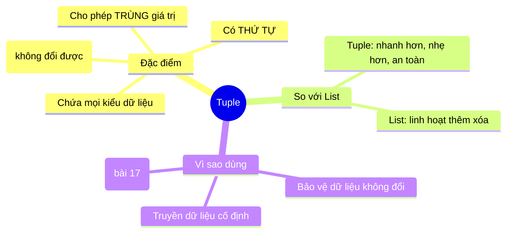

# 🔗 Bài 15: Tuple (Bộ Dữ Liệu) Trong Python

> 🎓 **Chương 5 – Cấu trúc dữ liệu: List, Tuple, Set và Dictionary**

Ở bài **14 (List)** bạn đã học kiểu dữ liệu lưu **nhiều giá trị** và tha hồ thêm/sửa/xóa. Nhưng có loại dữ liệu bạn **không muốn ai đụng vào**: tọa độ GPS của một địa điểm, số ngày trong tuần, hằng số khóa API... Nếu lỡ bị sửa một lần là sai toàn bộ. Python có một "người anh em" của list để lo việc đó — đó là **Tuple**.

---

## 🎯 Mục tiêu

Sau bài học này, học viên sẽ:

* ✅ Hiểu **Tuple là gì** và điểm khác biệt cốt lõi với list: **tính bất biến (immutable)**.
* ✅ **Tạo** tuple bằng `(...)` và hàm `tuple()`, kể cả tuple 1 phần tử.
* ✅ **Truy cập** phần tử bằng index, cắt slice giống list.
* ✅ **Duyệt** tuple bằng vòng lặp `for`.
* ✅ **Giải nén (unpacking)** tuple — đặc biệt là hoán đổi giá trị 2 biến trong một dòng.
* ✅ Dùng `count()`, `index()` và biết vì sao `sort()` không áp dụng được cho tuple bất biến.
* ✅ So sánh **List vs Tuple** và biết **khi nào nên dùng tuple**.

---

## 📖 Kiến thức

### 1. Tuple là gì?

> 💬 **Nói đơn giản:** Tuple giống như **bộ hồ sơ được niêm phong** — chứa đủ thông tin theo thứ tự cố định, nhưng **không thể sửa đổi** sau khi tạo.

**Ví dụ đời thực:** 📍 tọa độ `(21.0302, 105.8471)` cho Hà Nội, 📅 bộ `(thứ, ngày, tháng, năm)`, 🗓️ ba số đo một ngón chân trong cửa hàng giày dép...

```python
toa_do = (21.0302, 105.8471)   # kinh độ, vĩ độ — không nên đổi
```

**Tính bất biến (immutable) nghĩa là gì?**
Sau khi tạo, tuple **không có** các lệnh `append`, `remove`, `sort`, hay phép gán `tp[0] = ...`. Bất kỳ cố gắng nào cũng báo `TypeError`.

```python
tp = (1, 2, 3)
tp[0] = 99   # ❌ SAI — TypeError: 'tuple' object does not support item assignment
```



> 💡 **Ghi nhớ nhanh:** **List là "vở nháp"** (ghi xóa thoải mái), **Tuple là "văn bản đã đóng dấu"** (không sửa nữa).

### 2. Tạo tuple

| Cách | Cú pháp | Ví dụ |
|---|---|---|
| Có sẵn dữ liệu | `(giá_trị, ...)` | `tp = (1, 2, 3)` |
| Không cần dấu ngoặc | `giá_trị, giá_trị` | `tp = 1, 2, 3` ✅ đúng cú pháp |
| Từ list / chuỗi | `tuple(dữ liệu)` | `tuple("abc")` → `('a','b','c')` |
| Rỗng | `()` | `tp = ()` |
| **1 phần tử** | `(giá_trị,)` | `tp = (5,)` — **có dấu phẩy!** |

```python
toa_do = (21.03, 105.85)      # tuple 2 phần tử
ngay = 5, 8, 2026             # cũng là tuple (không cần dấu ngoặc!)
mo = ("An", "Binh", "Chi")    # tuple chuỗi
rong = ()                     # tuple rỗng
mot_phan_tu = (7,)            # ⚠️ THIẾU dấu phẩy là thành số 7, không phải tuple!
```

> ⚠️ **Bẫy số 1 trong tuple:** `(7)` không phải tuple mà là **số 7** — dấu ngoặc chỉ để nhóm phép tính. Muốn tuple 1 phần tử phải viết `(7,)` với **dấu phẩy đuôi**.

### 3. Truy cập phần tử

Tuple truy cập **giống hệt list**: index dương từ 0, index âm từ cuối, và cắt slice:

```python
ngay = ("thu hai", "thu ba", "thu tu", "thu nam", "thu sau")

print(ngay[0])      # thu hai   — phần tử đầu
print(ngay[-1])     # thu sau   — phần tử cuối
print(ngay[1:3])    # ("thu ba", "thu tu") — slice trả TUPLE mới
print(ngay[::-1])   # đảo ngược — vẫn là tuple
print(len(ngay))    # 5
```

> 💡 Slice của tuple trả về **tuple mới** (không phải list). List và tuple đều là **dãy (sequence)** nên dùng chung nhiều thao tác.

### 4. Duyệt tuple

```python
mon = ("Toan", "Van", "Anh")

for m in mon:                 # duyệt từng giá trị
    print("Mon:", m)

for i, m in enumerate(mon, start=1):   # kèm số thứ tự
    print(f"{i}. {m}")

print("Van" in mon)          # True — kiểm tra tồn tại
```

### 5. Unpacking — giải nén tuple ⭐

Tuple cho phép **gán đồng thời** các phần tử vào nhiều biến — gọi là **unpacking**. Đây là kỹ thuật cực kỳ hữu ích:

```python
toa_do = (21.03, 105.85)
kinh_do, vi_do = toa_do        # kinh_do = 21.03, vi_do = 105.85
print(kinh_do, vi_do)          # 21.03 105.85

ten, lop, diem = ("An", "10A1", 8.5)   # nhớ: trùng số lượng biến và phần tử
```

**Hoán đổi giá trị biến — Ứng dụng tuyệt đẹp của unpacking:**

```python
a = 1
b = 2

# Cách truyền thống: cần biến trung gian temp
temp = a
a = b
b = temp

# Cách của Python: unpacking trong MỘT dòng
a, b = b, a     # ⚡ hoán đổi ngay lập tức
print(a, b)     # 2 1
```

> 💡 `a, b = b, a` hoạt động vì vế phải `b, a` được **tạo thành tuple tạm** trước, sau đó mới giải nén trở lại vào `a`, `b`.

### 6. `count()` và `index()`

```python
diem = (9, 7, 9, 8, 9)

print(diem.count(9))     # 3 — đếm số lần giá trị 9 xuất hiện
print(diem.index(8))     # 3 — vị trí đầu tiên có giá trị 8
print(7 in diem)         # True
```

> ⚠️ `index()` mà không có giá trị → `ValueError`; kiểm tra `in` trước khi gọi.

### 7. List vs Tuple — So sánh chi tiết 📊

| Tiêu chí | 📋 List | 🔗 Tuple |
|---|---|---|
| Cú pháp | `[1, 2, 3]` | `(1, 2, 3)` |
| **Thay đổi được?** | ✅ Có (thêm/xóa/sửa) | ❌ **Không** (bất biến) |
| Tốc độ | Nhanh | **Nhanh hơn** một chút |
| Bộ nhớ | Nhiều hơn | **Ít hơn** (nhẹ hơn) |
| Hàm riêng | `append`, `extend`, `insert`, `remove`, `pop`, `reverse`, `sort`, `clear` | Chỉ `count`, `index` |
| Có đầy đủ thao tác dãy | ✅ | ✅ (truy cập, slice, duyệt, len...) |
| Làm khóa từ điển? | ❌ Không | ✅ **Được** (bất biến) |
| Dùng khi | Dữ liệu cần **thay đổi** | Dữ liệu **cố định**, bảo vệ khỏi sửa |

### 8. Khi nào dùng tuple?

* 📍 **Tọa độ / dữ liệu định vị:** `(lat, lon)` là một điểm — đổi một con số là "bay" sang nước khác.
* 🗓️ **Hằng số:** `(thu, ngay, thang, nam)`, cấu hình cố định, các giá trị mặc định.
* 🔐 **Khóa của từ điển:** chỉ kiểu bất biến mới làm khóa được (chi tiết bài 17).
* 🚀 **Trả về nhiều giá trị từ hàm:** hàm chỉ "trả về một thứ", nhưng thứ đó có thể là tuple (bài 12, 23 sẽ gặp).
* 🛡️ **Chống sửa đổi ngẫu nhiên:** dữ liệu đọc chỉ, không cho ai vô tình `append` vào.
* 📦 **Số lượng phần tử ngầm cố định:** như RGB `(255, 0, 0)` luôn 3 thành phần.

> ⚠️ **Mẹo quyết định:** nếu bạn **cần thêm/xóa/sắp xếp** → dùng **list**; nếu dữ liệu **cố định và cần bảo vệ** → dùng **tuple**. Đa số trường hợp lập trình thông thường vẫn dùng list nhiều hơn.

---

## 💡 Ví dụ minh họa

### Ví dụ 1: Tạo và truy cập tuple điểm

```python
# Tuple chứa điểm 3 môn — không cho phép sửa
diem = (8.5, 7.0, 9.0)

print("Mon dau:", diem[0])     # truy cập theo index
print("Mon cuoi:", diem[-1])   # index âm
print("Tong:", sum(diem))      # sum, len dùng được như list
print("TBC:", round(sum(diem) / len(diem), 2))
```

Kết quả: `Mon dau: 8.5`, `Mon cuoi: 9.0`, `Tong: 24.5`, `TBC: 8.17`.

| Dòng code | Ý nghĩa |
|---|---|
| `diem = (...)` | Tạo tuple 3 phần tử bằng ngoặc tròn |
| `diem[0]` / `diem[-1]` | Truy cập phần tử đầu / cuối |
| `sum(diem)` / `len(diem)` | Tổng và số lượng — dùng chung với list |

### Ví dụ 2: Unpacking tọa độ

```python
# Tọa độ một địa điểm: (vĩ độ, kinh độ)
toa_do = (10.7626, 106.6602)     # TP. Hồ Chí Minh
vi_do, kinh_do = toa_do          # giải nén vào 2 biến

print("Vi do:", vi_do)
print("Kinh do:", kinh_do)
```

Kết quả: `Vi do: 10.7626`, `Kinh do: 106.6602`.

### Ví dụ 3: Hoán đổi bằng tuple

```python
x = 100
y = 200
print("Truoc:", x, y)

# Hoán đổi mà không cần biến trung gian
x, y = y, x
print("Sau:", x, y)
```

Kết quả: `Truoc: 100 200` → `Sau: 200 100`.

---

## 🔬 Ví dụ nâng cao

### Ví dụ 1: Dữ liệu thời tiết cố định qua các ngày 🌤️

```python
# Tuple các ngày trong tuần — không thể thêm/bớt ngày
thu = ("T2", "T3", "T4", "T5", "T6", "T7", "CN")

# Mapping nhiệt độ cho từng ngày (lưu dạng tuple 2 phần tử)
nhiet_do = [
    ("T2", 28),
    ("T3", 30),
    ("T4", 26),
    ("T5", 31),
]

for ngay, nhiet in nhiet_do:     # unpacking ngay trong vòng lặp!
    print(f"{ngay}: {nhiet}°C")

print("Ngay dau tuan:", thu[0])
print("Ngay cuoi tuan:", thu[-1])
```

### Ví dụ 2: Tram ATM xử lý mệnh giá tiền 💵

```python
# Các mệnh giá được phép — cố định, không được thay đổi
menh_gia = (500, 200, 100, 50)

so_tien = 850
print(f"Rut {so_tien}k, khong duoc thoi lai:")

for menh in menh_gia:            # duyệt từ mệnh giá lớn xuống nhỏ
    so_to = so_tien // menh      # số tờ tối đa
    if so_to > 0:
        print(f"  {so_to} to {menh}k")
    so_tien %= menh              # số dư còn lại

if so_tien > 0:
    print("   (can le", so_tien, "k khong tra duoc)")
```

Kết quả:

```
Rut 850k, khong duoc thoi lai:
  1 to 500k
  1 to 200k
  1 to 100k
  1 to 50k
```

### Ví dụ 3: Điểm 3 môn cố định của giám khảo 🎤

```python
# Ba giám khảo chấm điểm — tuple bất biến bảo vệ điểm gốc
diem_giam_khao = (9.0, 8.5, 9.5)

tong = sum(diem_giam_khao)
diem_max = max(diem_giam_khao)     # tính cả max/min đều được
diem_min = min(diem_giam_khao)

print("Tong:", tong)
print("Max:", diem_max, "- Min:", diem_min)
print("Khong the append vao tuple!")   # nếu cố append sẽ gặp TypeError
```

### Ví dụ 4: Trả về nhiều kết quả bằng tuple 🧮

```python
# Hàm trả về tuple (diện tích, chu vi) — gọi tới "trả về 2 thứ"
def tinh_hinh_tron(ban_kinh):
    dien_tich = 3.14 * ban_kinh * ban_kinh
    chu_vi = 2 * 3.14 * ban_kinh
    return (dien_tich, chu_vi)     # trả về tuple 2 phần tử

dien_tich, chu_vi = tinh_hinh_tron(5)   # unpacking từ đầu ra hàm
print("Dien tich:", round(dien_tich, 2))
print("Chu vi:", round(chu_vi, 2))
```

Kết quả: `Dien tich: 78.5`, `Chu vi: 31.4`.

---

## ⚠️ Lỗi thường gặp

### Lỗi 1: Cố sửa tuple — TypeError

```python
tp = (1, 2, 3)
tp[0] = 99   # ❌ SAI — TypeError: 'tuple' object does not support item assignment
```

* **Nguyên nhân:** tuple **bất biến** (immutable) — không có thao tác sửa.
* **Cách sửa:** nếu cần sửa, hãy dùng **list** `[1, 2, 3]`; hoặc tạo tuple mới `(99,) + tp[1:]`.

### Lỗi 2: Quên dấu phẩy khi tạo tuple 1 phần tử

```python
tp = (5)        # ❌ SAI — đây là SỐ 5, không phải tuple!
tp = (5,)       # ✅ ĐÚNG — tuple chứa 1 phần tử 5
```

* **Nguyên nhân:** ngoặc tròn trong Python còn dùng để nhóm biểu thức.
* **Cách kiểm tra:** `print(type(tp))` — nếu in ra `<class 'tuple'>` là đúng.

### Lỗi 3: Gọi `sort()`, `append()` trên tuple — AttributeError

```python
tp = (3, 1, 2)
tp.sort()       # ❌ SAI — AttributeError: 'tuple' object has no attribute 'sort'
```

* **Nguyên nhân:** các phương thức chỉnh sửa chỉ thuộc về list.
* **Cách sửa:** dùng `sorted(tp)` (trả list mới) hoặc chuyển đổi: `list(tp).sort()`.

### Lỗi 4: Unpacking sai số lượng biến — ValueError

```python
mau = (255, 0, 0)
r, g = mau      # ❌ SAI — ValueError: too many values to unpack (expected 2)
```

* **Nguyên nhân:** số biến (2) không khớp số phần tử tuple (3).
* **Cách sửa:** đủ số biến `r, g, b = mau`, hoặc dùng dấu sao: `r, *con_lai = mau` (r=255, con_lai=[0,0]).

### Lỗi 5: Nhầm list khi cần cố định và ngược lại

```python
ngay_trong_dong_ho = [1, 2, 3, ...]   # ❌ ý tưởng tốt nhưng dùng sai kiểu
ngay_trong_dong_ho = (1, 2, 3, ...)   # ✅ tuple phù hợp hơn cho dữ liệu không đổi
```

* **Nguyên nhân:** chọn kiểu theo thói quen thay vì theo tính chất dữ liệu.
* **Cách sửa:** dữ liệu không đổi → tuple; cần thay đổi → list.

---

## 💎 Mẹo

* 🔄 **`a, b = b, a`** — bạn sẽ gặp lại trong thuật toán sắp xếp; nhớ tuple cho phép hoán đổi một dòng.
* 📦 **Nhớ dấu phẩy** khi tạo tuple 1 phần tử `(x,)` — đây là "câu đố" hay xuất hiện trong phỏng vấn.
* ⚡ **Tuple nhanh và nhẹ hơn list** — dùng tuple cho dữ liệu cố định vừa an toàn vừa tối ưu.
* 🔑 **Tuple có thể làm khóa từ điển**, còn list thì không (bài 17 sẽ thấy).
* 🎯 **Unpacking kết hợp vòng lặp:** `for ten, diem in ds:` rất hay gặp — hãy thành thạo.
* 🧪 **Kiểm tra kiểu:** `type(x)` in ra `<class 'tuple'>` để chắc chắn không tạo nhầm thành số.
* 📚 **Chuyển đổi linh hoạt:** `list(tuple)` và `tuple(list)` để đổi qua lại khi cần.

---

## 📝 Tóm tắt

| Khái niệm | Nội dung |
|---|---|
| Bản chất | Dãy có thứ tự, **bất biến** |
| Tạo | `(1, 2, 3)`, `1, 2, 3`, `tuple(...)`, `()` |
| 1 phần tử | `(5,)` — bắt buộc có dấu phẩy |
| Truy cập | `tp[0]`, `tp[-1]`, slice `tp[1:3]` |
| Duyệt | `for x in tp`, `enumerate` |
| Unpacking | `a, b = tp`; hoán đổi `a, b = b, a` |
| Hàm có sẵn | `count()`, `index()`, `len()`, `in` |
| Không có | `append`, `remove`, `sort`, gán `tp[0]=...` |
| Khi nào dùng | Tọa độ, hằng số, khóa dict, giá trị cố định, trả về nhiều giá trị |
| So với list | Nhẹ hơn, nhanh hơn, an toàn hơn; kém linh hoạt hơn |

---

## 🧪 Kiểm tra nhanh

1. ❓ Điểm khác biệt lớn nhất giữa tuple và list là gì?
2. ❓ Viết lệnh tạo tuple chứa 3 số nguyên.
3. ❓ `(5)` và `(5,)` khác nhau thế nào?
4. ❓ Làm sao truy cập phần tử cuối cùng của tuple?
5. ❓ Viết vòng lặp in từng phần tử của `tp = (1, 2, 3)`.
6. ❓ Dùng tuple để viết hoán đổi giá trị `x` và `y`.
7. ❓ `tp.sort()` hoạt động hay không? Vì sao?
8. ❓ Khi nào dùng tuple thay vì list?
9. ❓ Kết quả của `tp.count(9)` với `tp = (9, 7, 9, 8, 9)` là bao nhiêu?
10. ❓ Tuple có thể làm khóa của từ điển không? Vì sao?

<details>
<summary>🔍 Xem đáp án</summary>

1. Tuple **bất biến** (không sửa được), list **có thể thay đổi**.
2. `tp = (1, 2, 3)`.
3. `(5)` là **số 5** (dấu ngoặc chỉ nhóm phép tính); `(5,)` là **tuple 1 phần tử** nhờ dấu phẩy.
4. `tp[-1]`.
5. `for x in tp: print(x)`.
6. `x, y = y, x`.
7. Không → `AttributeError`, vì tuple bất biến không có phương thức `sort`.
8. Dữ liệu cố định không đổi: tọa độ, hằng số, khóa từ điển, trả về nhiều giá trị từ hàm.
9. 3.
10. Có — vì tuple là kiểu **bất biến (hashable)**, điều kiện cần để làm khóa của dictionary.

</details>

---

## 📚 Bài đọc thêm

* [Python.org – Data Structures: tuples](https://docs.python.org/3/tutorial/datastructures.html#tuples-and-sequences)
* [W3Schools – Python Tuples](https://www.w3schools.com/python/python_tuples.asp)
* [Real Python – Lists and Tuples in Python](https://realpython.com/python-lists-tuples/)
* [Python.org – Sequence types: tuple](https://docs.python.org/3/library/stdtypes.html#tuple)

---

## 🏁 Kết thúc bài

🎉 Bạn đã hiểu **Tuple** — "người anh em niêm phong" của list, giữ dữ liệu nguyên vẹn theo thứ tự. Nhưng còn một vấn đề chưa giải quyết: cả list lẫn tuple đều **cho phép phần tử trùng lặp**, và tìm một phần tử trong list dài cả nghìn mục rất chậm. Làm sao để **không bao giờ trùng** và **tìm cực nhanh**? Python có cấu trúc dữ liệu thứ ba dành cho việc đó — **Set**! Hãy sang:

👉 **[Bài 16: Set (Tập hợp)](../16_Set/bai_giang.md)**