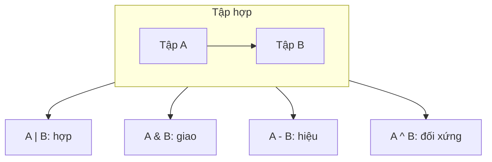

# 🎲 Bài 16: Set (Tập Hợp) Trong Python

> 🎓 **Chương 5 – Cấu trúc dữ liệu: List, Tuple, Set và Dictionary**

Ở bài **14 (List)** và bài **15 (Tuple)**, cả hai kiểu dữ liệu đều **cho phép trùng phần tử** và tìm kiếm thì phải duyệt từng phần. Giờ đến lượt một "chiến binh" khác biệt hoàn toàn: **Set (tập hợp)** — nơi mỗi phần tử **chỉ xuất hiện một lần** và tra cứu **cực nhanh**, giống hệt khái niệm tập hợp trong toán học!

---

## 🎯 Mục tiêu

Sau bài học này, học viên sẽ:

* ✅ Hiểu **Set là gì** và ba đặc điểm cốt lõi: **duy nhất**, **không thứ tự**, **nhanh**.
* ✅ **Tạo** set bằng `{}` và hàm `set()`.
* ✅ Hiểu cơ chế **tự loại bỏ phần tử trùng lặp**.
* ✅ **Thêm** phần tử bằng `add()` và **xóa** bằng `remove()`, `discard()`, `clear()`.
* ✅ **Kiểm tra** phần tử bằng `in` và đếm bằng `len()`.
* ✅ Thực hiện **phép toán tập hợp**: `union |`, `intersection &`, `difference -`, `symmetric_difference ^`.
* ✅ Biết **khi nào dùng set** và so sánh set với list/tuple.

---

## 📖 Kiến thức

### 1. Set là gì?

> 💬 **Nói đơn giản:** Set giống **rổ đựng trái cây không được trùng loại** — mỗi loại chỉ được bỏ vào một quả, và cách nhận diện cực nhanh: muốn biết có quả táo không, chỉ cần liếc qua rổ, không phải soi từng quả.

**Ví dụ đời thực:** 🗂️ danh sách mã số sinh viên trong câu lạc bộ (không ai trùng mã), 📇 danh sách từ khóa trong bài viết, 👥 danh sách bạn bè trên mạng (mỗi người một lần).

```python
ma_sv = {"SV001", "SV002", "SV003"}   # mỗi mã chỉ có một
```

**Ba đặc điểm của set:**

| Đặc điểm | Giải thích |
|---|---|
| 🔷 **Duy nhất** | Mỗi phần tử chỉ xuất hiện **một lần** — tự động loại trùng |
| 🌀 **Không thứ tự** | Phần tử không có index — **không thể** `ds[0]` |
| ⚡ **Tra cứu nhanh** | Kiểm tra `in` cực nhanh kể cả set hàng triệu phần tử |

```mermaid
mindmap
  root((Set))
    Đặc điểm
      Duy nhất (không trùng)
      Không thứ tự (không index)
      Phần tử phải bất biến
      Tra cứu cực nhanh (bảng băm)
    Thao tác
      Tạo: {} / set()
      Thêm: add()
      Xóa: remove, discard, clear
      Kiểm tra: in, len
    Phép toán tập hợp
      Hợp: a | b
      Giao: a & b
      Hiệu: a - b
      Đối xứng: a ^ b
```

### 2. Tạo set

| Cách | Cú pháp | Ví dụ |
|---|---|---|
| Có sẵn dữ liệu | `{giá_trị, ...}` | `s = {1, 2, 3}` |
| Từ list/chuỗi | `set(dữ liệu)` | `set("hello")` → `{'h','e','l','o'}` |
| Set rỗng | `set()` | `s = set()` — ⚠️ không dùng `{}` |

```python
mon_hoc = {"Toan", "Van", "Anh"}    # tạo bằng ngoặc nhọn
so = set([1, 2, 2, 3])              # từ list → tự loại bỏ số 2 trùng
chu = set("hello")                  # từ chuỗi → {'e', 'h', 'l', 'o'}

rong = set()                        # ✅ set rỗng
# rong = {}                         # ❌ đây là DICTIONARY rỗng, không phải set!
```

> ⚠️ **Bẫy số 1:** `{}` tạo ra **dictionary rỗng**, không phải set! Muốn set rỗng phải viết `set()`.

> ⚠️ **Bẫy số 2:** set chỉ chứa phần tử **bất biến** — số, chuỗi, tuple được; **list và set khác** thì không (sẽ báo `TypeError: unhashable type`).

### 3. Tính duy nhất — tự loại trùng lặp ⭐

```python
so = [1, 2, 2, 3, 3, 3]
so_duy_nhat = set(so)
print(so_duy_nhat)        # {1, 2, 3} — các giá trị trùng bị "nuốt" gọn

danh_sach = ["An", "An", "Binh", "Chi", "Binh"]
ten_duy_nhat = set(danh_sach)
print(ten_duy_nhat)       # {'An', 'Binh', 'Chi'}
```

> 💡 **Ứng dụng chớp nhoáng:** muốn biết một danh sách có bao nhiêu giá trị *khác nhau*? Chỉ cần `len(set(danh_sach))` — một dòng thay cho cả vòng lặp đếm tay.

### 4. Thêm và xóa phần tử

| Phương thức | Công dụng | Ví dụ |
|---|---|---|
| `s.add(x)` | Thêm **1** phần tử | `s.add("cam")` |
| `s.update([...])` | Thêm **nhiều** phần tử | `s.update(["cam", "xoai"])` |
| `s.remove(x)` | Xóa phần tử — **lỗi** nếu không có | `s.remove("cam")` |
| `s.discard(x)` | Xóa phần tử — **không lỗi** nếu không có | `s.discard("cam")` |
| `s.clear()` | Xóa **toàn bộ** set | `s.clear()` |

```python
trai_cay = {"tao", "chuoi"}

trai_cay.add("cam")                 # → {"tao", "chuoi", "cam"}
trai_cay.add("cam")                 # thêm lần nữa — không đổi gì cả!
trai_cay.update(["xoai", "dua"])    # thêm nhiều phần tử

trai_cay.remove("cam")              # xóa được — có "cam" trong set
trai_cay.discard("sau rieng")       # không có → không báo lỗi, im lặng bỏ qua
# trai_cay.remove("sau rieng")      # ❌ nếu dùng remove → KeyError!
```

> 💡 **`remove` vs `discard`:** `discard` "bao dung" hơn — xóa không thấy cũng không phàn nàn. Dùng `remove` khi bạn **chắc chắn** phần tử tồn tại; dùng `discard` khi dữ liệu đến từ bên ngoài không chắc chắn.

### 5. Kiểm tra và đếm

```python
thanh_vien = {"An", "Binh", "Chi"}

print("An" in thanh_vien)      # True — kiểm tra cực nhanh
print("Dung" in thanh_vien)    # False
print(len(thanh_vien))         # 3
```

> ⚡ **Vì sao `in` với set nhanh?** Set được cài đặt bằng **bảng băm (hash table)** — mỗi phần tử có "địa chỉ" tính sẵn, máy tính đi thẳng tới địa chỉ đó thay vì rà soát từng phần tử như list.

### 6. Duyệt set

```python
mon = {"Toan", "Van", "Anh"}

for m in mon:               # duyệt được nhưng THỨ TỰ KHÔNG cố định!
    print(m)

# ⚠️ KHÔNG có m.index, m[0], m[::-1], sắp xếp vị trí... vì set không có thứ tự
```

> ⚠️ **Lưu ý:** thứ tự in ra **không đảm bảo** giống thứ tự bạn gõ — mỗi lần chạy có thể khác nhau. Muốn duyệt có thứ tự thì dùng `sorted(s)` (trả list) hoặc chuyển `list(s)`.

### 7. Phép toán tập hợp — sức mạnh thật sự 🎯

Nhớ lại toán học lớp 6: hợp, giao, hiệu, hiệu đối xứng — Python có **toán tử riêng** cho từng phép:

```python
lop_A = {"An", "Binh", "Chi"}
lop_B = {"Chi", "Dung", "Em"}

hop    = lop_A | lop_B          # HỢP: ai đó thuộc ít nhất một lớp
giao   = lop_A & lop_B          # GIAO: thuộc cả hai lớp
hieu   = lop_A - lop_B          # HIỆU: chỉ thuộc A, không thuộc B
doi_x  = lop_A ^ lop_B          # ĐỐI XỨNG: chỉ thuộc đúng một trong hai

print(hop)    # {'An', 'Binh', 'Chi', 'Dung', 'Em'}
print(giao)   # {'Chi'}
print(hieu)   # {'An', 'Binh'}
print(doi_x)  # {'An', 'Binh', 'Dung', 'Em'}
```

| Ký hiệu | Tên | Nghĩa (toán học) | Tương đương phương thức |
|---|---|---|---|
| `a \| b` | Hợp (union) | mọi phần tử của cả hai | `a.union(b)` |
| `a & b` | Giao (intersection) | phần tử **chung** | `a.intersection(b)` |
| `a - b` | Hiệu (difference) | phần tử của a **trừ** phần trong b | `a.difference(b)` |
| `a ^ b` | Hiệu đối xứng (symmetric difference) | phần tử chỉ thuộc **một** trong hai | `a.symmetric_difference(b)` |



> 💡 **Có phải con trỏ `|` là "hoặc" trong điều kiện?** Không! Trong điều kiện `or` là chữ; dấu `|` **giữa hai set** nghĩa là phép hợp. Python thông minh phân biệt theo kiểu dữ liệu.

### 8. Set vs List vs Tuple — khi nào dùng gì?

| Tiêu chí | 📋 List | 🔗 Tuple | 🎲 Set |
|---|---|---|---|
| Thứ tự | ✅ Có | ✅ Có | ❌ Không |
| Trùng lặp | ✅ Cho phép | ✅ Cho phép | ❌ **Không** |
| Thay đổi được | ✅ | ❌ | ✅ |
| Truy cập theo index | ✅ `ds[0]` | ✅ `tp[0]` | ❌ |
| Tra cứu `in` | Chậm (duyệt) | Chậm (duyệt) | ⚡ Rất nhanh |
| Phần tử | Mọi kiểu | Mọi kiểu | Chỉ **bất biến** |
| Dùng khi | Cần thứ tự + thay đổi | Cố định, bảo vệ | Cần **duy nhất** + tra cứu nhanh + toán tập hợp |

**Tóm gọn:**
* Cần **thứ tự và sửa đổi** → **list**
* Dữ liệu **cố định không đổi** → **tuple**
* Cần **loại trùng, tìm nhanh, so sánh tập hợp** → **set**

---

## 💡 Ví dụ minh họa

### Ví dụ 1: Lọc phần tử trùng lặp

```python
# Danh sách môn đăng ký của cả khối — có học sinh đăng trùng
dang_ky = ["Toan", "Ly", "Toan", "Hoa", "Ly", "Anh"]

# set tự động loại bỏ trùng
mon_duy_nhat = set(dang_ky)

print("So luot dang ky:", len(dang_ky))          # 6
print("So mon khac nhau:", len(mon_duy_nhat))    # 4
print("Cac mon:", mon_duy_nhat)
```

| Dòng code | Ý nghĩa |
|---|---|
| `set(dang_ky)` | Chuyển list sang set — tự nén các giá trị trùng |
| `len(dang_ky)` | Số lượt đăng ký ban đầu |
| `len(mon_duy_nhat)` | Số môn học **khác nhau** thực tế |

### Ví dụ 2: Thêm và xóa với remove/discard

```python
# Set thành viên câu lạc bộ
thanh_vien = {"An", "Binh", "Chi"}

thanh_vien.add("Dung")        # thêm thành viên mới
thanh_vien.discard("An")      # An rời CLB — discard an toàn
thanh_vien.discard("Xuan")    # không có Xuan — không sao cả
print(thanh_vien)             # {'Binh', 'Chi', 'Dung'}
```

### Ví dụ 3: Kiểm tra môn đã đăng ký

```python
da_dang_ky = {"Toan", "Anh"}

mon_moi = "Ly"
if mon_moi in da_dang_ky:      # kiểm tra nhanh bằng in
    print("Da dang ky roi!")
else:
    da_dang_ky.add(mon_moi)
    print("Da them mon", mon_moi)
```

---

## 🔬 Ví dụ nâng cao

### Ví dụ 1: Lọc phần tử trùng lặp từ danh sách mua sắm 🛒

```python
# Giỏ hàng ghi nhầm nhiều lần
gio = ["sua", "banh", "sua", "trung", "banh", "gao"]

# Danh sách món cần mua — mỗi món một lần
can_mua = list(set(gio))
print("Can mua:", can_mua)
```

### Ví dụ 2: Học sinh giỏi cả hai môn 🏆

```python
# Học sinh giỏi từng môn (dữ liệu trùng nên dùng set là hợp lý)
gioi_toan = {"An", "Binh", "Chi", "Dung"}
gioi_van = {"Binh", "Dung", "Em", "Phuc"}

# Học sinh giỏi CẢ Toán lẫn Văn → GIAO của hai tập hợp
gioi_ca_hai = gioi_toan & gioi_van
print("Gioi ca hai mon:", gioi_ca_hai)

# Học sinh giỏi ít nhất MỘT môn → HỢP
gioi_it_nhat_mot = gioi_toan | gioi_van
print("So hoc sinh gioi it nhat 1 mon:", len(gioi_it_nhat_mot))

# Học sinh CHỈ giỏi Toán → HIỆU
chi_gioi_toan = gioi_toan - gioi_van
print("Chi gioi toan:", chi_gioi_toan)
```

Kết quả:

```
Gioi ca hai mon: {'Binh', 'Dung'}
So hoc sinh gioi it nhat 1 mon: 6
Chi gioi toan: {'An', 'Chi'}
```

### Ví dụ 3: Bạn bè chung của hai người 👥

```python
# Bạn của An và bạn của Binh (set — không trùng ai)
ban_an = {"Binh", "Chi", "Dung", "Em"}
ban_binh = {"An", "Chi", "Em", "Phuc"}

# Bạn CHUNG của cả hai → GIAO
ban_chung = ban_an & ban_binh
print("Ban chung:", ban_chung)

# Bạn chỉ quen đúng một trong hai → HIỆU ĐỐI XỨNG
ban_rieng = ban_an ^ ban_binh
print("Ban rieng (cua mot nguoi):", ban_rieng)
```

Kết quả:

```
Ban chung: {'Chi', 'Em'}
Ban rieng (cua mot nguoi): {'An', 'Binh', 'Dung', 'Phuc'}
```

### Ví dụ 4: Kiểm tra tài khoản trùng trong cuộc thi ⚠️

```python
# Danh sách tài khoản dự thi ghi từ 2 nguồn — có thể trùng
nguon_1 = ["user01", "user02", "user03"]
nguon_2 = ["user02", "user04"]

# Gộp và loại trùng bằng set
hop = set(nguon_1) | set(nguon_2)
print("Tong tai khoan duy nhat:", len(hop))

# Tìm tài khoản bị ghi trùng → GIAO
trung = set(nguon_1) & set(nguon_2)
print("Tai khoan trung:", trung)
```

---

## ⚠️ Lỗi thường gặp

### Lỗi 1: Dùng `{}` khi muốn set rỗng

```python
s = {}          # ❌ SAI — đây là dictionary rỗng!
s = set()       # ✅ ĐÚNG — set rỗng
```

* **Nguyên nhân:** `{}` đã được dành riêng cho dictionary (bài 17).
* **Cách kiểm tra:** `type(s)` — `<class 'set'>` mới là đúng.

### Lỗi 2: Đưa list vào set — TypeError

```python
s = {[1, 2], [3, 4]}   # ❌ SAI — TypeError: unhashable type: 'list'
```

* **Nguyên nhân:** set chỉ chứa phần tử **bất biến** (hashable); list thay đổi được nên không tính được "địa chỉ".
* **Cách sửa:** thay bằng tuple: `s = {(1, 2), (3, 4)}`.

### Lỗi 3: `remove` phần tử không tồn tại — KeyError

```python
s = {"tao", "cam"}
s.remove("xoai")   # ❌ SAI — KeyError: 'xoai'
```

* **Cách sửa:** dùng `discard("xoai")` (không lỗi) hoặc kiểm tra `if "xoai" in s:` trước.

### Lỗi 4: Tưởng truy cập theo index được

```python
s = {1, 2, 3}
print(s[0])   # ❌ SAI — TypeError: 'set' object is not subscriptable
```

* **Nguyên nhân:** set **không có thứ tự** nên không có index.
* **Cách sửa:** dùng `in` để kiểm tra, `for x in s:` để duyệt, hoặc `list(s)[0]` nếu thật sự cần vị trí.

### Lỗi 5: Giữ nguyên thứ tự sau khi tạo từ list

```python
ds = ["a", "b", "c"]
s = set(ds)
print(list(s))   # ⚠️ CÓ THỂ ra ['a', 'c', 'b'] — thứ tự không đảm bảo!
```

* **Nguyên nhân:** set không ghi nhớ thứ tự — đừng dựa vào thứ tự của set.

---

## 💎 Mẹo

* ⭐ **Loại trùng một dòng:** `set(danh_sach)` — nhanh hơn và ngắn hơn mọi vòng lặp tự viết.
* ⚡ **`in` với set cực nhanh:** kiểm tra thành viên với dữ liệu lớn nên dùng set thay list.
* 🧮 **Toán tập hợp thay vòng lặp:** `|`, `&`, `-`, `^` biến cả đoạn so sánh dài thành một biểu thức.
* 🛡️ **`discard` khi dữ liệu không chắc chắn** — đỡ phải viết `if` kiểm tra trước.
* 🔒 **Phần tử phải bất biến:** dùng tuple thay list nếu cần đưa nhiều giá trị vào set.
* 🔍 **Đếm giá trị khác nhau:** `len(set(ds))` — bài toán đếm phân biệt giải trong một dòng.
* 📦 **Muốn thứ tự khi in set:** dùng `sorted(s)`.

---

## 📝 Tóm tắt

| Thao tác | Cú pháp | Ghi chú |
|---|---|---|
| Tạo | `{1, 2, 3}` hoặc `set(list)` | `set()` cho set rỗng |
| Thêm 1 phần tử | `s.add(x)` | Thêm trùng → không đổi |
| Thêm nhiều | `s.update([...])` | |
| Xóa (có lỗi) | `s.remove(x)` | `KeyError` nếu không có |
| Xóa (an toàn) | `s.discard(x)` | Không lỗi khi thiếu |
| Xóa sạch | `s.clear()` | |
| Kiểm tra | `x in s` | ⚡ Rất nhanh |
| Số lượng | `len(s)` | |
| Hợp | `a \| b` | Mọi phần tử của cả hai |
| Giao | `a & b` | Phần tử chung |
| Hiệu | `a - b` | Phần của a trừ phần trong b |
| Đối xứng | `a ^ b` | Chỉ thuộc đúng một tập |

---

## 🧪 Kiểm tra nhanh

1. ❓ Ba đặc điểm chính của set là gì?
2. ❓ `{}` và `set()` khác nhau thế nào?
3. ❓ `set([1, 2, 2, 3])` cho kết quả gì? Vì sao?
4. ❓ `remove` và `discard` khác nhau ra sao?
5. ❓ Vì sao không thể dùng `s[0]` với set?
6. ❓ `a = {1, 2, 3}`, `b = {2, 3, 4}` — kết quả `a & b`, `a - b`, `a | b` là gì?
7. ❓ Viết lệnh kiểm tra `5` có trong set `s` không.
8. ❓ Khi nào nên dùng set thay vì list?
9. ❓ Đưa list vào set bị lỗi gì? Cách sửa?
10. ❓ `len(set("hello"))` bằng bao nhiêu?

<details>
<summary>🔍 Xem đáp án</summary>

1. **Duy nhất** (không trùng), **không thứ tự**, **tra cứu nhanh**.
2. `{}` là **dictionary rỗng**; `set()` mới là **set rỗng**.
3. `{1, 2, 3}` — set tự động loại bỏ phần tử trùng lặp.
4. `remove` báo `KeyError` khi phần tử không tồn tại; `discard` im lặng bỏ qua.
5. Vì set **không có thứ tự** — không có khái niệm vị trí/index.
6. `a & b` = `{2, 3}`; `a - b` = `{1}`; `a | b` = `{1, 2, 3, 4}`.
7. `5 in s`.
8. Khi cần loại trùng, tra cứu nhanh, hoặc thực hiện phép toán tập hợp (giao/hợp/hiệu).
9. `TypeError: unhashable type: 'list'` — set chỉ nhận phần tử bất biến; sửa bằng tuple.
10. 4 — chữ `l` trùng bị loại bỏ (`{'h','e','l','o'}`).

</details>

---

## 📚 Bài đọc thêm

* [Python.org – Data Structures: sets](https://docs.python.org/3/tutorial/datastructures.html#sets)
* [W3Schools – Python Sets](https://www.w3schools.com/python/python_sets.asp)
* [Python.org – Set types (set, frozenset)](https://docs.python.org/3/library/stdtypes.html#set-types-set-frozenset)
* [Real Python – Sets in Python](https://realpython.com/python-sets/)

---

## 🏁 Kết thúc bài

🎉 Bạn đã hoàn thành bộ ba cấu trúc lưu dữ liệu "trần": **List** (có thứ tự, đổi được), **Tuple** (cố định, bảo vệ), **Set** (duy nhất, nhanh). Nhưng tất cả mới chỉ lưu **các giá trị thuần** — chưa biết đâu là **nhãn** của chúng. Làm sao để tra cứu "điểm Toán của An" một cách trực tiếp, nhanh như tra từ điển? Câu trả lời là **Dictionary** — cấu trúc cuối cùng và cũng linh hoạt nhất trong bộ tứ này! Hãy sang:

👉 **[Bài 17: Dictionary (Từ điển)](../17_Dictionary/bai_giang.md)**