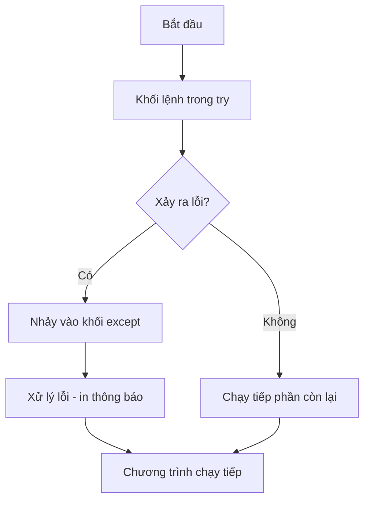

# 🚨 Bài 19: Ngoại Lệ (Exception) Trong Python

> 🎓 **Chương 7 – Viết chương trình an toàn, không bao giờ "sập"**

Bài 18 dạy bạn xử lý văn bản — nhưng nếu người dùng gõ nhầm chữ vào chỗ cần số, chương trình sẽ **dừng đột ngột** với thông báo lỗi đỏ rực. Bài hôm nay dạy bạn **bắt lỗi** (exception handling): biến chương trình mong manh thành chương trình **kiên cố**, sẵn sàng đối mặt mọi sai sót của người dùng.

---

## 🎯 Mục tiêu

Sau bài học này, học viên sẽ:

* ✅ Phân biệt **lỗi cú pháp (error)** và **ngoại lệ (exception)**.
* ✅ Dùng `try` / `except` để bắt lỗi và giữ chương trình chạy tiếp.
* ✅ Bắt các ngoại lệ cụ thể: `ValueError`, `TypeError`, `ZeroDivisionError`, `IndexError`, `KeyError`, `FileNotFoundError`.
* ✅ Dùng `else` (chạy khi không lỗi) và `finally` (luôn chạy).
* ✅ Chủ động ném lỗi bằng `raise`.
* ✅ Tự định nghĩa ngoại lệ riêng bằng `class MyError(Exception)`.

---

## 📖 Kiến thức

### 1. Error (lỗi) và Exception (ngoại lệ) khác nhau thế nào?

> 💬 **Nói đơn giản:** **Error** là lỗi xảy ra khi viết **sai cú pháp** — Python không hiểu code và không chạy được gì. **Exception** là lỗi xảy ra **lúc chương trình đang chạy** — code đúng cú pháp nhưng gặp tình huống bất thường (chia cho 0, nhập chữ vào chỗ số...).

| Tiêu chí | Error (lỗi) | Exception (ngoại lệ) |
|---|---|---|
| Xảy ra khi | Viết sai cú pháp | Đang chạy chương trình |
| Ví dụ | Thiếu dấu `:` sau `if` | `10 / 0` |
| Bắt được bằng try? | ❌ Không — phải sửa code | ✅ Có |

```python
print("Xin chao"    # ❌ SyntaxError — thiếu ngoặc, phải sửa code
```

```python
x = 10 / 0          # ✅ Cú pháp đúng, nhưng chạy báo ZeroDivisionError
```

**Ví dụ đời thực:** Chiếc ô tô — **Error** giống đổ xăng lẫn nước, xe không nổ máy. **Exception** giống đang chạy gặp chướng ngại vật: hệ thống **phanh** để bạn xử lý, không để xe lao xuống hố.

### 2. Tại sao chương trình "sập"?

Khi Python gặp ngoại lệ mà **không có chỗ xử lý**, nó in traceback (vết lỗi) và **dừng chương trình** — mọi câu lệnh phía sau không chạy nữa:

```python
a = int(input("Nhap so: "))   # người dùng gõ "abc"
print(a + 1)                  # ❌ ValueError → chương trình chết tại đây
```

Nếu đây là quầy tính tiền đang phục vụ khách, chương trình "chết" giữa chừng là thảm họa. Giải pháp: **bắt ngoại lệ** để xử lý lỗi nhẹ nhàng rồi chạy tiếp.

### 3. Cú pháp try / except cơ bản

```python
try:
    # khối lệnh có nguy cơ lỗi
    x = 10 / 0
except:
    # khối lệnh chạy khi có lỗi xảy ra
    print("Co loi xay ra!")
print("Chuong trinh van chay tiep")   # ✅ vẫn chạy
```



> 💡 Tưởng tượng `try` là **tấm lưới an toàn** dưới người đi dây: có lỗi là rơi vào lưới (`except`), không đau, vẫn đi tiếp.

### 4. Bắt ngoại lệ cụ thể

Bắt "trùm chung" giấu đi thông tin lỗi thật. Python cho phép bắt **từng loại lỗi riêng** và xử lý khác nhau:

```python
try:
    so = int(input("Nhap so: "))   # Nhập: abc
    print(10 / so)
except ValueError:
    print("Ban phai nhap SO, khong phai chu!")
except ZeroDivisionError:
    print("Khong duoc chia cho 0!")
```

| Ngoại lệ | Xảy ra khi | Ví dụ |
|---|---|---|
| `ValueError` | Giá trị không hợp lệ với hàm | `int("abc")` |
| `TypeError` | Sai kiểu dữ liệu | `"a" + 1` |
| `ZeroDivisionError` | Chia cho 0 | `10 / 0` |
| `IndexError` | Vượt quá chỉ số list/chuỗi | `"abc"[9]` |
| `KeyError` | Khóa không tồn tại trong dict | `{}["x"]` |
| `FileNotFoundError` | File không tồn tại | `open("none.txt")` |

> 💡 Bắt nhiều lỗi trong **một** khối bằng tuple: `except (ValueError, TypeError):`.

### 5. else và finally — thành công và dọn dẹp

```python
try:
    so = int(input("Nhap so: "))     # Nhập: 10
    ket_qua = 10 / so
except ValueError:
    print("Nhap sai roi!")
else:
    print("Ket qua:", ket_qua)       # else: chỉ chạy khi try không lỗi
finally:
    print("Hoan tat")                # finally: luôn chạy

try:
    f = open("ghi_chu.txt", "w")
    f.write("Xin chao")
finally:
    print("Dong file")               # dọn dẹp tài nguyên dù có lỗi hay không
```

> 💡 `finally` giống **công việc dọn dẹp**: trả sách cho thư viện dù bài kiểm tra đạt hay trượt.

### 7. raise — chủ động ném lỗi

Đôi khi **chính bạn** muốn báo lỗi khi dữ liệu không hợp lệ, thay vì chờ Python phát hiện:

```python
def kiem_tra_diem(diem):
    if diem < 0 or diem > 10:
        raise ValueError("Diem phai tu 0 den 10!")   # ném lỗi
    return diem
```

> 💡 `raise` đúng nghĩa "hô hoán": nói "có chuyện rồi!", ai có `try/except` bao quanh sẽ đỡ lấy.

### 8. Exception do người dùng định nghĩa

Hệ thống có sẵn nhiều ngoại lệ, nhưng bạn có thể **tự đặt tên** lỗi cho ứng dụng của mình:

```python
# Ngoại lệ riêng: chỉ cần kế thừa Exception
class TuoiKhongHopLe(Exception):
    pass

def kiem_tra_tuoi(tuoi):
    if tuoi < 0:
        raise TuoiKhongHopLe("Tuoi khong the la so am!")
    return tuoi

try:
    tuoi = kiem_tra_tuoi(-5)
except TuoiKhongHopLe as e:
    print("Loi:", e)   # Loi: Tuoi khong the la so am!
```

> 💡 Vì sao tự định nghĩa? Ngoại lệ của bạn mang **nghĩa riêng** — đọc code hiểu ngay chuyện gì xảy ra, xử lý đúng chỗ hơn là bắt chung `Exception`.

### 9. Thứ tự except — con trước, cha sau

Các ngoại lệ có quan hệ **cha – con** (ví dụ `ValueError` là con của `Exception`). Đặt con **trước**, cha **sau**, nếu không con sẽ không bao giờ chạy:

```python
try:
    int("abc")
except ValueError:          # ✅ con đặt trước
    print("Sai gia tri")
except Exception:           # cha đặt sau — bắt tất cả còn lại
    print("Loi khac")
```

---

## 💡 Ví dụ minh họa

### Ví dụ 1: Chia cho 0 không còn "sập"

```python
# Bước 1: phép chia có nguy cơ lỗi đặt trong try
try:
    ket_qua = 10 / 0

# Bước 2: bắt riêng lỗi chia cho 0
except ZeroDivisionError:
    print("Khong the chia cho 0!")

# Bước 3: chương trình vẫn chạy tiếp
print("Ket thuc chuong trinh binh thuong")
```

Kết quả: `Khong the chia cho 0!` rồi `Ket thuc chuong trinh binh thuong`.

| Dòng code | Ý nghĩa |
|---|---|
| `try:` | Mở khối có nguy cơ lỗi |
| `ket_qua = 10 / 0` | Ném ra `ZeroDivisionError` |
| `except ZeroDivisionError:` | Bắt đúng loại lỗi, in thông báo thân thiện |
| `print("Ket thuc...")` | Ngoài try — luôn chạy, chương trình không chết |

### Ví dụ 2: Nhập số sai — chương trình không sập

```python
try:
    so = int(input("Nhap mot so nguyen: "))   # Nhập: abc
    print("So cua ban:", so)
except ValueError:
    print("Ban nhap khong phai so nguyen!")
```

Kết quả: `Ban nhap khong phai so nguyen!`.

### Ví dụ 3: Bộ đủ try – except – else – finally

```python
try:
    so = int(input("Nhap so: "))      # Nhập: 10
    ket_qua = 100 / so
except ValueError:
    print("Phai nhap so!")
except ZeroDivisionError:
    print("Khong chia 0 duoc!")
else:
    print("Ket qua:", ket_qua)        # không lỗi mới chạy
finally:
    print("Da hoan tat xu ly")        # luôn chạy
```

Kết quả (với `10`): `Ket qua: 10.0` rồi `Da hoan tat xu ly`.

---

## 🔬 Ví dụ nâng cao

### Ví dụ 1: Nhập điểm hợp lệ — lặp cho tới khi đúng 🏫

```python
while True:
    try:
        diem = float(input("Nhap diem (0-10): "))   # Nhập: 12
        if diem < 0 or diem > 10:
            raise ValueError("Diem ngoai khoang 0-10!")
        break                     # hợp lệ thì thoát vòng lặp
    except ValueError:
        print("Sai roi! Nhap lai diem so tu 0 den 10.")

print("Diem da nhap:", diem)
```

> 💡 Mô hình **vòng lặp bảo vệ**: nhập sai → báo → nhập lại cho tới khi đúng. Dùng cực nhiều trong chương trình thực tế.

### Ví dụ 2: Máy tính không bao giờ "đứng" khi nhập sai 🧮

```python
while True:
    try:
        a = float(input("Nhap so thu nhat: "))   # Nhập: 10
        b = float(input("Nhap so thu hai: "))    # Nhập: 0
        print("Thuong:", a / b)
    except ValueError:
        print("Ban phai nhap SO, thu lai nhe!")
    except ZeroDivisionError:
        print("Khong chia duoc cho 0, thu lai nhe!")
    else:
        print("Tinh xong!")
        break                     # không lỗi thì hoàn thành và thoát
```

### Ví dụ 3: Ngoại lệ tùy chỉnh cho ứng dụng ngân hàng 🏦

```python
class SoDuKhongDu(Exception):
    pass

def rut_tien(so_du, so_tien):
    if so_tien <= 0:
        raise ValueError("So tien phai lon hon 0!")
    if so_tien > so_du:
        raise SoDuKhongDu("So du khong du!")
    return so_du - so_tien

try:
    so_du_moi = rut_tien(100000, 200000)
except SoDuKhongDu as e:
    print("Loi:", e)              # Loi: So du khong du!
else:
    print("Rut thanh cong. So du:", so_du_moi)
```

### Ví dụ 4: Chương trình đọc file an toàn 📄

```python
try:
    with open("khong_co_file.txt", "r") as f:   # bài 22 học kỹ về file
        noi_dung = f.read()
except FileNotFoundError:
    print("Khong tim thay file! Kiem tra lai ten file.")
else:
    print("Noi dung file:", noi_dung)
```

Kết quả: `Khong tim thay file! Kiem tra lai ten file.`

---

## ⚠️ Lỗi thường gặp

### Lỗi 1: Bắt lỗi quá rộng và "nuốt" lỗi

```python
try:
    x = int(input("Nhap so: "))
except Exception:     # ⚠️ bắt tất cả
    pass              # ❌ nuốt lỗi im lặng — không biết chuyện gì xảy ra
```

* **Cách sửa:** bắt loại cụ thể và in thông báo: `except ValueError as e: print("Nhap sai:", e)`.

### Lỗi 2: Thứ tự except sai — con đặt sau cha

```python
try:
    int("abc")
except Exception:          # ❌ cha chặn hết
    print("Loi chung")
except ValueError:         # ❌ không bao giờ tới đây
    print("Sai gia tri")
```

* **Nguyên nhân:** `ValueError` là con của `Exception` nên bị bắt trước. **Cách sửa:** con trước, cha sau.

### Lỗi 3: Viết code ngoài try rồi tưởng được bảo vệ

```python
try:
    a = int(input("Nhap so: "))
except ValueError:
    print("Sai!")
print(10 / a)      # ❌ phép chia NẰM NGOÀI try — chia 0 vẫn sập
```

* **Cách sửa:** đưa toàn bộ lệnh nguy hiểm vào trong `try`.

### Lỗi 4: raise thiếu thông điệp

```python
raise ValueError   # ❌ SAI — ném "lỗi trống", khó biết vì sao
raise ValueError("Diem khong hop le")   # ✅ kèm thông báo rõ ràng
```

---

## 💎 Mẹo

* 🎯 **Bắt lỗi cụ thể nhất có thể** — `except ValueError` rõ ràng hơn `except Exception`.
* 📦 **Gom nhiều lỗi một khối:** `except (ValueError, TypeError):`.
* 🛡️ **`finally` cho tài nguyên:** đóng file, đóng kết nối — dù lỗi hay không, không rò rỉ tài nguyên.
* 🔄 **Vòng lặp bảo vệ nhập liệu** (`while True` + `try/except` + `break`) là khuôn mẫu vàng cho mọi chương trình có nhập liệu.
* 🏷️ **Đặt tên ngoại lệ riêng có nghĩa** — `TuoiKhongHopLe` đọc là hiểu ngay.
* 🔬 Khi debug: bắt rộng tạm thời và in lỗi thật: `except Exception as e: print(e)`.
* 🚫 Không dùng `except:` trần hay `pass` im lặng — nó giấu mọi vấn đề.

---

## 📝 Tóm tắt

| Thành phần | Công dụng | Chạy khi nào |
|---|---|---|
| `try` | Chứa code có nguy cơ lỗi | Luôn |
| `except LoaiLoi` | Xử lý lỗi cụ thể | Có lỗi đúng loại |
| `except (L1, L2)` | Bắt nhiều loại lỗi | Có lỗi thuộc các loại đó |
| `else` | Code thành công | Không có lỗi |
| `finally` | Dọn dẹp tài nguyên | Luôn luôn |
| `raise LoaiLoi("msg")` | Chủ động ném lỗi | Khi bạn gọi |
| `class MyError(Exception)` | Ngoại lệ tùy chỉnh | Khi bạn `raise` nó |

---

## 🧪 Kiểm tra nhanh

1. ❓ Phân biệt error và exception bằng một ví dụ mỗi loại.
2. ❓ Viết cú pháp `try/except` bắt lỗi `ZeroDivisionError`.
3. ❓ `int("abc")` gây ra ngoại lệ gì?
4. ❓ Khối `else` chạy khi nào? Khối `finally` chạy khi nào?
5. ❓ Lệnh nào dùng để chủ động ném lỗi?
6. ❓ Làm sao tạo ngoại lệ tùy chỉnh tên `MyError`?
7. ❓ Vì sao phải đặt `except` của lớp con trước lớp cha?
8. ❓ Đọc file không tồn tại gây ra ngoại lệ gì?
9. ❓ Code ngoài `try` có được bảo vệ không?
10. ❓ Vòng lặp nhập điểm cho tới khi hợp lệ gồm những bước nào?

<details>
<summary>🔍 Xem đáp án</summary>

1. Error: `print("a"` (sai cú pháp). Exception: `10 / 0` (lỗi lúc chạy).
2. `try: x = 10 / 0` / `except ZeroDivisionError: print("Khong chia 0")`.
3. `ValueError`.
4. `else` chạy khi không có lỗi; `finally` luôn chạy.
5. `raise`.
6. `class MyError(Exception): pass`.
7. Vì lớp con bắt được sẽ chạy trước; đặt cha trước sẽ "chặn" con.
8. `FileNotFoundError`.
9. Không — chỉ code trong `try` được bảo vệ.
10. `while True` + `try/except` bắt lỗi nhập + kiểm tra khoảng giá trị (có thể `raise`) + `break` khi hợp lệ.

</details>

---

## 📚 Bài đọc thêm

* [Python.org – Errors and Exceptions](https://docs.python.org/3/tutorial/errors.html)
* [Python.org – Built-in Exceptions](https://docs.python.org/3/library/exceptions.html)
* [W3Schools – Python Try Except](https://www.w3schools.com/python/python_try_except.asp)
* [Real Python – Python Exceptions](https://realpython.com/python-exceptions/)

---

## 🏁 Kết thúc bài

🎉 Bạn đã biết cách **bắt lỗi, xử lý lỗi và tạo lỗi riêng** — chương trình của bạn giờ không còn dễ "sập". Nhưng code càng lớn, bạn càng cần tổ chức nó thành từng **thư viện nhỏ** để tái sử dụng. Bài sau sẽ dạy bạn điều đó:

👉 **[Bài 20: Module](../20_Module/bai_giang.md)** — chia chương trình thành các file nhỏ và tái sử dụng code.
