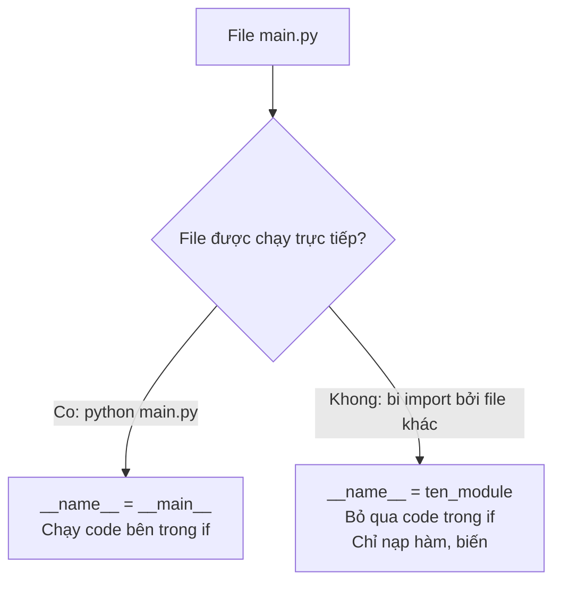

# 🧩 Bài 20: Module Trong Python

> 🎓 **Chương 6 – Tổ chức mã nguồn: Module, Package và File**

---

## 🎯 Mục tiêu

Sau bài học này, học viên sẽ:

* ✅ Hiểu **module là gì** và vì sao phải **chia nhỏ** chương trình thành nhiều file.
* ✅ Thành thạo **4 cách import**: `import ten`, `import ten as`, `from ... import ...`, `from ... import *`.
* ✅ Hiểu rõ câu lệnh **`if __name__ == "__main__"`** — "bí ẩn" mà ai cũng gặp.
* ✅ **Tự tạo module** riêng (`tien_ich.py`) và dùng lại trong chương trình khác.
* ✅ Sử dụng được các **module chuẩn**: `math`, `random`, `datetime`, `os` cho tác vụ thực tế.

---

## 📖 Kiến thức

### 1. Nhắc lại bài trước

Ở **Bài 19**, chúng ta học cách dùng `try/except` để **xử lý lỗi** mà không làm chương trình sập:

```python
try:
    so = int(input("Nhập số: "))
except ValueError:
    print("Bạn nhập không phải số!")
```

Khi chương trình còn nhỏ, viết tất cả trong **một file** không sao. Nhưng khi chương trình lên tới hàng trăm, hàng nghìn dòng thì một file duy nhất trở thành "mớ bòng bong". Giải pháp chính là **module**.

### 2. Module là gì?

> 💬 **Nói đơn giản:** Module là **một file Python (`.py`)** chứa các hàm, biến, class — giống một **bộ phận của máy**, chỉ đảm nhận một mảng việc nhất định.

> 🏠 **Ví dụ đời thực:** Một ngôi nhà không xây thành một khối duy nhất mà gồm nhiều **phòng**: phòng khách, phòng bếp, phòng ngủ. Mỗi phòng có chức năng riêng. Tương tự, mỗi module phụ trách một mảng chức năng: `tinh_toan.py` làm phép tính, `luu_tru.py` lưu dữ liệu, `hien_thi.py` hiển thị.

**Vì sao dùng module?**

| Lý do | Giải thích |
|---|---|
| ♻️ **Tái sử dụng** | Viết một lần, dùng ở nhiều nơi — giống món đồ nghề dùng chung |
| 🛠️ **Dễ bảo trì** | Sửa một chức năng chỉ cần sửa trong module của nó |
| 👀 **Dễ đọc** | File ngắn gọn, tập trung, ai đọc cũng dễ hiểu |
| 👥 **Dễ làm việc nhóm** | Mỗi người viết một module riêng, cuối cùng ghép lại |

### 3. Cách 1: `import ten_module`

```python
import math

print(math.sqrt(81))   # 9.0
print(math.pi)         # 3.141592653589793
```

* Sau lệnh `import math`, ta truy cập hàm qua **tên module**: `math.sqrt(...)`.
* Lợi ích: không sợ **trùng tên** — nếu bạn có hàm `sqrt` của riêng mình, nó không đụng độ với `math.sqrt`.

### 4. Cách 2: `import ten_module as ten_ngan`

```python
import random as rd
import math as m

so = rd.randint(1, 6)   # mô phỏng xúc xắc 1 - 6
print(m.floor(3.7))     # 3
```

* `as` (alias) = đặt **biệt danh ngắn** cho module — gõ nhanh hơn, code gọn hơn.
* Quy ước phổ biến: `import pandas as pd`, `import numpy as np` — bạn sẽ gặp hoài trong dự án thực tế.

### 5. Cách 3: `from ten_module import ten_can_dung`

```python
from math import sqrt, pi

print(sqrt(16))   # 4.0 — gọi trực tiếp, không cần math.sqrt
print(pi)
```

* Chỉ **lấy những thứ cần dùng** — code ngắn, rõ ràng.
* Lưu ý: giờ gọi thẳng `sqrt(16)`; nếu bạn tự định nghĩa một hàm `sqrt` khác thì nó sẽ **bị ghi đè** — cẩn thận trùng tên.

### 6. Cách 4: `from ten_module import *`

```python
from random import *

print(random())           # số thực ngẫu nhiên trong 0.0 - 1.0
print(randint(1, 100))    # số nguyên ngẫu nhiên từ 1 đến 100
```

* `*` = "lấy **tất cả**". Tiện nhưng **nguy hiểm**: mọi tên trong module đổ vào không gian tên của bạn, dễ ghi đè hàm/biến. Người mới nên hạn chế dùng.

> ⚠️ Trong code thực tế của các công ty, `import *` thường bị cấm (PEP 8 khuyến nghị tránh).

### 7. `if __name__ == "__main__"` là gì?

Đây là câu lệnh "thần bí" xuất hiện ở gần như mọi file Python chuyên nghiệp. Hãy hiểu từng mảnh:

* Khi bạn **chạy file trực tiếp** (`python main.py`), Python gán biến đặc biệt `__name__` = chuỗi `"__main__"`.
* Khi file đó **bị import** từ file khác, `__name__` = tên module (ví dụ `"tien_ich"`).



```python
# tien_ich.py
def binh_phuong(x):
    return x * x

if __name__ == "__main__":
    # Code này chỉ chạy khi gõ: python tien_ich.py
    print("Đang chạy trực tiếp tien_ich.py")
```

> 💡 **Ý nghĩa:** Giúp một file vừa làm **module** (bị import để dùng hàm) vừa làm **chương trình chạy độc lập** (kiểm thử nhanh). Đây là "khuôn vàng" của mọi file Python.

### 8. Tạo module tự viết

Chỉ cần **tạo một file `.py`** là đã có một module! Ví dụ tạo file `tien_ich.py`:

```python
# tien_ich.py — module tiện ích do mình viết
PI = 3.14159

def dien_tich_hinh_tron(r):
    """Trả về diện tích hình tròn bán kính r."""
    return PI * r * r

def chu_vi_hinh_tron(r):
    """Trả về chu vi hình tròn bán kính r."""
    return 2 * PI * r
```

Sau đó trong file `main.py` cùng thư mục:

```python
import tien_ich   # hoặc: from tien_ich import dien_tich_hinh_tron

print(tien_ich.dien_tich_hinh_tron(5))   # 78.53975
```

> ✔️ Điều kiện duy nhất với người mới: **file module và file dùng nó nằm cùng thư mục**. Bài 21 (Package) và Bài 30 (Virtual Environment) sẽ dạy cách tổ chức chuyên nghiệp hơn.

### 9. Module chuẩn của Python

Python đi kèm "tủ đồ nghề" khổng lồ gọi là **Thư viện chuẩn** (Standard Library) — cài Python là có sẵn, không cần cài thêm:

| Module | Chức năng | Ví dụ hay dùng |
|---|---|---|
| `math` | Toán học nâng cao | `sqrt()`, `floor()`, `ceil()`, `pi` |
| `random` | Sinh số ngẫu nhiên | `randint()`, `choice()`, `shuffle()` |
| `datetime` | Ngày, giờ | `datetime.now()`, `date.today()` |
| `os` | Tương tác với hệ điều hành | `os.getcwd()`, `os.listdir()` |
| `json` | Dữ liệu JSON (bài 32) | `json.dumps()`, `json.loads()` |
| `csv` | File CSV (bài 33) | `csv.reader()`, `csv.writer()` |

* **`math`**: như cuốn sổ tay công thức toán — căn bậc hai, lũy thừa, làm tròn, các hằng số.
* **`random`**: "máy xào bài" — sinh số/đối tượng ngẫu nhiên cho game, khảo sát, bốc thăm.
* **`datetime`**: đồng hồ + lịch — lấy giờ hiện tại, đếm ngày, tính tuổi.
* **`os`**: cầu nối với hệ điều hành — xem thư mục hiện tại, liệt kê file, đặt biến môi trường.

---

## 💡 Ví dụ minh họa

### Ví dụ 1: Dùng `math` tính diện tích hình tròn

```python
# Nhập module toán học
import math

# Bán kính hình tròn
ban_kinh = 5.0

# Diện tích = pi * r^2
dien_tich = math.pi * ban_kinh ** 2

# Làm tròn 2 chữ số sau dấu phẩy
print(round(dien_tich, 2))   # 78.54
```

**Giải thích từng dòng:**

| Dòng code | Ý nghĩa |
|---|---|
| `import math` | Nạp module math — từ đây dùng được `math.pi`, `math.sqrt`... |
| `ban_kinh = 5.0` | Biến lưu bán kính |
| `math.pi * ban_kinh ** 2` | `3.1415... * 5^2` — tính diện tích |
| `round(..., 2)` | Làm tròn tới 2 chữ số thập phân |

### Ví dụ 2: `random` mô phỏng xúc xắc

```python
# Nhập module sinh số ngẫu nhiên
import random

# randint(a, b): số nguyên ngẫu nhiên từ a đến b (bao gồm cả hai)
mat_xuc_xac = random.randint(1, 6)

# In kết quả
print("Bạn tung được:", mat_xuc_xac)
```

**Giải thích từng dòng:**

| Dòng code | Ý nghĩa |
|---|---|
| `import random` | Nạp module sinh số ngẫu nhiên |
| `random.randint(1, 6)` | Trả về một số nguyên bất kỳ trong 1 → 6 |
| `print(...)` | In kết quả — mỗi lần chạy ra một con số khác nhau |

### Ví dụ 3: Tự tạo module và dùng lại

File `chao_hon.py`:

```python
# Module chào hỏi do mình viết
def chao_ban(ten):
    """In lời chào thân thiện."""
    print(f"Xin chào {ten}, chúc một ngày tốt lành!")

if __name__ == "__main__":
    # Chỉ chạy khi gõ: python chao_hon.py
    chao_ban("Mai")
```

File `main.py`:

```python
# Nhập hàm từ module mình viết
from chao_hon import chao_ban

# Dùng hàm như hàm bình thường
chao_ban("An")
```

**Giải thích từng dòng:**

| Dòng code | Ý nghĩa |
|---|---|
| `def chao_ban(ten):` | Định nghĩa hàm trong module |
| `if __name__ == "__main__":` | Test thử khi chạy trực tiếp file `chao_hon.py` |
| `from chao_hon import chao_ban` | Chỉ nhập đúng hàm cần dùng, không kéo theo phần test |

---

## 🔬 Ví dụ nâng cao

### Ví dụ 1: Game đoán số (kết hợp `random` + `if` + vòng lặp)

```python
# Game đoán số từ 1 đến 100
import random

# Máy nghĩ ra một số bí mật
so_bi_mat = random.randint(1, 100)
so_ban_doan = 0
so_lan_doan = 0

print("Tôi đã nghĩ một số từ 1 đến 100. Hãy đoán nó!")

# Vòng lặp cho đến khi đoán đúng
while so_ban_doan != so_bi_mat:
    so_ban_doan = int(input("Nhập số bạn đoán: "))
    so_lu_doan = so_lu_doan + 1
    if so_ban_doan < so_bi_mat:
        print("Số bí mật lớn hơn! Đoán cao hơn nhé.")
    elif so_ban_doan > so_bi_mat:
        print("Số bí mật nhỏ hơn! Đoán thấp hơn nhé.")

print(f"Chúc mừng! Bạn đã đoán đúng số {so_bi_mat} sau {so_lu_doan} lần.")
```

* `random.randint(1, 100)` — máy chọn số ngẫu nhiên.
* `while` + `if/elif` — tạo vòng phản hồi cho đến khi trúng.
* Lưu ý: cần xử lý trường hợp người dùng nhập chữ *(dùng ứng dụng Bài 19)*.

### Ví dụ 2: Nhật ký thời gian chạy bằng `datetime`

```python
# Ghi lại thời điểm chạy chương trình
from datetime import datetime

# Lấy thời điểm hiện tại
bay_gio = datetime.now()
print("Chương trình chạy lúc:", bay_gio)
print("Giờ:phút:giây:", bay_gio.strftime("%H:%M:%S"))
```

> `strftime("%H:%M:%S")` — định dạng giờ theo mẫu (giờ:phút:giây).

### Ví dụ 3: `os` — dò thư mục và file `.py`

```python
# Khám phá hệ điều hành bằng os
import os

# Thư mục đang làm việc
print("Thư mục hiện tại:", os.getcwd())

# Liệt kê các file .py trong thư mục hiện tại
for ten in os.listdir():
    if ten.endswith(".py"):
        print("File Python:", ten)
```

---

## ⚠️ Lỗi thường gặp

### Lỗi 1: `ModuleNotFoundError: No module named 'tien_ich'`

```python
import tien_ich   # ❌ báo ModuleNotFoundError
```

* **Nguyên nhân:** File `tien_ich.py` **không tồn tại** hoặc **nằm khác thư mục** với file đang chạy; hoặc viết sai tên (hoa – thường, thiếu dấu).
* **Cách sửa:** Kiểm tra lại tên file (phải trùng khớp chính xác), đặt module cùng thư mục, hoặc kiểm tra đường dẫn.

### Lỗi 2: `ImportError: cannot import name 'rd' from 'random'`

```python
from random import rd   # ❌ sai — rd không tồn tại trong random
```

* **Nguyên nhân:** Bạn nhầm `import random as rd` (bí danh) với `from ... import` (tên thật phải đúng).
* **Cách sửa:** `import random as rd` dùng được `rd.randint(...)`, còn `from random import ...` chỉ nhập tên thật như `randint`.

### Lỗi 3: Đặt tên file trùng module chuẩn

Bạn đặt file `math.py` rồi gõ `import math` — chương trình báo lỗi hoặc hoạt động sai.

* **Nguyên nhân:** Python ưu tiên module cùng thư mục, nên `math` bị thay bằng file của bạn.
* **Cách sửa:** Không bao giờ đặt tên file trùng module chuẩn (`math.py`, `random.py`, `datetime.py`, `os.py`...).

### Lỗi 4: `import *` làm ghi đè hàm

```python
from random import *
def choice(a):
    return "tôi chọn"   # hàm tự viết
print(choice([1, 2, 3]))   # ❌ chạy hàm random, không phải hàm của bạn
```

* **Nguyên nhân:** `import *` đổ mọi tên vào không gian chung, ghi đè tên trùng.
* **Cách sửa:** Hạn chế `import *`, dùng `from random import choice` hoặc `import random`.

### Lỗi 5: Code "chạy lạ" khi import

```python
# file do_so.py
import random
print(random.randint(1, 100))   # ❌ in ra số ngẫu nhiên mỗi lần bị import
```

* **Nguyên nhân:** Code nằm ngoài `if __name__ == "__main__"` nên chạy cả khi import.
* **Cách sửa:** Bọc phần chạy thử trong `if __name__ == "__main__":`.

---

## 💎 Mẹo

* 📄 **Một module = một chủ đề.** Nếu file của bạn dài quá 300 dòng, hãy nghĩ tới việc tách module.
* 🏷️ Dùng `as` để gõ ngắn: `import random as rd`, nhưng giữ tên dễ nhớ, không lạm dụng.
* 🧪 Mọi file nên có khối `if __name__ == "__main__":` để tự test.
* 🔍 Gõ `help(math)` hoặc `dir(random)` để xem module có gì.
* 📚 Trước khi cài thư viện ngoài (Bài 31), hãy kiểm tra thư viện chuẩn đã có chưa.

---

## 📝 Tóm tắt

| Khái niệm | Nội dung |
|---|---|
| 🧩 Module | File `.py` chứa hàm, biến, class |
| `import ten` | Nạp cả module, gọi qua `ten.ham()` |
| `import ten as t` | Đặt bí danh ngắn gọn |
| `from ten import x` | Chỉ lấy `x`, gọi thẳng `x()` |
| `from ten import *` | Lấy tất cả — dễ ghi đè, hạn chế dùng |
| `if __name__ == "__main__"` | Chỉ chạy khi chạy trực tiếp file |
| 📦 Module chuẩn | `math`, `random`, `datetime`, `os`, `json`, `csv`... |

---

## 🧪 Kiểm tra nhanh

1. ❓ Module là gì trong Python?
2. ❓ Sự khác nhau giữa `import math` và `from math import sqrt`?
3. ❓ `as` trong `import random as rd` có tác dụng gì?
4. ❓ Vì sao nên hạn chế `from ten import *`?
5. ❓ `__name__` bằng gì khi chạy file trực tiếp? Khi bị import?
6. ❓ Lệnh nào sinh số nguyên ngẫu nhiên từ 1 đến 10?
7. ❓ Module nào lấy thời điểm hiện tại?
8. ❓ `os.getcwd()` trả về gì?
9. ❓ Tên file như thế nào có thể phá vỡ `import math`?
10. ❓ Muốn module vừa chạy thử trực tiếp vừa import được, cần bọc phần chạy thử trong gì?

<details>
<summary>🔍 Xem đáp án</summary>

1. Một file `.py` chứa hàm, biến, class để tái sử dụng.
2. `import math` phải gọi `math.sqrt(...)`; `from math import sqrt` gọi thẳng `sqrt(...)`.
3. Đặt bí danh ngắn hơn cho module.
4. Vì nó đổ mọi tên vào chương trình, dễ ghi đè hàm/biến của bạn.
5. Trực tiếp → `"__main__"`; bị import → tên module.
6. `random.randint(1, 10)`.
7. `datetime` (lệnh `datetime.now()`).
8. Đường dẫn thư mục đang làm việc.
9. Tên trùng module chuẩn như `math.py`, `random.py`.
10. `if __name__ == "__main__":`.

</details>

---

## 📚 Bài đọc thêm

* [Python.org – Modules](https://docs.python.org/3/tutorial/modules.html)
* [Python.org – The Python Standard Library](https://docs.python.org/3/library/index.html)
* [Real Python – Python Modules and Packages](https://realpython.com/python-modules-packages/)
* [PEP 8 – phong cách viết code (tiếng Anh)](https://peps.python.org/pep-0008/)

---

## 🏁 Kết thúc bài

🎉 Bạn đã biết tổ chức code thành **module** và dùng "tủ đồ nghề" chuẩn của Python. Nhưng khi dự án lớn, nhiều module cùng một chủ đề thì cần **package** — chiếc "tủ hồ sơ" sắp xếp các module gọn gàng:

👉 **[Bài 21: Package Trong Python](../21_Package/bai_giang.md)**

