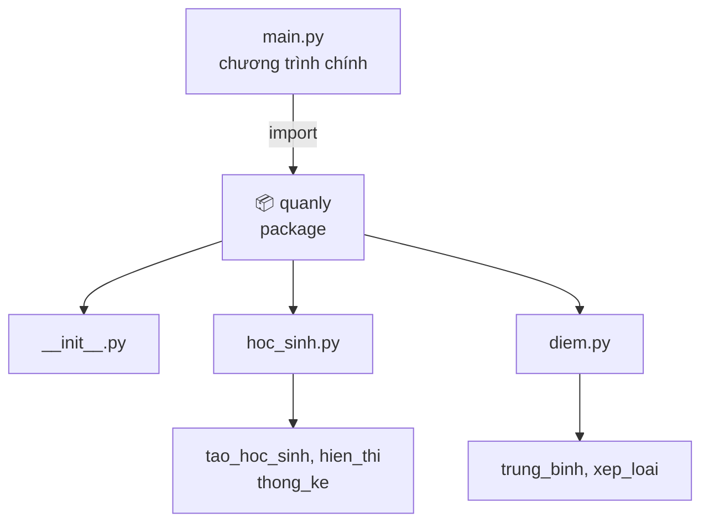

# 📦 Bài 21: Package Trong Python

> 🎓 **Chương 6 – Tổ chức mã nguồn: Module, Package và File**

---

## 🎯 Mục tiêu

Sau bài học này, học viên sẽ:

* ✅ Hiểu **package là gì** và khác gì so với **module** đã học ở Bài 20.
* ✅ Biết vai trò của file đặc biệt **`__init__.py`** trong mỗi package.
* ✅ **Tự tạo được package** `quanly` gồm `hoc_sinh.py` và `diem.py`.
* ✅ Thành thạo **4 cách import** dữ liệu từ package.
* ✅ Hiểu được **lợi ích** của package khi dự án ngày càng lớn.
* ✅ Nắm được **cấu trúc thư mục chuẩn** của một dự án Python.

---

## 📖 Kiến thức

### 1. Nhắc lại Bài 20 — Module

Ở **Bài 20**, chúng ta học được: **module = một file `.py`** chứa hàm, biến, class. Muốn dùng lại thì `import`:

```python
# main.py — dùng module tien_ich.py cùng thư mục
import tien_ich

print(tien_ich.dien_tich_hinh_tron(5))   # 78.53975
```

Nhưng dự án càng lớn, số module càng nhiều: `hoc_sinh.py`, `diem.py`, `tinh_toan.py`, `xep_loai.py`... tất cả nằm chung một thư mục sẽ **rối như một ngăn bàn nhét đầy giấy tờ**. Vì thế Python có **package** — chiếc "ngăn kéo" để sắp xếp các module gọn gàng.

### 2. Package là gì?

> 💬 **Nói đơn giản:** Package là **một thư mục** chứa các module (file `.py`) và một file đặc biệt tên là **`__init__.py`**.

> 🏠 **Ví dụ đời thực:** Một **ngôi trường** gồm nhiều **khối lớp**: khối 10, khối 11, khối 12. Mỗi khối có nhiều **phòng học** (module). Nếu đặt 30 phòng học nằm lộn xộn ở sân trường thì không ai tìm được lớp — nhưng chia theo khối, theo tầng thì vô cùng rõ ràng. Package chính là "khối/tầng nhà", module là "phòng học".

**So sánh Module và Package:**

| | 📄 Module | 📦 Package |
|---|---|---|
| Là gì | Một file `.py` | Một **thư mục** chứa nhiều module |
| Điều kiện | Chỉ cần tên file `.py` | Chứa file `__init__.py` |
| Ví dụ | `hoc_sinh.py`, `diem.py` | `quanly/` chứa `hoc_sinh.py`, `diem.py` |
| Vai trò | Một bộ phận chức năng | Gom nhóm các bộ phận cùng chủ đề |

### 3. File `__init__.py` — "chìa khóa" của package

Mỗi package **phải** có file `__init__.py` để Python nhận diện "đây là một package, không phải thư mục tầm thường". File này có 3 vai trò:

* 🗝️ **Đánh dấu**: giúp Python biết thư mục đó là package.
* ⚙️ **Khởi tạo**: code trong `__init__.py` sẽ **chạy tự động** khi bạn import package — có thể để trống hoặc đặt biến chung ở đây.
* 🚪 **Mặt tiền**: nơi xuất những thứ "chính chủ" của package ra ngoài.

> 💡 Từ Python 3.3, thư mục thiếu `__init__.py` vẫn import được (gọi là *namespace package*), nhưng **người mới nên luôn tạo** `__init__.py` để rõ ràng và tương thích mọi phiên bản.

### 4. Cấu trúc package chuẩn



Cây thư mục cụ thể:

```
du_an/
├── main.py            ← file chạy chính, nằm cùng cấp với package
└── quanly/            ← package
    ├── __init__.py
    ├── hoc_sinh.py
    └── diem.py
```

### 5. Tạo package `quanly` — làm từng bước

**Bước 1:** Tạo thư mục tên `quanly`.

**Bước 2:** Trong thư mục đó, tạo file trống `__init__.py`:

```python
# __init__.py — file đặc biệt đánh dấu thư mục này là package
```

**Bước 3:** Tạo file `hoc_sinh.py`:

```python
# hoc_sinh.py — quản lý thông tin học sinh (dùng hàm, bài 23 mới học class)

def tao_hoc_sinh(ten, lop):
    """Tạo một học sinh dạng dict."""
    return {"ten": ten, "lop": lop}

def hien_thi(hs):
    """In thông tin một học sinh ra màn hình."""
    print(f"- {hs['ten']} (lớp {hs['lop']})")
```

**Bước 4:** Tạo file `diem.py`:

```python
# diem.py — xử lý điểm số

def trung_binh(danh_sach_diem):
    """Tính điểm trung bình của một danh sách điểm."""
    if len(danh_sach_diem) == 0:
        return 0.0
    return sum(danh_sach_diem) / len(danh_sach_diem)

def xep_loai(diem_tb):
    """Xếp loại theo điểm trung bình."""
    if diem_tb >= 8.0:
        return "Gioi"
    if diem_tb >= 6.5:
        return "Kha"
    if diem_tb >= 5.0:
        return "Trung binh"
    return "Yeu"
```

**Bước 5:** Tạo file `main.py` **cùng cấp** với thư mục `quanly` (không nằm trong) và chạy thử.

### 6. Các cách import từ package

| Cách viết | Cách gọi hàm | Khi nào dùng |
|---|---|---|
| `import quanly.hoc_sinh` | `quanly.hoc_sinh.tao_hoc_sinh(...)` | Muốn rõ nguồn gốc 100% |
| `from quanly import hoc_sinh` | `hoc_sinh.tao_hoc_sinh(...)` | Gõ ngắn, thường dùng nhất |
| `from quanly.hoc_sinh import tao_hoc_sinh` | `tao_hoc_sinh(...)` | Chỉ cần 1–2 hàm |
| `import quanly.hoc_sinh as hs` | `hs.tao_hoc_sinh(...)` | Đặt bí danh ngắn |

> ⚠️ **Lưu ý quan trọng:** Lệnh `import quanly` **không tự động** nạp các module con. Muốn dùng `hoc_sinh` thì phải import rõ tên module con: `import quanly.hoc_sinh` hoặc `from quanly import hoc_sinh`.

### 7. Lợi ích của package

| Lợi ích | Giải thích dễ hiểu |
|---|---|
| 🗂️ **Tổ chức rõ ràng** | Module cùng chủ đề nằm chung một nơi, dễ tìm như tủ hồ sơ |
| 🆔 **Tránh trùng tên** | Hai package khác nhau có thể cùng tên hàm `trung_binh` mà không đụng nhau |
| ♻️ **Tái sử dụng** | Copy cả thư mục package sang dự án khác là dùng được ngay |
| 👥 **Làm việc nhóm** | Mỗi người đảm trách một package, không ai sửa của ai |
| 🔍 **Dễ bảo trì** | Sửa chức năng chỉ cần sửa đúng file bên trong package |

### 8. Cấp bậc thư mục chuẩn của dự án Python

Một dự án Python thực tế thường phân cấp như sau:

```
du_an/
├── main.py                # điểm vào — người dùng chạy file này
├── quanly/                # package chính (chức năng cốt lõi)
│   ├── __init__.py
│   ├── hoc_sinh.py
│   └── diem.py
├── tien_ich/              # package phụ trợ (dùng chung)
│   ├── __init__.py
│   ├── tinh_toan.py
│   └── chuoi.py
├── data/                  # thư mục dữ liệu (Bài 22 sẽ đọc/ghi file)
└── README.md              # mô tả dự án
```

**Quy tắc vàng:** file chạy chính (`main.py`) đặt **cùng cấp** với các package và chỉ import package, không import lung tung.

---

## 💡 Ví dụ minh họa

### Ví dụ 1: Sử dụng package `quanly` vừa tạo

File `main.py`:

```python
# main.py — chạy chương trình chính
import quanly.hoc_sinh   # Cách 1: import cả module con
from quanly import diem  # Cách 2: import module con

# Tạo một học sinh
hs1 = quanly.hoc_sinh.tao_hoc_sinh("Nguyen Van An", "10A1")
quanly.hoc_sinh.hien_thi(hs1)

# Tính điểm trung bình và xếp loại
diem_toan = 8.5
diem_van = 7.0
diem_anh = 9.0
tb = diem.trung_binh([diem_toan, diem_van, diem_anh])
print("Diem trung binh:", tb, "-> Xep loai:", diem.xep_loai(tb))
```

Kết quả chạy:

```
- Nguyen Van An (lớp 10A1)
Diem trung binh: 8.166666666666666 -> Xep loai: Gioi
```

**Giải thích từng dòng:**

| Dòng code | Ý nghĩa |
|---|---|
| `import quanly.hoc_sinh` | Nạp module con, gọi qua tên đầy đủ `quanly.hoc_sinh.hien_thi(...)` |
| `from quanly import diem` | Nạp module con `diem`, gọi ngắn gọn `diem.trung_binh(...)` |
| `quanly.hoc_sinh.tao_hoc_sinh(...)` | Gọi hàm nằm trong package — dấu chấm phân cấp từng cấp |
| `diem.trung_binh([...])` | Truyền list điểm cho hàm tính trung bình |

### Ví dụ 2: `__init__.py` làm "mặt tiền" của package

Sửa `__init__.py` để người dùng package chỉ cần **một câu import**:

```python
# __init__.py — mặt tiền: xuất sẵn những hàm hay dùng nhất
from .hoc_sinh import tao_hoc_sinh, hien_thi
from .diem import trung_binh, xep_loai

TEN_PHAN_MEM = "Quan ly hoc sinh v1.0"
```

Khi đó `main.py`:

```python
# main.py — import gọn từ chính package
import quanly
from quanly import tao_hoc_sinh, xep_loai

print(quanly.TEN_PHAN_MEM)              # dùng biến trong __init__.py
hs = tao_hoc_sinh("Tran Thi Mai", "11B2")
print("Diem 7.5 ->", xep_loai(7.5))
```

**Giải thích từng dòng:**

| Dòng code | Ý nghĩa |
|---|---|
| `from .hoc_sinh import ...` | Dấu `.` nghĩa là "import từ **chính package này**" (import tương đối) |
| `TEN_PHAN_MEM = ...` | Biến chung đặt trong `__init__.py`, mọi nơi đọc qua `quanly.TEN_PHAN_MEM` |
| `import quanly` | Giờ chỉ cần import package là đã có mọi thứ được xuất ra |

### Ví dụ 3: Package con (package lồng package)

Tạo thư mục `quanly/giaovu/` — bên trong đặt thêm `__init__.py` và `lop_hoc.py`:

```python
# lop_hoc.py — bên trong quanly/giaovu/
def danh_sach_lop():
    """Trả về danh sách lớp của trường."""
    return ["10A1", "10A2", "11B1"]
```

File `main.py` gọi bằng đường dẫn đầy đủ từng cấp:

```python
# main.py — gọi package con bằng nhiều cấp
from quanly.giaovu import lop_hoc

for ten_lop in lop_hoc.danh_sach_lop():
    print("Lop:", ten_lop)
```

**Giải thích từng dòng:**

| Dòng code | Ý nghĩa |
|---|---|
| `from quanly.giaovu import lop_hoc` | Dấu chấm đi qua từng cấp: package `quanly` → package con `giaovu` → module `lop_hoc` |
| `for ten_lop in ...` | Duyệt list trả về từ hàm trong module con |

---

## 🔬 Ví dụ nâng cao

### Ví dụ 1: Chương trình quản lý điểm bằng package `quanly`

Tạo 3 học sinh, nhập điểm 3 môn, tính điểm trung bình và xếp loại từng bạn, in bảng tổng hợp:

```python
# main.py — dùng toàn bộ package quanly
import quanly.hoc_sinh as hs_mod
from quanly import diem

# Dữ liệu mẫu: ten, lop, diem 3 mon
danh_sach = [
    {"ten": "Nguyen Van An", "lop": "10A1", "diem": [8.5, 7.0, 9.0]},
    {"ten": "Tran Thi Mai", "lop": "10A1", "diem": [6.0, 6.5, 7.0]},
    {"ten": "Le Quang Binh", "lop": "10A2", "diem": [4.5, 5.0, 5.5]},
]

print("=== BANG DIEM LOP 10 ===")
for hs in danh_sach:
    tb = diem.trung_binh(hs["diem"])
    loai = diem.xep_loai(tb)
    print(f"{hs['ten']:<20} TB: {tb:<6.2f} -> {loai}")
```

Kết quả:

```
=== BANG DIEM LOP 10 ===
Nguyen Van An       TB: 8.17  -> Gioi
Tran Thi Mai        TB: 6.50  -> Kha
Le Quang Binh       TB: 5.00  -> Trung binh
```

### Ví dụ 2: Tránh trùng tên giữa hai package

Hai package độc lập `diem` và `danh_gia` đều có hàm `xep_loai` nhưng **không xung đột**:

```python
# diem/xep_loai.py  ->  def xep_loai(tb): chia theo thang điểm 10
# danh_gia/xep_loai.py -> def xep_loai(tb): đánh giá "Tot"/"Chua tot" theo thang 100

from diem import xep_loai as xep_loai_diem
from danh_gia import xep_loai as xep_loai_danh_gia

print(xep_loai_diem(8.0))          # Gioi
print(xep_loai_danh_gia(80))       # Tot
```

> 💡 Dùng `as` để đặt bí danh cho **hàm** cũng được — đây là cách xử lý trùng tên khéo léo nhất.

---

## ⚠️ Lỗi thường gặp

### Lỗi 1: `ModuleNotFoundError: No module named 'quanly'`

```python
import quanly   # ❌ báo lỗi
```

* **Nguyên nhân:** File `main.py` **không nằm cùng cấp** với thư mục `quanly`, hoặc thư mục chưa có `__init__.py`, hoặc gõ sai tên.
* **Cách sửa:** Kiểm tra cây thư mục: `main.py` và `quanly/` phải cùng một thư mục cha; đảm bảo có `__init__.py` bên trong `quanly/`.

### Lỗi 2: `AttributeError: module 'quanly' has no attribute 'hoc_sinh'`

```python
import quanly
quanly.hoc_sinh.tao_hoc_sinh("An", "10A1")   # ❌ báo AttributeError
```

* **Nguyên nhân:** `import quanly` chỉ nạp `__init__.py`, **không nạp** module con `hoc_sinh`.
* **Cách sửa:** Import đầy đủ: `import quanly.hoc_sinh` hoặc `from quanly import hoc_sinh`.

### Lỗi 3: `ImportError: cannot import name 'trung_binh' from 'quanly'`

```python
from quanly import trung_binh   # ❌ trung_binh nằm trong quanly.diem
```

* **Nguyên nhân:** Hàm nằm trong module con `diem.py`, không nằm trực tiếp trong package.
* **Cách sửa:** `from quanly.diem import trung_binh`, hoặc chủ động xuất hàm đó ra trong `__init__.py`.

### Lỗi 4: Quên mất `if __name__ == "__main__"` trong module con

```python
# hoc_sinh.py
print("Hoc sinh module dang chay!")   # ❌ in ra mỗi lần bị import
```

* **Nguyên nhân:** Code chạy thử viết thẳng trong module con nên bị chạy lại mỗi lần import.
* **Cách sửa:** Bọc phần chạy thử trong `if __name__ == "__main__":` (đã học Bài 20).

---

## 💎 Mẹo

* 📁 **Một package = một chủ đề lớn** (quản lý, tiện ích, dữ liệu...) — đừng gom tất cả vào một package "vạn năng".
* 🏷️ Đặt tên package **chữ thường, ngắn gọn**: `quanly`, `tien_ich`, `ngan_hang` — không dùng dấu gạch ngang.
* 🚪 Giữ `__init__.py` **gọn nhẹ**: chỉ xuất những thứ "chính chủ", tránh code xử lý nặng nề.
* 🔍 Sau khi import, gõ `dir(quanly)` hoặc `quanly.__dict__` để xem package chứa gì.
* 📚 Khi copy dự án cho người khác, copy **cả thư mục package** — đó là "gói hàng" hoàn chỉnh.

---

## 📝 Tóm tắt

| Khái niệm | Nội dung |
|---|---|
| 📦 Package | Thư mục chứa module + file `__init__.py` |
| 🗝️ `__init__.py` | Đánh dấu package; code trong đó chạy khi import |
| 🔗 Import | `import quanly.hoc_sinh`, `from quanly import hoc_sinh`, `from quanly.hoc_sinh import tao_hoc_sinh`, `import ... as ...` |
| ⚠️ Lưu ý | `import quanly` không tự nạp module con |
| 🗂️ Lợi ích | Tổ chức rõ ràng, tránh trùng tên, tái sử dụng, làm việc nhóm |
| 🌳 Cấp thư mục | `main.py` cùng cấp với các package; package con nằm lồng trong package cha |

---

## 🧪 Kiểm tra nhanh

1. ❓ Package khác module ở điểm nào?
2. ❓ File nào bắt buộc phải có trong một package?
3. ❓ `import quanly` có nạp sẵn `quanly.hoc_sinh` không?
4. ❓ Viết lệnh import để gọi thẳng hàm `xep_loai` nằm trong `quanly/diem.py`.
5. ❓ Dấu chấm `.` trong `from .diem import trung_binh` có nghĩa gì?
6. ❓ Hai package có thể có cùng tên hàm không? Vì sao?
7. ❓ File chạy chính `main.py` nên đặt ở đâu so với package?
8. ❓ Code trong `__init__.py` chạy khi nào?
9. ❓ Nếu gọi `quanly.hoc_sinh` sau lệnh `import quanly` thì gặp lỗi gì?
10. ❓ Nêu 2 cách xử lý khi hai package có hàm trùng tên.

<details>
<summary>🔍 Xem đáp án</summary>

1. Module là một file `.py`; package là thư mục chứa nhiều module và có `__init__.py`.
2. File `__init__.py`.
3. Không — cần `import quanly.hoc_sinh` hoặc `from quanly import hoc_sinh`.
4. `from quanly.diem import xep_loai`.
5. Import từ chính package hiện tại (import tương đối).
6. Có — vì gọi qua tên package nên không xung đột.
7. Cùng cấp (cùng thư mục cha) với các package.
8. Khi package được import.
9. `AttributeError: module 'quanly' has no attribute 'hoc_sinh'`.
10. Dùng `as` đặt bí danh, hoặc gọi đầy đủ tên package.

</details>

---

## 📚 Bài đọc thêm

* [Python.org – Packages](https://docs.python.org/3/tutorial/modules.html#packages)
* [Python.org – The import system](https://docs.python.org/3/reference/import.html)
* [Real Python – Python Modules and Packages](https://realpython.com/python-modules-packages/)
* [PEP 8 – đặt tên module và package](https://peps.python.org/pep-0008/#package-and-module-names)

---

## 🏁 Kết thúc bài

🎉 Bạn đã biết tổ chức các module thành **package** gọn gàng. Nhưng dữ liệu vẫn đang **sống trong bộ nhớ** — tắt máy là mất! Bài kế tiếp sẽ dạy bạn **đọc và ghi file** để lưu trữ dữ liệu lâu dài:

👉 **[Bài 22: Đọc Và Ghi File](../22_File/bai_giang.md)**
