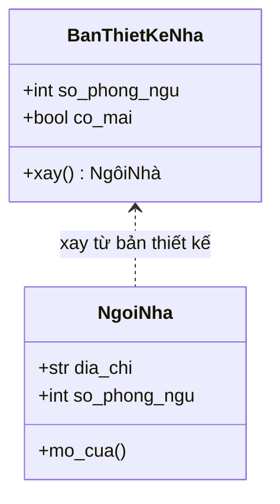
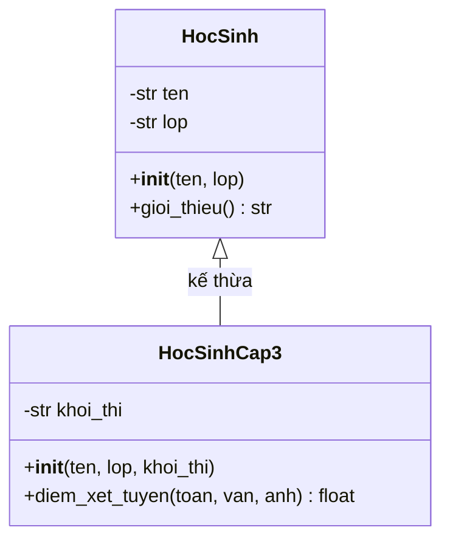

# 🏗️ Bài 23: Lập Trình Hướng Đối Tượng (OOP)

> 🎓 **Chương 7 – Lập trình hướng đối tượng**

---

## 🎯 Mục tiêu

Sau bài học này, học viên sẽ:

* ✅ Hiểu **class là gì**, **đối tượng là gì** — khác nhau như bản thiết kế và ngôi nhà.
* ✅ Biết khai báo class với **thuộc tính** (biến) và **phương thức** (hàm).
* ✅ Sử dụng thành thạo **`__init__`** và **`self`**.
* ✅ Viết **`__str__`** để in đối tượng đẹp mắt.
* ✅ Phân biệt rõ **lập trình thủ tục** và **hướng đối tượng** qua bảng so sánh.
* ✅ Dùng được **kế thừa** với `super()` và **ghi đè phương thức**.
* ✅ Hiểu **đóng gói** với dấu `_` và làm quen **`@classmethod` / `@staticmethod`**.

---

## 📖 Kiến thức

### 1. Nhắc lại Bài 22 — điểm yếu của cách cũ

Ở **Bài 22**, mỗi học sinh là một dict: `{"ten": ..., "lop": ..., "diem": [...]}`. Vấn đề:

* 😵 Tên khóa phải gõ lại mỗi lần: `hs["ten"]`, `hs["lop"]` — dễ gõ sai.
* 🧯 Mọi thao tác (tính TB, xếp loại, in) đều là hàm **tách rời** dữ liệu.
* 📦 Dữ liệu và hành vi "ở hai nơi" — như bánh xe và động cơ để riêng, muốn chạy phải tự lắp.

**OOP (Object-Oriented Programming)** giải quyết bằng cách **gói dữ liệu và hành vi vào một "vật thể" duy nhất** gọi là đối tượng.

### 2. Class và đối tượng

> 💬 **Nói đơn giản:** **Class (lớp)** là **bản thiết kế**; **đối tượng (object)** là **sản phẩm** làm ra từ bản thiết kế đó.

> 🏠 **Ví dụ đời thực:** Bản vẽ thiết kế một ngôi nhà: mô tả "ngôi nhà có mái, 2 phòng ngủ, 1 phòng khách" — đó là **class**. Căn nhà thật mà bạn **xây lên từ bản vẽ** — đó là **đối tượng**. Từ MỘT bản vẽ có thể xây HÀNG TRĂM ngôi nhà khác nhau!



Trong Python:

```python
class NgoiNha:
    def __init__(self, dia_chi, so_phong_ngu):
        self.dia_chi = dia_chi
        self.so_phong_ngu = so_phong_ngu

nha_cua_an = NgoiNha("12 Nguyen Hue", 2)   # một đối tượng từ class
nha_cua_mai = NgoiNha("45 Le Loi", 3)      # đối tượng thứ hai
```

### 3. Cú pháp khai báo class

```python
class TenLop:          # quy ước: tên class viết HOA chữ đầu mỗi từ
    """Docstring mô tả class."""
    pass
```

**Ví dụ thật — class HocSinh:**

```python
class HocSinh:
    """Bản thiết kế của một học sinh."""

    def __init__(self, ten, lop):
        self.ten = ten      # thuộc tính: biến gắn với từng đối tượng
        self.lop = lop

    def gioi_thieu(self):
        """Phương thức: hành vi của đối tượng."""
        print(f"Toi la {self.ten}, hoc lop {self.lop}.")
```

* **Thuộc tính** (attribute): biến của đối tượng — mô tả "đối tượng CÓ gì".
* **Phương thức** (method): hàm của đối tượng — mô tả "đối tượng LÀM được gì".

### 4. `__init__` và `self` — hai "nhân vật" quan trọng nhất

| Thành phần | Vai trò |
|---|---|
| `__init__` | **Hàm khởi tạo** — tự động chạy khi tạo đối tượng, dùng để "nạp nguyên liệu ban đầu" |
| `self` | **Chính đối tượng đang làm việc** — giúp phương thức truy cập thuộc tính của đúng đối tượng đó |

```python
hs = HocSinh("An", "10A1")
# Khi chạy dòng trên, Python gọi:  HocSinh.__init__(hs, "An", "10A1")
#                                   └─ self = hs
```

> 💡 `self` không cần bạn truyền vào — Python tự động đưa đối tượng đang gọi vào vị trí đầu tiên. Nhưng khi **định nghĩa** phương thức, `self` phải nằm ở tham số đầu tiên, nếu không chương trình báo lỗi!

### 5. `__str__` — "chân dung" của đối tượng

Mặc định `print(hs)` in ra thứ xấu xí: `<__main__.HocSinh object at 0x...>`. Phương thức đặc biệt `__str__` cho phép bạn quy định **đối tượng hiển thị như thế nào**:

```python
class HocSinh:
    def __init__(self, ten, lop, diem_tb):
        self.ten = ten
        self.lop = lop
        self.diem_tb = diem_tb

    def __str__(self):
        """Khi in đối tượng, Python gọi hàm này."""
        return f"Hoc sinh: {self.ten} - lop {self.lop} - TB {self.diem_tb}"

hs = HocSinh("An", "10A1", 8.5)
print(hs)   # Hoc sinh: An - lop 10A1 - TB 8.5
```

### 6. Thủ tục vs Hướng đối tượng — bảng so sánh

| Tiêu chí | 🔧 Lập trình thủ tục (đã học) | 🏗️ Hướng đối tượng (bài này) |
|---|---|---|
| Trọng tâm | **Hàm** làm việc với biến | **Đối tượng** gói dữ liệu + hành vi |
| Dữ liệu | Biến, list, dict rời rạc | Thuộc tính bên trong class |
| Hành vi | Hàm độc lập, phải truyền dữ liệu vào | Phương thức tự truy cập dữ liệu qua `self` |
| Ví dụ | `xep_loai(diem)` — đưa điểm vào hàm | `hs.xep_loai()` — đối tượng tự xếp loại |
| Tái sử dụng | Copy hàm | Kế thừa từ class cha |
| Dễ mở rộng | Phải sửa nhiều hàm | Thêm class mới không đụng code cũ |
| Phù hợp | Script nhỏ, tính toán | Hệ thống lớn: game, app, phần mềm quản lý |

```python
# THỦ TỤC: dữ liệu và hành vi tách rời
hs = {"ten": "An", "lop": "10A1", "diem": 8.5}
def xep_loai(diem):
    return "Gioi" if diem >= 8 else "Kha"
print(xep_loai(hs["diem"]))

# HƯỚNG ĐỐI TƯỢNG: mọi thứ nằm trong một đối tượng
class HocSinh:
    def __init__(self, ten, lop, diem):
        self.ten = ten
        self.lop = lop
        self.diem = diem
    def xep_loai(self):
        return "Gioi" if self.diem >= 8 else "Kha"

hs = HocSinh("An", "10A1", 8.5)
print(hs.xep_loai())
```

### 7. Kế thừa — con thừa hưởng của cha

> 💬 **Kế thừa:** Tạo **class mới** từ **class có sẵn** — class mới có **tất cả** thuộc tính/phương thức của class cũ, và có thể **thêm thứ riêng**.

> 🏫 **Ví dụ đời thực:** "Học sinh" là chung. "Học sinh cấp 3" cũng là học sinh (có tên, có lớp, biết giới thiệu) nhưng **thêm** khối thi, điểm xét tuyển. Ta không cần viết lại từ đầu — chỉ cần **kế thừa**.



```python
class HocSinh:                       # class cha
    def __init__(self, ten, lop):
        self.ten = ten
        self.lop = lop

    def gioi_thieu(self):
        print(f"Toi la {self.ten}, hoc lop {self.lop}.")

class HocSinhCap3(HocSinh):          # (HocSinh) = kế thừa từ HocSinh
    def __init__(self, ten, lop, khoi_thi):
        super().__init__(ten, lop)   # gọi __init__ của class cha
        self.khoi_thi = khoi_thi     # thêm thuộc tính riêng

    def diem_xet_tuyen(self, toan, van, anh):
        return (toan + van + anh) / 3

hs = HocSinhCap3("Mai", "12A1", "A1")
hs.gioi_thieu()                      # ✅ thừa hưởng phương thức của cha
print(hs.diem_xet_tuyen(8, 7, 9))    # ✅ dùng được tính năng riêng
```

**`super()`** = "người đại diện của class cha" — giúp gọi `__init__` của cha để **không phải gõ lại** những thuộc tính chung.

### 8. Ghi đè phương thức (override)

Class con muốn phương thức **hành xử khác** cha — chỉ cần **định nghĩa lại cùng tên**:

```python
class HocSinh:
    def __init__(self, ten, lop):
        self.ten = ten
        self.lop = lop

    def mo_ta(self):
        return f"Toi la hoc sinh {self.ten} lop {self.lop}."

class HocSinhGioi(HocSinh):
    def mo_ta(self):                     # ghi đè: cùng tên, nội dung mới
        return f"Toi la {self.ten}, mot hoc sinh gioi cua lop {self.lop}!"

hs1 = HocSinh("An", "10A1")
hs2 = HocSinhGioi("Mai", "10A1")
print(hs1.mo_ta())   # Toi la hoc sinh An lop 10A1.
print(hs2.mo_ta())   # Toi la Mai, mot hoc sinh gioi cua lop 10A1!
```

### 9. Đóng gói — "tài sản riêng" của đối tượng

> 💬 **Đóng gói:** Giấu chi tiết nội bộ, chỉ cho phép thay đổi qua phương thức — giống cây ATM: bạn chỉ nhấn nút nạp/rút, không thò tay vào máy để lấy tiền trực tiếp.

Python không cấm cứng như Java/C++, nhưng có **quy ước dấu gạch dưới**:

| Viết | Ý nghĩa |
|---|---|
| `self.ten` | Thuộc tính công khai — ai cũng dùng được |
| `self._so_du` | **Một gạch dưới** — "nội bộ, đừng động vào" (chỉ là quy ước) |
| `self.__mat_khau` | **Hai gạch dưới** — Python "bẻ tên" thật sự, truy cập trực tiếp sẽ lỗi |

```python
class BankAccount:
    def __init__(self, so_du):
        self._so_du = so_du          # quy ước: thuộc tính nội bộ

    def nap_tien(self, tien):
        if tien > 0:
            self._so_du += tien

    def xem_so_du(self):
        return self._so_du

tk = BankAccount(1000000)
tk.nap_tien(50000)                   # thay đổi qua phương thức — an toàn
print(tk.xem_so_du())                # 1050000
# tk._so_du = -999999                # ❌ không nên làm: phá vỡ quy ước
```

### 10. `@classmethod` và `@staticmethod` — giới thiệu

Hai loại phương thức đặc biệt **không cần đối tượng**:

| Loại | Tham số đầu tiên | Ý nghĩa |
|---|---|---|
| Phương thức thường | `self` | Làm việc với **đối tượng cụ thể** |
| `@classmethod` | `cls` | Làm việc với **cả class** — thường dùng để tạo đối tượng kiểu khác |
| `@staticmethod` | không có | "Hàm tiện ích" đặt trong class, không cần đối tượng cũng không cần class |

```python
class SanPham:
    THUE = 0.1                          # thuế chung cho MỌI sản phẩm

    def __init__(self, ten, gia):
        self.ten = ten
        self.gia = gia

    @classmethod
    def doi_thue(cls, thue_moi):        # cls = chính class SanPham
        cls.THUE = thue_moi

    @staticmethod
    def tinh_gia_sau_thue(gia):
        """Tiện ích: cộng thuế vào giá — không cần đối tượng."""
        return round(gia * (1 + SanPham.THUE), 2)

print(SanPham.tinh_gia_sau_thue(100000))    # 110000.0
SanPham.doi_thue(0.05)                       # đổi thuế cho cả class
print(SanPham.tinh_gia_sau_thue(100000))    # 105000.0
```

---

## 💡 Ví dụ minh họa

### Ví dụ 1: Class HocSinh cơ bản

```python
class HocSinh:
    """Bản thiết kế học sinh."""

    def __init__(self, ten, lop, diem_tb):
        self.ten = ten          # thuộc tính: tên
        self.lop = lop          # thuộc tính: lớp
        self.diem_tb = diem_tb  # thuộc tính: điểm trung bình

    def xep_loai(self):
        """Xếp loại theo điểm trung bình."""
        if self.diem_tb >= 8.0:
            return "Gioi"
        if self.diem_tb >= 6.5:
            return "Kha"
        if self.diem_tb >= 5.0:
            return "Trung binh"
        return "Yeu"

# Tạo 2 đối tượng từ cùng một class
an = HocSinh("Nguyen Van An", "10A1", 8.5)
mai = HocSinh("Tran Thi Mai", "10A1", 6.2)

print(f"{an.ten}: {an.xep_loai()}")   # Nguyen Van An: Gioi
print(f"{mai.ten}: {mai.xep_loai()}") # Tran Thi Mai: Trung binh
```

**Giải thích từng dòng:**

| Dòng code | Ý nghĩa |
|---|---|
| `class HocSinh:` | Khai báo class — tên viết hoa chữ cái đầu |
| `def __init__(self, ten, lop, diem_tb):` | Hàm khởi tạo — chạy tự động khi tạo đối tượng |
| `self.ten = ten` | Gán tham số vào thuộc tính của **đối tượng cụ thể** |
| `def xep_loai(self):` | Phương thức — tự đọc `self.diem_tb`, không cần truyền từ ngoài |
| `an = HocSinh(...)` | Tạo đối tượng `an` — tự động gọi `__init__(an, ...)` |

### Ví dụ 2: `__str__` làm đối tượng "nói chuyện"

```python
class ATM:
    """Máy ATM đơn giản."""

    def __init__(self, so_du):
        self.so_du = so_du

    def nap(self, tien):
        self.so_du += tien

    def rut(self, tien):
        if tien > self.so_du:
            print("Khong du tien!")
            return False
        self.so_du -= tien
        return True

    def __str__(self):
        return f"So du hien tai: {self.so_du} VND"

may_1 = ATM(500000)
may_1.nap(200000)
may_1.rut(100000)
print(may_1)                # So du hien tai: 600000 VND — nhờ __str__
```

**Giải thích từng dòng:**

| Dòng code | Ý nghĩa |
|---|---|
| `def nap(self, tien):` | Phương thức nạp — cập nhật `self.so_du` |
| `if tien > self.so_du:` | Kiểm tra đủ tiền trước khi rút — "bảo vệ" tài sản |
| `return False` | Tín hiệu rút thất bại cho chỗ gọi |
| `def __str__(self):` | Python tự gọi khi `print(may_1)` — không còn in địa chỉ bộ nhớ |

### Ví dụ 3: Kế thừa + ghi đè

```python
class Xe:
    """Xe nói chung."""

    def __init__(self, ten, gia):
        self.ten = ten
        self.gia = gia

    def mo_ta(self):
        return f"Xe {self.ten}, gia {self.gia} trieu."

class XeDien(Xe):
    """Xe điện — kế thừa Xe, thêm pin."""

    def __init__(self, ten, gia, pin_km):
        super().__init__(ten, gia)      # dùng __init__ của cha
        self.pin_km = pin_km

    def mo_ta(self):                    # ghi đè phương thức cha
        return f"Xe dien {self.ten}, gia {self.gia} trieu, di duoc {self.pin_km} km/sac."

xe = Xe("Vision", 40)
xe_dien = XeDien("VinFast Evo", 30, 200)
print(xe.mo_ta())
print(xe_dien.mo_ta())
```

**Giải thích từng dòng:**

| Dòng code | Ý nghĩa |
|---|---|
| `class XeDien(Xe):` | Kế thừa — XeDien có toàn bộ "tài sản" của Xe |
| `super().__init__(ten, gia)` | Gọi hàm khởi tạo của cha để gán 2 thuộc tính chung |
| `self.pin_km = pin_km` | Thêm thuộc tính riêng của con |
| `def mo_ta(self):` (trong XeDien) | Ghi đè — cùng tên hàm nhưng hành xử khác |

---

## 🔬 Ví dụ nâng cao

### Ví dụ 1: Hệ thống quản lý học sinh bằng OOP

```python
class HocSinh:
    """Học sinh với danh sách điểm 3 môn."""

    def __init__(self, ten, lop, diem):
        self.ten = ten
        self.lop = lop
        self.diem = diem              # list 3 điểm

    def tinh_tb(self):
        return sum(self.diem) / len(self.diem)

    def xep_loai(self):
        tb = self.tinh_tb()
        if tb >= 8.0:
            return "Gioi"
        if tb >= 6.5:
            return "Kha"
        if tb >= 5.0:
            return "Trung binh"
        return "Yeu"

    def __str__(self):
        return f"{self.ten:<20} TB: {self.tinh_tb():.2f} - {self.xep_loai()}"

class LopHoc:
    """Lớp học quản lý nhiều học sinh."""

    def __init__(self, ten_lop):
        self.ten_lop = ten_lop
        self.danh_sach = []           # list chứa đối tượng HocSinh

    def them(self, hs):
        self.danh_sach.append(hs)

    def in_bang_diem(self):
        print(f"=== BANG DIEM LOP {self.ten_lop} ===")
        for hs in self.danh_sach:
            print(hs)

# Sử dụng
lop_10a1 = LopHoc("10A1")
lop_10a1.them(HocSinh("Nguyen Van An", "10A1", [8.5, 7.0, 9.0]))
lop_10a1.them(HocSinh("Tran Thi Mai", "10A1", [6.0, 6.5, 7.0]))
lop_10a1.them(HocSinh("Le Quang Binh", "10A1", [4.5, 5.0, 5.5]))
lop_10a1.in_bang_diem()
```

Kết quả:

```
=== BANG DIEM LOP 10A1 ===
Nguyen Van An       TB: 8.17 - Gioi
Tran Thi Mai        TB: 6.50 - Kha
Le Quang Binh       TB: 5.00 - Trung binh
```

> 💡 Chú ý: `LopHoc` chứa list **các đối tượng HocSinh** — gọi là *hợp thành (composition)*: lớp gồm nhiều học sinh.

### Ví dụ 2: BankAccount với đóng gói

```python
class BankAccount:
    """Tài khoản ngân hàng — số dư được bảo vệ."""

    def __init__(self, so_du_ban_dau, mat_khau):
        self._so_du = so_du_ban_dau    # nội bộ: không động vào trực tiếp
        self.__mat_khau = mat_khau     # khóa riêng: hai gạch dưới

    def nap_tien(self, tien):
        if tien > 0:
            self._so_du += tien
            print(f"Nap {tien} VND. So du moi: {self._so_du}")

    def rut_tien(self, tien):
        if tien > self._so_du:
            print("Khong du so du!")
        else:
            self._so_du -= tien
            print(f"Rut {tien} VND. So du con lai: {self._so_du}")

    def xem_so_du(self):
        """Cách hợp lệ duy nhất để xem số dư."""
        return self._so_du

tk = BankAccount(1000000, "1234")
tk.nap_tien(500000)
tk.rut_tien(300000)
print("So du:", tk.xem_so_du())
# tk.__mat_khau          # ❌ AttributeError — Python đã "bẻ tên" thuộc tính
```

### Ví dụ 3: Kế thừa hai tầng — nhân viên, giáo viên, giáo viên chủ nhiệm

```python
class NhanVien:
    def __init__(self, ten, ma_so):
        self.ten = ten
        self.ma_so = ma_so

    def gioi_thieu(self):
        return f"Nhan vien {self.ten} (MS: {self.ma_so})"

class GiaoVien(NhanVien):
    def __init__(self, ten, ma_so, mon):
        super().__init__(ten, ma_so)     # tầng 1: kế thừa NhanVien
        self.mon = mon

    def gioi_thieu(self):                # ghi đè tầng 1
        return f"Giao vien {self.ten} day mon {self.mon}"

class GiaoVienChuNhiem(GiaoVien):
    def __init__(self, ten, ma_so, mon, lop):
        super().__init__(ten, ma_so, mon)  # tầng 2: kế thừa GiaoVien
        self.lop = lop

    def gioi_thieu(self):                # ghi đè tầng 2
        return f"Giao vien chu nhiem lop {self.lop}: {self.ten} (mon {self.mon})"

gv = GiaoVienChuNhiem("Co Mai", "GV01", "Toan", "10A1")
print(gv.gioi_thieu())
```

Kết quả:

```
Giao vien chu nhiem lop 10A1: Co Mai (mon Toan)
```

> 💡 `super()` ở tầng 2 gọi `GiaoVien.__init__`, tầng đó lại gọi tiếp `NhanVien.__init__` — "cầu thang" kế thừa tự nối tiếp.

---

## ⚠️ Lỗi thường gặp

### Lỗi 1: Quên `self` khi khai báo phương thức

```python
class HocSinh:
    def __init__(self, ten):
        self.ten = ten
    def xep_loai():            # ❌ thiếu self
        return "Gioi"
```

* **Nguyên nhân:** Python tự truyền đối tượng vào vị trí đầu tiên; khai báo thiếu `self` làm lệch tham số.
* **Kết quả báo:** `TypeError: xep_loai() takes 0 positional arguments but 1 was given`.
* **Cách sửa:** `def xep_loai(self):`.

### Lỗi 2: Gọi phương thức mà quên dấu ngoặc

```python
hs = HocSinh("An", "10A1", 8.5)
print(hs.xep_loai)   # ❌ in ra "<bound method ...>" thay vì kết quả
```

* **Nguyên nhân:** Không có `()` nghĩa là bạn đang "nói về" hàm, chứ không gọi hàm.
* **Cách sửa:** `print(hs.xep_loai())` — đủ dấu ngoặc.

### Lỗi 3: Quên gọi `super().__init__()` trong class con

```python
class HocSinhCap3(HocSinh):
    def __init__(self, ten, lop, khoi_thi):
        self.khoi_thi = khoi_thi      # ❌ chưa gán ten, lop
```

* **Nguyên nhân:** Không gọi `super().__init__(ten, lop)` nên thuộc tính của cha chưa được tạo.
* **Kết quả báo:** `AttributeError: 'HocSinhCap3' object has no attribute 'ten'`.
* **Cách sửa:** Dòng đầu tiên của `__init__` con: `super().__init__(ten, lop)`.

### Lỗi 4: Nhầm thuộc tính class với thuộc tính đối tượng

```python
class SanPham:
    thue = 0.1      # thuộc tính của CLASS
    def __init__(self, ten):
        self.ten = ten   # thuộc tính của ĐỐI TƯỢNG
```

* **Nguyên nhân:** `SanPham.thue` chia sẻ cho mọi đối tượng; gán `sp.thue = 0.2` chỉ tạo thuộc tính mới cho riêng `sp`, không ảnh hưởng class.
* **Cách sửa:** Đổi thuế chung phải qua `@classmethod` như ví dụ ở phần Kiến thức.

### Lỗi 5: Tưởng `__ten` cấm hoàn toàn bên ngoài

* **Nguyên nhân:** Hai gạch dưới chỉ là *name mangling* — đổi tên thành `_TenLop__ten`, không phải bảo mật tuyệt đối.
* **Cách sửa:** Hiểu đúng bản chất: `_` và `__` là **quy ước/che giấu**, an toàn thực sự phụ thuộc thiết kế phương thức truy cập hợp lý.

---

## 💎 Mẹo

* 🏷️ Tên class viết hoa chữ đầu (`HocSinh`, `BankAccount`); tên phương thức/thuộc tính viết thường.
* 📦 **Một class = một khái niệm** — `HocSinh` không nên quản lý cả trường học; hãy tách `LopHoc`, `Truong`.
* 🧪 Viết `__str__` cho mọi class — in đối tượng để kiểm tra rất tiện.
* 🛡️ Thuộc tính nội bộ đặt `_` (một gạch); chỉ cho thay đổi qua phương thức.
* 🧬 Dùng kế thừa khi có quan hệ "là một" (`GiaoVien là NhanVien`); dùng hợp thành khi "có một" (`LopHoc có nhiều HocSinh`).
* 🔍 `dir(hs)` xem mọi thứ đối tượng có; `help(HocSinh)` xem tài liệu.

---

## 📝 Tóm tắt

| Khái niệm | Nội dung |
|---|---|
| 🏗️ Class | Bản thiết kế — gói thuộc tính + phương thức |
| 🧸 Đối tượng | Sản phẩm tạo từ class bằng `TenLop(...)` |
| ⚙️ `__init__` | Hàm khởi tạo, tự chạy khi tạo đối tượng |
| 🪞 `self` | Chính đối tượng đang gọi phương thức |
| 📜 `__str__` | Quy định cách in đối tượng |
| 🧬 Kế thừa | `class Con(Cha)`, `super().__init__(...)`, ghi đè bằng định nghĩa lại |
| 🔒 Đóng gói | `_ten` quy ước nội bộ; `__ten` name mangling |
| 🏷️ `@classmethod` / `@staticmethod` | Làm việc với class / hàm tiện ích không cần đối tượng |

---

## 🧪 Kiểm tra nhanh

1. ❓ Class và đối tượng khác nhau như thế nào?
2. ❓ `self` trong phương thức đại diện cho gì?
3. ❓ `__init__` chạy khi nào?
4. ❓ Phương thức `__str__` có tác dụng gì?
5. ❓ Viết cú pháp tạo class `Cho` kế thừa class `DongVat`.
6. ❓ `super().__init__(...)` dùng để làm gì?
7. ❓ Ghi đè phương thức nghĩa là gì?
8. ❓ `self._so_du` so với `self.so_du` khác gì nhau?
9. ❓ `@staticmethod` có tham số `self` không?
10. ❓ Kế thừa phù hợp với quan hệ nào: "là một" hay "có một"?

<details>
<summary>🔍 Xem đáp án</summary>

1. Class là bản thiết kế; đối tượng là sản phẩm cụ thể tạo từ bản thiết kế.
2. Chính đối tượng đang gọi phương thức.
3. Tự động chạy ngay khi tạo đối tượng (`TenLop(...)`).
4. Quy định cách đối tượng hiển thị khi in (`print(doi_tuong)`).
5. `class Cho(DongVat):`.
6. Gọi hàm khởi tạo (hoặc phương thức) của class cha để tái sử dụng.
7. Định nghĩa lại phương thức cùng tên trong class con với hành vi khác.
8. `_so_du` là quy ước thuộc tính nội bộ; `so_du` là thuộc tính công khai.
9. Không — staticmethod không cần `self` cũng không cần `cls`.
10. "Là một" (ví dụ: GiaoVien là NhanVien).

</details>

---

## 📚 Bài đọc thêm

* [Python.org – Classes](https://docs.python.org/3/tutorial/classes.html)
* [Python.org – Dunder methods (Special method names)](https://docs.python.org/3/reference/datamodel.html#special-method-names)
* [Real Python – Object-Oriented Programming in Python](https://realpython.com/python3-object-oriented-programming/)
* [W3Schools – Python Classes and Objects](https://www.w3schools.com/python/python_classes.asp)

---

## 🏁 Kết thúc bài

🎉 Bạn đã nắm nền tảng OOP: class, đối tượng, kế thừa, đóng gói. Nhưng bạn có thấy không — `__init__`, `__str__` đều là những phương thức đặc biệt có tên "dunder". **Bài kế tiếp** sẽ dạy cách viết class với ít code hơn, tự động sinh các phương thức này bằng **dataclass**:

👉 **[Bài 24: Dataclass](../24_Dataclass/bai_giang.md)**
