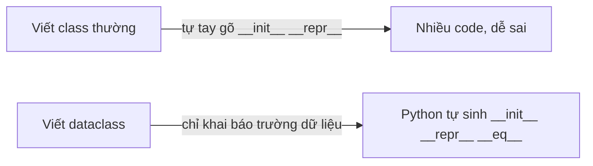
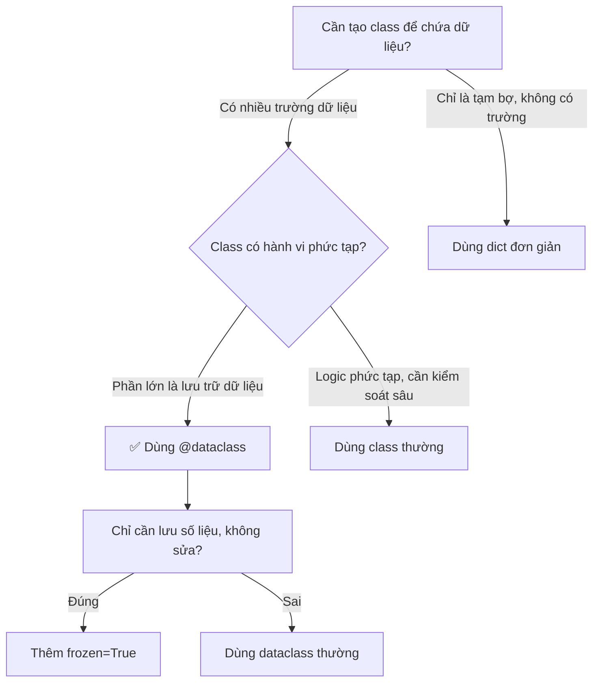

# 📦 Bài 24: Dataclass – Dữ Liệu "Tự Biết" Khai Báo

> 🎓 **Chương 5 – Lập trình hướng đối tượng & các công cụ nâng cao**

---

## 🎯 Mục tiêu

Sau bài học này, học viên sẽ:

* ✅ Hiểu **Dataclass là gì** và vì sao nó ra đời để "đỡ đần" class thường.
* ✅ Biết dùng `@dataclass` để tạo class **nhanh, ngắn, tự động** có `__init__`, `__repr__`, `__eq__`.
* ✅ Nắm được cách đặt **giá trị mặc định** và dùng `field(default_factory=list)` cho dữ liệu kiểu list/dict.
* ✅ Biết dùng **`frozen=True`** để tạo dữ liệu "bất biến" (không sửa được).
* ✅ Lập được **bảng so sánh** Dataclass với class thường để biết khi nào dùng cái nào.
* ✅ Ứng dụng Dataclass vào các bài toán thực tế: quản lý sản phẩm, học sinh, điểm số.

---

## 📖 Kiến thức

### 1. Nhắc lại bài 23: class thường "viết tay"

Ở [Bài 23 – OOP](../23_OOP/bai_giang.md), muốn tạo một class "sản phẩm" ta phải **tự tay viết**:

```python
class SanPham:
    def __init__(self, ten, gia):          # tự tay viết hàm khởi tạo
        self.ten = ten
        self.gia = gia
    def __repr__(self):                    # tự tay viết hàm in đối tượng
        return f"SanPham(ten={self.ten}, gia={self.gia})"
```

Cứ mỗi class lại phải gõ lại y hệt 2 khối lệnh trên — **nhàm chán và dễ sai**. Hãy tưởng tượng một lớp học có 40 học sinh, thầy giáo phải chép tên 40 lần vào sổ — nếu có máy in danh sách thì đỡ biết bao! 🖨️

### 2. Dataclass là gì?

> 💬 **Nói đơn giản:** Dataclass là một **"máy in danh sách học sinh"** — bạn chỉ cần *khai báo* các trường (tên, tuổi, điểm...), Python sẽ **tự động viết giúp** `__init__`, `__repr__`, `__eq__` và nhiều hàm khác.

Dataclass nằm trong **thư viện chuẩn** (có sẵn từ Python 3.7, không cần cài gì thêm) — chỉ cần một dòng `from dataclasses import dataclass` ở đầu file.



### 3. Cú pháp cơ bản của @dataclass

```python
from dataclasses import dataclass      # 1. Nhập khẩu "máy in" từ thư viện chuẩn

@dataclass                             # 2. Trang trí (decorator) cho class
class SanPham:                         # 3. Khai báo class như bình thường
    ten: str                           # 4. Khai báo trường: tên (kiểu chữ)
    gia: float                         # 5. Khai báo trường: giá (kiểu số thực)
```

Chỉ cần vậy thôi! Python **tự sinh**:

| Python tự tạo | Công dụng |
|---|---|
| `__init__(self, ten, gia)` | Tạo đối tượng: `SanPham("Bút", 5000)` |
| `__repr__(self)` | In ra `SanPham(ten='Bút', gia=5000.0)` đẹp mắt |
| `__eq__(self, other)` | So sánh `sp1 == sp2` theo từng trường |

> 🔎 **Chú ý phần khai báo kiểu:** `ten: str` — dấu hai chấm là **chú thích kiểu (type hint)**, giúp con người đọc hiểu rõ ràng và giúp máy phát hiện lỗi. Dataclass **không bắt buộc** dữ liệu phải đúng kiểu đó khi chạy, nhưng ta NÊN tôn trọng nó.

### 4. Giá trị mặc định (default)

Trường có thể có **giá trị mặc định** — như "màu xe mặc định là trắng":

```python
@dataclass
class Xe:
    ten: str
    mau: str = "Trắng"      # nếu không truyền mau, tự động là "Trắng"
```

```python
xe1 = Xe("Honda Vision")        # không truyền mau -> mau = "Trắng"
xe2 = Xe("Yamaha Sirius", "Đỏ") # truyền rõ màu
```

> ⚠️ **Luật bất biến:** trường có mặc định phải **đứng SAU** trường không có mặc định (không được viết `mau: str = "Trắng"` rồi mới đến `ten: str`).

### 5. field(default_factory=list) – bẫy kinh điển

Thử đặt mặc định là list trực tiếp:

```python
@dataclass
class LopHoc:
    ten: str
    hoc_sinh: list = []   # ❌ SAI — Python báo lỗi ngay!
```

Python **cấm** dùng list/dict làm giá trị mặc định trực tiếp vì mọi đối tượng sẽ **dùng chung một list**. Đúng cách là:

```python
from dataclasses import field          # nhập thêm field

@dataclass
class LopHoc:
    ten: str
    hoc_sinh: list = field(default_factory=list)   # ✅ mỗi đối tượng có list RIÊNG
```

> 💬 **Giải thích dễ hiểu:** `default_factory=list` nghĩa là "mỗi lần tạo đối tượng mới, hãy gọi `list()` để làm một danh sách trống mới tinh". Giống như mỗi học sinh tự có một quyển vở riêng, không ai dùng chung vở của ai.

### 6. frozen=True – dữ liệu bất biến

Thêm `frozen=True` vào dấu ngoặc của `@dataclass`:

```python
@dataclass(frozen=True)
class DiemThi:
    mon: str
    diem: float
```

Khi đó mọi thuộc tính **không thể thay đổi** sau khi tạo — cố sửa sẽ báo `FrozenInstanceError`:

```python
d = DiemThi("Toán", 9.5)
d.diem = 10      # ❌ Lỗi: FrozenInstanceError — điểm thi đã "đóng khung"
```

> 💬 **Khi nào dùng?** Khi dữ liệu là **sự thật không thay đổi**: điểm thi đã chấm xong, ngày sinh, số CCCD, giá trị cấu hình... Dữ liệu bất biến giúp chương trình **an toàn hơn**, tránh sửa nhầm.

### 7. Bảng tổng so sánh: Dataclass vs Class thường

| Tiêu chí | 🐍 Class thường | 📦 Dataclass |
|---|---|---|
| Viết `__init__` | Tự tay gõ từng dòng | Tự động sinh |
| Viết `__repr__` | Tự tay gõ | Tự động sinh, in đẹp |
| So sánh `==` | Mặc định so địa chỉ ô nhớ | Tự động so từng trường |
| Sắp xếp được | Phải tự viết `__lt__` | Thêm `order=True` là xong |
| Độ dài code | Dài, trùng lặp | Ngắn gọn, tập trung vào dữ liệu |
| Linh hoạt hành vi riêng | Cao (tự kiểm soát mọi thứ) | Vẫn viết method được bình thường |
| Phù hợp | Class có logic/hành vi phức tạp | Class chỉ chứa dữ liệu + vài thao tác |

### 8. Khi nào dùng Dataclass?



**Quy tắc vàng:** Nếu class của bạn 90% là *chứa dữ liệu* và 10% là *thao tác* → Dataclass. Nếu là class điều khiển hệ thống (như ATM, Game Engine) → class thường.

---

## 💡 Ví dụ minh họa

### Ví dụ 1: Quản lý sản phẩm đơn giản

```python
from dataclasses import dataclass

@dataclass                # trang trí: biến class thành dataclass
class SanPham:            # khai báo class như bình thường
    ten: str              # trường: tên sản phẩm, kiểu chữ
    gia: float            # trường: giá sản phẩm, kiểu số thực

sp = SanPham("Bút bi", 5000)     # tạo sản phẩm, Python tự sinh __init__
print(sp)                        # in đối tượng -> dùng __repr__ tự sinh
print(sp.ten, sp.gia)            # truy cập thuộc tính như class thường
```

Kết quả:

```
SanPham(ten='Bút bi', gia=5000.0)
Bút bi 5000.0
```

**Giải thích từng dòng:**

| Dòng code | Ý nghĩa |
|---|---|
| `from dataclasses import dataclass` | Nhập "máy in" `@dataclass` từ thư viện chuẩn |
| `@dataclass` | Trang trí cho Python biết: hãy tự sinh các hàm cho class này |
| `ten: str` / `gia: float` | Khai báo trường dữ liệu kèm chú thích kiểu |
| `SanPham("Bút bi", 5000)` | Gọi `__init__` tự sinh, đúng thứ tự khai báo |
| `print(sp)` | Gọi `__repr__` tự sinh -> hiển thị đẹp, đủ thông tin |
| `sp.ten` | Truy cập như thuộc tính bình thường |

### Ví dụ 2: Học sinh với giá trị mặc định

```python
from dataclasses import dataclass

@dataclass
class HocSinh:
    ten: str                    # bắt buộc truyền
    lop: str = "10A1"           # mặc định: 10A1 nếu không truyền
    diem_tb: float = 0.0        # mặc định: 0.0

hs1 = HocSinh("An")                       # chỉ truyền tên
hs2 = HocSinh("Bình", "10A2", 8.5)        # truyền đủ cả 3
print(hs1)
print(hs2)
```

Kết quả:

```
HocSinh(ten='An', lop='10A1', diem_tb=0.0)
HocSinh(ten='Bình', lop='10A2', diem_tb=8.5)
```

**Giải thích từng dòng:**

| Dòng code | Ý nghĩa |
|---|---|
| `ten: str` | Trường bắt buộc — không có mặc định |
| `lop: str = "10A1"` | Trường mặc định — nhập liệu thiếu vẫn chạy |
| `diem_tb: float = 0.0` | Mặc định 0.0 — hợp lý cho học sinh chưa có điểm |
| `HocSinh("An")` | Chỉ truyền 1 đối số, hai trường còn lại lấy mặc định |
| `print(hs1)` | `__repr__` tự sinh hiển thị đầy đủ cả giá trị mặc định |

### Ví dụ 3: Danh sách môn học với field

```python
from dataclasses import dataclass, field

@dataclass
class HocSinh:
    ten: str
    mon_hoc: list = field(default_factory=list)   # mỗi hs có list riêng

hs1 = HocSinh("An")
hs2 = HocSinh("Bình")
hs1.mon_hoc.append("Toán")     # chỉ An học Toán
print(hs1)
print(hs2)                      # Bình vẫn trống — không dính lỗi chung list
```

Kết quả:

```
HocSinh(ten='An', mon_hoc=['Toán'])
HocSinh(ten='Bình', mon_hoc=[])
```

**Giải thích từng dòng:**

| Dòng code | Ý nghĩa |
|---|---|
| `from dataclasses import dataclass, field` | Nhập cả `field` để khai báo factory |
| `list = field(default_factory=list)` | Mỗi đối tượng mới được "sản xuất" một `list` mới |
| `hs1.mon_hoc.append("Toán")` | Thêm môn học cho riêng hs1 |
| `print(hs2)` | hs2 có list **riêng trống** — không bị hs1 "làm phiền" |

---

## 🔬 Ví dụ nâng cao

### Ví dụ 1: Quản lý cửa hàng

```python
from dataclasses import dataclass

@dataclass
class SanPham:
    ten: str
    gia: float
    ton_kho: int = 0

    def gia_tri_ton(self):              # phương thức bình thường
        return self.gia * self.ton_kho  # giá trị hàng tồn kho

    def giam_gia(self, phan_tram):
        self.gia = self.gia * (1 - phan_tram / 100)   # giảm giá %

# Tạo giỏ hàng
sp1 = SanPham("Laptop", 15000000, 10)
sp2 = SanPham("Chuột", 200000, 50)

print(sp1)                                  # repr tự sinh
print(f"Giá trị tồn kho Laptop: {sp1.gia_tri_ton()}")   # 15tr * 10
sp2.giam_gia(20)                            # giảm 20%
print(f"Chuột sau giảm giá: {sp2.gia} đồng")
```

Kết quả:

```
SanPham(ten='Laptop', gia=15000000.0, ton_kho=10)
Giá trị tồn kho Laptop: 150000000.0
Chuột sau giảm giá: 160000.0 đồng
```

> 💡 Dataclass vẫn cho phép viết **phương thức** như class thường — chỉ là phần dữ liệu thì tự động.

### Ví dụ 2: Quản lý điểm học sinh & sắp xếp

```python
from dataclasses import dataclass

@dataclass
class HocSinh:
    ten: str
    diem: float

    def xep_loai(self):                     # xếp loại theo điểm
        if self.diem >= 8: return "Giỏi"
        if self.diem >= 6.5: return "Khá"
        return "Trung bình"

# Danh sách học sinh
lop = [
    HocSinh("An", 8.5),
    HocSinh("Bình", 6.0),
    HocSinh("Cường", 9.0),
]

# Sắp xếp giảm dần theo điểm, dùng sorted + key=lambda (học ở bài 25)
lop_sx = sorted(lop, key=lambda hs: hs.diem, reverse=True)

for hs in lop_sx:
    print(hs.ten, hs.diem, hs.xep_loai())   # in danh sách đã sắp xếp
```

Kết quả:

```
Cường 9.0 Giỏi
An 8.5 Giỏi
Bình 6.0 Trung bình
```

### Ví dụ 3: frozen=True cho điểm thi

```python
from dataclasses import dataclass, FrozenInstanceError

@dataclass(frozen=True)
class DiemThi:
    mon: str
    diem: float

d = DiemThi("Toán", 9.0)
print(d)                          # repr tự sinh
try:
    d.diem = 10                   # cố sửa điểm
except FrozenInstanceError:
    print("❌ Không thể sửa điểm thi sau khi đã chấm!")
```

Kết quả:

```
DiemThi(mon='Toán', diem=9.0)
❌ Không thể sửa điểm thi sau khi đã chấm!
```

### Ví dụ 4: So sánh `==` tự động

```python
from dataclasses import dataclass

@dataclass
class ToaDo:
    x: int
    y: int

a = ToaDo(3, 4)
b = ToaDo(3, 4)
c = ToaDo(4, 3)

print(a == b)    # ✅ True — dataclass tự so từng trường
print(a == c)    # ❌ False — khác tọa độ
```

> 🧠 Nếu là class thường, `a == b` sẽ trả về `False` vì Python so **địa chỉ ô nhớ**. Dataclass so **giá trị** — đúng ý nghĩa con người mong đợi.

---

## ⚠️ Lỗi thường gặp

### Lỗi 1: Quên import `dataclass`

```python
@dataclass          # ❌ SAI
class SanPham:
    ten: str
```

* **Kết quả báo:** `NameError: name 'dataclass' is not defined`
* **Nguyên nhân:** chưa nhập `from dataclasses import dataclass` ở đầu file.
* **Cách sửa:** thêm dòng import ở đầu file — dataclass là **thư viện chuẩn**, không cần cài đặt.

### Lỗi 2: `list = []` làm mặc định

```python
@dataclass
class Lop:
    ten: str
    hs: list = []       # ❌ SAI
```

* **Kết quả báo:** `ValueError: mutable default <class 'list'> for field hs is not allowed`
* **Nguyên nhân:** list là dữ liệu "thay đổi được" (mutable), dùng làm mặc định sẽ khiến mọi đối tượng dùng chung một list.
* **Cách sửa:** `hs: list = field(default_factory=list)`.

### Lỗi 3: Sửa thuộc tính của dataclass frozen

```python
@dataclass(frozen=True)
class DiemThi:
    mon: str
    diem: float

d = DiemThi("Toán", 9.0)
d.diem = 10        # ❌ SAI
```

* **Kết quả báo:** `dataclasses.FrozenInstanceError: cannot assign to field 'diem'`
* **Nguyên nhân:** `frozen=True` đóng băng mọi thuộc tính.
* **Cách sửa:** nếu muốn thay đổi, bỏ `frozen=True`; nếu muốn giữ bất biến, tạo đối tượng mới: `d = DiemThi("Toán", 10)`.

### Lỗi 4: Truyền sai số đối số khi tạo đối tượng

```python
sp = SanPham("Bút bi")        # ❌ SAI — thiếu tham số gia
```

* **Kết quả báo:** `TypeError: __init__() missing 1 required positional argument: 'gia'`
* **Nguyên nhân:** `__init__` tự sinh yêu cầu đúng số tham số như khai báo.
* **Cách sửa:** truyền đủ tham số, hoặc đặt mặc định cho trường: `gia: float = 0.0`.

### Lỗi 5: Viết trường có mặc định trước trường không mặc định

```python
@dataclass
class Xe:
    mau: str = "Trắng"    # ❌ SAI — có mặc định đứng trước
    ten: str
```

* **Kết quả báo:** `TypeError: non-default argument 'ten' follows default argument`
* **Nguyên nhân:** Python không biết xử lý tham số bắt buộc đứng sau tham số tùy chọn.
* **Cách sửa:** đổi thứ tự — trường bắt buộc trước, trường mặc định sau.

---

## 💎 Mẹo

* ✨ **Quy tắc vàng khi khai báo:** trường nào cũng nên ghi **chú thích kiểu** (`ten: str`) — đọc code lên là hiểu ngay dữ liệu hình dạng ra sao.
* 🧰 **Thêm `order=True`** để sắp xếp luôn: `@dataclass(order=True)` giúp `sorted()` hoạt động trực tiếp trên danh sách đối tượng mà không cần viết `key`.
* 🔒 **Dùng `frozen=True` cho dữ liệu lịch sử** (điểm thi, hóa đơn, log) — bảo vệ dữ liệu khỏi sửa nhầm.
* 🏭 **`default_factory` còn làm được nhiều hơn `list`:** `field(default_factory=dict)`, `field(default_factory=lambda: [0, 0])`... — đều là "công thức sản xuất" giá trị mặc định mới mỗi lần.
* 📋 **In danh sách nhiều đối tượng:** vòng lặp `for` + `print(sp)` hiển thị rất đẹp nhờ `__repr__` tự sinh — không cần viết hàm in riêng.
* 🧪 **Kết hợp với bài 22 (File):** dataclass là nơi lý tưởng chứa dữ liệu đọc từ file CSV/JSON — bài 32, 33 sẽ dùng rất nhiều.
* 🔍 **Đừng lạm dụng:** class chỉ có 1-2 trường thì dùng tuple/dict cho gọn; dataclass phát huy khi từ 3 trường trở lên.

---

## 📝 Tóm tắt

| Khái niệm | Nội dung chính |
|---|---|
| 📦 `@dataclass` | Trang trí class để Python tự sinh `__init__`, `__repr__`, `__eq__` |
| 🔤 Khai báo trường | `ten: str` — tên + chú thích kiểu |
| 🎯 Giá trị mặc định | `lop: str = "10A1"` — trường tùy chọn, phải đứng sau trường bắt buộc |
| 🏭 `field(default_factory=list)` | Mỗi đối tượng có list/dict **riêng biệt** |
| ❄️ `frozen=True` | Dữ liệu bất biến — sửa sẽ báo `FrozenInstanceError` |
| 🧮 `order=True` | Cho phép sắp xếp trực tiếp bằng `sorted()` |
| ⚖️ So với class thường | Class thường: tự kiểm soát mọi thứ; Dataclass: ngắn gọn, hợp dữ liệu |
| ✅ Khi nào dùng | Class chứa dữ liệu thuần túy → Dataclass; logic phức tạp → class thường |

---

## 🧪 Kiểm tra nhanh

1. ❓ `@dataclass` nằm trong thư viện nào? Có cần `pip install` không?
2. ❓ Kể tên 3 hàm mà Python tự động sinh khi dùng `@dataclass`.
3. ❓ Trong khai báo `ten: str`, phần `: str` dùng để làm gì?
4. ❓ Vì sao không được viết `hoc_sinh: list = []` mà phải dùng `field(default_factory=list)`?
5. ❓ `frozen=True` có tác dụng gì? Khi cố sửa thuộc tính sẽ báo lỗi gì?
6. ❓ Viết dataclass `Sach` có 2 trường: `tua` (str), `gia` (float, mặc định 0).
7. ❓ Đúng hay sai: trường có giá trị mặc định phải khai báo trước trường không mặc định?
8. ❓ Hai đối tượng dataclass có cùng giá trị mọi trường, so `==` trả về gì?

<details>
<summary>🔍 Xem đáp án</summary>

1. Thư viện `dataclasses` — là **thư viện chuẩn** (Python 3.7+), không cần cài thêm.
2. `__init__`, `__repr__`, `__eq__` (và `__lt__`... nếu `order=True`).
3. Chú thích kiểu (type hint) — ghi rõ trường đó lưu dữ liệu kiểu gì.
4. Vì list là dữ liệu mutable — nếu dùng trực tiếp, mọi đối tượng dùng chung một list, sửa cái này ảnh hưởng cái kia.
5. Đóng băng dữ liệu, không sửa được; báo `FrozenInstanceError`.
6. `@dataclass` + `class Sach:` + `tua: str` + `gia: float = 0`.
7. Sai — trường mặc định phải đứng **sau** trường bắt buộc.
8. `True` — dataclass tự sinh `__eq__` so từng trường.

</details>

---

## 📚 Bài đọc thêm

* [Python.org – dataclasses (tài liệu chính thức)](https://docs.python.org/3/library/dataclasses.html)
* [Real Python – Data Classes in Python](https://realpython.com/python-data-classes/)
* [GeeksforGeeks – Data Classes](https://www.geeksforgeeks.org/data-classes-in-python-an-introduction/)

---

## 🏁 Kết thúc bài

🎉 **Xuất sắc!** Giờ bạn đã biết cách "in ấn" class chứa dữ liệu một cách tự động và an toàn với `@dataclass` — từ sản phẩm, học sinh đến điểm thi bất biến.

Nhưng trong ví dụ sắp xếp ở trên, bạn đã thấy một thứ lạ lẫm: **`lambda`** — một "hàm vô danh" siêu ngắn gọn. Nó là gì và vì sao lại cần? Hãy sang:

👉 **[Bài 25: Lambda](../25_Lambda/bai_giang.md)**
