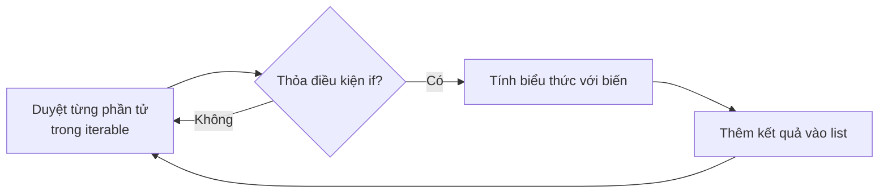
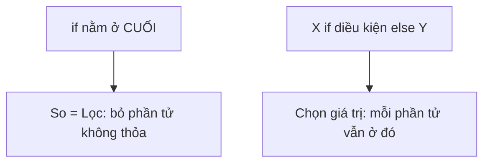

# 🎯 Bài 26: List Comprehension – Vòng Lặp "Viết Trong Một Dòng"

> 🎓 **Chương 5 – Lập trình hướng đối tượng & các công cụ nâng cao**

---

## 🎯 Mục tiêu

Sau bài học này, học viên sẽ:

* ✅ Hiểu **list comprehension là gì** — viết vòng lặp sinh danh sách trong một dòng.
* ✅ Viết được cú pháp cơ bản `[bieuthuc for phantu in danhsach]`.
* ✅ Thêm được **bộ lọc `if`** để chỉ giữ phần tử thỏa điều kiện.
* ✅ Dùng được **`if...else`** để chọn giá trị khác nhau theo điều kiện.
* ✅ Viết được **set comprehension** và **dict comprehension** tương tự.
* ✅ Biết **lợi ích** (ngắn gọn, đẹp mắt) và **nhược điểm** (khó đọc khi phức tạp).

---

## 📖 Kiến thức

### 1. Vấn đề: tạo danh sách bình phương — cách dài

Ở bài 10 (vòng lặp `for`) và bài 14 (list), muốn tạo danh sách bình phương của các số 0..9 ta viết:

```python
binh_phuong = []                    # danh sách rỗng
for x in range(10):                 # duyệt từng số
    binh_phuong.append(x * x)       # thêm bình phương vào cuối
print(binh_phuong)                  # [0, 1, 4, 9, 16, 25, 36, 49, 64, 81]
```

4 dòng chỉ để "gom dữ liệu lại" — hơi dài dòng. Người Python "chế" ra cách viết **cả vòng lặp ngay trong dấu ngoặc vuông của list**:

```python
binh_phuong = [x * x for x in range(10)]
print(binh_phuong)   # [0, 1, 4, 9, 16, 25, 36, 49, 64, 81]
```

**Kết quả giống hệt, code ngắn hơn nhiều!** 🎉

> 💬 **Nói đơn giản:** List comprehension là "vòng lặp chạy trong dấu `[]`" — vừa duyệt, vừa tạo ra danh sách mới, hoàn toàn không cần `append`.

### 2. Cú pháp cơ bản (hình)

```python
[bieu_thuc for bien in iterable]
```



| Thành phần | Ý nghĩa | Ví dụ |
|---|---|---|
| `bieu_thuc` | Giá trị muốn có trong list mới | `x * x` |
| `for x in iterable` | Duyệt từng giá trị | `for x in range(10)` |
| `if dieu_kien` (tùy chọn) | Lọc — chỉ giữ phần tử thỏa điều kiện | `if x % 2 == 0` |

Cấu trúc chung đầy đủ:

```python
mang_moi = [bieu_thuc for bien in iterable if dieu_kien]
```

### 3. Bộ lọc `if`

Chỉ giữ những phần tử thỏa điều kiện — giống hệt `filter` ở bài 25 nhưng gọn hơn:

```python
so_chan = [x for x in range(1, 11) if x % 2 == 0]
print(so_chan)   # [2, 4, 6, 8, 10]
```

So sánh các cách viết:

| Cách viết | Code |
|---|---|
| Vòng lặp + `if` + `append` | `so_chan = []; for x in ...: if ...: append(...)` |
| `filter` + lambda (bài 25) | `list(filter(lambda x: x % 2 == 0, so))` |
| List comprehension | `[x for x in so if x % 2 == 0]` 👍 |

### 4. `if...else` bên trong biểu thức

Nếu cần **trả giá trị khác nhau tùy điều kiện**, đặt `if/else` vào phía trái (vị trí biểu thức) — KHÁC với bộ lọc:

```python
so = [1, 2, 3, 4, 5, 6]

# Số chẵn → "chan", số lẻ → "le"
nhan = ["chan" if x % 2 == 0 else "le" for x in so]
print(nhan)   # ['le', 'chan', 'le', 'chan', 'le', 'chan']
```

> ⚠️ **Điểm dễ nhầm nhất bài này:**
> * `[X for x in so if DIEU_KIEN]` — **LỌC**: phần tử không thỏa sẽ bị bỏ.
> * `[X if DIEU_KIEN else Y for x in so]` — **CHỌN GIÁ TRỊ**: mỗi phần tử vẫn được giữ, chỉ là chọn X hay Y.
> * "if đứng cuối" = lọc; "if đứng đầu (có else)" = chọn giá trị.



### 5. List comprehension lồng nhau (nested) — cơ bản

Khi cần duyệt "bảng trong bảng" (ví dụ ma trận), viết vòng ngoài trước, vòng trong sau:

```python
ket = [x + y for x in [1, 2] for y in [10, 20]]
print(ket)   # [11, 21, 12, 22]
```

Đọc nó như vòng lặp bình thường:

```python
ket = []
for x in [1, 2]:          # vòng NGOÀI
    for y in [10, 20]:    # vòng TRONG
        ket.append(x + y)
```

### 6. Set comprehension và dict comprehension

Nguyên tắc giống hệt, chỉ thay dấu ngoặc:

* **Set** `{bieu thuc for ...}` — kết quả **không trùng lặp**:

```python
chu_cai = {c for c in "hello"}
print(chu_cai)   # {'e', 'h', 'l', 'o'} — chữ 'l' chỉ xuất hiện 1 lần
```

* **Dict** `{key: value for ...}` — mỗi phần tử sinh một cặp **khóa: giá trị**:

```python
bp = {x: x * x for x in range(1, 6)}
print(bp)   # {1: 1, 2: 4, 3: 9, 4: 16, 5: 25}
```

### 7. Lợi ích và khả năng đọc (readability)

| Lợi ích | Nói rõ |
|---|---|
| ✂️ Ngắn gọn | Thay 3-4 dòng vòng lặp + append bằng 1 dòng |
| 🌿 Dễ đọc | Đọc kiểu tiếng Anh: "x*x cho từng x trong 1..10" |
| ⚡ Nhanh | Chạy nhanh hơn vòng lặp tay trong Python |
| 🧩 Đa dụng | Dùng được cho list, set, dict |

**Nhưng đừng dùng với nỗi sợ đọc:** PEP 8 khuyên comprehension chỉ nên có độ khó vừa phải. Nếu cần **nhiều `if`/`for` hay logic phức tạp** → quay lại vòng lặp `for`: "readable" (đọc được) quan trọng hơn "ngắn".

| Tình huống | Nên dùng cái nào |
|---|---|
| 1 biểu thức + 1 điều kiện đơn giản | ✅ List comprehension |
| Nhiều vòng lồng nhau, nhiều if | ✅ Vòng lặp `for` bình thường |

---

## 💡 Ví dụ minh họa

### Ví dụ 1: Bình phương các số 0..9

```python
# Biểu thức x*x; duyệt x trong range(10); không có bộ lọc
bp = [x * x for x in range(10)]
print(bp)   # [0, 1, 4, 9, 16, 25, 36, 49, 64, 81]
```

**Giải thích từng dòng:**

| Phần code | Ý nghĩa |
|---|---|
| `x * x` | Biểu thức — kết quả mỗi phần tử của list mới |
| `for x in range(10)` | Vòng lặp x chạy 0→9 |
| `[...]` | Bọc trong dấu list để tạo danh sách |
| `print(bp)` | Hiển thị toàn bộ danh sách kết quả |

### Ví dụ 2: Chỉ giữ số lẻ

```python
# Giữ nguyên giá trị x nếu nó là số lẻ
le = [x for x in range(1, 31) if x % 2 == 1]
print(le)   # [1, 3, 5, 7, ..., 29]
```

**Giải thích từng dòng:**
* `x` đứng đầu — giữ nguyên giá trị khi điều kiện đúng.
* `if x % 2 == 1` — bộ lọc cuối cùng: phải lẻ mới được giữ.
* Kết quả: mọi số lẻ từ 1 đến 29.

### Ví dụ 3: Lọc chẵn rồi bình phương

```python
so = [1, 2, 3, 4, 5, 6, 7, 8]
# Lọc chẵn trước, bình phương sau
ket = [x * x for x in so if x % 2 == 0]
print(ket)   # [4, 16, 36, 64]
```

**Giải thích từng dòng:**
* `if x % 2 == 0` — bộ lọc: chỉ số chẵn đi tiếp.
* `x * x` — biến đổi: số chẵn sau khi bình phương thành [4, 16, 36, 64].
* Thứ tự hoạt động: **duyệt → lọc → biến đổi → thêm vào list**.

---

## 🔬 Ví dụ nâng cao

### Ví dụ 1: Thống kê điểm học sinh (kết hợp dataclass bài 24)

```python
from dataclasses import dataclass

@dataclass
class HocSinh:
    ten: str
    diem: float

lop = [
    HocSinh("An", 8.5),
    HocSinh("Bình", 6.0),
    HocSinh("Cường", 9.0),
    HocSinh("Dung", 7.5),
]

# Danh sách tên học sinh giỏi (diem >= 8)
gioi = [hs.ten for hs in lop if hs.diem >= 8]
print("Hoc sinh gioi:", gioi)

# Trung bình của cả lớp bằng list comprehension
trung_binh = sum([hs.diem for hs in lop]) / len(lop)
print("Diem trung binh lop:", round(trung_binh, 2))
```

Kết quả:

```
Hoc sinh gioi: ['An', 'Cường']
Diem trung binh lop: 7.62
```

> 💡 Có thể bỏ ngoặc `[]` trong `sum(...)` để thành generator — chi tiết bài 27!

### Ví dụ 2: Dict comprehension đếm chữ cái (thống kê tần suất)

```python
cau = "python la ngon ngu tuyen voi"

# Đếm số lần xuất hiện mỗi chữ cái (bỏ khoảng trắng)
dem = {c: cau.lower().count(c) for c in set(cau) if c != " "}
print(dem)
```

Kết quả (ví dụ):

```
{'l': 2, 'n': 5, 'p': 1, ...}
```

> 🔎 Ý tưởng: với mỗi chữ cái duy nhất (lấy từ `set`), đếm bằng `count(c)`.

### Ví dụ 3: if/else chọn nhãn điểm

```python
so_diem = [8.5, 4.0, 6.0, 9.0]

# >=8 → "Dat" ngược lại → "Chua"
nhan = ["Dat" if d >= 8 else "Chua" for d in so_diem]
print(nhan)   # ['Dat', 'Chua', 'Chua', 'Dat']
```

> 🧠 Lưu ý cấu trúc: `"Dat" if d >= 8 else "Chua"` **nằm ở vị trí biểu thức** (đầu), không phải phần lọc.

### Ví dụ 4: Nested — bảng cửu chương nhỏ

```python
# Bảng nhân 3x3 không kẹp trong vòng lặp tay
bang = [f"{a} x {b} = {a * b}" for a in range(1, 4) for b in range(1, 4)]
for dong in bang:
    print(dong)
```

Kết quả:

```
1 x 1 = 1
1 x 2 = 2
...
3 x 3 = 9
```

---

## ⚠️ Lỗi thường gặp

### Lỗi 1: Viết sai điều kiện bộ lọc

```python
# Mục tiêu: lấy số chẵn
sai = [x for x in range(1, 6) if x]            # ❌ SAI — if x đúng với mọi số khác 0
dung = [x for x in range(1, 6) if x % 2 == 0]  # ✅ ĐÚNG
```

* **Nguyên nhân:** `if x` kiểm tra "khác 0" chứ không phải "chẵn".
* **Cách sửa:** viết đúng điều kiện `x % 2 == 0`.

### Lỗi 2: Nhầm vị trí `if/else` đứng đầu và cuối

```python
# ❌ SAI — sau vòng for chỉ được phép if (lọc), không được if...else
sai = [x if x > 2 for x in [1, 2, 3, 4]]
```

* **Kết quả báo:** `SyntaxError: invalid syntax`
* **Nguyên nhân:** phía sau `for ...` chỉ cho phép `if` lọc, không có `else`.
* **Cách sửa:** `[x if x > 2 else 0 for x in ...]` khi chọn giá trị; `[x for x in ... if x > 2]` khi lọc.

### Lỗi 3: Lẫn set/dict comprehension với list khi gõ `{}`

```python
# Đúng ý là list nhưng gõ ngoặc { }
sai = {x for x in [1, 2, 2, 3]}   # kết quả là set: {1, 2, 3} — mất lặp, mất thứ tự
```

* **Nguyên nhân:** `{...}` tạo **set** (không trùng), không phải list.
* **Cách sửa:** dùng `[...]` nếu muốn list bảo toàn thứ tự và cho phép lặp.

### Lỗi 4: Comprehension quá phức tạp — không đọc nổi

```python
# ❌ Khó đọc — ba vòng lồng nhau + nhiều if trong một dòng
phuc_tap = [a + b + c for a in A for b in B for c in C if a > b if b < c]
```

* **Nguyên nhân:** một dòng cố nuốt cả thuật toán.
* **Cách sửa:** tách bằng vòng lặp `for` bình thường hoặc viết hàm `def` riêng.

### Lỗi 5: Gõ ngoặc `{}` khi muốn list — nhận được set

```python
danh_sach = {x for x in [1, 2, 2, 3]}   # ❌ tạo ra set {1, 2, 3} — bị loại lặp, thứ tự không đảm bảo
danh_sach = [x for x in [1, 2, 2, 3]]   # ✅ list giữ nguyên: [1, 2, 2, 3]
```

* **Nguyên nhân:** ngoặc `{}` luôn tạo **set**, không phải list.
* **Cách sửa:** dùng `[...]` khi muốn giữ thứ tự và cho phép trùng.

---

## 💎 Mẹo

* 🧮 **Áp dụng cho list + set + dict** chỉ đổi dấu ngoặc — học một được ba.
* 🔤 **Đặt tên biến vòng ngắn** (`x`, `i`, `c`, `hs`) — đừng đặt biến dài lòi cả dòng.
* 🧹 **Kết hợp với `sum`/`max`:** `sum([x*x for x in so])` — tính nhanh tổng, max có điều kiện.
* 🚦 **if lọc (cuối) và if/else chọn (đầu)** — phân biệt sẽ hết lỗi vị trí.
* 📏 **Giới hạn 1-2 điều kiện.** Nếu dòng bị dài/tối nghĩa → dùng vòng lặp `for` + biến ai nói gì cũng không đẹp bằng.
* 🪞 **Viết lại 3-4 dòng append cũ thành comprehension** để dần quen mắt.

---

## 📝 Tóm tắt

| Khái niệm | Cú pháp / Ghi chú |
|---|---|
| 📋 Cơ bản | `[bieu_thuc for x in iterable]` |
| 🧯 Lọc | `[x for x in iterable if dieu_kien]` |
| 🎭 Chọn giá trị | `[X if dk else Y for x in iterable]` |
| 🪆 Lồng nhau | `[... for x in A for y in B]` — ngoài trước, trong sau |
| 🗂️ Set | `{x for x in ...}` — không trùng lặp |
| 🗺️ Dict | `{k: v for ...}` — cặp khóa/giá trị |
| ⚖️ Ưu | Ngắn, đẹp, nhanh |
| ⚠️ Nhược | Khó đọc khi quá phức tạp → xê dùng vòng lặp |

---

## 🧪 Kiểm tra nhanh

1. ❓ Viết comprehension lấy bình phương các số 1..5.
2. ❓ `[x for x in data if x % 2 == 1]` giữ lại loại số gì?
3. ❓ Phân biệt: `if` cuối **lọc** hay **chọn giá trị**?
4. ❓ Viết comprehension lấy các số ≥ 10 trong `[3, 12, 7, 20]`.
5. ❓ Dict comprehension `{x: x**2 for x in range(1,4)}` cho ra gì?
6. ❓ Set comprehension có đặc điểm gì so với list?
7. ❓ Khi nào nên tránh dùng comprehension?
8. ❓ Viết `if/else` trong comprehension đổi số chẵn thành `"E"`, lẻ thành `"O"` cho [1..5].

<details>
<summary>🔍 Xem đáp án</summary>

1. `[x * x for x in range(1, 6)]`.
2. Số lẻ.
3. Lọc — bỏ phần tử không thỏa.
4. `[x for x in [3, 5, 7, 20] if x >= 10]` → `[20]`.
5. `{1: 1, 2: 4, 3: 9}` — (chú ý x: x**2 với x ∈ {1,2,3}).
6. Không trùng lặp, không theo thứ tự cố định.
7. Khi logic phức tạp, nhiều vòng/điều kiện, đọc rối → dùng `for`.
8. `["E" if x % 2 == 0 else "O" for x in range(1, 6)]` → `['O', 'E', 'O', 'E', 'O']`.

</details>

---

## 📚 Bài đọc thêm

* [Python.org – Lis[] display (tài liệu chính thức)](https://docs.python.org/3/tutorial/datastructures.html#list-comprehensions)
* [Real Python – When to Use a List Comprehension](https://realpython.com/list-comprehension-python/)
* [W3Schools – List Comprehension](https://www.w3schools.com/python/python_lists_comprehension.asp)

---

## 🏁 Kết thúc bài

🎉 **Rất tốt!** Giờ bạn viết vòng lặp sinh danh sách ngắn gọn và đọc hiểu "một dòng" — mạnh mẽ hơn hẳn vòng lặp tay.

Nhưng có một điểm nữa: khi dùng `sum([...])` hay `range(1000000)`, danh sách bình thường nạp **toàn bộ giá trị vào bộ nhớ**. Liệu có cách nào *sinh ra từng giá trị một, cần mẹ nào tính đến đó* không? — Đó chính là bài sau:

👉 **[Bài 27: Generator](../27_Generator/bai_giang.md)**