# 🔁 Bài 29: Iterator – Vòng Lặp Hoạt Động Thế Nào?

> 🎓 **Chương 9 – Lập trình nâng cao**
> Ở bài 27 bạn đã học **generator** — hàm đặc biệt dùng `yield` để sản xuất từng giá trị một. Bài 28 là **decorator** — cách trang trí hàm. Bài này chúng ta mở nắp chiếc hộp bí ẩn cuối cùng của dòng họ này: **iterator** — "người chuyển phát từng món hàng" mà vòng lặp `for` dựa vào để chạy. Hóa ra, bạn đã dùng iterator từ bài 10 mà không hề hay biết!

---

## 🎯 Mục tiêu

Sau bài học này, học viên sẽ:

* ✅ Phân biệt được **iterable** và **iterator** — hai khái niệm dễ nhầm lẫn nhất của Python.
* ✅ Dùng thành thạo **`iter()`** và **`next()`** để điều khiển quá trình duyệt bằng tay.
* ✅ Hiểu **vòng lặp `for` chạy thế nào bên trong** — nhờ iterator mà không cần đếm vị trí.
* ✅ Hiểu **`StopIteration`** — tín hiệu "đã hết dữ liệu" của iterator.
* ✅ Tự tạo **class Iterator** với `__iter__` và `__next__`.
* ✅ Viết được iterator thực tế: dãy số chẵn vô hạn, đọc file theo từng dòng.

---

## 📖 Kiến thức

### 1. Nhắc nhẹ bài trước — mảnh ghép còn thiếu

Bài 27 dạy bạn generator qua `yield` và lệnh `for`. Bài này trả lời câu hỏi: **`for` thực sự làm gì?** Và generator có liên quan gì đến iterator? Câu trả lời ngắn gọn:

> 🐍 **Sự thật:** Generator là một loại iterator đặc biệt. Và vòng lặp `for` chỉ là "khuôn mặt" dễ nhìn của iterator. Học iterator là hiểu được cốt lõi của cả hai!

### 2. Iterable là gì?

**Iterable** (vật có thể duyệt) là đối tượng mà bạn có thể **duyệt qua từng phần tử** — tức là dùng được trong vòng lặp `for`.

Những iterable bạn đã quen thuộc:

| Iterable | Ví dụ | Có thứ tự không |
|---|---|---|
| 📋 List | `[3, 1, 4, 1]` | Có |
| 🧮 Tuple | `(5, 6, 7)` | Có |
| 🔤 String | `"Python"` | Có (từng ký tự) |
| 📚 Set | `{1, 2, 3}` | Không |
| 🗂️ Dict | `{"ten": "An", "tuoi": 15}` | Có (Python 3.7+) |
| 🎲 Range | `range(10)` | Có |

> 💬 **Ví dụ đời thực:** Iterable giống **thùng bánh kẹo** — bạn biết trong thùng có nhiều phần, và bạn có thể lấy ra từng chiếc bánh để ăn (duyệt). Nhưng cái thùng không tự đưa bánh ra; nó cần một "người đưa bánh".

### 3. Iterator là gì?

**Iterator** là "người đưa bánh" đó — một đối tượng có hai khả năng:

* 🎯 Nhớ **vị trí hiện tại** (đang đứng ở món nào).
* 🎁 Có thể **đưa ra món kế tiếp** khi được yêu cầu.

Mỗi khi bạn gọi `next(iterator)`, nó đưa món tiếp theo và tự nhích lên. Khi hết món, nó "báo hết" bằng **`StopIteration`**.

**Bảng so sánh:**

| Đặc điểm | Iterable | Iterator |
|---|---|---|
| 🏷️ Bản chất | Tập dữ liệu (list, str, dict...) | "Người duyệt" tập dữ liệu |
| 🔢 Nhớ vị trí | Không | Có |
| 🏭 Lấy bằng cách nào | `iter(iterable)` để lấy iterator | `next(iterator)` để lấy giá trị |
| 🚦 Dấu hiệu hết | Không có | Ném `StopIteration` |
| ♻️ Dùng lại được | Có, lấy iterator mới mãi được | Không — dùng hết là hết |

> ⚠️ **Lưu ý quan trọng:** Iterator dùng một lần là hết. Muốn duyệt lại phải tạo iterator mới từ iterable.

### 4. `iter()` và `next()` — điều khiển bằng tay

Hãy "giải phẫu" vòng lặp `for` bằng tay:

```python
danh_sach = [10, 20, 30]

# Bước 1: lấy iterator từ iterable
it = iter(danh_sach)

# Bước 2: gọi next() từng lần
print(next(it))   # 10
print(next(it))   # 20
print(next(it))   # 30

# Bước 3: hết dữ liệu → ném StopIteration
print(next(it))   # StopIteration (lỗi)
```

**Giải thích từng dòng:**

| Dòng | Ý nghĩa |
|---|---|
| `it = iter(danh_sach)` | Hàm `iter()` tạo ra iterator gắn với danh sách |
| `next(it)` | Trả giá trị hiện tại và nhảy đến giá trị kế tiếp |
| `next(it)` khi hết | Python ném ngoại lệ `StopIteration` — thông báo hết dữ liệu |

> 💬 **Ví dụ đời thực:** Iterator giống **thẻ gợi ý trong thư viện** — bạn rút từng tấm thẻ ghi tựa sách; hết thẻ thì hết sách để tìm. Không thể "rút lại" thẻ đã rút!

### 5. Vòng lặp `for` hoạt động thế nào bên trong?

Khi bạn viết:

```python
for phan_tu in danh_sach:
    print(phan_tu)
```

Python dịch thành:

```python
it = iter(danh_sach)          # 1. Lấy iterator
while True:                   # 2. Vòng lặp vô tận
    try:
        phan_tu = next(it)    # 3. Xin giá trị kế tiếp
    except StopIteration:     # 4. Hết dữ liệu?
        break                 # 5. Thoát vòng lặp
    print(phan_tu)            # 6. Chạy thân vòng lặp
```



```mermaid
flowchart TD
    A[Bắt đầu for] --> B[iter&#40;iterable&#41;<br/>lấy iterator]
    B --> C[next&#40;it&#41;<br/>xin giá trị]
    C --> D{Còn giá trị?}
    D -- Có --> E[Chạy thân vòng lặp]
    E --> C
    D -- Không → StopIteration --> F[Thoát vòng lặp]
```

> 💡 **Vì sao hiểu được điều này?** Vì giờ bạn biết vì sao `for` dùng được với mọi iterable (list, dict, file, generator...): chỉ cần iterable đó cung cấp được `iter()`. Đây là "hợp đồng" mà Python áp dụng cho mọi thứ.

### 6. `StopIteration` — tín hiệu hết hàng

`StopIteration` không phải "lỗi nghiêm trọng" — nó là **tín hiệu hết dữ liệu** mà vòng lặp dùng để thoát ra.

Bạn có thể "bắt" nó như mọi ngoại lệ khác (đã học ở bài 19):

```python
it = iter([1, 2])
print(next(it))   # 1
print(next(it))   # 2
try:
    next(it)      # đã hết
except StopIteration:
    print("Đã duyệt hết dữ liệu!")
```

Kết quả:

```
1
2
Đã duyệt hết dữ liệu!
```

### 7. Tự tạo class Iterator với `__iter__` và `__next__`

Đây là phần "đỉnh cao" — bạn tự xây một iterator riêng. Hợp đồng Python yêu cầu:

| Phương thức | Nhiệm vụ |
|---|---|
| `__iter__(self)` | Trả về chính iterator (thường là `return self`) |
| `__next__(self)` | Trả giá trị kế tiếp; nếu hết → `raise StopIteration` |

```python
class DemNguoc:
    """Iterator đếm ngược từ n về 1."""

    def __init__(self, n):
        self.hien_tai = n          # giá trị bắt đầu

    def __iter__(self):
        return self                # chính nó là iterator

    def __next__(self):
        if self.hien_tai < 1:      # đã đếm xong?
            raise StopIteration    # báo hết dữ liệu
        gia_tri = self.hien_tai
        self.hien_tai -= 1         # nhích xuống số kế tiếp
        return gia_tri

# Dùng với vòng lặp for
for so in DemNguoc(3):
    print(so)
```

Kết quả:

```
3
2
1
```

**Giải thích từng dòng:**

| Dòng | Ý nghĩa |
|---|---|
| `class DemNguoc:` | Định nghĩa lớp iterator |
| `self.hien_tai = n` | Lưu trạng thái "đang đứng ở số nào" |
| `return self` | Lớp vừa là iterable vừa là iterator — trả chính nó |
| `if self.hien_tai < 1: raise StopIteration` | Kiểm tra hết dữ liệu |
| `gia_tri = self.hien_tai; self.hien_tai -= 1` | Trả giá trị rồi nhích vị trí |

> 💡 Vòng lặp `for` chỉ cần `__iter__` (để lấy iterator). Vì `__iter__` trả `self` nên chính đối tượng cũng là iterator — dùng luôn `for` được!

### 8. Iterator có thể vô hạn — ví dụ dãy số chẵn

Vì iterator không lưu toàn bộ dữ liệu mà **tự sản xuất khi được hỏi**, nó có thể biểu diễn **dãy vô hạn**:

```python
class SoChan:
    """Iterator sinh ra số chẵn liên tiếp: 0, 2, 4, 6..."""

    def __init__(self):
        self.so = 0

    def __iter__(self):
        return self

    def __next__(self):
        ket_qua = self.so
        self.so += 2        # số chẵn kế tiếp
        return ket_qua

it = SoChan()
print(next(it))   # 0
print(next(it))   # 2
print(next(it))   # 4
```

> ⚠️ **Cảnh báo:** Đừng bao giờ viết `for x in SoChan():` — vì không bao giờ có `StopIteration`, vòng lặp sẽ chạy mãi mãi! Chỉ dùng `next()` với số lần giới hạn.

### 9. `iter()` với hàm gọi — `iter(ham, sentinel)`

Cú pháp ít biết: `iter(ham, gia_tri_dung)` — gọi `ham` liên tục cho đến khi kết quả bằng `gia_tri_dung`:

```python
# Đọc file theo từng dòng bằng iterator
with open("ghi_chu.txt", "r", encoding="utf-8") as f:
    for dong in iter(f.readline, ""):   # dừng khi readline trả ""
        print("Dòng:", dong.strip())
```

### 10. Iterator vs Generator — hai anh em

| Tiêu chí | Iterator (class) | Generator (hàm `yield`) |
|---|---|---|
| Cách viết | `__iter__` + `__next__` | Hàm với `yield` |
| Dòng code | Nhiều hơn | Ngắn gọn hơn |
| Giữ trạng thái | Biến trong `self` | Tự động (biến cục bộ) |
| Dùng khi nào | Cần logic phức tạp, nhiều trạng thái | Viết nhanh dãy giá trị |

> 💎 **Mẹo thực tế:** Thông thường hãy ưu tiên generator (ngắn, dễ đọc). Class iterator dành cho trường hợp cần logic phức tạp hoặc cần thêm phương thức khác.

---

## 💡 Ví dụ minh họa

### Ví dụ 1: Đọc file theo từng dòng bằng iterator tự chế

```python
class DocFileTheoDong:
    """Iterator đọc file, mỗi lần next() trả một dòng."""

    def __init__(self, ten_file):
        self.f = open(ten_file, "r", encoding="utf-8")

    def __iter__(self):
        return self

    def __next__(self):
        dong = self.f.readline()     # đọc một dòng
        if dong == "":               # hết file?
            self.f.close()           # đóng file sạch sẽ
            raise StopIteration
        return dong.rstrip("\n")     # bỏ ký tự xuống dòng

# Tạo file mẫu
with open("lop_hoc.txt", "w", encoding="utf-8") as f:
    f.write("An\nBinh\nChi\n")

# Duyệt file như một danh sách!
for ten in DocFileTheoDong("lop_hoc.txt"):
    print("Học sinh:", ten)
```

Kết quả:

```
Học sinh: An
Học sinh: Binh
Học sinh: Chi
```

**Giải thích từng dòng:**

| Dòng | Ý nghĩa |
|---|---|
| `self.f = open(...)` | Mở file ngay khi tạo iterator |
| `dong = self.f.readline()` | Đọc một dòng — nếu hết sẽ trả `""` |
| `if dong == "": raise StopIteration` | Báo hết dữ liệu khi chạm cuối file |
| `dong.rstrip("\n")` | Bỏ ký tự xuống dòng ở cuối dòng |
| `for ten in DocFileTheoDong(...)` | `for` tự gọi `next()` cho tới `StopIteration` |

### Ví dụ 2: Dãy Fibonacci vô hạn bằng iterator

```python
class Fibonacci:
    """Iterator sinh dãy Fibonacci: 0, 1, 1, 2, 3, 5, 8..."""

    def __init__(self):
        self.a, self.b = 0, 1

    def __iter__(self):
        return self

    def __next__(self):
        ket_qua = self.a
        self.a, self.b = self.b, self.a + self.b
        return ket_qua

fb = Fibonacci()
for _ in range(10):          # chỉ lấy 10 số đầu
    print(next(fb), end=" ")
```

Kết quả:

```
0 1 1 2 3 5 8 13 21 34
```

### Ví dụ 3: So sánh duyệt bằng `for` và `while + next`

```python
danh_sach = ["mưa", "nắng", "gió"]

# Cách 1: for — Python lo mọi thứ
for thoi_tiet in danh_sach:
    print("Thời tiết:", thoi_tiet)

# Cách 2: while + next — hiểu đúng cơ chế
it = iter(danh_sach)
while True:
    try:
        thoi_tiet = next(it)
    except StopIteration:
        break
    print("Thời tiết:", thoi_tiet)
```

Cả hai cách cho cùng kết quả — nhưng cách 1 gọn hơn rất nhiều!

---

## 🔬 Ví dụ nâng cao

### Ví dụ 1: Bàn cờ vua — sinh tọa độ từng ô

```python
class BanCo:
    """Iterator trả về tọa độ từng ô cờ theo hàng."""

    def __init__(self, kich_thuoc):
        self.kich_thuoc = kich_thuoc
        self.hang = 0
        self.cot = -1     # -1 để next() đầu tiên nhảy về 0

    def __iter__(self):
        return self

    def __next__(self):
        self.cot += 1
        if self.cot >= self.kich_thuoc:      # hết cột → xuống hàng
            self.cot = 0
            self.hang += 1
        if self.hang >= self.kich_thuoc:     # hết hàng → hết bàn cờ
            raise StopIteration
        return (self.hang, self.cot)

for o in BanCo(3):
    print(o, end=" ")
```

Kết quả:

```
(0, 0) (0, 1) (0, 2) (1, 0) (1, 1) (1, 2) (2, 0) (2, 1) (2, 2)
```

### Ví dụ 2: Bộ lọc điểm đậu — kiểm tra học sinh bằng iterator

```python
class DiemThi:
    """Iterator chỉ trả về các học sinh có điểm >= 5."""

    def __init__(self, danh_sach_diem):
        self.danh_sach = danh_sach_diem
        self.index = 0

    def __iter__(self):
        return self

    def __next__(self):
        while self.index < len(self.danh_sach):
            ten, diem = self.danh_sach[self.index]
            self.index += 1
            if diem >= 5:               # chỉ lấy học sinh đậu
                return (ten, diem)
        raise StopIteration

diem = [("An", 8), ("Binh", 4), ("Chi", 7), ("Dung", 3)]
print("Danh sách đậu:")
for ten, diem in DiemThi(diem):
    print(f"  {ten}: {diem} điểm")
```

Kết quả:

```
Danh sách đậu:
  An: 8 điểm
  Chi: 7 điểm
```

### Ví dụ 3: Kết hợp iterator với `zip` để duyệt song song

```python
ten = ["An", "Binh", "Chi"]
diem = [8.5, 6.0, 9.0]

# zip lấy iterator của từng danh sách và kéo song song
for hs, d in zip(ten, diem):
    print(f"{hs} được {d} điểm")
```

Kết quả:

```
An được 8.5 điểm
Binh được 6.0 điểm
Chi được 9.0 điểm
```

> 💡 `zip` chỉ lấy tới khi **iterator ngắn nhất** cạn — đây chính là hành vi điển hình khi làm việc với iterator.

---

## ⚠️ Lỗi thường gặp

### Lỗi 1: Gọi `next()` trên iterable thay vì iterator

```python
danh_sach = [1, 2, 3]
next(danh_sach)   # ❌ SAI
```

* **Kết quả báo:** `TypeError: 'list' object is not an iterator`.
* **Nguyên nhân:** List là iterable — phải qua `iter()` trước.
* **Cách sửa:** `it = iter(danh_sach); next(it)`.

### Lỗi 2: Dùng lại iterator đã cạn

```python
it = iter([1, 2])
next(it); next(it)
list(it)   # ❌ trả về [] — đã hết từ lâu
```

* **Nguyên nhân:** Iterator không quay lại đầu được.
* **Cách sửa:** Tạo iterator mới: `it = iter([1, 2])` lần nữa.

### Lỗi 3: Quên `raise StopIteration` trong `__next__`

```python
class Dem:
    def __init__(self, n):
        self.n = n
    def __iter__(self):
        return self
    def __next__(self):
        return self.n     # ❌ SAI: không bao giờ dừng → vòng lặp vô hạn
```

* **Nguyên nhân:** Không có tín hiệu dừng.
* **Cách sửa:** Kiểm tra điều kiện hết rồi `raise StopIteration`.

### Lỗi 4: Quên `return self` trong `__iter__`

* **Nguyên nhân:** `for` gọi `iter(obj)`; nếu `__iter__` trả `None`, chương trình báo lỗi.
* **Kết quả báo:** `TypeError: iter() returned non-iterator of type 'NoneType'`.
* **Cách sửa:** `__iter__` luôn trả về `self`.

### Lỗi 5: Tưởng iterator lưu hết dữ liệu trong bộ nhớ

* **Nguyên nhân:** Nhầm iterator với list.
* **Cách sửa:** Iterator (và generator) sinh giá trị "khi được hỏi" — đó là điểm mạnh giúp tiết kiệm bộ nhớ với dữ liệu lớn, hãy tận dụng thay vì đổi sang list.

---

## 💎 Mẹo

* 🎯 **Phân biệt nhanh:** `iterable` = "thùng hàng", `iterator` = "người giao hàng". Thùng không di chuyển, người giao hàng thì có.
* 🔁 **Muốn duyệt lại** → tạo iterator mới (`iter(x)` lần nữa); đừng cố "quay đầu" iterator cũ.
* 📦 **Tận dụng `for`**: 99% trường hợp bạn không cần `next()` thủ công — chỉ dùng khi muốn kiểm soát vị trí từng bước.
* ⚠️ **Cẩn thận iterator vô hạn**: luôn có điều kiện dừng (`range`, `break`, `next()` có số lần).
* 🧪 **`iter(ham, sentinel)`** rất tiện cho việc đọc file hoặc dữ liệu theo khối.
* 💡 **Nếu class iterator của bạn chỉ có `__iter__`/`__next__` trần trụi**, hãy cân nhắc viết generator cho ngắn gọn — bài 27 đã dạy rồi đó!

---

## 📝 Tóm tắt

| Khái niệm | Nội dung |
|---|---|
| 🏷️ **Iterable** | Đối tượng duyệt được (list, str, dict...) — cung cấp `iter()` |
| 🎯 **Iterator** | "Người duyệt" — nhớ vị trí, có `__next__()` |
| 🛠️ `iter(x)` | Lấy iterator từ iterable `x` |
| 🎁 `next(it)` | Lấy giá trị kế tiếp của iterator |
| 🚦 `StopIteration` | Tín hiệu hết dữ liệu |
| 🔄 Vòng `for` | `iter()` → lặp `next()` → bắt `StopIteration` → thoát |
| 🏗️ Tự tạo | `__iter__` (trả self) + `__next__` (trả giá trị, raise StopIteration khi hết) |
| ♾️ Vô hạn | Iterator sinh giá trị khi được hỏi — dãy chẵn, Fibonacci... |
| 🤝 Generator | Là iterator viết bằng `yield` — ngắn gọn hơn class |

---

## 🧪 Kiểm tra nhanh

1. ❓ Phân biệt iterable và iterator bằng một câu ngắn.
2. ❓ Lệnh nào tạo iterator từ một danh sách? Lệnh nào lấy giá trị kế tiếp?
3. ❓ Khi iterator hết dữ liệu, điều gì xảy ra?
4. ❓ Vòng lặp `for` bên trong làm gì ở bước đầu tiên?
5. ❓ `__iter__` thường trả về gì và `__next__` phải làm gì khi hết dữ liệu?
6. ❓ Vì sao iterator "một lần dùng" không duyệt lại được?
7. ❓ Viết class `SoLe` sinh số lẻ 1, 3, 5, 7...
8. ❓ `for x in SoChanVoTan():` có chạy xong không? Vì sao?
9. ❓ Iterator và generator giống và khác nhau ở điểm nào?
10. ❓ `zip` dừng khi nào và vì sao?

<details>
<summary>🔍 Xem đáp án</summary>

1. Iterable là tập dữ liệu duyệt được; iterator là "người duyệt" nhớ vị trí.
2. `iter(danh_sach)` tạo iterator; `next(it)` lấy giá trị kế tiếp.
3. Ném ngoại lệ `StopIteration`.
4. Gọi `iter(iterable)` để lấy iterator.
5. `__iter__` trả `self`; `__next__` `raise StopIteration` khi hết.
6. Iterator chỉ nhớ vị trí hiện tại, không lưu lại dữ liệu đã qua.
7. Class có `__init__` đặt `self.so = 1`, `__next__` trả rồi `+= 2`.
8. Không — không bao giờ có `StopIteration` nên chạy mãi.
9. Generator là iterator viết bằng `yield`; class dài dòng hơn, generator ngắn gọn hơn.
10. Dừng khi iterator ngắn nhất cạn dữ liệu — vì mỗi iterator tự báo hết riêng.

</details>

---

## 📚 Bài đọc thêm

* [Python.org – Iterator Types](https://docs.python.org/3/library/stdtypes.html#iterator-types)
* [Python.org – Iterators (tutorial)](https://docs.python.org/3/tutorial/classes.html#iterators)
* [Real Python – Iterators and Iterables](https://realpython.com/python-iterators-iterables/)
* [GeeksforGeeks – Iterators in Python](https://www.geeksforgeeks.org/iterators-in-python/)
* [Python Tutor](https://pythontutor.com/) — chạy từng bước xem iterator nhích thế nào

---

## 🏁 Kết thúc bài

🎉 Tuyệt vời! Bạn đã hiểu cơ chế bên trong vòng lặp `for`, biết tự tạo iterator và biết dãy vô hạn hoạt động ra sao. Giờ là lúc mở rộng hành trang làm việc thực tế: khi dự án ngày càng lớn, mỗi dự án cần **bộ thư viện riêng, tách biệt với nhau** — đó chính là bài:

👉 **[Bài 30: Virtual Environment – Môi trường ảo](../30_Virtual_Environment/bai_giang.md)**
