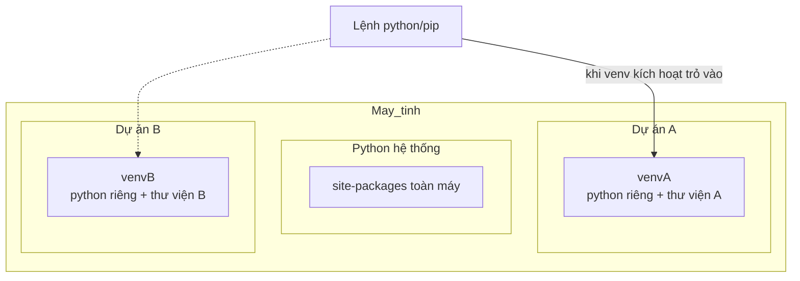

# 🧪 Bài 30: Virtual Environment – Môi Trường Ảo Cho Mỗi Dự Án

> 🎓 **Chương 10 – Làm việc như lập trình viên chuyên nghiệp**
> Bạn đã biết module (bài 20), package (bài 21), và sắp tới sẽ học cách cài thư viện bằng **pip** (bài 31). Nhưng làm việc theo kiểu chuyên nghiệp nghĩa là: mỗi dự án một **"môi trường sống" riêng biệt** — nơi chứa đúng các thư viện dự án đó cần, không đụng chạm gì tới dự án khác. Đó chính là **Virtual Environment (môi trường ảo)** — chủ đề của bài hôm nay.

---

## 🎯 Mục tiêu

Sau bài học này, học viên sẽ:

* ✅ Hiểu **vì sao cần môi trường ảo** — mỗi dự án dùng thư viện riêng, tránh xung đột phiên bản.
* ✅ Tạo được môi trường ảo bằng lệnh **`python -m venv ten_env`**.
* ✅ **Kích hoạt** môi trường trên Windows (PowerShell/CMD) và macOS/Linux.
* ✅ **Tắt** môi trường ảo bằng lệnh `deactivate`.
* ✅ Chọn môi trường ảo làm **interpreter trong VS Code**.
* ✅ Nắm được **bảng so sánh** và các lưu ý quan trọng (không commit thư mục `venv`).

---

## 📖 Kiến thức

### 1. Nhắc nhẹ bài trước — bài này đi theo hướng "thực chiến"

Từ bài 28, 29 bạn đã làm quen với kỹ thuật nâng cao. Từ bài 30 trở đi, chúng ta chuyển hẳn sang phong cách **làm việc như lập trình viên thật**: quản lý môi trường, cài thư viện, làm việc với dữ liệu và mạng. Môi trường ảo là "chiếc hộp trong suốt" đầu tiên bạn cần làm chủ.

### 2. Vấn đề: vì sao cần môi trường ảo?

Hãy tưởng tượng tình huống:

* 📦 Dự án A cần thư viện `numpy` **phiên bản 1.24**.
* 📦 Dự án B cần thư viện `numpy` **phiên bản 2.1** (phiên bản mới thay đổi cách dùng).
* Nếu cài chung vào một chỗ "toàn hệ thống", hai dự án sẽ **giành nhau một phiên bản** → một trong hai dự án hỏng.

> 💬 **Ví dụ đời thực:** Một căn phòng ở chung cho 5 sinh viên — mỗi người mang đồ trang trí khác nhau, xích mích liên miên. Giải pháp: **mỗi người một phòng riêng**. Mỗi dự án Python một "phòng" (= venv) riêng, đúng đồ dùng mình cần.

**Lợi ích rõ ràng:**

| Lợi ích | Giải thích |
|---|---|
| 🔒 **Cách ly** | Mỗi dự án có bộ thư viện riêng, không đụng nhau |
| 🕒 **Phiên bản đúng** | Khóa đúng phiên bản thư viện mỗi dự án cần |
| 📦 **Sạch sẽ** | Không làm ô nhiễm Python hệ thống |
| 🤝 **Chia sẻ dễ** | Xuất file `requirements.txt` để người khác dựng lại môi trường (học ở bài 31) |

### 3. Môi trường ảo là gì?

**Môi trường ảo (virtual environment)** là một **thư mục tự chứa** bên trong dự án, ví dụ tên `venv`, gồm:

* Một **bản sao Python** (interpreter) dành riêng cho dự án.
* Một **thư mục `Lib/site-packages`** — nơi cài riêng các thư viện của dự án.

Khi bạn bật môi trường này, mọi lệnh `python` và `pip` đều trỏ RIÊNG VỀ môi trường đó, không phải Python hệ thống.



### 4. Tạo môi trường ảo — `python -m venv ten_env`

Mở terminal/cmd ở **thư mục dự án** và gõ:

```bash
python -m venv ten_env
```

* `python -m venv` — chạy module `venv` của Python (bài 20 có giới thiệu cách chạy module qua `-m`).
* `ten_env` — **tên thư mục** chứa môi trường. Tên phổ biến nhất là `venv` hoặc `.venv`.

> 💡 **Giải thích hiệu quả:** Lệnh này tạo một thư mục mới trong dự án, bên trong có Python riêng và sẵn `pip`. Thư mục đó chính là "phòng riêng" của dự án.

**Kiểm tra đã tạo thành công:** bạn sẽ thấy thư mục `ten_env` xuất hiện, bên trong có các thư mục con như `Scripts` (Windows) hoặc `bin` (macOS/Linux), `Lib`, `include`.

### 5. Kích hoạt môi trường ảo (Activate)

**Kích hoạt cực kỳ quan trọng** — chưa kích hoạt thì vẫn dùng Python hệ thống!

> 💬 **Ví dụ đời thực:** Bạn vào phòng riêng của mình (venv) cần **quẹt thẻ ra vào** — đó là lệnh kích hoạt. Khi đã vào phòng, mọi đồ dùng (thư viện) trong phòng đều dùng được.

Lệnh phụ thuộc hệ điều hành:

| Hệ điều hành | Shell | Lệnh kích hoạt |
|---|---|---|
| Windows | Command Prompt (cmd) | `venv\Scripts\activate.bat` |
| Windows | **PowerShell** | `venv\Scripts\Activate.ps1` |
| Windows | Git Bash | `source venv/Scripts/activate` |
| macOS / Linux | Bash | `source venv/bin/activate` |

**Khi kích hoạt thành công**, ở đầu dòng lệnh sẽ hiện tên môi trường trong dấu ngoặc:

```bash
(venv) C:\Users\An\du_an_A>
```

> ✅ **Dấu hiệu nhận ra:** thấy `(venv)` trước dấu nhắc là môi trường ảo **đang hoạt động**. Kiểm tra chắc chắn bằng `python --version` / `where python` (Windows) hoặc `which python` (Linux) — đường dẫn phải trỏ vào thư mục venv.

### 6. Tắt môi trường ảo — `deactivate`

Khi làm xong việc trong dự án, bạn có thể tắt:

```bash
deactivate
```

* Trả về Python hệ thống bình thường.
* Thư mục `venv` vẫn còn — bạn có thể kích hoạt lại bất cứ lúc nào.
* Đóng cửa sổ terminal cũng tự động "tắt" môi trường.

> ⚠️ Muốn **xoá hẳn** môi trường thì xoá thư mục `venv` (Windows Explorer hoặc `rmdir /s venv` — cần thận trọng). Xoá thư mục venv không ảnh hưởng gì tới dự án hay Python.

### 7. Venv trong VS Code — chọn interpreter

VS Code tự đề xuất môi trường ảo khi bạn mở thư mục dự án. Cách chọn thủ công:

1. Mở dự án trong VS Code (thư mục chứa `venv`).
2. Mở Command Palette: `Ctrl + Shift + P` → gõ `Python: Select Interpreter`.
3. Chọn dự án: tự hiện tên môi trường dạng `.\venv\Scripts\python.exe` hoặc `.venv/bin/python`.
4. Trạng thái: góc đáy trái hiển thị tên interpreter đang dùng.

> 💡 Khi chạy file bằng nút ▶ hoặc mở terminal trong VS Code, nếu môi trường được chọn đúng, terminal tự động kích hoạt venv — bạn thấy `(venv)` ngay từ đầu.

### 8. Mỗi dự án một venv — quy tắc vàng

> 📏 **Quy tắc vàng:** Mỗi dự án Python → **một môi trường ảo riêng**. Không dùng chung venv giữa hai dự án, vì lại mang xung đột trở lại.

Mô hình khi làm việc:

1. Tạo thư mục dự án.
2. Vào thư mục dự án.
3. Tạo venv: `python -m venv venv`.
4. Kích hoạt: (lệnh theo OS).
5. Cài thư viện: `pip install ten_thu_vien`.
6. Làm việc: viết code, chạy chương trình.

### 9. Bảng so sánh: venv vs global

| Tiêu chí | Python hệ thống | venv |
|---|---|---|
| Thư viện | Chung toàn máy | Riêng từng dự án |
| Xung đột phiên bản | Thường xảy ra | Không xảy ra |
| Cần kích hoạt | Không | Có |
| Ô nhiễm cài đặt | Có | Không |
| Khi dự án lớn hoặc nhóm | Khó quản lý | Chuẩn chuyên nghiệp |

### 10. Lưu ý quan trọng: KHÔNG commit `venv` lên git

Thư mục `venv` rẤT lớn (200–500 MB trở lên) và **không nên đưa vào git** (nếu dự án dùng Git được quản lý ở bài 31/41):

* ✂️ Tạo file **`.gitignore`** trong dự án với dòng `venv/` (hoặc `env/`, `.venv/`) để git bỏ qua.
* 📄 Thay vào đó, xuất **`requirements.txt`** (bài 31) — người khác chỉ cần `pip install -r requirements.txt` là dựng lại môi trường y hệt.

> 💡 **Nguyên tắc:** "Không commit môi trường, chỉ commit **hướng dẫn xây môi trường**".

---

## 💡 Ví dụ minh họa (chạy theo từng bước thật)

### Ví dụ 1: Tạo và sử dụng venv cho dự án "quản_lý_lớp"

**Bước 1 — Tạo dự án và môi trường ảo:**

```bash
mkdir du_an_quan_ly_lop
cd du_an_quan_ly_lop
python -m venv venv
```

* `mkdir` — tạo thư mục dự án.
* `cd` — đi vào dự án.
* `python -m venv venv` — tạo môi trường ảo tên `venv`.

**Bước 2 — Kích hoạt (Windows PowerShell):**

```powershell
.\venv\Scripts\Activate.ps1
```

Nếu bị lỗi "running script is disabled":

```powershell
Set-ExecutionPolicy -Scope Process -ExecutionPolicy Bypass
# rồi chạy lại lệnh activate
```

**Bước 3 — Kiểm tra Python & pip của môi trường:**

```powershell
python --version
pip --version
where python
```

`where python` trả đường dẫn nằm trong `venv\Scripts\` → thành công.

**Bước 4 — Thoát:**

```powershell
deactivate
```

### Ví dụ 2: macOS / Linux (Terminal)

```bash
python3 -m venv venv
source venv/bin/activate
python --version
deactivate
```

> Trên Linux/macOS lệnh python có thể là `python3`.

---

## 🔬 Ví dụ nâng cao

### Ví dụ 1: Tạo venv cho "môi trường thực hành" có thư viện

```bash
python -m venv thuchanh
source thuchanh/bin/activate        # Windows: thuchanh\Scripts\activate
pip install requests                # cài thử thư viện (kiến thức bài 31)
python -c "import requests; print(requests.__version__)"
deactivate
```

* Lệnh `python -c "..."` chạy nhanh một dòng code không cần tạo file.
* Sau `deactivate`, môi trường `thuchanh` vẫn còn nguyên để dùng lại.

### Ví dụ 2: Kiểm tra venv hoạt động không bằng `pip show`

```powershell
# Sau khi kích hoạt venv vừa tạo
pip show pip | Select-Object -Property Location
```

Vị trí trả về nằm trong thư mục venv → đúng môi trường đang hoạt động.

### Ví dụ 3: "Phòng riêng" — hai dự án hai numpy khác phiên bản

```bash
# Dự án A
mkdir du_an_A && cd du_an_A
python -m venv venv
source venv/bin/activate
pip install "numpy==1.24.0"
deactivate

# Dự án B — trình tự giống, phiên bản khác
mkdir du_an_B && cd du_an_B
python -m venv venv
source venv/bin/activate
pip install "numpy==2.1.0"
deactivate
```

Hai dự án có hai numpy riêng biệt, không can thià nhau — chính là vì môi trường ảo.

---

## ⚠️ Lỗi thường gặp

### Lỗi 1: Gõ `pip install` mà không kích hoạt venv

* **Nguyên nhân:** thư viện cài vào **Python hệ thống**, không phải venv.
* **Dấu hiệu:** không thấy `(venv)` ở đầu dòng lệnh.
* **Cáach sửa:** chạy lệnh kích hoạt trước, nhìn thấy `(venv)` rồi mới `pip install`.

### Lỗi 2: PowerShell chặn lệnh `Activate.ps1`

* **Lỗi hiện:** `...running scripts is disabled on this system`.
* **Nguyên nhân:** chính sách ExecutionPolicy mặc định.
* **Cách sửa:** cho phiên hiện tại: `Set-ExecutionPolicy -Scope Process -ExecutionPolicy Bypass`. Hoặc dùng `cmd` với lệnh `venv\Scripts\activate.bat`.

### Lỗi 3: tưởng đã ở trong venv nhưng `where python` chỉ về hệ thống

* **Nguyên nhân:** chưa kích hoạt hoặc kích hoạt ở cửa ký khác.
* **Cá sửa:** chạy `where python` (Windows) hoặc `which python` (Linux) sau khi kích hoạt; đường dẫn phải có `venv`.

### Lỗi 4: Vì sao `python` không chạy dù venv tồn tại?

* **Nguyên nhân:** venv chưa được **kích hoạt** hoặc đang ở thư mục con khác.
* **Cách sửa:** di chuyển về thư mục cây dự án, kích hoạt, rồi chạy `python`.

### Lỗi 5: Commit nhầm thư mục `venv` lên Git

* **Nguyên nhân:** quên `.gitignore`.
* **Cách sửa:** tạo `.gitignore` chứa `venv/`, dùng Git để bỏ đã theo dõi (`git rm -r --cached venv`) — chi tiết học ở bài Git (Chương sau).

---

## 💎 Mẹo

* 🏠 **Đặt tên chuẩn:** `venv` (phổ dụng), hoặc `.venv` để VS Code ẩn.
* ⚡ **Chọn interpreter sớm:** mở VS Code → `Python: Select Interpreter` ngay khi tạo venv.
* 🧹 **Làm sạch trong chớp:** thử thư viện không dùng thì gỡ để dự án gọn.
* 📄 **Luôn kèm `requirements.txt`** khi chia sẻ dự án (sẽ học ai bài 31).
* 🚫 **Không bao giờ commit `venv`;** hãy coi nó như "đồ dùng sinh viên" — mỗi máy phải tự chuẩn bị lại.
* 🧠 **Tăng sức mạnh:** dùng `virtualenv` + `virtualenvwrapper` khi cần nhiều venv đồng thời (chỉ học upgrade sau).

---

## 📝 Tóm tắt

| Thao tác | Lệnh |
|---|---|
| Tạo môi trường ảo | `python -m venv venv` |
| Kích hoạt – Windows (PowerShell) | `venv\Scripts\Activate.ps1` |
| Kích hoạt – Windows (cmd) | `venv\Scripts\activate.bat` |
| Kích hoạt – macOS/Linux | `source venv/bin/activate` |
| Kiểm tra | `(venv)` hiện đầu dòng; `where python` trỏ về venv |
| Tắt môi trường | `deactivate` |
| Xoá môi trường | xoá thư mục `venv` |
| Chọn trong VS Code | `Ctrl+Shift+P` → `Python: Select Interpreter` |
| Git | **không commit venv** — dùng `.gitignore` |

---

## 🧪 Kiểm tra nhanh

1. ❓ Môi trường ảo là gì và vì sao cần?
2. ❓ Lệnh tạo venv là gì?
3. ❓ Lệnh kích thích trên Windows PowerShell? Trên macOS/Linux?
4. ❓ Dấu hiệu nào cho biết venv được kích thích?
5. ❓ Lệnh nào tắt môi trường ảo?
6. ❓ Vì sao mỗi dự án nên có venv riêng?
7. ❓ venv có nên đẩy lên Git không? Vì sao?
8. ❓ VS Code chọn interpreter thế nào?
9. ❓ `python -m venv ten_env` làm những gì?
10. ❓ Muốn cài thư viện vào đúng venv cần làm gì trước?

<details>
<summary>🔍 Xem đáp án</summary>

1. Thư mục chứa Python riêng và thư viện riêng cho dự án; tránh xung đột phiên bản thư viện.
2. `python -m venv ten_env` (tên thường là `venv`).
3. Windows PowerShell: `venv\Scripts\Activate.ps1`; macOS/Linux: `source venv/bin/activate`.
4. Thấy `(venv)` ở đầu dòng lệnh; và `where python`/`which python` chỉ vào venv.
5. `deactivate`.
6. Mỗi dự án dùng phiên bản thư viện khác; venv riêng tránh xung đột.
7. Không. vì nó khá lớn và tái tạo được; nguyên tắc "commit hướng dẫn môi tạo, không commit môi trường".
8. `Ctrl + Shift + P` → `Python: Select Interpreter` → chọn interpreter có `venv`.
9. Tạo thư mục chứa bản Python riêng, pip riêng và site-packages riêng.
10. Kích hoạt môi trường trước (để có `(venv)`), rồi mới dùng pip.

</details>

---

## 📚 Bài đọc thêm

* [Python.org – venv (tài liệu official)](https://docs.python.org/3/library/venv.html)
* [Real Python – Python Virtual Environments: A Primer](https://realpython.com/python-virtual-environments-a-primer/)
* [VS Code – Using Python environments](https://code.visualstudio.com/docs/python/environments)
* [pip – tài liệu cài đặt package (chuẩn bị bài 31)](https://pip.pypa.io/en/stable/)

---

## 🏁 Kết thúc bài

🧪 Đã biết tạo và dùng môi trường ảo! Việc tiếp theo hiển nhiên xuất hiện: **cài thư viện vào môi trường đó như thế nào** — xem có những thư viện gì, gỡ ra sao, chia sẻ danh sách cho bạn bè... đó chính là công việc của **pip**. Hãy sang:

👉 **[Bài 31: Pip – Quản Lý Thư Viện](../31_Pip/bai_giang.md)**