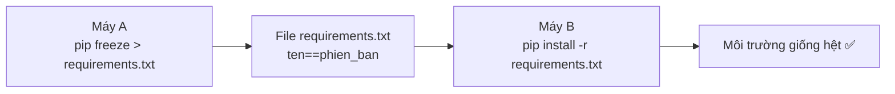

# 📦 Bài 31: Pip – Quản Lý Thư Viện

> 🎓 **Chương 10 – Làm việc như lập trình viên chuyên nghiệp**
> Bài 30 đã dạy bạn tạo "phòng riêng" cho dự án — **virtual environment**. Bài này dạy cách **mua sắm đồ đạc cho phòng đó**: cài thư viện, gỡ thư viện, xem danh sách, và quan trọng nhất là **xuất danh sách để chia sẻ**. Tất cả đều nhờ một công cụ nhỏ tên là **pip** — người bạn đồng hành của mọi lập trình viên Python.

---

## 🎯 Mục tiêu

Sau bài học này, học viên sẽ:

* ✅ Hiểu **pip là gì** và vai trò của nó trong hệ sinh thái Python.
* ✅ Dùng thành thạo **`pip install`**, **`pip uninstall`**, **`pip list`**, **`pip show`**.
* ✅ Xuất danh sách thư viện bằng **`pip freeze > requirements.txt`**.
* ✅ Cài toàn bộ thư viện từ danh sách bằng **`pip install -r requirements.txt`**.
* ✅ Cài đúng phiên bản thư viện (**`pip install requests==2.31.0`**).
* ✅ **Nâng cấp pip** và các thư viện khi cần.

---

## 📖 Kiến thức

### 1. Nhắc nhẹ bài trước — venv và pip đi đôi với nhau

Ở bài 30, bạn đã làm quen với môi trường ảo và chạy thử `pip install requests`. Câu hỏi đặt ra: pip hoạt động thế nào, có những lệnh nào, và vì sao phải cài thư viện qua pip thay vì tự tải về tay?

> 📦 **Câu trả lời ngắn:** pip là "siêu thị cài đặt" — bạn gọi tên món, pip tải món đó (kèm các món phụ thuộc) và bày vào đúng venv đang hoạt động.

### 2. Pip là gì?

**pip** (viết tắt của "Pip Installs Packages") là **trình quản lý thư viện** mặc định của Python, được cài sẵn từ Python 3.4 trở lên.

* 🔎 Tải thư viện từ **PyPI** (Python Package Index) — "chợ thư viện" chính thức của Python: https://pypi.org/.
* 📦 Tự động cài cả **thư viện phụ thuộc** (thư viện mà thư viện bạn cần dựa vào).
* 🧹 Gỡ cài đặt, cập nhật phiên bản, liệt kê mọi thứ đã cài.

> 💬 **Ví dụ đời thực:** PyPI giống **chợ trung tâm**, pip giống **shipper** — bạn báo món ("requests"), shipper chạy vào chợ lấy món và mang về tận nhà (venv), kèm cả "gia vị kèm theo" (thư viện phụ thuộc).

**Kiểm tra pip đã có chưa:**

```bash
python -m pip --version
```

Kết quả dạng:

```
pip 26.1.2 from C:\Python314\Lib\site-packages\pip (python 3.14)
```

> 💡 Mẹo: dùng `python -m pip` thay cho `pip` để chắc chắn chạy đúng pip của Python hiện tại (đặc biệt khi có nhiều Python trên máy).

### 3. Cài thư viện — `pip install`

```bash
pip install requests
```

* Không ghi phiên bản → pip cài **bản mới nhất**.
* Có thể cài nhiều thư viện cùng lúc: `pip install requests flask`.

**Cài đúng phiên bản cụ thể:**

```bash
pip install requests==2.31.0
```

| Cú pháp | Ý nghĩa |
|---|---|
| `pip install requests` | Bản mới nhất |
| `pip install requests==2.31.0` | Đúng phiên bản 2.31.0 |
| `pip install "requests>=2.31"` | Lớn hơn hoặc bằng 2.31 |
| `pip install requests==2.31.0 "flask<3"` | Nhiều ràng buộc cùng lúc |

> ⚠️ **Quan trọng:** khi cài thư viện phải **kích hoạt venv trước** — nếu không thư viện sẽ cài vào Python hệ thống, làm hỏng sự tách biệt (bài 30).

### 4. Xem thư viện đã cài — `pip list` và `pip show`

**`pip list`** — danh sách mọi thư viện trong môi trường hiện tại:

```bash
pip list
```

```
Package            Version
------------------ ----------
certifi            2025.5.15
charset-normalizer 3.4.1
idna              3.10
pip               26.1.2
requests          2.32.3
```

**`pip show ten_thu_vien`** — chi tiết một thư viện (tác giả, phiên bản, cần cho ai...):

```bash
pip show requests
```

```
Name: requests
Version: 2.32.3
Summary: Python HTTP for Humans.
Author: Kenneth Reitz
Requires: certifi, charset-normalizer, idna, urllib3
```

> 🔎 Nhìn mục `Requires` — bạn sẽ thấy các thư viện phụ thuộc mà pip tự cài kèm!

### 5. Gỡ thư viện — `pip uninstall`

```bash
pip uninstall requests
```

* Hỏi xác nhận `y/n`; dùng `-y` để xác nhận luôn: `pip uninstall requests -y`.

> ⚠️ Gỡ thư viện mà thư viện khác đang dùng có thể làm chương trình khác hỏng — hãy xem mục `Requires` trước khi gỡ.

### 6. Xuất danh sách — `pip freeze` và `requirements.txt`

**`pip freeze`** — in danh sách theo định dạng `ten==phiên_bản`:

```bash
pip freeze
```

```
certifi==2025.5.15
charset-normalizer==3.4.1
idna==3.10
requests==2.32.3
urllib3==2.3.0
```

**Lưu vào file `requirements.txt`:**

```bash
pip freeze > requirements.txt
```

**Người khác (hoặc máy khác) khôi phục môi trường y hệt:**

```bash
pip install -r requirements.txt
```

> 💬 **Ví dụ đời thực:** `requirements.txt` giống **thực đơn món ăn** — bạn không gửi thức ăn đi, bạn gửi thực đơn để nhà hàng khác nấu y hệt. Nguyên tắc này nối tiếp bài 30: không commit venv, chỉ commit `requirements.txt`.



### 7. Nâng cấp pip và thư viện

**Nâng cấp chính pip:**

```bash
python -m pip install --upgrade pip
```

**Nâng cấp một thư viện:**

```bash
pip install --upgrade requests
```

**Xem thư viện nào đã cũ (có phiên bản mới hơn):**

```bash
pip list --outdated
```

> 💡 Nâng cấp pip thỉnh thoảng thôi; pip cũ vẫn cài thư viện bình thường nhưng bản mới sửa lỗi và nhanh hơn.

### 8. Bảng lệnh thường dùng (tham khảo nhanh)

| Lệnh | Chức năng |
|---|---|
| `pip install ten_thu_vien` | Cài thư viện (bản mới nhất) |
| `pip install ten==1.2.3` | Cài đúng phiên bản |
| `pip uninstall ten` | Gỡ thư viện |
| `pip list` | Xem danh sách đã cài |
| `pip show ten` | Xem chi tiết thư viện |
| `pip freeze > requirements.txt` | Xuất danh sách ra file |
| `pip install -r requirements.txt` | Cài theo danh sách |
| `pip install --upgrade pip` | Nâng cấp pip |
| `pip list --outdated` | Xem thư viện có bản mới |
| `python -m pip --version` | Kiểm tra pip |

---

## 💡 Ví dụ minh họa

### Ví dụ 1: Tạo dự án hoàn chỉnh bằng pip (cài thư viện thật)

**Bước 1 — chuẩn bị venv (bài 30):**

```bash
mkdir vi_du_pip && cd vi_du_pip
python -m venv venv
venv\Scripts\activate        # Windows; macOS/Linux: source venv/bin/activate
```

**Bước 2 — cài hai thư viện:**

```bash
pip install requests flask
```

**Bước 3 — kiểm tra:**

```bash
pip list
```

**Giải thích từng dòng:**

| Lệnh | Ý nghĩa |
|---|---|
| `python -m venv venv` | Tạo môi trường ảo (bài 30) |
| `venv\Scripts\activate` | Kích hoạt venv — thấy `(venv)` đầu dòng |
| `pip install requests flask` | Cài 2 thư viện và mọi phụ thuộc của chúng |
| `pip list` | Xác nhận danh sách đã có requests, flask |

### Ví dụ 2: Xuất và khôi phục môi trường

**Xuất:**

```bash
pip freeze > requirements.txt
```

**Xem nội dung file:**

```bash
type requirements.txt      # Windows
cat requirements.txt       # macOS/Linux
```

**Khôi phục trên máy khác:**

```bash
pip install -r requirements.txt
```

> ✅ Sau lệnh cuối, máy khác có đúng bộ thư viện cùng phiên bản — không cần chỉnh tay từng thứ.

### Ví dụ 3: Cài phiên bản cụ thể và kiểm chứng

```bash
pip install requests==2.31.0
pip show requests | findstr Version        # Windows
pip show requests | grep Version           # macOS/Linux
```

Kết quả `Version: 2.31.0` — đúng phiên bản đã yêu cầu.

---

## 🔬 Ví dụ nâng cao

### Ví dụ 1: Cài thư viện "từ nguồn khác" — GitHub

```bash
pip install git+https://github.com/user/thu_vien.git
```

* Dùng khi thư viện chưa lên PyPI hoặc cần bản mới nhất trên GitHub.
* Đi kèm yêu cầu máy có Git.

### Ví dụ 2: Báo cáo "sức khỏe" môi trường

```bash
pip list --outdated
pip check
```

* `pip list --outdated` — thư viện nào có phiên bản mới hơn.
* `pip check` — phát hiện thư viện **thiếu phụ thuộc hoặc xung đột phiên bản**.

### Ví dụ 3: Tự động cài mọi thứ cho dự án mới

```bash
git clone https://github.com/ten_nhom/du_an.git
cd du_an
python -m venv venv
venv\Scripts\activate
pip install -r requirements.txt
python app.py
```

Quy trình 5 bước chuẩn "nhận việc về máy mới" của lập trình viên — bạn thấy vai trò pip rất rõ ở bước thứ tư.

---

## ⚠️ Lỗi thường gặp

### Lỗi 1: `pip is not recognized` (Windows)

* **Nguyên nhân:** pip chưa nằm trong PATH hoặc chưa kích hoạt venv.
* **Cách sửa:** thử `python -m pip` thay vì `pip`; hoặc kích hoạt venv trước; hoặc cài lại Python kèm "Add to PATH".

### Lỗi 2: Cài vào sai môi trường (không thấy `(venv)`)

* **Nguyên nhân:** quên kích hoạt venv → thư viện rơi vào Python hệ thống.
* **Cách sửa:** luôn kiểm tra `(venv)` ở đầu dòng lệnh trước khi `pip install`.

### Lỗi 3: `No matching distribution found for ten`

* **Nguyên nhân:** tên viết sai, hoặc thư viện không tồn tại trên PyPI.
* **Cách sửa:** kiểm tra chính tả tên thư viện trên https://pypi.org/.

### Lỗi 4: Xung đột phiên bản — `ResolutionImpossible`

* **Nguyên nhân:** hai thư viện đòi hai phiên bản khác nhau của cùng một thư viện con.
* **Cách sửa:** chọn bộ phiên bản tương thích hoặc cài từng thư viện vào từng venv khác nhau.

### Lỗi 5: Quên `> requirements.txt` — tưởng freeze đã ghi file

* **Nguyên nhân:** `pip freeze` chỉ in ra màn hình, không tự lưu file.
* **Cách sửa:** dùng `pip freeze > requirements.txt` — dấu `>` là **chuyển hướng in ra file**.

---

## 💎 Mẹo

* 🎯 **`python -m pip` an toàn hơn `pip`** — luôn dùng pip của đúng Python đang chạy.
* 📄 **Đặt `requirements.txt` ở gốc dự án** — chuẩn cộng đồng, dễ thấy.
* 🧹 **Sau khi gỡ thư viện**, chạy `pip check` để chắc không phá phụ thuộc.
* 🚀 **Cài nhiều lần một lúc:** `pip install a b c` tiết kiệm thời gian.
* ⚡ **Cài nhanh hơn** bằng gương (mirror) trong nước nếu tải chậm: `pip install -i https://pypi.tuna.tsinghua.edu.cn/simple ten_thu_vien` — tìm gương phù hợp nơi bạn ở.
* 🔐 **Cảnh giác lệnh cài từ trang lạ** — chỉ cài thư viện đã tin cậy từ PyPI.
* 💡 Lệnh hay quên nhất: `pip freeze > requirements.txt` — in ra nhớ ngay: **freeze (đóng băng) danh sách** → lưu file → chia sẻ.

---

## 📝 Tóm tắt

| Khái niệm | Nội dung |
|---|---|
| 📦 pip | Trình quản lý thư viện Python, cài từ PyPI |
| 🛒 PyPI | Chợ thư viện chính thức (pypi.org) |
| ⬇️ `pip install x` | Cài thư viện x |
| 🎯 `pip install x==1.2.3` | Cài đúng phiên bản |
| 🗑️ `pip uninstall x` | Gỡ thư viện x |
| 📋 `pip list` / `pip show x` | Xem danh sách / chi tiết |
| 🧾 `pip freeze > requirements.txt` | Xuất danh sách ra file |
| ♻️ `pip install -r requirements.txt` | Cài theo danh sách |
| ⬆️ `pip install --upgrade pip` | Nâng cấp pip |

---

## 🧪 Kiểm tra nhanh

1. ❓ pip là gì? Thư viện được tải từ đâu?
2. ❓ Lệnh cài thư viện `requests` phiên bản 2.31.0?
3. ❓ `pip list` và `pip show requests` khác nhau thế nào?
4. ❓ Lệnh gỡ thư viện và xác nhận tự động?
5. ❓ Làm sao để người khác dựng lại môi trường y hệt bạn?
6. ❓ `requirements.txt` có định dạng gì?
7. ❓ Trước khi `pip install` cần làm gì (về môi trường)?
8. ❓ Lệnh nâng cấp pip?
9. ❓ `pip freeze > requirements.txt` — dấu `>` làm gì?
10. ❓ Nếu cài nhầm phiên bản, lệnh nào thay đổi?

<details>
<summary>🔍 Xem đáp án</summary>

1. Trình quản lý thư viện Python; tải từ PyPI (pypi.org).
2. `pip install requests==2.31.0`.
3. `pip list` — danh sách tất cả; `pip show requests` — chi tiết một thư viện.
4. `pip uninstall requests -y`.
5. Xuất `pip freeze > requirements.txt`, người kia chạy `pip install -r requirements.txt`.
6. Dạng `ten_thu_vien==phien_ban` (mỗi dòng một thư viện).
7. Kích hoạt venv (thấy `(venv)` đầu dòng).
8. `python -m pip install --upgrade pip`.
9. Chuyển hướng (redirect) kết quả in vào file thay vì màn hình.
10. `pip install requests==phien_ban_moi` — pip sẽ gỡ bản cũ và cài bản mới.

</details>

---

## 📚 Bài đọc thêm

* [PyPI – Chợ thư viện chính thức](https://pypi.org/)
* [pip – Tài liệu chính thức](https://pip.pypa.io/en/stable/)
* [Python.org – Installing Packages](https://packaging.python.org/en/latest/tutorials/installing-packages/)
* [Real Python – What is Pip?](https://realpython.com/what-is-pip/)

---

## 🏁 Kết thúc bài

📦 Tuyệt vời! Bạn đã biết cài, gỡ, xem, xuất danh sách thư viện. Giờ là lúc dùng kỹ năng này vào việc thực tế: dữ liệu từ **file JSON** — định dạng lưu trữ phổ biến nhất trên web và trong cấu hình ứng dụng. Hãy sang:

👉 **[Bài 32: JSON – Lưu Trữ Dữ Liệu](../32_JSON/bai_giang.md)**