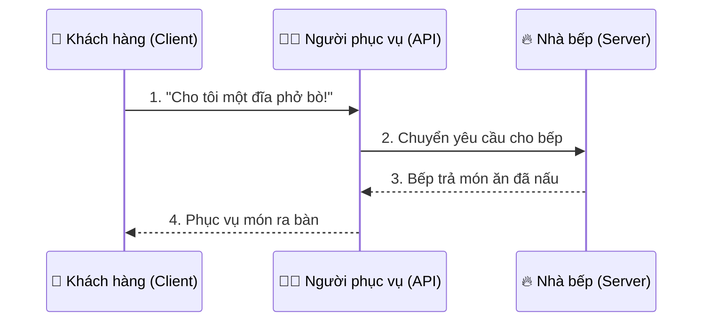
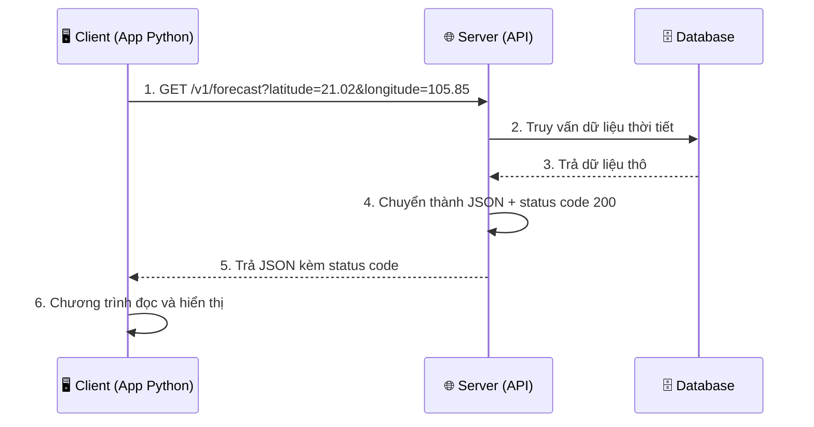

# 🌐 Bài 34: API – Giao Tiếp Giữa Các Chương Trình

> 🎓 **Chương 10 – Dữ liệu và mạng**
> Bài 33 bạn đã học lưu dữ liệu vào file CSV — dữ liệu nằm ngay trên máy mình. Bài này mở ra cánh cửa lớn hơn: lấy dữ liệu từ **các dịch vụ trên Internet** qua **API**. Đây là kỹ thuật nền tảng để viết app thời tiết, chatbot, app đặt đồ ăn, gọi AI... Bài này **học lý thuyết**; bài 35 sẽ học cách thực sự gọi API bằng Python.

---

## 🎯 Mục tiêu

Sau bài học này, học viên sẽ:

* ✅ Hiểu **API là gì** qua ví dụ đời thực (nhà hàng, thực đơn, người phục vụ).
* ✅ Biết **REST** là bộ quy ước giao tiếp phổ biến trên web.
* ✅ Phân biệt được 4 **phương thức HTTP**: `GET`, `POST`, `PUT`, `DELETE`.
* ✅ Đọc được **URL / endpoint** và hiểu ý nghĩa từng thành phần.
* ✅ Nhận biết các **mã trạng thái (status code)** thường gặp: 200, 201, 400, 404, 500...
* ✅ Hiểu **JSON** là định dạng phản hồi phổ biến của API.
* ✅ Mô tả được **luồng giao tiếp** Client → Server → Database qua sơ đồ.
* ✅ Nhận diện API thời tiết **Open-Meteo** — ví dụ thực tế dùng xuyên 2 bài tiếp.

---

## 📖 Kiến thức

### 1. Nhắc nhẹ bài trước — dữ liệu ở đâu?

Bài 32–33 bạn làm việc với **file cục bộ**: đọc JSON, ghi CSV ngay trên máy tính. Nhưng trong thực tế, dữ liệu thường ở **máy chủ xa** (server): thời tiết thuộc về trạm khí tượng, giá vàng thuộc về ngân hàng, tên lửa thuộc về NASA... Làm sao chương trình của bạn xin được dữ liệu đó? Câu trả lời: **gọi API**.

### 2. API là gì?

> 💬 **Nói đơn giản:** **API** (Application Programming Interface — Giao diện lập trình ứng dụng) là **người phục vụ trung gian** giúp hai chương trình nói chuyện với nhau mà không cần biết bên trong nhau hoạt động thế nào.

**🏪 Ví dụ đời thực — Nhà hàng:**

Bạn là **khách hàng (client)**, nhà bếp là **máy chủ (server)**:



* 🧑🍳 **Người phục vụ** chính là **API**: bạn không đi thẳng vào bếp, không cần biết bếp nấu bằng nồi gì.
* 📋 **Thực đơn** là **danh sách API** (endpoint): chỉ được gọi những món có trong thực đơn.
* 💬 **Ngôn ngữ chung** là **HTTP**: mọi nhà hàng, mọi khách đều hiểu quy ước này.

**Máy tính gọi API:**
* 📱 App thời tiết trên điện thoại gọi API của trạm khí tượng → nhận nhiệt độ.
* 🛒 App Shopee gọi API của ngân hàng để kiểm tra thanh toán.
* 🤖 ChatGPT gọi API để gửi câu hỏi và nhận câu trả lời.

### 3. REST là gì?

**REST** (Representational State Transfer) là **bộ quy tắc thiết kế API** được web dùng rộng rãi nhất. API tuân theo REST gọi là **RESTful API**.

| Quy tắc | Ý nghĩa |
|---|---|
| 📍 Mỗi tài nguyên có một **URL** riêng | `hoc_sinh`, `san_pham`, `don_hang` |
| 🔧 Tài nguyên được thao tác bằng **phương thức HTTP** | GET đọc, POST tạo, PUT sửa, DELETE xóa |
| 📦 Dữ liệu trao đổi bằng **JSON** | nhẹ, dễ đọc, ai cũng parse được |
| 🚦 Mỗi yêu cầu đều có **status code** báo kết quả | thành công hay thất bại |

> 🏪 Nhà hàng: thực đơn + người phục vụ + quy tắc đặt món chính là một "REST" của nhà hàng — quy tắc chung để mọi khách dùng được.

### 4. Phương thức HTTP — 4 hành động chính

| Phương thức | Hành động | Ví dụ nhà hàng | Dùng khi |
|---|---|---|---|
| **GET** | Lấy dữ liệu | "Cho xem thực đơn" | Đọc, không thay đổi gì |
| **POST** | Tạo dữ liệu mới | "Tạo đơn đặt món mới" | Thêm mới |
| **PUT** | Cập nhật toàn bộ | "Đổi toàn bộ món trong đơn" | Sửa |
| **DELETE** | Xóa dữ liệu | "Hủy đơn" | Xóa |

> 💡 Nhớ mẹo: **GET** giống người đưa **thư đi lấy hàng về**; **POST** giống người đưa **thư đi gửi hàng đi** — một cái kéo dữ liệu về, một cái đẩy dữ liệu lên.

### 5. URL và Endpoint

**Endpoint** = địa chỉ một "món ăn" cụ thể trong thực đơn API. **URL** là chuỗi địa chỉ đầy đủ để truy cập nó.

Ví dụ URL API thời tiết Open-Meteo (miễn phí, không cần khóa API):

```
https://api.open-meteo.com/v1/forecast?latitude=21.0285&longitude=105.8542&current_weather=true
```

| Thành phần | Trong ví dụ | Ý nghĩa |
|---|---|---|
| 🔒 Giao thức | `https://` | Hội thoại an toàn, mã hóa |
| 🌐 Tên miền | `api.open-meteo.com` | Máy chủ nào đang được gọi |
| 🛣️ Đường dẫn | `/v1/forecast` | Endpoint: "món" nào trong thực đơn |
| ❓ Dấu hỏi | `?` | Bắt đầu phần tham số |
| 🎛️ Tham số | `latitude=21.0285&longitude=105.8542&current_weather=true` | "Gia vị": tọa độ, muốn gì (các cặp `khóa=giá trị` ngăn cách bằng `&`) |

> 💬 **Ví dụ đời thực:** URL giống như **địa chỉ giao đồ ăn đầy đủ**: tên quán (tên miền) + tên món (endpoint) + ghi chú "ít cay, nhiều rau" (tham số).

### 6. Status code — "mã trạng thái" của phản hồi

Mỗi phản hồi từ máy chủ đều kèm một con số 3 chữ số báo kết quả. Giống như câu "món của bạn đang nấu" hay "món này hết rồi" của nhà hàng.

| Mã | Nhóm | Ý nghĩa | Ví dụ |
|---|---|---|---|
| **200** | ✅ 2xx – Thành công | OK, có dữ liệu | Lấy được thời tiết |
| **201** | ✅ 2xx – Thành công | Đã tạo mới | Tạo tài khoản thành công |
| **400** | ❌ 4xx – Lỗi của bạn | Yêu cầu sai cú pháp | Thiếu tham số bắt buộc |
| **401** | ❌ 4xx – Lỗi của bạn | Chưa đăng nhập | Thiếu API key |
| **403** | ❌ 4xx – Lỗi của bạn | Bị cấm truy cập | Thiếu User-Agent (bài 35!) |
| **404** | ❌ 4xx – Lỗi của bạn | Không tìm thấy | Sai endpoint, sai id |
| **500** | ❌ 5xx – Lỗi máy chủ | Server hỏng | Hệ thống ngân hàng sập |

> 🏪 Nhà hàng: `200` = "phở đây rồi", `201` = "đơn đã tạo", `400` = "bạn gọi món không có trong thực đơn", `404` = "quán không có món đó", `500` = "bếp đang cháy".

### 7. JSON response — câu trả lời của máy chủ

Máy chủ trả dữ liệu dạng **JSON** (đã học bài 32!) — chuỗi văn bản có cấu trúc. Ví dụ Open-Meteo trả về thời tiết Hà Nội:

```json
{
  "latitude": 21.0285,
  "longitude": 105.8542,
  "current_weather": {
    "temperature": 30.2,
    "windspeed": 11.5,
    "weathercode": 1,
    "time": "2026-08-05T09:00"
  }
}
```

* `temperature: 30.2` — nhiệt độ hiện tại 30.2°C.
* `windspeed: 11.5` — gió 11.5 km/h.
* `weathercode: 1` — mã thời tiết (1 = trời hơi có mây).
* Cấu trúc **lồng nhau**: `current_weather` chứa thêm các giá trị bên trong — giống dict trong dict (bài 17, 32).

### 8. Sơ đồ luồng gọi API đầy đủ



> 💡 **Client** = chương trình của bạn (điện thoại, app, trình duyệt...). **Server** = máy tính "biết" dữ liệu. **Database** = nơi cất giữ dữ liệu. Bạn chỉ "nói chuyện" với server; server lo phần kho dữ liệu của nó.

### 9. Ví dụ thực tế: Open-Meteo

**Open-Meteo** là dịch vụ thời tiết miễn phí, không cần đăng ký khóa (API key) — rất hợp để học:

* 📍 Cho tọa độ (vĩ độ `latitude`, kinh độ `longitude`) → nhận thời tiết tại đó.
* 🌏 Hà Nội: `latitude=21.0285`, `longitude=105.8542`.
* 🧪 Muốn thêm tham số `current_weather=true` để lấy thời tiết hiện tại.
* 🔗 Có thể thử ngay trên trình duyệt bằng cách dán URL vào thanh địa chỉ — trình duyệt chính là một "client".

> ⚠️ **Bài này chưa viết code gọi API** — bạn vừa thấy khái niệm URL, JSON, status code. Sang bài 35, ta sẽ dùng thư viện `requests` để gọi đúng URL trên từ Python và xử lý JSON.

### 10. Khái niệm bổ sung — headers và API key

* 📋 **Headers** — "phong bì thư" của yêu cầu: gửi kèm thông tin như tên client (`User-Agent`), loại dữ liệu chấp nhận... Một số server từ chối (403) yêu cầu không có `User-Agent`.
* 🔑 **API key** — "thẻ thành viên" nhà hàng: một số API (Google Maps, ChatGPT...) yêu cầu đăng ký để lấy khóa rồi gửi kèm mỗi yêu cầu. Open-Meteo **không cần** key — lý tưởng cho bài tập.

---

## 💡 Ví dụ minh họa

### Ví dụ 1: Đọc URL như đọc "thực đơn"

```python
# Một URL API thời tiết (bài 35 sẽ gọi thật)
url = "https://api.open-meteo.com/v1/forecast?latitude=21.0285&longitude=105.8542&current_weather=true"

# Tách URL thành 2 phần: địa chỉ và tham số
vi_tri_hoi = url.index("?")            # vị trí dấu chấm hỏi
phan_1, phan_2 = url.split("?")        # ["https://...forecast", "latitude=..."]

print("Endpoint:", phan_1)             # phần trước dấu ?
print("Tham so :", phan_2)             # phần sau dấu ?
```

Kết quả:

```
Endpoint: https://api.open-meteo.com/v1/forecast
Tham so : latitude=21.0285&longitude=105.8542&current_weather=true
```

**Giải thích từng dòng:**

| Dòng | Ý nghĩa |
|---|---|
| `url.split("?")` | Cắt URL tại dấu `?` thành 2 phần (chuỗi — bài 18) |
| `phan_1` | Địa chỉ endpoint: máy chủ + đường dẫn |
| `phan_2` | Chuỗi tham số: 3 cặp `khóa=giá trị` ngăn cách `&` |

### Ví dụ 2: Đọc phản hồi JSON bằng `json.loads`

```python
import json

# Chuỗi JSON mô phỏng phản hồi API thời tiết (bài 35 sẽ nhận thật từ server)
phong_hoi = '''{
    "current_weather": {
        "temperature": 30.2,
        "windspeed": 11.5,
        "weathercode": 1
    }
}'''

du_lieu = json.loads(phong_hoi)                      # chuỗi JSON -> dict

nhiet_do = du_lieu["current_weather"]["temperature"]  # truy cập tầng 1 -> tầng 2
print(f"Ha Noi: {nhiet_do}°C")
```

Kết quả:

```
Ha Noi: 30.2°C
```

**Giải thích từng dòng:**

| Dòng | Ý nghĩa |
|---|---|
| `json.loads(phong_hoi)` | Biến chuỗi JSON thành dict Python (bài 32) |
| `du_lieu["current_weather"]` | Lấy dict con — tầng thứ nhất |
| `["temperature"]` | Lấy giá trị bên trong dict con — tầng thứ hai |

### Ví dụ 3: Mô phỏng "người phục vụ API"

```python
# Mô phỏng máy chủ thời tiết: nhận tọa độ, trả dữ liệu (thật sẽ là gọi mạng)
def phuc_vu_thoi_tiet(kinh_do, vi_do):
    if not (-90 <= vi_do <= 90) or not (-180 <= kinh_do <= 180):
        return 400, {"error": "Toa do khong hop le"}     # mô phỏng status 400
    return 200, {"temperature": 30.2, "city": "Ha Noi"}  # mô phỏng status 200

status, du_lieu = phuc_vu_thoi_tiet(105.8542, 21.0285)
print("Status:", status)
print("Du lieu:", du_lieu)
```

Kết quả:

```
Status: 200
Du lieu: {'temperature': 30.2, 'city': 'Ha Noi'}
```

**Giải thích từng dòng:**

| Dòng | Ý nghĩa |
|---|---|
| `if not (-90 <= vi_do <= 90)...` | Kiểm tra tọa độ hợp lệ, nếu sai trả về 400 |
| `return 200, {...}` | Server luôn trả 2 thứ: status code + dữ liệu JSON |
| `status, du_lieu = ...` | Giải nén 2 giá trị trả về — kỹ thuật gặp lại ở bài 35 |

---

## 🔬 Ví dụ nâng cao

### Ví dụ 1: Phân tích phản hồi JSON lồng nhau đầy đủ

```python
import json

# Phản hồi mô phỏng (đúng định dạng Open-Meteo trả về)
phong_hoi = '''{
    "latitude": 21.0285,
    "longitude": 105.8542,
    "timezone": "Asia/Bangkok",
    "current_weather": {
        "temperature": 30.2,
        "windspeed": 11.5,
        "weathercode": 1,
        "time": "2026-08-05T09:00"
    }
}'''

thoi_tiet = json.loads(phong_hoi)
cw = thoi_tiet["current_weather"]          # rút gọn biến cục bộ
print(f"Thoi diem : {cw['time']}")
print(f"Nhiet do  : {cw['temperature']}°C")
print(f"Gio       : {cw['windspeed']} km/h")
print(f"Ma thoi tiet: {cw['weathercode']}")
```

> 🏪 **Tình huống thực tế:** App thời tiết không cần hiểu bảng dữ liệu khí tượng — chỉ cần gọi API, nhận JSON, rút các giá trị cần thiết và hiển thị. Toàn bộ kỹ năng đọc JSON bạn có từ bài 32–34 là đủ!

### Ví dụ 2: "Nhà hàng API" — mô phỏng đủ 4 phương thức

```python
# Cơ sở dữ liệu mô phỏng của nhà hàng
thuc_don = [
    {"id": 1, "ten": "Pho bo", "gia": 50000},
    {"id": 2, "ten": "Bun cha", "gia": 45000},
]

def phuc_vu(phuong_thuc, du_lieu=None):
    """Mô phỏng server xử lý theo phương thức HTTP."""
    if phuong_thuc == "GET":            # xem thực đơn
        return 200, thuc_don
    if phuong_thuc == "POST":           # thêm món mới
        mon_moi = {"id": len(thuc_don) + 1, **du_lieu}
        thuc_don.append(mon_moi)
        return 201, mon_moi
    if phuong_thuc == "DELETE":         # xóa món
        mon = du_lieu
        thuc_don.remove(mon)
        return 200, {"da_xoa": mon["ten"]}
    return 405, {"error": "Phuong thuc khong ho tro"}

print(phuc_vu("GET"))
print(phuc_vu("POST", {"ten": "Com tam", "gia": 60000}))
print(phuc_vu("DELETE", thuc_don[1]))
```

> 💡 Mỗi phương thức trả **status code khác nhau**: GET→200, POST→201 (created!), DELETE→200. Đây chính là "ngôn ngữ" server dùng để báo kết quả.

### Ví dụ 3: Kiểm tra status code trước khi đọc dữ liệu

```python
# Mô phỏng: server trả về status code + chuỗi JSON (thật sẽ từ requests)
def nhan_phong_hoi():
    return 404, '{"error": "Khong tim thay thanh pho"}'

status, chuoi_json = nhan_phong_hoi()
if status == 200:
    print("Thanh cong! Doc du lieu...")
else:
    print(f"Loi {status}: khong doc du lieu")
```

> ⚠️ **Nguyên tắc vàng:** luôn kiểm tra status code trước, đọc dữ liệu sau. Bài 35 sẽ dùng đúng nguyên tắc này với `response.status_code`.

---

## ⚠️ Lỗi thường gặp

### Lỗi 1: Nhầm lẫn API với website

* **Sai:** gọi `https://open-meteo.com` (trang chủ) và mong nhận JSON thời tiết.
* **Đúng:** endpoint dữ liệu là `https://api.open-meteo.com/v1/forecast?...` — phải đúng máy chủ `api.` và đúng đường dẫn `/v1/forecast`.
* **Cách sửa:** đọc kỹ tài liệu (documentation) của API — "thực đơn" chính thức.

### Lỗi 2: Quên dấu `?` và `&` khi nối tham số

* **Sai:** `...forecast&latitude=21.02` — phải có `?` trước tham số đầu tiên.
* **Đúng:** `...forecast?latitude=21.02&longitude=105.85` — `?` trước tham số đầu, `&` giữa các tham số sau.
* **Cách sửa:** dùng tham số `params` của thư viện requests (bài 35) — khỏi lo lỗi nối chuỗi.

### Lỗi 3: Không đọc status code

* **Sai:** nhận phản hồi 404 vẫn cố đọc dữ liệu JSON → sai vì 404 thường không có dữ liệu.
* **Đúng:** kiểm tra `status_code == 200` trước khi đọc nội dung.
* **Cách sửa:** luôn xử lý theo trạng thái, như ví dụ nâng cao 3.

### Lỗi 4: Giữ API key trong code công khai

* **Sai:** dán API key (nếu có) thẳng vào file code rồi đưa lên GitHub.
* **Đúng:** lưu trong biến môi trường hoặc file cấu hình bí mật.
* **Cách sửa:** không bao giờ commit khóa bí mật; học cách dùng `os.environ` (bài 38).

### Lỗi 5: Gọi API không có User-Agent

* **Nguyên nhân:** một số server (như httpbin) từ chối yêu cầu "vô danh", trả **403**.
* **Cách sửa:** gửi kèm header `User-Agent` — sẽ học chi tiết ở bài 35.

---

## 💎 Mẹo

* 🏪 **Nhà hàng = API:** thực đơn = danh sách endpoint, phục vụ = lời gọi API, món ăn = dữ liệu, câu trả lời của bếp = status code.
* 🔗 **Mẹo thử API ngay:** dán URL API vào **trình duyệt** — trình duyệt là client, bạn thấy JSON và status ngay mà không cần code.
* 📚 **Đọc tài liệu trước khi gọi:** mọi API đều có tài liệu (docs) liệt kê endpoint, tham số, status code — "thực đơn chính thức".
* 🚦 **Ghi nhớ status code quan trọng:** 200, 201, 400, 401, 403, 404, 500 — 7 con số này gặp hàng ngày.
* 🔑 **Ưu tiên API miễn phí không key khi học:** Open-Meteo là lựa chọn hoàn hảo để thực hành.
* 🌐 **Phân biệt:** API trả **dữ liệu** (JSON), website trả **giao diện** (HTML) — đừng mong API về trang đẹp.

---

## 📝 Tóm tắt

| Khái niệm | Ý nghĩa |
|---|---|
| 🌐 API | Người phục vụ trung gian giữa client và server |
| 🏪 Ví dụ nhà hàng | Khách đặt món → phục vụ → bếp → mang ra bàn |
| 🧱 REST | Bộ quy tắc thiết kế API phổ biến |
| 📖 GET | Lấy dữ liệu (đọc thực đơn) |
| ➕ POST | Tạo dữ liệu mới (đặt món) |
| ✏️ PUT | Cập nhật (đổi món) |
| 🗑️ DELETE | Xóa (hủy đơn) |
| 🔗 Endpoint | URL của một tài nguyên trong API |
| 🚦 Status code | Con số báo kết quả: 200, 201, 400, 404, 500... |
| 📦 JSON | Định dạng phản hồi của API |
| 🗄️ Luồng giao tiếp | Client → Server → Database → về Client |

---

## 🧪 Kiểm tra nhanh

1. ❓ API là gì? Giải thích qua ví dụ nhà hàng.
2. ❓ REST là gì? Kể 4 phương thức HTTP cơ bản.
3. ❓ GET và POST khác nhau thế nào?
4. ❓ Trong URL `https://api.open-meteo.com/v1/forecast?latitude=21.02&longitude=105.85`, đâu là endpoint, đâu là tham số?
5. ❓ Status code 200, 201, 400, 404, 500 lần lượt có nghĩa gì?
6. ❓ API trả dữ liệu ở định dạng nào?
7. ❓ Client và Server khác nhau ra sao?
8. ❓ Sắp xếp đúng luồng gọi API: Database trả dữ liệu, Client gửi yêu cầu, Server trả JSON, Server truy vấn Database.
9. ❓ Vì sao nói Open-Meteo rất hợp để học API?
10. ❓ Trước khi đọc dữ liệu phản hồi, ta nên kiểm tra gì trước?

<details>
<summary>🔍 Xem đáp án</summary>

1. API là người phục vụ trung gian giúp hai chương trình trao đổi dữ liệu; khách không cần biết bếp hoạt động thế nào.
2. Bộ quy tắc thiết kế API; GET, POST, PUT, DELETE.
3. GET lấy dữ liệu về, không thay đổi gì; POST đẩy dữ liệu lên để tạo mới.
4. Endpoint: `https://api.open-meteo.com/v1/forecast`; tham số: `latitude=21.02&longitude=105.85`.
5. 200 OK, 201 đã tạo mới, 400 lỗi yêu cầu của client, 404 không tìm thấy, 500 lỗi máy chủ.
6. JSON.
7. Client là chương trình gửi yêu cầu (app, trình duyệt); Server là máy chủ có dữ liệu và xử lý yêu cầu.
8. Client gửi yêu cầu → Server truy vấn Database → Database trả dữ liệu → Server trả JSON.
9. Miễn phí, không cần API key, dữ liệu thật có thể thử bằng trình duyệt.
10. Kiểm tra status code (thường là 200) trước khi đọc nội dung JSON.

</details>

---

## 📚 Bài đọc thêm

* [MDN – HTTP response status codes](https://developer.mozilla.org/en-US/docs/Web/HTTP/Status)
* [MDN – HTTP request methods](https://developer.mozilla.org/en-US/docs/Web/HTTP/Methods)
* [Wikipedia – API](https://vi.wikipedia.org/wiki/API)
* [Open-Meteo – tài liệu chính thức](https://open-meteo.com/en/docs)
* [REST API Tutorial](https://restfulapi.net/)

---

## 🏁 Kết thúc bài

🌐 Tuyệt vời! Bạn đã hiểu **API là gì**, các **phương thức HTTP**, **URL/endpoint**, **status code** và **JSON response** — nền tảng lý thuyết đã sẵn sàng. Câu hỏi còn lại là: **gọi API từ Python như thế nào?** Câu trả lời nằm ở thư viện nổi tiếng nhất — `requests`. Hãy sang:

👉 **[Bài 35: Thư Viện Requests – Gọi API Từ Python](../35_Requests/bai_giang.md)**
