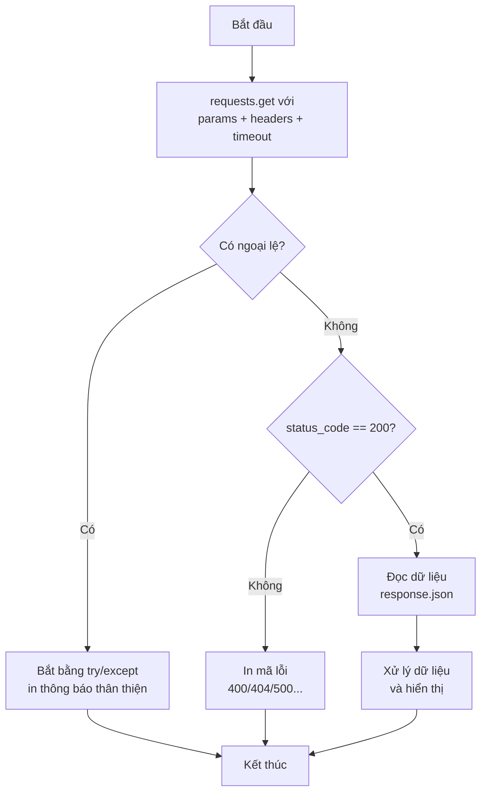

# 📡 Bài 35: Thư Viện Requests – Gọi API Từ Python

> 🎓 **Chương 10 – Dữ liệu và mạng**
> Bài 34 bạn đã hiểu API là gì: endpoint, phương thức HTTP, status code, JSON response — nhưng mới dừng ở mô phỏng. Bài này là **khoảnh khắc "chạm tay" vào thế giới thật**: dùng thư viện `requests` gọi API thật trên Internet, lấy thời tiết Hà Nội từ Open-Meteo (miễn phí, không cần khóa) và thử nghiệm với httpbin.org.

---

## 🎯 Mục tiêu

Sau bài học này, học viên sẽ:

* ✅ Cài đặt thư viện `requests` bằng `pip install requests`.
* ✅ Gửi yêu cầu **GET** với `requests.get()` và đọc phản hồi `.status_code`, `.text`, `.json()`.
* ✅ Truyền tham số qua **`params`** thay vì nối chuỗi thủ công.
* ✅ Gửi **headers** (User-Agent) — giải quyết lỗi 403.
* ✅ Gọi **POST** với dữ liệu JSON.
* ✅ Sử dụng **`timeout`** và bắt ngoại lệ bằng `try/except` — chương trình không bao giờ "treo" hay sập.
* ✅ Viết được chương trình **lấy thời tiết Hà Nội thật** từ Open-Meteo.

---

## 📖 Kiến thức

### 1. Nhắc nhẹ bài trước

Bài 34 bạn đã học "thực đơn" (endpoint), "người phục vụ" (API) và "ngôn ngữ" (HTTP + status code + JSON). Giờ chỉ còn một việc: **gửi yêu cầu thật** từ Python. Thư viện `requests` chính là "đôi chân" đưa lời gọi của bạn ra Internet.

### 2. Cài đặt thư viện `requests`

`requests` **không có sẵn** trong Python — phải cài từ kho thư viện PyPI:

```powershell
pip install requests
```

> 💡 Nhớ quy trình chuẩn từ bài 30–31: nên cài trong **môi trường ảo (venv)** của dự án, và dùng đúng Python đang chạy dự án. Kiểm tra cài đặt thành công:

```python
import requests          # không báo lỗi là đã cài xong
print(requests.__version__)
```

### 3. `requests.get` — yêu cầu lấy dữ liệu

```python
import requests

# Gửi yêu cầu GET tới dịch vụ httpbin (trả về chính yêu cầu của bạn)
phong_hoi = requests.get("https://httpbin.org/get")
print(phong_hoi.status_code)   # 200 — thành công
print(phong_hoi.text)          # nội dung thô (chuỗi)
```

> 🏪 Ví dụ nhà hàng: `requests.get(...)` giống bạn **gọi người phục vụ**: "Cho tôi xem thực đơn". Phản hồi (Response) là đĩa thức ăn được bưng ra: có mã trạng thái (200) và nội dung (dữ liệu).

**Đối tượng `Response`** — "đĩa thức ăn" chứa mọi thứ server trả về:

| Thuộc tính / phương thức | Ý nghĩa |
|---|---|
| `.status_code` | Mã trạng thái: 200, 201, 400, 404, 500... |
| `.text` | Nội dung thô dạng chuỗi (thường là JSON dạng chữ) |
| `.json()` | Tự phân tích nội dung thành dict/list Python |
| `.headers` | Tiêu đề phản hồi (server gửi kèm) |
| `.ok` | `True` nếu status_code < 400 |

### 4. Truyền tham số bằng `params`

URL tham số như `?latitude=21.0285&longitude=105.8542` **không cần tự nối chuỗi** — `requests` lo việc đó:

```python
import requests

# Cách sai: tự nối chuỗi, dễ sai dấu ? và &
# url = "https://httpbin.org/get?name=An&tuoi=15"

# Cách đúng: truyền dict cho params
tham_so = {"name": "An", "tuoi": 15}
phong_hoi = requests.get("https://httpbin.org/get", params=tham_so)
print(phong_hoi.url)    # xem URL thật đã được tạo
```

> 💡 `params` chính là hàm `tao_url` bạn tự viết ở bài 34 — giờ thư viện làm hộ. Tham số giá trị `True` cũng được chuyển thành `true` đúng chuẩn.

### 5. Headers — "phong bì" của yêu cầu và lỗi 403

Một số server muốn biết **ai** đang gọi. `User-Agent` là "danh thiếp" của chương trình bạn. Yêu cầu không có User-Agent có thể bị từ chối với **403 Forbidden**:

```python
import requests

# Thiếu User-Agent: một số server trả 403
phong_hoi = requests.get("https://httpbin.org/status/403")
print(phong_hoi.status_code)   # 403 — bị từ chối

# Gửi kèm headers: "xin chào, tôi là ứng dụng Python"
headers = {"User-Agent": "MyPythonApp/1.0"}
phong_hoi = requests.get("https://httpbin.org/get", headers=headers)
print(phong_hoi.status_code)   # 200
```

> 🏪 Nhà hàng: khách không tự giới thiệu (403) thì không được phục vụ; có danh thiếp (User-Agent) thì vào ngay.

### 6. Đọc dữ liệu JSON với `.json()`

Server trả chuỗi JSON (bài 32, 34). `.json()` phân tích chuỗi đó thành dict/list — **không cần `json.loads` nữa**:

```python
import requests

phong_hoi = requests.get("https://api.open-meteo.com/v1/forecast",
                         params={"latitude": 21.0285,
                                 "longitude": 105.8542,
                                 "current_weather": True})

du_lieu = phong_hoi.json()          # tự phân tích JSON -> dict
thoi_tiet = du_lieu["current_weather"]
print(f"Nhiet do Ha Noi: {thoi_tiet['temperature']}°C")
```

> ⚠️ **Quan trọng:** chỉ gọi `.json()` khi server **thực sự trả JSON** và status là 200. Nếu server trả lỗi (404, 500...) hoặc nội dung không phải JSON, `.json()` sẽ ném `JSONDecodeError` — cần xử lý (mục 9).

### 7. `timeout` và ngoại lệ — chương trình không bao giờ treo

**Mạng có thể chậm hoặc đứt.** Nếu không đặt thời gian chờ, chương trình có thể "đứng hình" hàng phút. Luôn đặt `timeout`:

```python
import requests

try:
    # timeout=10: chờ tối đa 10 giây rồi bỏ cuộc
    phong_hoi = requests.get("https://api.open-meteo.com/v1/forecast",
                             params={"latitude": 21.0285,
                                     "longitude": 105.8542,
                                     "current_weather": True},
                             timeout=10)
    phong_hoi.raise_for_status()        # 4xx/5xx sẽ ném lỗi HTTPError
    print(phong_hoi.status_code)
except requests.exceptions.Timeout:
    print("Het thoi gian cho — kiem tra mang!")
except requests.exceptions.ConnectionError:
    print("Khong ket noi duoc — may khong co mang?")
except requests.exceptions.RequestException as loi:
    print("Loi khac:", loi)
```

**Các ngoại lệ chính của `requests`:**

| Ngoại lệ | Khi nào xảy ra |
|---|---|
| `requests.exceptions.Timeout` | Chờ quá `timeout` giây vẫn không có phản hồi |
| `requests.exceptions.ConnectionError` | Không kết nối được (mất mạng, sai địa chỉ) |
| `requests.exceptions.HTTPError` | Server trả mã lỗi 4xx/5xx (khi dùng `raise_for_status()`) |
| `requests.exceptions.JSONDecodeError` | Nội dung không phải JSON nhưng bạn gọi `.json()` |
| `requests.exceptions.RequestException` | "Ông tổ" của mọi lỗi requests — bắt để chặn tất cả |

### 8. POST — gửi dữ liệu lên server

`POST` tạo dữ liệu mới (bài 34). Dùng tham số `json=` để gửi dữ liệu dạng JSON:

```python
import requests

du_lieu_moi = {"ten": "An", "lop": "10A1"}
phong_hoi = requests.post("https://httpbin.org/post", json=du_lieu_moi)

print(phong_hoi.status_code)        # 200 (httpbin luôn trả 200)
print(phong_hoi.json()["json"])     # httpbin "phản hồi lại" dữ liệu đã nhận
```

> 💡 `json=` tự chuyển dict thành chuỗi JSON, đặt header `Content-Type: application/json` — không cần tự `json.dumps`.

### 9. Quy trình gọi API an toàn — "nấu ăn" chuẩn



### 10. Ví dụ thực tế: thời tiết Hà Nội — Open-Meteo

API thời tiết miễn phí, không cần key (đã giới thiệu bài 34):

```python
import requests

# Hà Nội: vĩ độ 21.0285, kinh độ 105.8542
url = "https://api.open-meteo.com/v1/forecast"
tham_so = {
    "latitude": 21.0285,
    "longitude": 105.8542,
    "current_weather": True,
}

phong_hoi = requests.get(url, params=tham_so, timeout=10)
du_lieu = phong_hoi.json()          # dict chứa mọi dữ liệu

cw = du_lieu["current_weather"]     # rút dict con
print(f"Thoi diem  : {cw['time']}")
print(f"Nhiet do   : {cw['temperature']}°C")
print(f"Gio        : {cw['windspeed']} km/h")
```

> 🌏 Bạn có thể dán URL `https://api.open-meteo.com/v1/forecast?latitude=21.0285&longitude=105.8542&current_weather=true` vào trình duyệt để xem phản hồi JSON — chính xác thứ Python vừa nhận!

---

## 💡 Ví dụ minh họa

### Ví dụ 1: GET đơn giản — chào httpbin

```python
import requests

# httpbin.org/get trả về chính yêu cầu của bạn (miễn phí, dùng để học)
phong_hoi = requests.get("https://httpbin.org/get")

print("Status:", phong_hoi.status_code)   # 200
print("Text:", phong_hoi.text)            # toàn bộ nội dung thô
```

**Giải thích từng dòng:**

| Dòng | Ý nghĩa |
|---|---|
| `requests.get("https://httpbin.org/get")` | Gửi yêu cầu GET, trả đối tượng Response |
| `phong_hoi.status_code` | Mã trạng thái của phản hồi — 200 là thành công |
| `phong_hoi.text` | Nội dung thô dạng chuỗi (JSON dạng chữ) |

### Ví dụ 2: params và headers

```python
import requests

# Truyền tham số + headers cùng lúc
phong_hoi = requests.get(
    "https://httpbin.org/get",
    params={"name": "An", "tuoi": 15},
    headers={"User-Agent": "HocSinhPython/1.0"},
    timeout=10,
)

du_lieu = phong_hoi.json()          # phân tích JSON
print("URL da gui :", phong_hoi.url)     # ?name=An&tuoi=15
print("Tham so    :", du_lieu["args"])   # {"name": "An", "tuoi": "15"}
print("User-Agent :", du_lieu["headers"]["User-Agent"])
```

**Giải thích từng dòng:**

| Dòng | Ý nghĩa |
|---|---|
| `params={...}` | Dict tham số — requests tự nối thành `?name=An&tuoi=15` |
| `headers={...}` | Gửi kèm "danh thiếp" User-Agent — tránh 403 |
| `timeout=10` | Chờ tối đa 10 giây — không treo chương trình |
| `du_lieu["args"]` | httpbin phản hồi lại các tham số nó nhận được |

### Ví dụ 3: Xử lý status code trước khi đọc dữ liệu

```python
import requests

# httpbin.org/status/404 — server trả đúng mã 404
phong_hoi = requests.get("https://httpbin.org/status/404", timeout=10)

if phong_hoi.status_code == 200:
    print("Thanh cong:", phong_hoi.json())
else:
    print(f"Loi {phong_hoi.status_code} — khong doc duoc du lieu")
```

**Giải thích từng dòng:**

| Dòng | Ý nghĩa |
|---|---|
| `requests.get(".../status/404")` | httpbin có endpoint trả bất kỳ mã lỗi nào bạn muốn |
| `if phong_hoi.status_code == 200` | **Kiểm tra status trước**, đọc dữ liệu sau (bài 34!) |
| `else:` | 4xx/5xx chỉ in thông báo, không gọi `.json()` tránh sập |

---

## 🔬 Ví dụ nâng cao

### Ví dụ 1: Chương trình thời tiết Hà Nội hoàn chỉnh (chạy được!)

```python
import requests

# Hàm lấy thời tiết một thành phố theo tọa độ — an toàn với try/except
def lay_thoi_tiet(ten_thanh_pho, vi_do, kinh_do):
    """Gọi Open-Meteo, trả chuỗi mô tả thời tiết hoặc thông báo lỗi."""
    url = "https://api.open-meteo.com/v1/forecast"
    tham_so = {
        "latitude": vi_do,
        "longitude": kinh_do,
        "current_weather": True,
    }
    try:
        # timeout=10: chờ tối đa 10 giây
        phong_hoi = requests.get(url, params=tham_so, timeout=10)
        if phong_hoi.status_code != 200:
            return f"{ten_thanh_pho}: loi {phong_hoi.status_code}"

        cw = phong_hoi.json()["current_weather"]
        return (f"{ten_thanh_pho}: {cw['temperature']}°C, "
                f"gio {cw['windspeed']} km/h")
    except requests.exceptions.Timeout:
        return f"{ten_thanh_pho}: het thoi gian cho"
    except requests.exceptions.ConnectionError:
        return f"{ten_thanh_pho}: mat ket noi mang"
    except requests.exceptions.RequestException as loi:
        return f"{ten_thanh_pho}: loi {loi}"

# Hà Nội và TP.HCM
print(lay_thoi_tiet("Ha Noi", 21.0285, 105.8542))
print(lay_thoi_tiet("TP HCM", 10.8231, 106.6297))
```

**Giải thích từng phần:**

| Phần | Ý nghĩa |
|---|---|
| Hàm nhận 3 tham số | Tái sử dụng cho mọi thành phố — chỉ đổi tọa độ |
| `timeout=10` | Chống treo khi mạng chậm |
| `if status_code != 200` | Trả thông báo lỗi thay vì cố đọc JSON |
| `except Timeout / ConnectionError / RequestException` | Bắt 3 lớp lỗi phổ biến, ai cũng có thông báo riêng |
| Hàm luôn trả chuỗi | Gọi 2 lần, chương trình không bao giờ sập |

### Ví dụ 2: Kiểm tra dữ liệu trước khi `.json()`

```python
import requests

# Gọi thử: 404 sẽ không có JSON hợp lệ
phong_hoi = requests.get("https://httpbin.org/status/404", timeout=10)

try:
    du_lieu = phong_hoi.json()       # có thể ném JSONDecodeError
    print("OK:", du_lieu)
except requests.exceptions.JSONDecodeError:
    print(f"Khong phai JSON (status {phong_hoi.status_code}) — "
          f"noi dung: {phong_hoi.text}")
```

> 💡 Kết hợp cả 2 lớp bảo vệ: kiểm tra status + `try/except` quanh `.json()` — chương trình xử lý được mọi tình huống mạng thật.

### Ví dụ 3: POST với JSON — httpbin

```python
import requests

# Mô phỏng đăng ký học sinh (httpbin trả lại dữ liệu đã nhận)
du_lieu_dang_ky = {
    "ten": "Nguyen Van An",
    "lop": "10A1",
    "diem": 8,
}

phong_hoi = requests.post(
    "https://httpbin.org/post",
    json=du_lieu_dang_ky,
    timeout=10,
)

if phong_hoi.status_code == 200:
    phan_hoi = phong_hoi.json()
    print("Da gui:", phan_hoi["json"])        # dữ liệu server nhận được
    print("Content-Type:", phan_hoi["headers"]["Content-Type"])  # application/json
else:
    print("Loi:", phong_hoi.status_code)
```

> 🏪 Nhà hàng: POST giống đặt món — bạn gửi thông tin đơn hàng lên, server nhận và trả về xác nhận. httpbin giúp bạn "nhìn thấy" chính xác dữ liệu mình đã gửi.

---

## ⚠️ Lỗi thường gặp

### Lỗi 1: `ModuleNotFoundError: No module named 'requests'`

* **Nguyên nhân:** chưa cài thư viện.
* **Cách sửa:** chạy `pip install requests` trong đúng môi trường ảo (venv) đang dùng.

### Lỗi 2: Lỗi 403 Forbidden

* **Nguyên nhân:** server từ chối yêu cầu "vô danh" — thường do thiếu `User-Agent`.
* **Cách sửa:** gửi kèm `headers={"User-Agent": "..."}` (ví dụ tên ứng dụng của bạn).
* **Lưu ý:** một số API đòi **API key** (bài 34) — thiếu key cũng ra 401/403.

### Lỗi 3: Chương trình "đứng hình" mãi không trả kết quả

* **Nguyên nhân:** mạng chậm hoặc server không phản hồi, và bạn **quên `timeout`**.
* **Cách sửa:** luôn đặt `timeout=10` (hoặc số giây phù hợp).

### Lỗi 4: `JSONDecodeError: Expecting value` khi gọi `.json()`

* **Nguyên nhân:** nội dung không phải JSON — server trả 404/500, trang HTML, hoặc chuỗi rỗng.
* **Cách sửa:** kiểm tra `status_code == 200` trước; bọc `.json()` trong `try/except`.

### Lỗi 5: Cộng sai vì quên `int()`/`float()`

* **Nguyên nhân:** giá trị trong JSON có thể là chuỗi (ví dụ `"15"`) — cộng chuỗi cho kết quả sai.
* **Cách sửa:** `int(...)`/`float(...)` trước khi tính toán — giống bài 33 với CSV.

---

## 💎 Mẹo

* ⏱️ **Luôn `timeout`** — con số nhỏ (5–10 giây) đủ cho hầu hết API.
* 📦 **Kiểm tra status trước, `.json()` sau** — quy tắc vàng tránh mọi lỗi đọc dữ liệu.
* 🧪 **httpbin.org là "phòng thí nghiệm" tuyệt vời:** `/get`, `/post`, `/status/404`, `/status/500` — trả về đúng thứ bạn cần để luyện tập.
* 🌏 **Open-Meteo miễn phí, không key** — lý tưởng cho bài tập thời tiết thật.
* 🔧 **`raise_for_status()`** — một dòng thay cho `if status_code != 200`; ném HTTPError tự động.
* 🛡️ **Bắt `requests.exceptions.RequestException`** cuối cùng — "lưới an toàn" cho mọi lỗi còn lại.
* 📡 **Kiểm tra mạng trước khi đổ lỗi cho code:** thử dán URL vào trình duyệt xem có hoạt động không.
* 🐍 **`pip list`** — lệnh xem các thư viện đã cài, kiểm tra `requests` đã có chưa.

---

## 📝 Tóm tắt

| Thành phần | Chức năng |
|---|---|
| `pip install requests` | Cài thư viện |
| `requests.get(url, params=..., headers=..., timeout=...)` | Gửi yêu cầu GET |
| `requests.post(url, json={...})` | Gửi dữ liệu JSON lên server |
| `.status_code` | Mã trạng thái phản hồi |
| `.text` | Nội dung thô dạng chuỗi |
| `.json()` | Phân tích JSON thành dict/list |
| `params` | Tham số URL — tự nối chuỗi chuẩn |
| `headers` | "Danh thiếp" của yêu cầu — tránh 403 |
| `timeout=10` | Giới hạn thời gian chờ |
| `try/except` | Bắt Timeout, ConnectionError, JSONDecodeError... |
| Open-Meteo | API thời tiết miễn phí, không cần key |
| httpbin.org | Dịch vụ thử nghiệm requests miễn phí |

---

## 🧪 Kiểm tra nhanh

1. ❓ Lệnh nào cài thư viện requests?
2. ❓ `requests.get(...)` trả về đối tượng gì? Kể 3 thuộc tính/phương thức của nó.
3. ❓ Vì sao nên dùng `params` thay vì tự nối chuỗi `?name=An&...`?
4. ❓ Lỗi 403 xảy ra khi nào và sửa thế nào?
5. ❓ `timeout` dùng để làm gì? Nếu thiếu timeout có thể xảy ra điều gì?
6. ❓ Gọi `.json()` khi server trả 404 thường gặp lỗi gì?
7. ❓ `requests.post(url, json=du_lieu)` — tham số `json` làm gì?
8. ❓ Kể 3 ngoại lệ thường gặp của requests.
9. ❓ Thứ tự đúng: đọc `.json()` hay kiểm tra `.status_code` trước?
10. ❓ API nào dùng trong bài để lấy thời tiết Hà Nội? Có cần API key không?

<details>
<summary>🔍 Xem đáp án</summary>

1. `pip install requests`.
2. Đối tượng `Response`; `.status_code`, `.text`, `.json()`, `.headers`...
3. Vì requests tự nối đúng chuẩn (dấu `?`, `&`, chuyển `True` → `true`), không sợ lỗi chuỗi.
4. Khi server từ chối yêu cầu "vô danh" — thêm header `User-Agent`; có khi phải có API key.
5. Giới hạn thời gian chờ; không có timeout, chương trình có thể "đứng hình" rất lâu khi mạng chậm.
6. `JSONDecodeError` (nội dung không phải JSON).
7. Tự chuyển dict thành JSON, đặt `Content-Type: application/json`, gửi lên server.
8. `Timeout`, `ConnectionError`, `JSONDecodeError` (cùng `RequestException`).
9. Kiểm tra `.status_code` (200) trước, rồi mới gọi `.json()`.
10. Open-Meteo (`api.open-meteo.com`); không cần API key.

</details>

---

## 📚 Bài đọc thêm

* [Requests – Tài liệu chính thức](https://requests.readthedocs.io/en/latest/)
* [W3Schools – Python Requests](https://www.w3schools.com/python/module_requests.asp)
* [Open-Meteo – tài liệu API](https://open-meteo.com/en/docs)
* [httpbin.org – dịch vụ thử nghiệm](https://httpbin.org/)
* [Real Python – Requests library](https://realpython.com/python-requests/)

---

## 🏁 Kết thúc bài

📡 Tuyệt vời! Bạn đã gọi được API **thật** từ Python: lấy thời tiết Hà Nội từ Open-Meteo, thử nghiệm GET/POST trên httpbin, và xử lý mọi lỗi mạng bằng `timeout` + `try/except`. Bạn đã chạm tay vào kỹ năng của một lập trình viên thực thụ!

Câu hỏi tiếp theo: dữ liệu bảng phức tạp (điểm số, sản phẩm, học viên) nên **lưu trữ lâu dài** ở đâu? File CSV mỗi lần đọc cả file hơi thô — đã đến lúc gặp **cơ sở dữ liệu SQLite**:

👉 **[Bài 36: SQLite – Cơ Sở Dữ Liệu Trong Python](../36_SQLite/bai_giang.md)**
