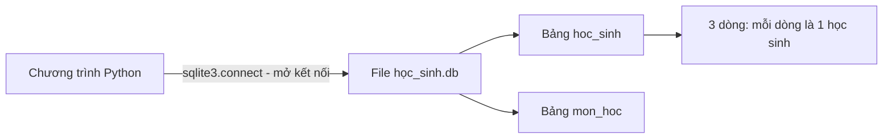
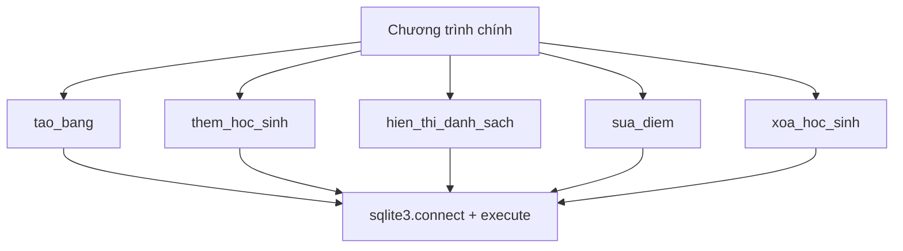

# 🐍 Bài 36: SQLite – Lưu Trữ Dữ Liệu Với Cơ Sở Dữ Liệu

> 🎓 **Chương 8 – Lập trình ứng dụng chuyên sâu**

---

## 🎯 Mục tiêu

Sau bài học này, học viên sẽ:

* ✅ Hiểu **cơ sở dữ liệu là gì**, khi nào cần dùng thay vì file JSON/CSV.
* ✅ Biết **SQLite là gì**, file `.db` hoạt động ra sao (không cần server).
* ✅ Dùng module **`sqlite3`** trong thư viện chuẩn: `connect()`, `cursor()`.
* ✅ Viết được các câu lệnh **SQL**: `CREATE TABLE`, `INSERT`, `SELECT`, `WHERE`, `UPDATE`, `DELETE`.
* ✅ Hiểu rõ vai trò của `commit()`, `close()` và cách dùng **`with` statement**.
* ✅ Dùng **tham số `?`** để tránh lỗ hổng SQL injection.
* ✅ Xây dựng chương trình **CRUD quản lý học sinh** hoàn chỉnh.

---

## 📖 Kiến thức

> 🔁 **Nhắc lại bài trước:** Ở bài 35, chúng ta dùng `requests` để **lấy dữ liệu từ API** (ví dụ thời tiết). Nhưng dữ liệu đó chỉ tồn tại trong bộ nhớ lúc chương trình chạy — đóng chương trình là mất. Hôm nay chúng ta học cách **lưu trữ dữ liệu lâu dài** trong cơ sở dữ liệu.

### 1. Cơ sở dữ liệu là gì?

> 💬 **Nói đơn giản:** Cơ sở dữ liệu (database – DB) là nơi **cất giữ dữ liệu có tổ chức**, giống như một **tủ hồ sơ** gồm nhiều **ngăn kéo** (bảng), mỗi ngăn có nhiều **phiếu** (dòng) được điền theo **mẫu cột** cố định.

**Ví dụ đời thực:** Cô giáo lưu điểm bằng sổ tay (giống viết tay — dễ mất), rồi chuyển sang Excel (giống file CSV — tốt hơn nhưng vẫn rời rạc). Khi trường có **5.000 học sinh** và cần hỏi "ai có điểm Toán trên 8?", cô cần một hệ thống truy vấn nhanh — đó là lúc cần **cơ sở dữ liệu**.

### 2. Vì sao cần DB thay vì file JSON/CSV?

| Tiêu chí | File JSON/CSV (bài 32, 33) | Cơ sở dữ liệu |
|---|---|---|
| 📦 Lượng dữ liệu | Vài trăm – vài ngàn bản ghi | Hàng triệu bản ghi vẫn nhanh |
| 🔍 Truy vấn | Phải đọc hết file rồi tự lọc | Có ngôn ngữ SQL chuyên dụng |
| 🔒 An toàn dữ liệu | Dễ ghi hỏng, trùng lặp | Có ràng buộc (NOT NULL, khóa chính) |
| 👥 Nhiều người cùng dùng | Không hỗ trợ | Hỗ trợ tốt |
| ⚙️ Độ phức tạp | Đơn giản | Phức tạp hơn nhưng mạnh mẽ |

> 💡 **Quy tắc thực tế:** Dữ liệu ít, cấu trúc đơn giản → JSON/CSV. Dữ liệu nhiều, cần truy vấn, cần an toàn → **SQLite**.

### 3. SQLite là gì? File `.db` là gì?

* **SQLite** là một **hệ quản trị cơ sở dữ liệu nhỏ gọn** được nhúng thẳng vào Python (không cần cài thêm, không cần server chạy riêng).
* Toàn bộ dữ liệu nằm trong **một file duy nhất** có đuôi `.db` — bạn chỉ cần copy file là mang theo cả cơ sở dữ liệu.
* Các hệ DB khác như **MySQL, PostgreSQL** cần cài một chương trình server riêng và kết nối qua mạng — mạnh hơn nhưng phức tạp hơn nhiều. SQLite đủ tốt cho ứng dụng nhỏ, phần mềm máy tính, ứng dụng điện thoại (điện thoại Android cũng dùng SQLite!).

> 💬 **Ví dụ đời thực:** File `.db` giống như **một cuốn sổ đóng sẵn giấy trắng** — mở là ghi được ngay. MySQL giống **tòa nhà văn phòng có lễ tân** — muốn ghi chép phải đi qua lễ tân (server).



### 4. SQL – ngôn ngữ nói chuyện với cơ sở dữ liệu

**SQL** (Structured Query Language) là ngôn ngữ để hỏi và thao tác dữ liệu. Python chỉ là "người đưa thư" — gửi câu SQL cho SQLite qua `execute()`:

| Câu lệnh SQL | Chức năng |
|---|---|
| `CREATE TABLE ten_bang (...)` | Tạo bảng mới |
| `INSERT INTO ten_bang (...) VALUES (...)` | Thêm dòng mới |
| `SELECT ... FROM ten_bang` | Lấy dữ liệu ra xem |
| `UPDATE ten_bang SET ... WHERE ...` | Sửa dữ liệu |
| `DELETE FROM ten_bang WHERE ...` | Xóa dữ liệu |

### 5. Bước 1 – Kết nối: `connect()` và `cursor()`

```python
import sqlite3

# Mở kết nối — nếu file chưa tồn tại, Python tự tạo mới
conn = sqlite3.connect("hoc_sinh.db")

# Tạo "con trỏ" — chiếc bút dùng để gửi lệnh SQL
cur = conn.cursor()
```

| Thành phần | Ý nghĩa |
|---|---|
| `sqlite3.connect("ten.db")` | Mở file cơ sở dữ liệu; chưa có thì **tự tạo file** |
| `conn` (connection) | **Cầu nối** giữa Python và file `.db` |
| `cur` (cursor) | **Con trỏ thao tác** — dùng `cur.execute(sql)` để chạy lệnh |

### 6. `CREATE TABLE` – tạo bảng

```python
cur.execute("""
    CREATE TABLE IF NOT EXISTS hoc_sinh (
        id   INTEGER PRIMARY KEY AUTOINCREMENT,
        ten  TEXT    NOT NULL,
        toan REAL,
        van  REAL
    )
""")
```

* `id INTEGER PRIMARY KEY AUTOINCREMENT` — cột **khóa chính** tự tăng: mỗi học sinh có số hiệu riêng 1, 2, 3...
* `ten TEXT NOT NULL` — kiểu chữ, **bắt buộc phải có** (không được để trống).
* `toan REAL`, `van REAL` — kiểu số thực, lưu điểm.
* `IF NOT EXISTS` — chỉ tạo nếu bảng chưa có, giúp chạy lại không bị lỗi.

> ⚠️ **Quan trọng:** SQL viết **chữ hoa hay thường đều được** (`SELECT` hay `select` đều chạy), nhưng thói quen viết hoa từ khóa SQL giúp code dễ đọc.

### 7. `INSERT` – thêm dữ liệu

```python
cur.execute(
    "INSERT INTO hoc_sinh (ten, toan, van) VALUES (?, ?, ?)",
    ("Nguyễn Văn An", 8.5, 7.0)
)
```

* Dấu `?` là **vị trí dành chỗ** — giá trị thật được truyền ở đối số thứ hai dạng **tuple** `(...)`.
* **Không bao giờ** nhúng giá trị trực tiếp vào chuỗi SQL (xem phần Lỗi thường gặp về SQL injection).

### 8. `commit()` và `close()` – bước không thể quên!

```python
# LƯU mọi thay đổi (INSERT/UPDATE/DELETE) vào file .db
conn.commit()

# Đóng kết nối khi xong việc
conn.close()
```

> 💬 **Ví dụ đời thực:** `commit()` giống như **bấm nút "Lưu"** trong Word — nếu không bấm, đóng file là mất hết. `close()` giống như **đóng hộp tủ hồ sơ** lại cho sạch sẽ.

### 9. `SELECT` và `WHERE` – đọc dữ liệu

```python
# Lấy TẤT CẢ học sinh
cur.execute("SELECT * FROM hoc_sinh")
rows = cur.fetchall()

# Lấy học sinh có điểm toán >= 8
cur.execute("SELECT ten, toan FROM hoc_sinh WHERE toan >= 8")
rows2 = cur.fetchall()
```

Các hàm đọc kết quả:

| Hàm | Trả về |
|---|---|
| `cur.fetchall()` | **Danh sách** tất cả các dòng, mỗi dòng là một tuple |
| `cur.fetchone()` | **Một dòng** duy nhất (hoặc `None` nếu hết) |
| `cur.fetchmany(n)` | n dòng đầu tiên |

### 10. `UPDATE` và `DELETE`

```python
# Sửa điểm Toán của học sinh id = 1
cur.execute("UPDATE hoc_sinh SET toan = 9.0 WHERE id = 1")

# Xóa học sinh id = 3
cur.execute("DELETE FROM hoc_sinh WHERE id = 3")

conn.commit()
```

> ⚠️ **Cảnh báo:** Nếu quên `WHERE`, câu `UPDATE` sẽ sửa **tất cả** các dòng, câu `DELETE` sẽ xóa **sạch** bảng! Luôn viết `WHERE` trước khi chạy.

### 11. `with` statement – đóng kết nối tự động

```python
with sqlite3.connect("hoc_sinh.db") as conn:
    cur = conn.cursor()
    cur.execute("INSERT INTO hoc_sinh (ten, toan, van) VALUES (?, ?, ?)",
                ("Trần Thị Bình", 9.5, 8.0))
    conn.commit()
```

* Khối `with` sẽ **tự đóng kết nối** khi thoát khối lệnh, kể cả khi có lỗi xảy ra.
* Hơn nữa, trong `with sqlite3.connect(...)` mà có lỗi, giao dịch sẽ **tự động hủy** — rất an toàn.
* Vẫn phải gọi `conn.commit()` khi muốn lưu thay đổi.

### 12. Tham số `?` – vũ khí chống SQL injection

**SQL injection** là kỹ thuật hacker nhét code SQL vào chỗ dữ liệu nhập. Ví dụ nguy hiểm:

```python
# ❌ NGUY HIỂM: gõ tên:  x'); DROP TABLE hoc_sinh; --
ten = input("Tên học sinh: ")
cur.execute("INSERT INTO hoc_sinh (ten) VALUES ('" + ten + "')")
```

Nếu ai đó gõ `x'); DROP TABLE hoc_sinh; --` thì bảng bị xóa sạch!

```python
# ✅ AN TOÀN: ? chỉ nhận GIÁ TRỊ, không bao giờ bị hiểu là lệnh SQL
cur.execute("INSERT INTO hoc_sinh (ten) VALUES (?)", (ten,))
```

> 💎 **Nguyên tắc vàng:** **Mọi** giá trị do người dùng nhập hoặc từ bên ngoài đều phải đi qua tham số `?`, không bao giờ nối chuỗi vào câu SQL.

### 13. Các thông tin bổ sung hữu ích

* `cur.lastrowid` — id của dòng vừa INSERT (thường được dùng để thông báo "đã thêm học sinh mã số X").
* `cur.rowcount` — số dòng bị ảnh hưởng bởi INSERT/UPDATE/DELETE.
* Kết quả `SELECT` là **tuple** — truy cập theo vị trí: `row[0]` là cột đầu (id), `row[1]` là cột thứ hai...

---

## 💡 Ví dụ minh họa

### Ví dụ 1: Tạo bảng và thêm học sinh đầu tiên

```python
import sqlite3

# 1. Kết nối (tự tạo file vi_du_1.db)
conn = sqlite3.connect("vi_du_1.db")
cur = conn.cursor()

# 2. Tạo bảng
cur.execute("""
    CREATE TABLE IF NOT EXISTS hoc_sinh (
        id  INTEGER PRIMARY KEY AUTOINCREMENT,
        ten TEXT NOT NULL,
        diem REAL
    )
""")

# 3. Thêm 2 học sinh bằng tham số ?
cur.execute("INSERT INTO hoc_sinh (ten, diem) VALUES (?, ?)", ("An", 8.5))
cur.execute("INSERT INTO hoc_sinh (ten, diem) VALUES (?, ?)", ("Binh", 7.0))

# 4. LƯU lại
conn.commit()

# 5. Đọc lại và in ra
cur.execute("SELECT * FROM hoc_sinh")
for row in cur.fetchall():
    print(row)

# 6. Đóng kết nối
conn.close()
```

Kết quả:

```
(1, 'An', 8.5)
(2, 'Binh', 7.0)
```

**Giải thích từng dòng:**

| Dòng code | Ý nghĩa |
|---|---|
| `conn = sqlite3.connect("vi_du_1.db")` | Mở file DB; chưa có thì tự tạo |
| `cur.execute("""CREATE TABLE IF NOT EXISTS...""")` | Tạo bảng 3 cột: id tự tăng, tên, điểm |
| `cur.execute("INSERT ... (?, ?)", ("An", 8.5))` | Chèn 1 dòng, `?` được thay bằng "An" và 8.5 |
| `conn.commit()` | Lưu thay đổi xuống file — **không thể thiếu** |
| `cur.fetchall()` | Lấy toàn bộ kết quả: danh sách các tuple |
| `conn.close()` | Đóng kết nối |

### Ví dụ 2: Lọc học sinh giỏi bằng `WHERE`

```python
import sqlite3

with sqlite3.connect("vi_du_1.db") as conn:
    cur = conn.cursor()
    # Chỉ lấy những bạn điểm >= 8, chỉ lấy cột tên và điểm
    cur.execute("SELECT ten, diem FROM hoc_sinh WHERE diem >= 8")
    for row in cur.fetchall():
        print(f"{row[0]} - {row[1]}")
```

Kết quả:

```
An - 8.5
```

**Giải thích từng dòng:**

| Dòng code | Ý nghĩa |
|---|---|
| `with sqlite3.connect(...) as conn:` | Mở kết nối, tự đóng khi hết khối — không cần `close()` |
| `SELECT ten, diem FROM hoc_sinh WHERE diem >= 8` | Chọn 2 cột, chỉ giữ dòng có điểm từ 8 trở lên |
| `row[0]` | Cột đầu tiên của dòng kết quả (tên) |
| `f"{row[0]} - {row[1]}"` | f-string (học ở bài 18) để ghép chữ và số |

### Ví dụ 3: Sửa và xóa

```python
import sqlite3

with sqlite3.connect("vi_du_1.db") as conn:
    cur = conn.cursor()

    # Sửa: nâng điểm Binh lên 9.0
    cur.execute("UPDATE hoc_sinh SET diem = 9.0 WHERE ten = ?", ("Binh",))
    print("Số dòng đã sửa:", cur.rowcount)

    # Xóa: học sinh tên An
    cur.execute("DELETE FROM hoc_sinh WHERE ten = ?", ("An",))
    print("Số dòng đã xóa:", cur.rowcount)

    conn.commit()
```

Kết quả:

```
Số dòng đã sửa: 1
Số dòng đã xóa: 1
```

**Giải thích từng dòng:**

| Dòng code | Ý nghĩa |
|---|---|
| `WHERE ten = ?` | Chỉ tác động đúng dòng có tên khớp |
| `cur.rowcount` | Số dòng bị ảnh hưởng — kiểm tra xem đã sửa/xóa đúng chưa |
| `conn.commit()` | Bắt buộc để lưu thay đổi |

---

## 🔬 Ví dụ nâng cao

### Ví dụ: Chương trình CRUD quản lý học sinh hoàn chỉnh

Đây là chương trình có đủ 4 thao tác cơ bản của cơ sở dữ liệu: **C**reate (thêm), **R**ead (xem), **U**pdate (sửa), **D**elete (xóa).

```python
import sqlite3

DB_FILE = "quan_ly_hoc_sinh.db"


def tao_bang():
    """Tạo bảng hoc_sinh nếu chưa tồn tại."""
    with sqlite3.connect(DB_FILE) as conn:
        cur = conn.cursor()
        cur.execute("""
            CREATE TABLE IF NOT EXISTS hoc_sinh (
                id   INTEGER PRIMARY KEY AUTOINCREMENT,
                ten  TEXT NOT NULL,
                toan REAL,
                van  REAL
            )
        """)
        conn.commit()


def them_hoc_sinh(ten, toan, van):
    """Thêm một học sinh mới."""
    with sqlite3.connect(DB_FILE) as conn:
        cur = conn.cursor()
        cur.execute(
            "INSERT INTO hoc_sinh (ten, toan, van) VALUES (?, ?, ?)",
            (ten, toan, van),
        )
        conn.commit()
        print(f"Đã thêm học sinh {ten} (mã số {cur.lastrowid}).")


def hien_thi_danh_sach():
    """In ra danh sách tất cả học sinh."""
    with sqlite3.connect(DB_FILE) as conn:
        cur = conn.cursor()
        cur.execute("SELECT * FROM hoc_sinh")
        rows = cur.fetchall()
    if not rows:
        print("Chưa có học sinh nào.")
        return
    print("--- DANH SÁCH HỌC SINH ---")
    for row in rows:
        print(f"Mã {row[0]}: {row[1]} - Toán {row[2]} - Văn {row[3]}")


def sua_diem(ma_hs, mon, diem_moi):
    """Sửa điểm một môn của học sinh theo mã số."""
    cot = "toan" if mon == "toan" else "van"
    with sqlite3.connect(DB_FILE) as conn:
        cur = conn.cursor()
        cur.execute(
            f"UPDATE hoc_sinh SET {cot} = ? WHERE id = ?", (diem_moi, ma_hs)
        )
        conn.commit()
        print("Số dòng đã sửa:", cur.rowcount)


def xoa_hoc_sinh(ma_hs):
    """Xóa học sinh theo mã số."""
    with sqlite3.connect(DB_FILE) as conn:
        cur = conn.cursor()
        cur.execute("DELETE FROM hoc_sinh WHERE id = ?", (ma_hs,))
        conn.commit()
        print("Số dòng đã xóa:", cur.rowcount)


# --- Chạy thử chương trình ---
if __name__ == "__main__":
    tao_bang()
    them_hoc_sinh("Nguyễn Văn An", 8.5, 7.0)
    them_hoc_sinh("Trần Thị Bình", 9.0, 8.5)
    them_hoc_sinh("Lê Văn Cường", 6.5, 7.5)
    hien_thi_danh_sach()
    sua_diem(1, "toan", 10.0)
    xoa_hoc_sinh(3)
    hien_thi_danh_sach()
```

Kết quả:

```
Đã thêm học sinh Nguyễn Văn An (mã số 1).
Đã thêm học sinh Trần Thị Bình (mã số 2).
Đã thêm học sinh Lê Văn Cường (mã số 3).
--- DANH SÁCH HỌC SINH ---
Mã 1: Nguyễn Văn An - Toán 8.5 - Văn 7.0
Mã 2: Trần Thị Bình - Toán 9.0 - Văn 8.5
Mã 3: Lê Văn Cường - Toán 6.5 - Văn 7.5
Số dòng đã sửa: 1
Số dòng đã xóa: 1
--- DANH SÁCH HỌC SINH ---
Mã 1: Nguyễn Văn An - Toán 10.0 - Văn 7.0
Mã 2: Trần Thị Bình - Toán 9.0 - Văn 8.5
```

**Phân tích chương trình:**

* Mỗi chức năng là **một hàm riêng** — dễ đọc, dễ bảo trì (kỹ năng từ bài 12).
* Mỗi hàm **tự mở kết nối bằng `with`** rồi đóng — không lo rò rỉ kết nối.
* `sua_diem()` dùng biến `cot` để chọn cột cần sửa — lưu ý biến `cot` là tên do chính mình đặt (an toàn), còn **giá trị người dùng nhập luôn qua `?`**.
* `cur.lastrowid` giúp biết mã số vừa được cấp tự động.



---

## ⚠️ Lỗi thường gặp

### Lỗi 1: Quên `commit()` — dữ liệu "biến mất"

```python
conn = sqlite3.connect("hoc_sinh.db")
cur = conn.cursor()
cur.execute("INSERT INTO hoc_sinh (ten) VALUES (?)", ("An",))
conn.close()          # ❌ Không commit: dữ liệu không được lưu!
```

* **Nguyên nhân:** Mọi thay đổi chỉ nằm trong bộ nhớ; phải `commit()` mới ghi xuống file.
* **Cách sửa:** Gọi `conn.commit()` trước `close()`, hoặc dùng `with sqlite3.connect(...)` kèm commit trong khối.

### Lỗi 2: `sqlite3.OperationalError: no such table: hoc_sinh`

* **Nguyên nhân:** Câu lệnh `SELECT`/`INSERT` chạy trước lệnh `CREATE TABLE` (hoặc bảng tên sai, ví dụ gõ `hoc_sinh` khi bảng là `hs`).
* **Cách sửa:** Kiểm tra thứ tự: **tạo bảng trước, thao tác sau**; đối chiếu chính xác tên bảng và tên cột.

### Lỗi 3: Nối chuỗi vào câu SQL — nguy cơ SQL injection

```python
ten = input("Tên: ")
cur.execute("INSERT INTO hoc_sinh (ten) VALUES ('" + ten + "')")   # ❌ RẤT NGUY HIỂM
cur.execute("INSERT INTO hoc_sinh (ten) VALUES (?)", (ten,))       # ✅ An toàn
```

* **Nguyên nhân:** Giá trị nhập trở thành một phần của lệnh SQL.
* **Cách sửa:** Luôn dùng tham số `?` với tuple chứa giá trị.

### Lỗi 4: Quên `WHERE` — xóa/sửa sạch bảng

```python
cur.execute("DELETE FROM hoc_sinh")    # ❌ Xóa toàn bộ!
cur.execute("DELETE FROM hoc_sinh WHERE id = 1")    # ✅ Chỉ xóa 1 dòng
```

* **Cách sửa:** Trước khi chạy `UPDATE`/`DELETE`, tự hỏi "câu lệnh này tác động đến những dòng nào?" — luôn kèm `WHERE`.

### Lỗi 5: Truy cập kết quả sai kiểu

```python
rows = cur.fetchall()      # rows là danh sách các TUPLE
print(rows[0]["ten"])      # ❌ TypeError: tuple indices must be integers
print(rows[0][1])          # ✅ Dòng đầu, cột thứ 2 (ten)
```

* **Nguyên nhân:** Kết quả mặc định là tuple, truy cập theo vị trí chứ không theo tên cột.
* **Cách sửa:** Dùng vị trí `row[0]`, `row[1]`... hoặc `conn.row_factory = sqlite3.Row` để truy cập theo tên.

---

## 💎 Mẹo

* 💾 **Luôn `commit()`** sau INSERT/UPDATE/DELETE — coi như phản xạ tự nhiên.
* 📦 **Dùng `with sqlite3.connect(...)`** để tự đóng kết nối, tránh lỗi `database is locked`.
* 🛡️ **Mọi dữ liệu ngoài vào đều qua `?`** — không bao giờ nối chuỗi vào SQL.
* 📝 Đặt tên bảng/cột **viết thường, không dấu, dùng `_`**: `ten_hoc_sinh`, `diem_toan`.
* 🔍 Nên in `cur.rowcount` sau UPDATE/DELETE để chắc chắn tác động đúng số dòng mong muốn.
* 🛠️ Tải **DB Browser for SQLite** (miễn phí) để nhìn thấy dữ liệu trong file `.db` bằng giao diện.
* 🚫 Không xóa file `.db` khi đang có kết nối mở — đóng chương trình rồi mới xóa.

---

## 📝 Tóm tắt

| Khái niệm | Nội dung |
|---|---|
| 🗄️ Cơ sở dữ liệu | Nơi lưu dữ liệu có tổ chức thành bảng – dòng – cột |
| 📄 SQLite | Hệ DB nhúng, 1 file `.db`, không cần server, có sẵn trong Python |
| 🔌 `connect()` | Mở (hoặc tự tạo) file `.db` |
| 🖊️ `cursor()` | Con trỏ để gửi lệnh SQL |
| 🏗️ `CREATE TABLE` | Tạo bảng, khóa chính `PRIMARY KEY AUTOINCREMENT` |
| ➕ `INSERT` | Thêm dòng mới |
| 📖 `SELECT ... WHERE` | Đọc dữ liệu có điều kiện |
| ✏️ `UPDATE ... SET ... WHERE` | Sửa dữ liệu |
| 🗑️ `DELETE ... WHERE` | Xóa dữ liệu |
| 💾 `commit()` | Lưu thay đổi xuống file |
| 🔒 `?` | Tham số an toàn, chống SQL injection |

---

## 🧪 Kiểm tra nhanh

1. ❓ SQLite có cần cài đặt server riêng không? Dữ liệu nằm ở đâu?
2. ❓ Hàm nào dùng để mở kết nối file `data.db`?
3. ❓ Lệnh SQL nào tạo bảng mới?
4. ❓ Điều gì xảy ra nếu quên gọi `commit()` sau khi INSERT?
5. ❓ `fetchall()` trả về kiểu dữ liệu gì?
6. ❓ Viết câu lệnh SQL lấy tất cả học sinh có điểm Toán từ 8 trở lên.
7. ❓ Câu lệnh sửa điểm Văn thành 9 cho học sinh mã số 2?
8. ❓ Điều gì xảy ra nếu `DELETE FROM hoc_sinh` không có `WHERE`?
9. ❓ Vì sao nên dùng tham số `?` thay vì nối chuỗi?
10. ❓ Lệnh nào trả về id tự động của dòng vừa INSERT?

<details>
<summary>🔍 Xem đáp án</summary>

1. Không cần server; toàn bộ dữ liệu nằm trong một file `.db`.
2. `sqlite3.connect("data.db")`.
3. `CREATE TABLE`.
4. Dữ liệu chỉ ở bộ nhớ, đóng kết nối là mất.
5. Danh sách các tuple (mỗi tuple là một dòng).
6. `SELECT * FROM hoc_sinh WHERE toan >= 8`.
7. `UPDATE hoc_sinh SET van = 9 WHERE id = 2`.
8. Xóa sạch toàn bộ dữ liệu trong bảng.
9. Chống SQL injection và đảm bảo dữ liệu luôn được coi là giá trị.
10. `cur.lastrowid`.

</details>

---

## 📚 Bài đọc thêm

* [Python docs – sqlite3 (SQLite Database)](https://docs.python.org/3/library/sqlite3.html)
* [SQLite chính thức – About](https://www.sqlite.org/about.html)
* [W3Schools – SQL Tutorial](https://www.w3schools.com/sql/)
* [DB Browser for SQLite (công cụ xem file .db)](https://sqlitebrowser.org/)

---

## 🏁 Kết thúc bài

🎉 Giờ bạn đã biết **lưu trữ dữ liệu lâu dài** bằng SQLite. Nhưng chương trình càng lớn càng cần biết **chuyện gì đang xảy ra bên trong** — ai truy cập, lỗi gì xảy ra, lúc nào. Đó chính là **Logging**:

👉 **[Bài 37: Logging – Ghi Nhật Ký Hoạt Động](../37_Logging/bai_giang.md)**
