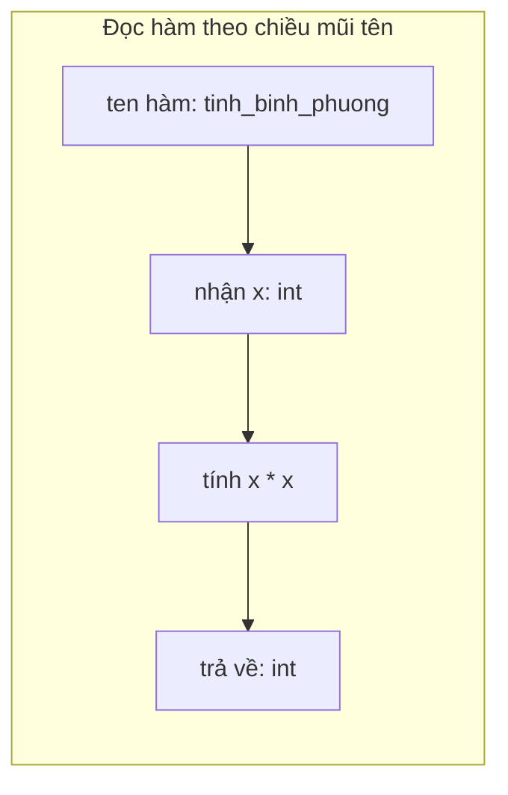

# 🐍 Bài 38: Type Hints – Chú Thích Kiểu Dữ Liệu

> 🎓 **Chương 8 – Lập trình ứng dụng chuyên sâu**

---

## 🎯 Mục tiêu

Sau bài học này, học viên sẽ:

* ✅ Hiểu **kiểu dữ liệu động** của Python và vì sao cần **chú thích kiểu (type hints)**.
* ✅ Khai báo chú thích cho **biến**: `x: int = 5`.
* ✅ Chú thích **tham số và giá trị trả về** của hàm: `def f(x: int) -> str`.
* ✅ Dùng module **`typing`**: `List`, `Dict`, `Optional`, `Union`, `Tuple`, `Any`.
* ✅ Hiểu lợi ích: **đọc code tốt hơn, IDE gợi ý, ít bug**.
* ✅ Tạo **type alias** (bí danh kiểu) để code gọn và rõ ràng.

---

## 📖 Kiến thức

> 🔁 **Nhắc lại bài trước:** Bài 37 đã dạy bạn ghi log để "theo dõi" chương trình. Nhưng để một chương trình dễ bảo trì lâu dài, người đọc code phải hiểu **mỗi hàm nhận gì và trả về gì ngay từ cái nhìn đầu tiên**. Đó chính là việc của **Type Hints** trong bài này.

### 1. Kiểu dữ liệu động vs tĩnh

Python là ngôn ngữ **kiểu động (dynamic typing)** — bạn **không cần khai báo kiểu**; Python tự đoán:

```python
x = 10        # Python đoán x là số nguyên
x = "chao"    # đổi ý — x bây giờ là chuỗi
```

> 💬 **Ví dụ đời thực:** Kiểu dữ liệu động giống một **thùng đồ không dán nhãn** — bỏ gì vào cũng được. Kiểu tĩnh (như Java, C++) giống **hộp có dán nhãn "chỉ đựng ốc vít"** — rõ ràng nhưng gò bó hơn.

Kiểu động linh hoạt nhưng đi kèm rủi ro:

```python
def tinh_tong(a, b):
    return a + b

print(tinh_tong("10", "5"))   # "105" — nối chuỗi, không phải 15!
```

Chương trình **không báo lỗi** nhưng kết quả sai. **Type hints** không bắt buộc kiểu (Python interpretation vẫn chạy) nhưng **nói rõ ý định** và để IDE/tool gợi ý, soát lỗi.

### 2. Chú thích kiểu cho biến

Cú pháp đơn giản: `tên_biến: kiểu = giá_trị`

```python
ten: str = "An"          # biến ten phải là chuỗi
tuoi: int = 15           # biến tuoi phải là số nguyên
diem: float = 8.5        # số thực
da_thi: bool = True      # đúng/sai
```

> 💡 **Quan trọng:** Chú thích kiểu **chỉ là ghi chú** — Python không ép. Bạn vẫn có thể gán `tuoi = "mười lăm"` mà không gặp lỗi chạy (nhưng IDE sẽ cảnh báo). Type hints = "hợp đồng bằng văn bản" giữa người viết và người đọc.

### 3. Chú thích tham số và hàm trả về

```python
def tinh_binh_phuong(x: int) -> int:
    """Trả về bình phương của x."""
    return x * x
```

* `x: int` — tham số `x` có kiểu nguyên.
* `-> int` — hàm trả về giá trị kiểu nguyên.



Bạn có thể đọc: *"tăng_bình_phuong nhận một số nguyên, trả về một số nguyên"* — 3 giây để hiểu mục đích không cần đọc thân hàm.

### 4. Các kiểu cơ bản có sẵn

| Kiểu | Ý nghĩa | Ví dụ |
|---|---|---|
| `int` | Số nguyên | `tuoi: int` |
| `float` | Số thực | `diem: float` |
| `str` | Chuỗi ký tự | `ten: str` |
| `bool` | Đúng / Sai | `da_giam_gia: bool` |
| `bytes` | Dữ liệu thô (nhị phân) | `du_lieu: bytes` |
| `None` | Không có giá trị | hàm `print()` trả về None |

### 5. Module `typing` cho kiểu dữ liệu phức tạp

Với danh sách, từ điển... dùng module `typing`:

| Kiểu | Ý nghĩa | Ví dụ |
|---|---|---|
| `List[int]` | Danh sách các số nguyên | `diem: List[float]` |
| `Dict[str, int]` | Từ điển: khóa chuỗi, giá trị số nguyên | `bang_diem: Dict[str, float]` |
| `Tuple[str, int]` | Tuple 2 phần: chuỗi và số nguyên | `thong_tin: Tuple[str, int]` |
| `Set[str]` | Tập hợp chuỗi | `lop: Set[str]` |
| `Optional[int]` | Số nguyên hoặc `None` | `diem_khong_co: Optional[float]` |
| `Union[int, float]` | Số nguyên **hoặc** số thực | `so_luong: Union[int, float]` |
| `Any` | Bất kỳ kiểu nào | `du_lieu: Any` |

```python
from typing import List, Dict, Optional, Union, Tuple, Any

diem_so: List[float] = [8.5, 9.0, 7.5]          # danh sách điểm
bang_diem: Dict[str, float] = {"An": 8.5, "Binh": 9.0}   # tên -> điểm
thong_tin: Tuple[str, int] = ("An", 2008)       # tên + năm sinh
ho_so: Optional[str] = None                     # hoặc chuỗi, hoặc rỗng
so_: Union[int, float] = 10                     # cả hai kiểu số đều được nhận
thu_gi: Any = "bat ky"
```

### 6. `Optional` và `Union` – hai kiểu "có thể"

* **`Optional[int]`** = `int` **hoặc** `None` — cực kỳ phổ biến khi hàm **có thể không tìm thấy**:

  ```python
  def tim_diem(ten: str, bang_diem: Dict[str, float]) -> Optional[float]:
      """Trả điểm của tên; None nếu không có."""
      return bang_diem.get(ten)   # .get() trả None nếu khóa không tồn tại
  ```

* **`Union[int, float]`** = kiểu này **hoặc** kiểu kia — ví dụ hàm nhận cả số nguyên lẫn số thực.

> 💡 Trong Python 3.10+ có cú pháp ngắn gọn `int | None` và `int | float`. Giáo trình dùng cách `Optional[...]`/`Union[...]` vì chạy được ngay cả trên Python 3.9.

### 7. Vì sao type hints đáng dùng?

**a) Đọc code nhanh và chính xác:**

```python
# Không có type hints — phải đọc thân hàm mới biết:
def khuyen_mai(gia, phan_tram):
    return gia * (100 - phan_tram) / 100

# Có type hints — hiểu ngay:
def khuyen_mai(gia: float, phan_tram: int) -> float:
    """Trả về giá sau khi giảm phần trăm."""
    return gia * (100 - phan_tram) / 100
```

**b) IDE gợi ý tuyệt vời:** VS Code (Pyright/Pylance) hiển thị gợi ý thuộc tính, báo lỗi trước khi chạy.

**c) Ít bug hơn:** Tool `mypy` (hoặc gợi ý IDE) phát hiện ngay `tinh_diem("8.5", 2)` trong khi hàm khai báo `tinh_diem(diem: float, so_lan: int)` — dạng lỗi rất khó bắt.

**d) Tự động hoàn thành:** Khi viết `sach.` IDE của bạn đề xuất các thuộc tính của `Sach` — chỉ biết được nhờ kiểu.

### 9. Type alias – đặt tên cho kiểu

Khi kiểu dài hoặc dùng nhiều lần, đặt **bí danh (alias)**:

```python
from typing import List, Tuple

# Alias: "Diem" = danh sách các số thực
Diem = List[float]

# Alias: "HoSo" = tuple (tên, năm sinh, điểm)
HoSo = Tuple[str, int, float]

def trung_binh(diem_so: Diem) -> float:
    """Tính trung bình danh sách điểm."""
    return round(sum(diem_so) / len(diem_so), 2)

def in_ho_so(ho_so: HoSo) -> None:
    ten, nam_sinh, diem = ho_so
    print(f"{ten} - {nam_sinh} - {diem}")
```

* Tên alias **viết hoa chữ cái đầu** để phân biệt kiểu với biến.
* Alias giúp code ngắn, dễ thay đổi (đổi một chỗ là đổi toàn bộ).

---

## 💡 Ví dụ minh họa

### Ví dụ 1: Hàm chào mừng có type hints

```python
def chao(ten: str, tuoi: int) -> str:
    """Tạo câu chào cho người dùng."""
    return f"Xin chào {ten}, bạn {tuoi} tuổi!"

# Gọi thử
print(chao("Mai", 16))
```

Kết quả:

```
Xin chào Mai, bạn 16 tuổi!
```

**Giải thích từng dòng:**

| Dòng code | Ý nghĩa |
|---|---|
| `def chao(ten: str, tuoi: int)` | 2 tham số: `ten` phải là chuỗi, `tuoi` phải số nguyên |
| `-> str` | Hàm cam kết trả về một chuỗi |
| `f"..."` | f-string ghép dữ liệu |

* Nếu ai đó gõ `chao("Mai", "mười sáu")` — IDE cảnh báo ngay: `tuoi` phải là `int`.

### Ví dụ 2: Hàm tính điểm trung bình

```python
from typing import List

def trung_binh(diem: List[float]) -> float:
    """Tính trung bình danh sách điểm."""
    if not diem:
        return 0.0
    return round(sum(diem) / len(diem), 2)

print(trung_binh([8.0, 7.5, 9.0]))   # 8.17
print(trung_binh([]))                # 0.0
```

Kết quả:

```
8.17
0.0
```

**Giải thích từng dòng:**

| Dòng code | Ý nghĩa |
|---|---|
| `diem: List[float]` | Tham số là danh sách các số thực |
| `-> float` | Trả về một số thực |
| `if not diem:` | Tránh chia cho 0 khi danh sách rỗng |
| `sum/len`, `round(x, 2)` | Tổng rồi chia, làm tròn 2 chữ số |

### Ví dụ 3: Tìm sản phẩm — `Optional`

```python
from typing import Dict, Optional

def tim_gia(ten_sp: str, kho: Dict[str, float]) -> Optional[float]:
    """Trả về giá sản phẩm; None nếu sản phẩm không có."""
    return kho.get(ten_sp)

kho_hang = {"ban phim": 250.0, "chuot": 150.0}

print(tim_gia("chuot", kho_hang))
print(tim_gia("man hinh", kho_hang))
```

Kết quả:

```
150.0
None
```

**Giải thích từng dòng:**

| Dòng code | Ý nghĩa |
|---|---|
| `kho: Dict[str, float]` | Từ điển: tên sản phẩm (chuỗi) → giá (số thực) |
| `-> Optional[float]` | "Có thể về số thực, có thể là None" — đúng bản chất hàm tìm kiếm |
| `kho.get(ten_sp)` | Trả giá trị hoặc `None` nếu khóa không tồn tại |

---

## 🔬 Ví dụ nâng cao

### Ví dụ 1: Quản lý lớp học bằng type hints

```python
from typing import Dict, List, Optional

# Bảng ánh xạ: tên học sinh -> danh sách điểm
BangDiem = Dict[str, List[float]]
DiemTrungBinh = Dict[str, float]


def tinh_tb_cho_tat_ca(bang_diem: BangDiem) -> DiemTrungBinh:
    """Tính điểm trung bình cho từng học sinh."""
    ket_qua: DiemTrungBinh = {}
    for ten, diem_so in bang_diem.items():
        ket_qua[ten] = round(sum(diem_so) / len(diem_so), 2)
    return ket_qua


def hoc_sinh_gioi_nhat(tb: DiemTrungBinh) -> Optional[str]:
    """Trả về tên học sinh có điểm trung bình cao nhất."""
    if not tb:
        return None
    return max(tb, key=tb.get)


lop = {
    "An":   [8.5, 9.0, 7.0],
    "Binh": [9.0, 8.0, 9.5],
    "Cuong": [6.5, 7.0, 7.5],
}

print(tinh_tb_cho_tat_ca(lop))
print("Gioi nhat:", hoc_sinh_gioi_nhat(lop))
```

Kết quả:

```
{'An': 8.17, 'Binh': 8.83, 'Cuong': 7.0}
Gioi nhat: Binh
```

**Phân tích:**

* `BangDiem` và `DiemTrungBinh` là **type alias** — code không cần viết lại kiểu dài nhiều lần.
* Hai hàm có chữ ký rõ ràng: cái nào nhận gì, trả gì — đọc không cần đoán.
* Hàm trả `Optional[str]` vì có thể lớp trống → học sinh cao điểm nhất không tồn tại.

### Ví dụ 2: Hệ thống hóa đơn có kiểu dữ liệu rõ ràng

```python
from typing import List, Tuple

# Mỗi dòng hóa đơn: (tên sản phẩm, số lượng, đơn giá)
HoSo = Tuple[str, int, float]


def tinh_tong_hoa_don(cac_dong: List[HoSo]) -> float:
    """Tính tổng tiền của một hóa đơn."""
    tong = 0.0
    for ten, so_luong, don_gia in cac_dong:
        tong += so_luong * don_gia
    return tong


hoa_don = [
    ("Ban phim", 1, 350.0),
    ("Chuot", 1, 150.0),
    ("Tai nghe", 1, 200.0),
]

print("Tong tien:", tinh_tong_hoa_don(hoa_don))
```

Kết quả:

```
Tổng tiền: 700.0
```

**Phân tích:**

* `HoSo` alias mô tả cấu trúc một dòng hóa đơn — bất kỳ ai đọc đều biết dòng hóa đơn gồm bộ phận nào.
* Vòng lặp giải nén tuple trực tiếp: `ten, so_luong, don_gia`.

---

## ⚠️ Lỗi thường gặp

### Lỗi 1: Type hints không có tác dụng chạy

```python
def cong(a: int, b: int) -> int:
    return a + b

print(cong("3", "4"))     # ❌ KHÔNG báo lỗi, in ra "34"!
```

* **Nguyên nhân:** `int` ở đây **chỉ là ghi chú**; trình thông dịch Python bỏ qua trong lúc chạy.
* **Cách sửa:** Không lệ thuộc vào việc chạy thử — muốn chặn kiểu thật sự cần công cụ kiểm tra tĩnh như `mypy` (hoặc cảnh báo của IDE) trước khi chạy.

### Lỗi 2: Quên import từ `typing`

```python
diem: List[float] = [8.5]    # ❌ NameError: name 'List' is not defined
```

* **Nguyên nhân:** `List`, `Dict`... không có sẵn trong namespace mặc định.
* **Cách sửa:** Thêm dòng đầu: `from typing import List` (hoặc import đầy đủ các tên cần).

### Lỗi 3: Nhầm `List` kiểu với `list()` hàm

* `list([1, 2])` — gọi hàm biến đổi; `List[int]` — chú thích kiểu. Hai cái hoàn toàn khác nhau.
* **Cách sửa:** `List` (viết hoa) chỉ dùng trong **chú thích**; lúc tạo list dùng `[ ]` hoặc `list(...)`.

### Lỗi 4: Nhầm lẫn Union và Optional

```python
def ham(x: Optional[int]):   # x là int HOẶC None
def ham(x: Union[int, float])  # x là int HOẶC float (không có None)
```

* `Optional[T]` = `Union[T, None]` — **không phải** "tùy chọn không truyền".
* **Cách sửa:** Hàm trả về khóa hoặc `None` → `Optional[T]`; chấp nhận 2 kiểu không None → `Union[A, B]`.

### Lỗi 5: Type hints sai chỗ (đặt sau khi không có kiểu)

```python
def sai(x: int):          # ✅ tham số đúng cách
    return x

def sai2(x): return x     # ✅ cũng hợp lệ nhưng không có hints

# ❌ KHÔNG hợp lệ
def sai3(x) int:           # quên mũi tên
    return x
```

* **Cách sửa:** Chú thích giá trị trả về luôn đi sau `->`: `def f(x: int) -> int:`.

---

## 💎 Mẹo

* 📝 **Bắt đầu từ hàm**: chú thích tham số + `-> Kiểu trả về` trước; chú thích biến khai sau.
* 🎯 **Dùng `Optional`** cho mọi hàm "tìm kiếm có thể không thấy" — người đọc biết trước cách xử lý `None`.
* 🧪 **Điều nhìn thấy ngay tại IDE**: bật VS Code với extension Python và thử gõ `diem_so.` — danh sách gợi ý khổng lồ hữu ích.
* 📦 **Tái sử dụng alias** ở nhiều hàm trong cùng dự án — ít lỗi, đổi một lần.
* 🚀 **Python 3.10+**: dùng `X | None`, `int | float` thay `Optional`/`Union` nếu bạn chạy phiên bản mới (giáo trình này dùng tương thích 3.9).
* ⚠️ Type hints **không** là biện pháp ép kiểu lúc chạy — nó là "hợp đồng" đọc được bởi con người + công cụ.

---

## 📝 Tóm tắt

| Khái niệm | Nội dung |
|---|---|
| 🐍 Kiểu động | Python tự xác định kiểu — linh hoạt nhưng dễ sai ng |
| 🏷️ Type hints | Ghi chú kiểu: `x: int = 5` |
| → Dấu mũi tên | `-> int` khai báo kiểu hàm trả về |
| 📦 `typing.List/Dict/Tuple/Set` | Kiểu dữ liệu chứa các thành tố khác |
| 🎁 `Optional[T]` | `T` hoặc `None` |
| 🔀 `Union[A, B]` | kiểu A hoặc kiểu B |
| 🌐 `Any` | Bất kỳ kiểu nào |
| 🏷️ Type alias | Đặt tên cho một kiểu: `Diem = List[float]` |
| 💡 Lợi ích | Đọc nhanh, IDE gợi ý, BẮT bug sớm |

---

## 🧪 Kiểm tra nhanh

1. ❓ Type hints có tác dụng gì ở thời điểm chạy chương trình?
2. ❓ Viết chú thích kiểu cho biến `tuoi` số nguyên.
3. ❓ `-> str` trong `def f(x: int) -> str` nghĩa là gì?
4. ❓ `Optional[float]` bằng với `Union` và kiểu nào?
5. ❓ Kiểu nào giúp hàm "nhận int HOẶC float"?
6. ❓ Để dùng `List[float]` trong chú thích, cần làm gì đầu file?
7. ❓ Mục `typing` dùng để làm gì?
8. ❓ Type alias là gì? Ví dụ?
9. ❓ Nêu 3 lợi ích của type hints.
10. ❓ Python có cưỡng bộc kiểu theo type hints không?

<details>
<summary>🔍 Xem đáp án</summary>

1. Không làm gì — chỉ ghi chú; chương trình chạy bình thường.
2. `tuoi: int`.
3. Hàm trả về một chuỗi (str).
4. `Optional[float]` = `Union[float, None]`.
5. `Union[int, float]`.
6. Cần `from typing import List`.
7. Cung cấp kiểu dữ liệu phức hợp cho chú thích: List, Dict, Optional...
8. Đặt tên ngắn cho kiểu dài, viết hoa chữ đầu: `Diem = List[float]`.
9. Đọc code nhanh, IDE gợi ý/soát lỗi, hạn chế bug kiểu dữ liệu.
10. Không.

</details>

---

## 📚 Bài đọc thêm

* [Python docs – typing](https://docs.python.org/3/library/typing.html)
* [PEP 484 – Type Hints (tiêu chuẩn chính thức)](https://peps.python.org/pep-0484/)
* [Real Python – Python Type Checking](https://realpython.com/python-type-checking/)
* [mypy – công cụ kiểm tra type tương ứng](https://mypy.readthedocs.io/)

---

## 🏁 Kết thúc bài

🎉 Bạn đã biết "ký hợp đồng kiểu" cho code để đọc nhanh và ít lỗi. Nhưng còn một loại chương trình mà **chờ đợi dữ liệu** chính là thời gian mất nhiều nhất — như đợi mạng, đợi file. Làm thế nào để chương trình **làm việc khác trong lúc chờ**? Đó là **Asyncio**:

👉 **[Bài 39: Asyncio – Lập Trình Bất Đồng Bộ](../39_Asyncio/bai_giang.md)**