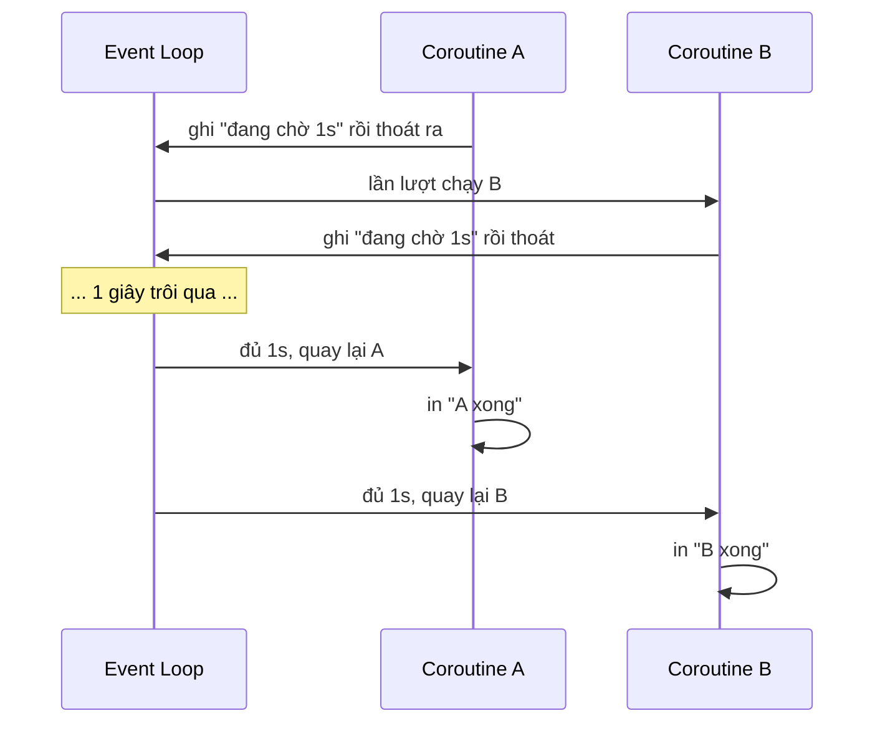

# ⚡ Bài 39: Asyncio – Lập Trình Bất Đồng Bộ

> 🎓 **Chương 8 – Lập trình ứng dụng chuyên sâu**

---

## 🎯 Mục tiêu

Sau bài học này, học viên sẽ:

* ✅ Hiểu khác biệt **chương trình đồng bộ (synchronous)** và **bất đồng bộ (asynchronous)** qua ví dụ đời thực.
* ✅ Định nghĩa được **coroutine** – hàm `async def` – và dùng `await` để chờ.
* ✅ Chạy coroutine bằng **`asyncio.run()`**; tạm dừng bằng **`asyncio.sleep()`**.
* ✅ Chạy **nhiều tác vụ song song** bằng **`asyncio.gather()`**.
* ✅ **Đo và so sánh thời gian** chạy tuần tự so với song song.
* ✅ Biết các **hạn chế** của asyncio và khi nào không nên dùng nó.
* ✅ Áp dụng thực tế: mô phỏng tải nhiều trang web và gọi song song **API thời tiết Open-Meteo**.

---

## 📖 Kiến thức

> 🔁 **Nhắc lại bài trước:** Bài 38 dạy bạn "ký hợp đồng" về kiểu dữ liệu để code dễ đọc, hạn chế bug. Nhưng còn một thứ chậm hơn cả bug — đó là **thời gian chờ**. Khi chờ mạng, chờ ổ cứng, chương trình đứng im. Bài này dạy cách **dùng thời gian chờ đó để làm việc khác**.

### 1. Chương trình đồng bộ – "làm hết việc này rồi mới làm việc kia"

Mọi chương trình bạn viết từ bài 1 đến bài 38 đều **chạy từng dòng một**: dòng này xong rồi mới đến dòng sau.

```python
def tai_trang():
    # Giả sử tải một trang mất 2 giây
    time.sleep(2)
    return "Noi dung trang"

a = tai_trang()   # mất 2 giây
b = tai_trang()   # 2 giây <-- phải chờ a xong mới bắt đầu
# Tổng cộng: 4 giây
```

So sánh đời thường:

| Hình mẫu | Hành vi | Ví dụ |
|---|---|---|
| 🔵 **Đồng bộ** | Một người chỉ làm một việc, xong việc này mới đến việc kia | Đi mua nước: đứng xếp hàng đến lượt mới mua được |
| 🟢 **Bất đồng bộ** | Một người "để lịch chờ" nhiều việc chạy cùng lúc | Vừa nấu cơm vừa chờ máy giặt chạy xong |

`time.sleep(2)` làm **chương trình đông cứng** — máy tính chờ không làm gì trong 2 giây.

### 2. Ví dụ đời thực: Pha trà trong khi chờ nước sôi 🫖

Hãy so sánh hai cách pha trà:

**Cách đồng bộ (tốn thời gian):**

```
Bật ấm đun nước → ĐỨNG NHÌN ấm sôi (3 phút) → rót nước vào ấm trà (1 phút) → lấy bánh (1 phút)
Tổng cộng: 5 phút
```

Bạn đứng nhìn nước sôi mà không làm việc gì hữu ích — đó chính là `time.sleep` bên trong chương trình.

**Cách bất đồng bộ (nhanh):**

```
1. Bật ấm đun nước (nhanh).
2. Trong lúc chờ nước sôi → đi rửa ấm trà, lấy bánh ra bàn.   😴 KHÔNG đứng nhìn ấm
3. Nước sôi → rót nước vào ấm trà, đợi trà ngấm.
4. Hoàn tất, mang trà + bánh ra mời.
```

Tổng thời gian gần bằng **việc lâu nhất (chờ nước sôi)** mà thôi, chứ không phải tổng của tất cả việc.

> 💡 Đây chính là tư tưởng cốt lõi của **asyncio**: khi gặp thao tác **chờ chậm** (đọc file, lấy dữ liệu mạng), hãy **"làm việc khác" trong lúc chờ** thay vì đứng im.

### 3. Coroutine – hàm bất đồng bộ `async def`

Trong Python, hàm thường được khai báo bằng `def`. Hàm **bất đồng bộ (coroutine)** được khai báo bằng **`async def`**:

```python
async def chao():
    return "Xin chao!"
```

| Khai báo | Gọi là gì | Khi gọi xảy ra |
|---|---|---|
| `def` | Hàm thường (đồng bộ) | Thân hàm chạy ngay khi gọi |
| `async def` | **Coroutine** | Chỉ tạo **đối tượng coroutine**, chưa chạy |

> ⚠️ **Quan trọng:** Gọi một coroutine **không chạy nó**. `chao()` chỉ tạo đối tượng coroutine; muốn nó chạy phải **`await`** hoặc đưa vào event loop qua `asyncio.run()`.

### 4. `asyncio.run()` – nơi mọi coroutine bắt đầu

Cách đơn giản nhất để chạy một coroutine:

```python
import asyncio

async def chao():
    print("Bat dau...")
    await asyncio.sleep(1)   # nhường quyền điều phối 1 giây
    print("Xong!")
    return "OK"

asyncio.run(chao())
```

* `asyncio.run(main())` tạo **event loop** (vòng lặp điều phối), chạy coroutine đến khi hết, rồi đóng loop.
* Chỉ nên gọi **một lần duy nhất** trong chương trình — thường ở dòng cuối cùng.

### 5. `asyncio.sleep()` – tạm dừng nhưng không chặn chương trình

`time.sleep(2)` chặn cả chương trình không làm gì. Ngược lại, **`await asyncio.sleep(2)`** chỉ tạm dừng **coroutine hiện tại**; event loop sẽ chạy **coroutine khác** trong lúc chờ.



### 6. `asyncio.gather()` – chạy nhiều coroutine **song song**

Công cụ quan trọng nhất để "chạy cùng lúc":

```python
import asyncio

async def cong_viec(ten: str, so_giay: int) -> str:
    await asyncio.sleep(so_giay)          # tạm dừng, để loop làm việc khác
    return f"{ten} xong sau {so_giay}s"

async def main() -> None:
    # Cả 3 coroutine cùng đua vào loop, chạy gần như đồng thời
    ket_qua = await asyncio.gather(
        cong_viec("A", 2),
        cong_viec("B", 1),
        cong_viec("C", 3),
    )
    print(ket_qua)   # ['A xong sau 2s', 'B xong sau 1s', 'C xong sau 3s']

asyncio.run(main())
```

* `asyncio.gather(a, b, c, ...)` nhận **nhiều coroutine** và chạy **song song**.
* `await` trước `gather` nghĩa là chờ **tất cả** hoàn thành.
* Kết quả trả về là **danh sách theo đúng thứ tự đầu vào** (không phải thứ tự xong trước).
* Tổng thời gian = `max(2, 1, 3) = 3 giây`, chứ **không phải** `2 + 1 + 3 = 6 giây`.

### 7. Đồng bộ vs bất đồng bộ – bảng so sánh

| Tiêu chí | 🔵 Đồng bộ | 🟢 Bất đồng bộ |
|---|---|---|
| Cách thực thi | Từng tác vụ một, hết rồi mới tới tác vụ sau | Dừng ở chỗ chờ để chạy tác vụ khác |
| Ví dụ pha trà | Đứng nhìn ấm nước | Rửa tách trà trong lúc nước sôi |
| Thời gian 3 tác vụ 1s | 3 giây | ~1 giây |
| Độ khó viết | Dễ hiểu, ít sai | Phải hiểu rõ `await` để tránh sai sót |
| Phù hợp khi | I/O nhỏ, tính toán CPU | Chờ mạng, đọc file lớn, đồng bộ nhiều trang |

### 8. Đo và so sánh thời gian thực tế

Dùng `time.perf_counter()` để đo từng cách:

```python
import asyncio
import time

async def tai(n: int) -> int:
    """Giả lập tải nặng n giây."""
    await asyncio.sleep(n)
    return n

async def chay_song_song() -> float:
    bat = time.perf_counter()
    await asyncio.gather(tai(1), tai(1), tai(1))   # chạy đồng thời
    return time.perf_counter() - bat

async def chay_tuan_tu() -> float:
    bat = time.perf_counter()
    for _ in range(3):
        await tai(1)                               # tuần tự từng cái một
    return time.perf_counter() - bat

async def main() -> None:
    print(f"Song song: {await chay_song_song():.2f}s")
    print(f"Tuan tu:   {await chay_tuan_tu():.2f}s")

asyncio.run(main())
```

Kết quả điển hình: `Song song: 1.00s — Tuan tu: 3.00s`.

### 9. Ví dụ thực tế: chờ nhiều API song song với Open-Meteo

Python 3.9 có hàm tiện dụng **`asyncio.to_thread()`** — chạy một hàm đồng bộ (blocking) trong một luồng riêng, **không cần cài thêm thư viện**. Kết hợp với `gather`, ta tải nhiệt độ nhiều thành phố cùng lúc:

```python
import asyncio
import json
import urllib.request
from typing import Dict

def lay_nhiet_do(thanh_pho: str, vi_do: float, kinh_do: float) -> Dict[str, object]:
    """Chạy đồng bộ: gọi Open-Meteo, đọc JSON nhiệt độ hiện tại."""
    url = (f"https://api.open-meteo.com/v1/forecast?latitude={vi_do}"
           f"&longitude={kinh_do}&current_weather=true")
    with urllib.request.urlopen(url, timeout=10) as phan_hoi:
        du_lieu = json.loads(phan_hoi.read().decode("utf-8"))
    nhiet_do = du_lieu["current_weather"]["temperature"]
    return {"thanh_pho": thanh_pho, "nhiet_do": nhiet_do}

async def tai_nhiet_do(*args) -> Dict[str, object]:
    """Bọc công việc chặn vào luồng riêng — event loop KHÔNG bị chặn."""
    return await asyncio.to_thread(lay_nhiet_do, *args)

async def main() -> None:
    cac_thanh_pho = [
        ("Ha Noi", 21.03, 105.85),
        ("Da Nang", 16.07, 108.22),
        ("TP.HCM", 10.82, 106.63),
    ]
    ket_qua = await asyncio.gather(*(tai_nhiet_do(*tp) for tp in cac_thanh_pho))
    for kq in ket_qua:
        print(f"{kq['thanh_pho']}: {kq['nhiet_do']}°C")

asyncio.run(main())
```

* `lay_nhiet_do` là hàm đồng bộ (gọi HTTP truyền thống bằng `urllib`).
* `tai_nhiet_do` là coroutine — dùng `to_thread` để đẩy công việc "chờ mạng" ra **luồng riêng**, event loop tiếp tục điều phối các thành phố khác.
* Cả 3 thành phố được tải **cùng lúc**; tổng thời gian ≈ thời gian thành phố chậm nhất.

### 10. Hạn chế của asyncio – khi nào KHÔNG nên dùng?

`asyncio` **không thần thánh** — nó chạy trên **một luồng duy nhất** và chỉ tăng tốc khi chờ **I/O** (mạng, ổ đĩa, bàn phím...). Không tăng tốc được tác vụ nặng về CPU.

| Trường hợp | Nên dùng |
|---|---|
| Chờ mạng, tải nhiều trang | 🟢 **asyncio** (gather) |
| Đọc/ghi nhiều file lớn | 🟢 **asyncio.to_thread** |
| Tính toán nặng CPU (lặp tỷ lần, xử lý ảnh) | 🔴 **multiprocessing** (chạy đa lõi) |
| Cần chạy 2 hàm đều tốn CPU | 🔴 **threading** / `multiprocessing` |
| Chương trình I/O đơn lẻ, ít tác vụ | 🔵 Đồng bộ cũng đủ |

---

## 💡 Ví dụ minh họa

### Ví dụ 1: Chào hỏi bất đồng bộ

```python
import asyncio

async def chao(ten: str) -> str:
    """Tạo câu chào (mô phỏng một chờ nhỏ)."""
    await asyncio.sleep(0.5)      # một việc nhanh nhưng vẫn "nhường CPU"
    return f"Xin chao {ten}!"

async def main() -> None:
    loi_chao = await chao("Mai")  # await = chờ kết quả coroutine
    print(loi_chao)

asyncio.run(main())
```

| Dòng code | Ý nghĩa |
|---|---|
| `async def chao` | Khai báo coroutine |
| `await asyncio.sleep(0.5)` | Tạm dừng 0.5s, không chặn event loop |
| `await chao("Mai")` | Chờ kết quả của coroutine |
| `asyncio.run(main())` | Tạo event loop, chạy `main`, đóng loop |

### Ví dụ 2: Hai tác vụ song song + đo thời gian

```python
import asyncio
import time

async def tai_tin(ten: str, giay: float) -> str:
    await asyncio.sleep(giay)     # giả lập thời gian tải
    return f"{ten} tai xong sau {giay}s"

async def main() -> None:
    bat = time.perf_counter()
    ket_qua = await asyncio.gather(
        tai_tin("trang A", 2),
        tai_tin("trang B", 3),
    )
    print(ket_qua)
    # Song song: max(2,3) = 3 giây, KHÔNG phải 2+3=5 giây
    print(f"Tong: {time.perf_counter() - bat:.1f}s")

asyncio.run(main())
```

### Ví dụ 3: Mô phỏng tải nhiều trang web

```python
import asyncio
import time
import random

async def tai_trang(so_luot: int) -> str:
    giay = random.uniform(0.5, 1.5)   # thời gian tải "ngẫu nhiên"
    await asyncio.sleep(giay)
    return f"trang{so_luot} xong sau {giay:.1f}s"

async def main() -> None:
    bat = time.perf_counter()
    cac_trang = [tai_trang(i) for i in range(1, 6)]
    for ket in await asyncio.gather(*cac_trang):
        print(ket)
    print(f"Tong {time.perf_counter() - bat:.2f}s")   # ≈ trang chậm nhất

asyncio.run(main())
```

---

## 🔬 Ví dụ nâng cao

### Ví dụ 1: Giới hạn thời gian chờ với `asyncio.wait_for`

Khi một API quá chậm, đừng để chương trình treo vô hạn — đặt **timeout**:

```python
import asyncio

async def tai_nguon_teo() -> str:
    await asyncio.sleep(30)              # ví dụ thật sự chậm
    return "Du lieu"

async def main() -> None:
    try:
        du_lieu = await asyncio.wait_for(tai_nguon_teo(), timeout=2)
        print(du_lieu)
    except asyncio.TimeoutError:
        print("Qua han 2 giay — bo qua, khoi treo chuong trinh!")

asyncio.run(main())
```

### Ví dụ 2: Xử lý lỗi trong `gather` bằng `return_exceptions`

Nếu 1 task lỗi, mặc định `gather` ném lỗi và hủy các task còn lại. Dùng `return_exceptions=True` để tách riêng:

```python
import asyncio

async def go_api(duong_dan: str) -> str:
    await asyncio.sleep(1)
    if duong_dan == "fail":
        raise ValueError("Loi ket noi API!")
    return f"Du lieu {duong_dan}"

async def main() -> None:
    ket_qua = await asyncio.gather(
        go_api("user"),
        go_api("product"),
        go_api("fail"),
        return_exceptions=True,   # lỗi trở thành phần tử, không hủy toàn bộ
    )
    for kq in ket_qua:
        if isinstance(kq, BaseException):
            print("LOI:", kq)
        else:
            print(kq)

asyncio.run(main())
```

### Ví dụ 3: Báo cáo thời gian tải N trang

Ví dụ hoàn chỉnh: tải 8 trang song song rồi in tổng thời gian và danh sách kết quả.

```python
import asyncio
import random
import time

async def tai(ma: int) -> int:
    await asyncio.sleep(random.uniform(0.5, 2.0))
    return ma

async def main() -> None:
    bat = time.perf_counter()
    ket_qua = await asyncio.gather(*(tai(i) for i in range(1, 9)))
    print("Ket qua:", ket_qua)
    print(f"Tong {len(ket_qua)} trang, mat {time.perf_counter() - bat:.2f}s")

asyncio.run(main())
```

---

## ⚠️ Lỗi thường gặp

### Lỗi 1: Gọi coroutine nhưng không `await`

```python
async def chao():
    return "hi"

kq = chao()          # ❌ Chưa chạy — chỉ tạo coroutine
print(kq)            # <coroutine object chao at ...>
```

* **Nguyên nhân:** quên `await`.
* **Hệ quả:** `RuntimeWarning: coroutine 'chao' was never awaited`.
* **Cách sửa:** khai báo `async def main(): ...` và `await chao()` bên trong.

### Lỗi 2: Nhầm `time.sleep` với `asyncio.sleep` trong coroutine

```python
import time

async def xu_ly() -> None:
    time.sleep(2)   # ❌ chặn event loop — các tác vụ khác phải chờ
```

* **Nguyên nhân:** `time.sleep` là hàm đồng bộ, chặn thread chính → event loop đứng im.
* **Cách sửa:** dùng `await asyncio.sleep(2)` (hoặc nếu thật sự cần blocking → `asyncio.to_thread`).

### Lỗi 3: Gọi `asyncio.run()` lồng nhau

```python
async def inner():
    await asyncio.sleep(0)

async def main():
    asyncio.run(inner())   # ❌ RuntimeError: asyncio.run() cannot be called
                           #   from a running event loop
```

**Cách sửa:** Chỉ gọi `asyncio.run()` **một lần** ở dòng cuối. Bên trong coroutine chỉ dùng `await`.

### Lỗi 4: Tưởng asyncio sẽ tăng tốc các tác vụ tính toán nặng

```python
async def tinh_toan_nang():
    for i in range(10**8):
        pass
```

* **Nguyên nhân:** event loop chạy **1 luồng** — công CPU không được chia ra nhiều lõi.
* **Cách sửa:** với tác vụ CPU-bound dùng `multiprocessing`; asyncio chỉ phù hợp chờ I/O.

### Lỗi 5: Quên xử lý ngoại lệ trong `gather`

```python
# ❌ Một task lỗi → ném lỗi, hủy toàn bộ task còn lại
await asyncio.gather(task_ok, task_fail)
```

* **Cách sửa:** dùng `return_exceptions=True` hoặc bọc lỗi ngay trong từng coroutine bằng `try/except`.

---

## 💎 Mẹo

* ✨ **Mỗi lần thấy chương trình đứng chờ** (mạng, file, tải dữ liệu) → hãy bọc thao tác đó trong `await asyncio...`.
* 🧵 **`asyncio.to_thread`** biến hàm "block" thành "chờ thông minh" — không cần cài thư viện thêm.
* ⏱️ **`time.perf_counter()`** để đo thời gian chính xác thay vì `time.time()`.
* 🧽 **`return_exceptions=True`** giữ cho `gather` không sụp đổ toàn cục khi một task lỗi.
* ⏰ **`asyncio.wait_for(...)`** chống treo khi API bên ngoài chậm bất thường.
* 📁 **Tách nhỏ coroutine** thành từng hàm, đặt tên có hậu tố `tai`, `go`, `fetch` để dễ nhận biết.
* 📝 **Tóm tắt nhanh:** chờ bằng lệnh → `await asyncio.sleep`; chạy nhiều việc → `gather`; gọi hàm đồng bộ chậm → `to_thread`; giới hạn chờ → `wait_for`.

---

## 📝 Tóm tắt

| Khái niệm | Nội dung |
|---|---|
| ⚡ Đồng bộ | Làm việc này xong rồi mới làm việc kia |
| 🧵 Bất đồng bộ | Tạm dừng ở chỗ chờ, làm việc khác trong lúc chờ |
| 🌀 `async def` | Tạo coroutine |
| 🧷 `await` | Chờ kết quả + nhường điều phối |
| 🏠 `asyncio.run(coro)` | Điểm vào duy nhất để chạy coroutine |
| 😴 `await asyncio.sleep(n)` | Tạm dừng coroutine này mà không chặn loop |
| 🧲 `asyncio.gather(...)` | Chạy nhiều coroutine song song, trả danh sách kết quả |
| 🧵 `asyncio.to_thread(...)` | Chạy hàm đồng bộ trong luồng riêng |
| ⏰ `asyncio.wait_for(...)` | Giới hạn thời gian chờ — tránh treo vô hạn |
| ⚠️ Hạn chế | 1 luồng, không tăng tốc CPU-bound |

---

## 🧪 Kiểm tra nhanh

1. ❓ Coroutine được khai báo bằng từ khóa nào?
2. ❓ Gọi trực tiếp `chao()` (hàm `async def`) thì điều gì xảy ra?
3. ❓ Mục đích của `await` là gì?
4. ❓ `await asyncio.sleep(1)` khác `time.sleep(1)` ra sao?
5. ❓ Công cụ nào chạy nhiều coroutine song song và trả kết quả?
6. ❓ Event loop của asyncio chạy trên bao nhiêu luồng chính?
7. ❓ Vì sao asyncio không tăng tốc các tác vụ tính toán nặng?
8. ❓ Trong `gather`, tham số nào cho phép task lỗi không hủy các task còn lại?
9. ❓ Công cụ nào giới hạn thời gian chờ một tác vụ?
10. ❓ Ba task mỗi task `sleep(2)`, dùng `gather` thì mất tổng bao nhiêu giây?

<details>
<summary>🔍 Xem đáp án</summary>

1. `async def`.
2. Trả về một coroutine — **không** chạy; cần `await` hoặc đưa vào `asyncio.run`.
3. Chờ kết quả của coroutine và nhường điều phối cho việc khác.
4. `time.sleep` chặn cả event loop; `asyncio.sleep` chỉ tạm dừng coroutine đang chạy.
5. `asyncio.gather()`.
6. Một luồng duy nhất.
7. Vì một luồng không tận dụng được đa lõi CPU; asyncio chỉ chia sẻ thời gian chờ I/O.
8. `return_exceptions=True`.
9. `asyncio.wait_for(task, timeout=n)`.
10. `max(2,2,2) = 2` giây.

</details>

---

## 📚 Bài đọc thêm

* [Python docs – asyncio (thư viện chuẩn)](https://docs.python.org/3/library/asyncio.html)
* [asyncio – High-level API](https://docs.python.org/3/library/asyncio-api.html)
* [Real Python – Async IO in Python](https://realpython.com/async-io-python/)
* [Open-Meteo – API thời tiết tự do](https://open-meteo.com/)

---

## 🏁 Kết thúc bài

🎉 Bạn đã hiểu cách "chờ một cách thông minh" bằng asyncio. Giờ đến lúc **ghép toàn bộ** 39 bài học thành một **dự án Mini hoàn chỉnh** — nơi bạn không học từng khái niệm rời rạc nữa mà **vận dụng mọi thứ cùng lúc**:

👉 **[Bài 40: Mini Project – Quản Lý Cửa Hàng Sách](../40_Mini_Project/bai_giang.md)**