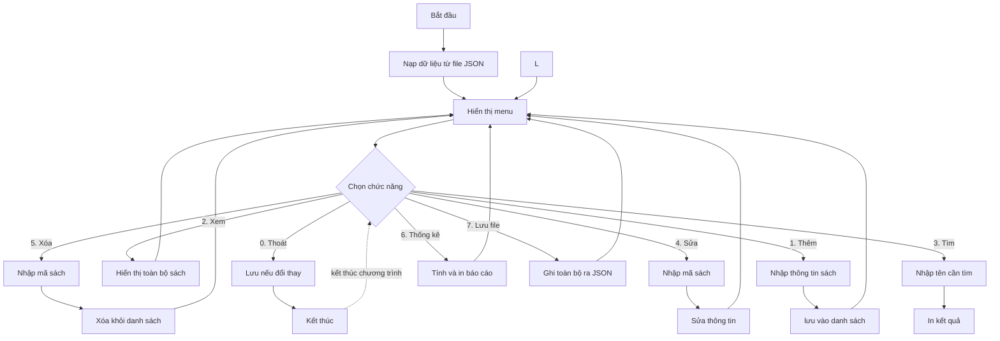

# 🆕 Bài 40: Mini Project – Ứng Dụng Quản Lý Cửa Hàng Sách

> 🎓 **Chương 8 – Lập trình ứng dụng chuyên sâu**

---

## 🎯 Mục tiêu

Sau bài học này, học viên sẽ:

* ✅ Hiểu quy trình làm **một dự án phần mềm nhỏ**: phân tích yêu cầu → thiết kế → lập trình → kiểm thử.
* ✅ Lập được **sơ đồ luồng hoạt động** (mermaid flowchart) cho ứng dụng.
* ✅ **Chia nhỏ chương trình thành hàm** — mỗi hàm một việc, tái sử dụng được.
* ✅ Viết đầy đủ **menu và CRUD** (Thêm, Xem, Sửa, Xóa, Tìm) cho danh sách sách.
* ✅ Thống kê kho sách (tổng số, tổng giá trị, trung bình giá, sản phẩm đắt nhất).
* ✅ **Lưu / đọc dữ liệu bằng file JSON** với thư viện chuẩn `json`.
* ✅ Ghép tất cả thành **một chương trình hoàn chỉnh chạy được**.

---

## 📖 Kiến thức

> 💬 **Bài học lớn nhất của khóa:** bạn đã học 39 bài về từng mảnh ghép. Bài này dạy **cách lắp các mảnh ghép ấy lại thành một ứng dụng hoàn chỉnh** — kỹ năng mà mọi lập trình viên làm nghề đều phải biết.

### 1. Đề bài và bài toán thực tế 🏪

Một cửa hàng sách nhỏ cần quản lý kho sách bằng máy tính. Người bán sẽ:

1. Xem danh sách sách trong kho.
2. Thêm sách mới.
3. Tìm sách theo tên.
4. Sửa thông tin sách (đổi giá, số lượng...).
5. Xóa sách khi hết hàng.
6. Xem thống kê (tổng số đầu sách, tổng giá trị kho, trung bình giá...).
7. **Lưu lại** danh sách để mở lại lần sau không bị mất → dùng file JSON.

### 2. Phân tích yêu cầu (Requirements)

| STT | Chức năng | Kiểu thao tác | Ghi chú |
|---|---|---|---|
| 1 | Hiện menu lựa chọn | Điều khiển | Run lại cho đến khi chọn "Thoát" |
| 2 | Thêm sách | CRUD - Create | Nhập tên, tác giả, thể loại, giá, số lượng |
| 3 | Xem toàn bộ sách | CRUD - Read | In bảng gọn gàng |
| 4 | Tìm kiếm theo tên | CRUD - Read | Phân không phân biệt hoa thường |
| 5 | Sửa sách theo mã | CRUD - Update | Có thể sửa từng trường |
| 6 | Xóa sách theo mã | CRUD - Delete | Yêu cầu xác nhận |
| 7 | Thống kê kho | Báo cáo | Số đầu sách, tổng giá, giá trung bình |
| 8 | Lưu / đọc file JSON | Lưu trữ | Dữ liệu bền vững qua các lần chạy |

> 📐 **Quy tắc vàng của thiết kế:** chương trình nhỏ nhưng phải **chia thành hàm**, mỗi hàm một việc duy nhất. Nhìn vào tên hàm là biết hàm đó làm gì, không cần đọc thân.

### 3. Sơ đồ luồng tổng thể (flowchart)



### 4. Thiết kế dữ liệu – mỗi sách là một từ điển

Mỗi cuốn sách biểu diễn bằng một **dict** (ôn bài 17), các cuốn nằm trong một **list**:

```python
{
    "ma": 1,
    "ten": "De Men Phieu Luu Ky",
    "tac_gia": "To Hoai",
    "the_loai": "Truyen",
    "gia": 65000.0,
    "so_luong": 12
}
```

| Trường | Kiểu | Ý nghĩa |
|---|---|---|
| `ma` | int | Mã sách duy nhất (tự tăng dần) |
| `ten` | str | Tên sách |
| `tac_gia` | str | Tác giả |
| `the_loai` | str | Thể loại (Văn học, Khoa học...) |
| `gia` | float | Đơn giá (đồng) |
| `so_luong` | int | Số cuốn trong kho |

> 💡 Mã tự tăng: muốn phần tử tiếp theo dùng `danh_sach[-1]["ma"] + 1` (cuối list) hoặc `max(ma)` hiện có rồi cộng một.

### 5. Chia nhỏ thành hàm

| Hàm | Tham số | Việc làm |
|---|---|---|
| `tao_sach(...)` | các trường | Tạo dict sách mới |
| `them_sach(danh_sach)` | list | Nhập & thêm sách vào cuối |
| `hien_thi_danh_sach(danh_sach)` | list | In toàn bộ sách |
| `tim_theo_ten(danh_sach, ten)` | list, str | Trả `None` nếu không thấy |
| `tim_theo_ma(danh_sach, ma)` | list, int | Trả index hoặc `None` |
| `sua_sach(danh_sach, ma)` | list, int | Cập nhật trường được chọn |
| `xoa_sach(danh_sach, ma)` | list, int | Xóa sách |
| `thong_ke(danh_sach)` | list | In các số liệu tổng hợp |
| `luu_file(danh_sach, ten)` | list, str | `json.dump` ra file |
| `nap_file(ten)` | str | `json.load` từ file, `None` nếu quên |
| `main()` | — | Vòng lặp menu, điều phối mọi thứ |

> 📁 **Cấu trúc 1 file duy nhất `quan_ly_sach.py`** — đủ cho một dự án Mini. Chương trình thật sẽ tách nhiều file; khái niệm tách hàm đã chuẩn bị cho bạn.

### 6. Lưu trữ bằng JSON

JSON là "bản đồ chữ" của dữ liệu (ôn bài 32):

| Việc | Lệnh chuẩn |
|---|---|
| Ghi list dict ra file | `json.dump(data, f, ensure_ascii=False, indent=2)` |
| Đọc file thành list | `json.load(f)` |
| Xử lý file chưa tồn tại | bắt `FileNotFoundError` → trả `[]` |

> ⚠️ `ensure_ascii=False` giúp ghi đúng tiếng Việt có dấu trong file JSON, không bị thành các ký tự `\u....` khó đọc.

---

## 💡 Ví dụ minh họa – Code từng phần (xây dần)

Chúng ta **xây chương trình từ các viên gạch nhỏ**. Mỗi phần dưới đây là một hàm độc lập; ở phần Ví dụ nâng cao chúng sẽ được ghép lại thành chương trình hoàn chỉnh.

### Phần 1: Hàm tạo sách + danh sách mẫu

```python
from typing import Dict, List

Sach = Dict[str, object]   # "bản đồ" một cuốn sách

def tao_sach(ma: int, ten: str, tac_gia: str, the_loai: str,
             gia: float, so_luong: int) -> Sach:
    """Trả về một dict đại diện cho cuốn sách mới."""
    return {
        "ma": ma,
        "ten": ten,
        "tac_gia": tac_gia,
        "the_loai": the_loai,
        "gia": gia,
        "so_luong": so_luong,
    }

# Danh sách ban đầu có 2 cuốn
kho: List[Sach] = [
    tao_sach(1, "De Men Phieu Luu Ky", "To Hoai", "Truyen", 65000.0, 12),
    tao_sach(2, "Tuoi tho du doi", "Nguyen Nhat Anh", "Van hoc", 58000.0, 8),
]
print(kho[0]["ten"])   # De Men Phieu Luu Ky
```

### Phần 2: Hiển thị bảng sách

```python
def hien_thi_danh_sach(danh_sach: List[Sach]) -> None:
    """In toàn bộ sách dạng bảng."""
    if not danh_sach:
        print("Kho dang rong.")
        return
    print(f"{'Ma':<4}{'Ten':<24}{'Tac gia':<16}{'The loai':<12}{'Gia':<10}{'SL':<5}")
    print("-" * 70)
    for s in danh_sach:
        print(f"{s['ma']:<4}{s['ten']:<24}{s['tac_gia']:<16}"
              f"{s['the_loai']:<12}{s['gia']:<10}{s['so_luong']:<5}")

kho: List[Sach] = []
hien_thi_danh_sach(kho)   # Kho dang rong.
```

### Phần 3: Thêm sách

```python
def them_sach(danh_sach: List[Sach]) -> None:
    """Nhập thông tin rồi thêm sách mới vào cuối kho."""
    ten = input("Ten sach: ")          # Nhập: De Men
    tac_gia = input("Tac gia: ")       # Nhập: To Hoai
    the_loai = input("The loai: ")     # Nhập: Truyen
    gia = float(input("Gia (dong): ")) # Nhập: 65000
    so_luong = int(input("So luong: "))# Nhập: 10
    # Mã mới = mã lớn nhất hiện có + 1
    ma = max((s["ma"] for s in danh_sach), default=0) + 1
    danh_sach.append(tao_sach(ma, ten, tac_gia, the_loai, gia, so_luong))
    print("Da them sach co ma", ma)
```

### Phần 4: Tìm theo tên và theo mã

```python
from typing import Optional

def tim_theo_ten(danh_sach: List[Sach], ten_can_tim: str) -> Optional[Sach]:
    """Tìm cuốn đầu tiên có tên chứa chuỗi (không phân biệt hoa thường)."""
    ten_can_tim = ten_can_tim.lower()                # đưa về chữ thường
    for s in danh_sach:
        if ten_can_tim in str(s["ten"]).lower():
            return s
    return None

def tim_theo_ma(danh_sach: List[Sach], ma: int) -> Optional[int]:
    """Trả VỀ vị trí (index) của sách trong list; None nếu không có."""
    for i, s in enumerate(danh_sach):
        if s["ma"] == ma:
            return i
    return None
```

> None trả về từ hàm tìm kiếm phải được người gọi **kiểm tra** — kỹ năng đã học ở bài 38 (`Optional`).

### Phần 5: Sửa và Xóa

```python
def sua_sach(danh_sach: List[Sach], ma: int) -> None:
    """Sửa một hoặc nhiều trường của sách có mã cho trước."""
    vi_tri = tim_theo_ma(danh_sach, ma)
    if vi_tri is None:
        print("Khong tim thay ma", ma)
        return
    s = danh_sach[vi_tri]
    print("Dang sua:", s["ten"], "-> de trong de giu nguyen")
    gia_moi = input("Gia moi: ")        # Nhập: 70000
    if gia_moi.strip():
        s["gia"] = float(gia_moi)
    so_moi = input("So luong moi: ")    # Nhập: 15
    if so_moi.strip():
        s["so_luong"] = int(so_moi)
    print("Da cap nhat sach ma", ma)

def xoa_sach(danh_sach: List[Sach], ma: int) -> None:
    """Xóa sách có mã cho trước khi xác nhận."""
    vi_tri = tim_theo_ma(danh_sach, ma)
    if vi_tri is None:
        print("Khong tim thay ma", ma)
        return
    xac_nhan = input("Chac chan xoa (y/n)? ")  # Nhập: y
    if xac_nhan.lower() == "y":
        danh_sach.pop(vi_tri)
        print("Da xoa sach ma", ma)
    else:
        print("Da huy thao tac xoa.")
```

---

## 🔬 Ví dụ nâng cao

### Nâng cao 1: Thống kê kho sách

```python
def thong_ke(danh_sach: List[Sach]) -> None:
    """In báo cáo: số đầu sách, tổng đầu sách, tổng giá trị, giá trung bình."""
    if not danh_sach:
        print("Kho rong, khong co gi de thong ke.")
        return
    so_dau = len(danh_sach)
    tong_cuon = sum(int(s["so_luong"]) for s in danh_sach)
    tong_gia_tri = sum(float(s["gia"]) * int(s["so_luong"]) for s in danh_sach)
    gia_tb = sum(float(s["gia"]) for s in danh_sach) / so_dau
    sach_dat_nhat = max(danh_sach, key=lambda s: s["gia"])
    print(f"So dau sach: {so_dau}")
    print(f"Tong so cuon: {tong_cuon}")
    print(f"Tong gia tri kho: {tong_gia_tri:,.0f} dong")
    print(f"Gia trung binh: {gia_tb:,.0f} dong")
    print(f"Sach dat nhat: {sach_dat_nhat['ten']} ({sach_dat_nhat['gia']:,.0f} dong)")
```

### Nâng cao 2: Lưu và nạp file JSON

```python
import json

def luu_file(danh_sach: List[Sach], ten_file: str) -> None:
    """Ghi toàn bộ danh sách ra file JSON."""
    with open(ten_file, "w", encoding="utf-8") as f:
        json.dump(danh_sach, f, ensure_ascii=False, indent=2)
    print(f"Da luu {len(danh_sach)} cuon sach vao {ten_file}.")

def nap_file(ten_file: str) -> List[Sach]:
    """Đọc danh sách từ file JSON; file chưa có thì trả danh sách rỗng."""
    try:
        with open(ten_file, "r", encoding="utf-8") as f:
            return json.load(f)
    except FileNotFoundError:
        return []
```

### Nâng cao 3: Chương trình hoàn chỉnh (ghép mọi phần)

```python
# quan_ly_sach.py
import json
from typing import Dict, List, Optional

Sach = Dict[str, object]

# ... (đặt toàn bộ các hàm tao_sach, them_sach, hien_thi,
#      tim_*, sua_sach, xoa_sach, thong_ke, luu_file, nap_file ở đây) ...

def in_menu() -> None:
    print("\n===== QUAN LY CUA HANG SACH =====")
    print("1. Them sach")
    print("2. Xem danh sach")
    print("3. Tim theo ten")
    print("4. Sua sach")
    print("5. Xoa sach")
    print("6. Thong ke")
    print("7. Luu file")
    print("0. Thoat")

def main() -> None:
    kho: List[Sach] = nap_file("kho_sach.json")
    while True:
        in_menu()
        chon = input("Chon chuc nang: ")      # Nhập: 1/2/3/...
        if chon == "1":
            them_sach(kho)
        elif chon == "2":
            hien_thi_danh_sach(kho)
        elif chon == "3":
            ten = input("Nhap ten can tim: ")   # Nhập: De Men
            sach = tim_theo_ten(kho, ten)
            print(sach if sach else "Khong tim thay.")
        elif chon == "4":
            sua_sach(kho, int(input("Ma sach can sua: ")))
        elif chon == "5":
            xoa_sach(kho, int(input("Ma sach can xoa: ")))
        elif chon == "6":
            thong_ke(kho)
        elif chon == "7":
            luu_file(kho, "kho_sach.json")
        elif chon == "0":
            print("Tam biet!")
            break
        else:
            print("Lua chon khong hop le.")

if __name__ == "__main__":
    main()
```

> 💡 Cấu trúc này là **khuôn mẫu (template)** chuẩn của mọi chương trình menu: `while True` + rẽ nhánh `if/elif` + hàm chuyên biệt cho từng việc.

---

## ⚠️ Lỗi thường gặp

### Lỗi 1: Quên xử lý `None` khi tìm kiếm

```python
vi_tri = tim_theo_ma(kho, 99)
kho[vi_tri]["gia"] = 100   # ❌ TypeError: 'NoneType' object is not subscriptable
```

* **Nguyên nhân:** mã 99 không tồn tại → hàm trả `None`.
* **Cách sửa:** luôn kiểm tra `if vi_tri is None: print("Khong tim thay")` trước khi dùng.

### Lỗi 2: Lưu file nhưng quên `encoding="utf-8"` và `ensure_ascii=False`

```python
json.dump(kho, f)          # ❌ tiếng Việt biến thành \u01A1...
```

* **Cách sửa:** mở file với `encoding="utf-8"` và ghi `json.dump(..., ensure_ascii=False, indent=2)`.

### Lỗi 3: `input()` trả chuỗi — ép kiểu sai vị trí

```python
gia = input("Gia: ")          # "65000" là str
kho[0]["gia"] = gia * 2       # ❌ nối chuỗi: "6500065000"
```

* **Cách sửa:** `gia = float(input("Gia: "))` — ép kiểu **ngay khi nhập**, và đặt trong `try/except` nếu người dùng gõ chữ.

### Lỗi 4: Mã sách bị trùng

```python
def them_sach(danh_sach):
    ma = len(danh_sach) + 1   # ❌ sai khi đã xóa bớt sách
```

* **Cách sửa:** dùng `max((s["ma"] for s in danh_sach), default=0) + 1` — mã mới luôn lớn hơn mã lớn nhất hiện có.

### Lỗi 5: Ghi đè file khi thoát mà chưa lưu

Nếu người dùng chọn Thoát sau khi thêm/sửa, mọi thay đổi **biến mất** vì mới chỉ nằm trong RAM.

* **Cách sửa:** mỗi thao tác thêm/sửa/xóa nên hỏi "Lưu ngay? (y/n)" hoặc tự động `luu_file` sau mỗi thay đổi — đơn giản và an toàn nhất cho dự án Mini.

---

## 💎 Mẹo

* 🏗️ **Xây từng hàm, test từng hàm**: viết xong `them_sach` là chạy thử ngay, không đợi hoàn thành cả dự án.
* 🐍 **Dùng type hints** cho mọi hàm — bạn sẽ đọc lại code của mình sau 1 tuần và cảm ơn chính mình.
* 📊 **`sum(... for s in danh_sach)`** — generator expression tính tổng nhanh và gọn.
* 📁 **Tên file JSON đặt chung một chỗ** (ví dụ hằng số `TEN_FILE = "kho_sach.json"`) — đổi một dòng là đổi toàn bộ.
* 🔤 **Tìm kiếm không phân biệt hoa thường** bằng `.lower()` cả hai phía.
* 🧪 **Chạy thử kịch bản đầy đủ** trước khi nộp: thêm → sửa → xóa → thống kê → lưu → thoát → mở lại xem dữ liệu còn không.

---

## 📝 Tóm tắt

| Khái niệm | Nội dung |
|---|---|
| 🗂️ Phân tích yêu cầu | Liệt kê chức năng trước khi viết code |
| 🗺️ Flowchart | Vẽ luồng hoạt động bằng mermaid |
| 🧩 Chia hàm | Mỗi hàm một việc; tái sử dụng |
| 📚 Dữ liệu sách | Dict `{"ma","ten","tac_gia","the_loai","gia","so_luong"}` |
| ➕➖✏️ CRUD | Thêm, Xem, Sửa, Xóa trên List |
| 📈 Thống kê | Đếm, tổng, trung bình, max bằng generator |
| 💾 JSON | `json.dump` / `json.load` với `encoding="utf-8"`, `ensure_ascii=False` |
| 🔁 Vòng menu | `while True` + `input` + rẽ nhánh |

---

## 🧪 Kiểm tra nhanh

1. ❓ Vì sao cần phân tích yêu cầu trước khi viết code?
2. ❓ Mỗi cuốn sách được biểu diễn bằng kiểu dữ liệu nào?
3. ❓ Hàm nào tạo ra dict của cuốn sách mới?
4. ❓ Mã sách mới tính thế nào để không bị trùng?
5. ❓ `tim_theo_ma` trả về gì khi không tìm thấy — vì sao cần kiểu `Optional`?
6. ❓ Lệnh nào ghi danh sách ra file JSON kèm tiếng Việt đúng?
7. ❓ Khi đọc file không tồn tại, hàm `nap_file` nên trả về gì?
8. ❓ Vòng lặp menu dùng câu lệnh nào để lặp đến khi chọn thoát?
9. ❓ Nêu 2 cách tránh mất dữ liệu khi thoát chương trình.
10. ❓ `sum(float(s["gia"]) for s in kho)` tính được cái gì?

<details>
<summary>🔍 Xem đáp án</summary>

1. Tránh làm thiếu chức năng, biết rõ cần viết gì.
2. Từ điển (dict).
3. `tao_sach(ma, ten, tac_gia, the_loai, gia, so_luong)`.
4. `max((s["ma"] for s in danh_sach), default=0) + 1`.
5. Trả `None` — người gọi kiểm tra trước khi dùng.
6. `json.dump(data, f, ensure_ascii=False, indent=2)` với file mở `encoding="utf-8"`.
7. Danh sách rỗng `[]`.
8. `while True` (kết hợp `break` khi chọn 0).
9. Tự động lưu sau mỗi thay đổi; hoặc lưu trước khi thoát.
10. Tổng giá trị của toàn bộ kho sách.

</details>

---

## 📚 Bài đọc thêm

* [Python docs – json (mã hóa dữ liệu)](https://docs.python.org/3/library/json.html)
* [Python docs – file I/O](https://docs.python.org/3/tutorial/inputoutput.html)
* [Mermaid – hướng dẫn flowchart](https://mermaid.js.org/syntax/flowchart.html)
* [PEP 8 – phong cách viết code Python](https://peps.python.org/pep-0008/)

---

## 🏁 Kết thúc bài

🎉 Bạn vừa trải qua toàn bộ quy trình làm một dự án nhỏ: phân tích → thiết kế → code từng hàm → ghép nối → lưu trữ JSON. Giờ đây bạn đã đủ kỹ năng cho thử thách lớn cuối cùng — một **Dự án cuối khóa** chuyên nghiệp với **OOP + SQLite**:

👉 **[Bài 41: Dự Án Cuối Khóa – Ứng Dụng Quản Lý Thư Viện](../41_Du_an_Cuoi_Khoa/bai_giang.md)**