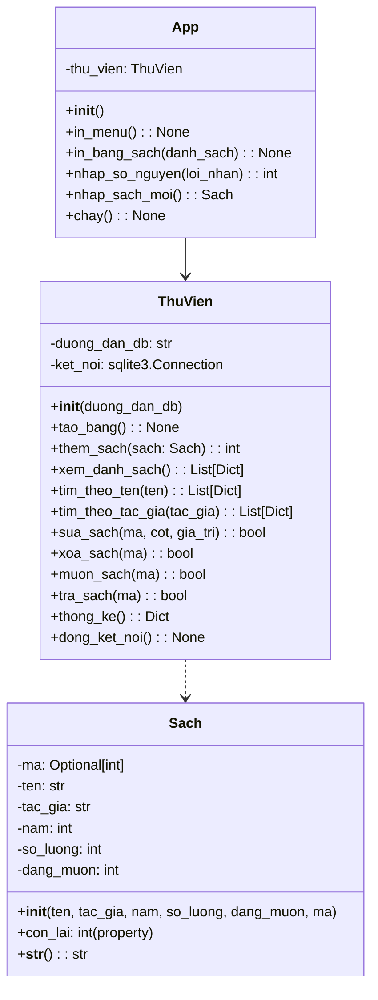
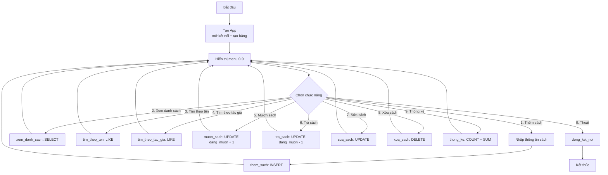

# 🏆 Bài 41: Dự Án Cuối Khóa – Ứng Dụng Quản Lý Thư Viện (Library Manager)

> 🎓 **Chương 8 – Lập trình ứng dụng chuyên sâu**

---

## 🎯 Mục tiêu

Sau bài học này, học viên sẽ:

* ✅ Tổng hợp **toàn bộ kiến thức 40 bài trước**: OOP, SQLite, exception, module, typing, file, JSON...
* ✅ Phân tích yêu cầu và **thiết kế cơ sở dữ liệu** (bảng `Sach` với 6 cột) trước khi viết code.
* ✅ Xây dựng **3 lớp** `Sach`, `ThuVien`, `App` — đúng tinh thần lập trình hướng đối tượng (ôn bài 23).
* ✅ Viết đầy đủ các hàm **CRUD + mượn/trả + thống kê** bằng câu lệnh SQL an toàn (placeholder `?`).
* ✅ **Xử lý lỗi toàn diện**: nhập sai, mượn khi hết sách, lỗi database — chương trình không bao giờ gãy.
* ✅ Tạo ra **một sản phẩm chạy được, dữ liệu bền vững** nhờ SQLite — nâng cấp trực tiếp từ Mini Project (bài 40).
* ✅ Biết tự **chấm điểm theo rubric** và có định hướng phát triển sau khóa học.

---

## 📖 Kiến thức

> 💬 **Nhắc bài trước:** ở **[Bài 40](../40_Mini_Project/bai_giang.md)** bạn đã làm "Quản lý cửa hàng sách" bằng **List + JSON** — dữ liệu nằm trong RAM, mỗi lần chạy phải nạp từ file. Bài cuối cùng này sẽ **nâng cấp toàn bộ** lên **OOP + SQLite**: dữ liệu nằm trong một *cơ sở dữ liệu* thật, mọi thao tác trở nên chuyên nghiệp như phần mềm thương mại.

### 1. Đặt vấn đề 📚

Một thư viện nhỏ của trường có hàng trăm đầu sách. Thủ thư hiện ghi sổ tay:

* 📕 Mỗi ngày phải lật sổ để xem **cuốn nào đang được mượn**, **còn lại bao nhiêu cuốn**.
* ✏️ Học sinh mượn/trả phải chờ thủ thư sửa sổ — dễ sai sót, mất thời gian.
* 📉 Cuối tháng muốn thống kê: bao nhiêu đầu sách? bao nhiêu cuốn đang mượn? — đếm tay rất mệt.

**Yêu cầu:** hãy xây một chương trình Python để máy tính làm hết việc trên. Đây chính là **bài toán cuối khóa** — kết hợp mọi thứ bạn đã học suốt 41 bài.

### 2. Yêu cầu chức năng (Requirements)

| STT | Chức năng | Kiểu thao tác | Mô tả ngắn |
|---|---|---|---|
| 1 | Thêm sách | CRUD – Create | Nhập tên, tác giả, năm, số lượng |
| 2 | Xem danh sách | CRUD – Read | In toàn bộ đầu sách dạng bảng |
| 3 | Tìm theo tên | CRUD – Read | Tìm sách có tên chứa chuỗi nhập vào |
| 4 | Tìm theo tác giả | CRUD – Read | Tìm theo tên tác giả |
| 5 | Mượn sách | Nghiệp vụ | Tăng `dang_muon` lên 1 nếu còn sách |
| 6 | Trả sách | Nghiệp vụ | Giảm `dang_muon` xuống 1 nếu có cuốn đang mượn |
| 7 | Sửa sách | CRUD – Update | Sửa một cột (tên, tác giả, năm, số lượng) |
| 8 | Xóa sách | CRUD – Delete | Xóa đầu sách theo mã |
| 9 | Thống kê | Báo cáo | Số đầu sách, tổng cuốn, đang mượn, còn lại |
| 0 | Thoát | Điều khiển | Đóng kết nối DB, kết thúc |

> 📐 **Bài 40 dạy ta:** trước khi viết code, phải **liệt kê chức năng**. Bài này ta làm điều đó một cách bài bản hơn: liệt kê xong → thiết kế dữ liệu → thiết kế lớp → vẽ sơ đồ → mới lập trình.

### 3. Bài 40 → Bài 41: sự tiến bộ như thế nào?

| Tiêu chí | Bài 40 (Mini Project) | Bài 41 (Dự án cuối khóa) |
|---|---|---|
| Tổ chức code | Các hàm rời rạc | **3 lớp OOP**: `Sach`, `ThuVien`, `App` |
| Lưu trữ | List + file JSON | **SQLite** — cơ sở dữ liệu thật sự |
| Truy vấn | Quét list bằng vòng lặp | Câu lệnh SQL: `SELECT`, `INSERT`, `UPDATE`, `DELETE` |
| An toàn dữ liệu | Phải nhớ lưu file thủ công | Mỗi thao tác **tự commit** ngay vào DB |
| Tìm kiếm | `in` trong list | `LIKE '%...%'` do database xử lý |
| Khả năng mở rộng | Chỉ chạy được khi dữ liệu nhỏ | Hàng nghìn cuốn sách vẫn nhanh |

> 🚀 Kỹ sư phần mềm thật sự thường làm đúng con đường này: **làm thử bằng cấu trúc đơn giản → nhận ra giới hạn → nâng cấp lên công nghệ mạnh hơn.**

### 4. Thiết kế cơ sở dữ liệu — bảng `Sach`

Một đầu sách cần 6 thông tin. Ta đặt tên cột **bằng tiếng Việt không dấu** để code khỏi lỗi:

```sql
CREATE TABLE IF NOT EXISTS Sach (
    id         INTEGER PRIMARY KEY AUTOINCREMENT,
    ten        TEXT    NOT NULL,
    tac_gia    TEXT    NOT NULL,
    nam        INTEGER,
    so_luong   INTEGER NOT NULL,
    dang_muon  INTEGER NOT NULL DEFAULT 0
);
```

| Cột | Kiểu dữ liệu | Ràng buộc | Ý nghĩa |
|---|---|---|---|
| `id` | INTEGER | PRIMARY KEY AUTOINCREMENT | Mã sách tự tăng, **duy nhất** |
| `ten` | TEXT | NOT NULL | Tên đầu sách |
| `tac_gia` | TEXT | NOT NULL | Tác giả |
| `nam` | INTEGER | — | Năm xuất bản |
| `so_luong` | INTEGER | NOT NULL | Tổng số cuốn của đầu sách |
| `dang_muon` | INTEGER | NOT NULL DEFAULT 0 | Số cuốn đang được mượn |

> 💡 **Vì sao có cả `so_luong` lẫn `dang_muon`?** Vì một đầu sách có thể có 10 cuốn; học sinh mượn 3 cuốn. Số còn lại trên kệ = `so_luong - dang_muon`. Không lưu "số còn lại" trực tiếp vì nó **tính được** từ hai cột kia — tránh dữ liệu trùng lặp và lệch nhau.
>
> 💾 **Lưu ý quan trọng:** khi chạy chương trình, file **`thu_vien.db` sẽ được tạo tự động ngay tại thư mục đang chạy** — bạn không cần tạo trước.

### 5. Thiết kế lớp — sơ đồ classDiagram



| Lớp | Trách nhiệm | Giống vai trò ngoài đời |
|---|---|---|
| `Sach` | Mô tả **một đầu sách** (dữ liệu thuần túy) | "Phiếu mô tả sách" |
| `ThuVien` | **Toàn bộ thao tác với database** (một class duy nhất chứa mọi câu SQL) | "Người thủ thư giữ sổ" |
| `App` | **Menu + nhập liệu + in ấn** (giao tiếp với người dùng) | "Quầy phục vụ bạn đọc" |

> 🧩 **Nguyên tắc một trách nhiệm (single responsibility):** `ThuVien` không bao giờ gọi `input()`; `App` không bao giờ viết câu SQL. Nhìn vào một class là biết nó chỉ lo một việc — mẹo lớn nhất của lập trình thực tế.

### 6. Sơ đồ luồng menu (flowchart)



> 🔁 **Khuôn mẫu menu** (đã học bài 40): `while True` → in menu → `input` → `if/elif` → lặp lại cho tới khi chọn `0` rồi `break`. Lần này mỗi nhánh chỉ cần **một dòng gọi phương thức của `ThuVien`** — sức mạnh của OOP.

### 7. Triển khai từng bước (Tạo ứng dụng)

#### Bước 0: Chuẩn bị — import và hằng số

```python
import sqlite3
from typing import Dict, List, Optional

# File thu_vien.db sẽ được tạo tự động tại thư mục đang chạy chương trình
TEN_FILE_DB = "thu_vien.db"
```

* `sqlite3` — thư viện chuẩn của Python, **không cần cài thêm** (ôn bài 36).
* Hằng số `TEN_FILE_DB` đặt tên file DB **một chỗ duy nhất** — muốn đổi tên chỉ sửa một dòng (ôn bài 38 về typing, bài 40 về hằng số).

#### Bước 1: Kết nối và tạo bảng

```python
class ThuVien:
    """Quản lý mọi thao tác với cơ sở dữ liệu SQLite."""

    COT_HOP_LE = ("ten", "tac_gia", "nam", "so_luong")  # danh sách cột được phép sửa

    def __init__(self, duong_dan_db: str = TEN_FILE_DB) -> None:
        self.duong_dan_db = duong_dan_db
        # row_factory: mỗi dòng trả về truy cập được theo tên cột (dong["ten"])
        self.ket_noi = sqlite3.connect(duong_dan_db)
        self.ket_noi.row_factory = sqlite3.Row
        self.tao_bang()

    def tao_bang(self) -> None:
        """Tạo bảng Sach nếu chưa tồn tại (chạy mỗi lần mở ứng dụng)."""
        with self.ket_noi:   # context manager: tự COMMIT khi thành công
            self.ket_noi.execute(
                """CREATE TABLE IF NOT EXISTS Sach (
                       id         INTEGER PRIMARY KEY AUTOINCREMENT,
                       ten        TEXT    NOT NULL,
                       tac_gia    TEXT    NOT NULL,
                       nam        INTEGER,
                       so_luong   INTEGER NOT NULL,
                       dang_muon  INTEGER NOT NULL DEFAULT 0
                   )"""
            )
```

* `sqlite3.Row` cho phép đọc cột **bằng tên** thay vì chỉ số: `dong["ten"]` thay vì `dong[1]` — code dễ đọc hơn nhiều (bài 36).
* `with self.ket_noi:` — nếu khối lệnh chạy tốt thì **tự động COMMIT**, nếu có lỗi thì tự ROLLBACK. Không còn lỗi "quên lưu" (bài 22 về file, bài 19 về exception).

#### Bước 2: Class `Sach`

```python
class Sach:
    """Một đầu sách trong thư viện."""

    def __init__(self, ten: str, tac_gia: str, nam: int, so_luong: int = 1,
                 dang_muon: int = 0, ma: Optional[int] = None) -> None:
        self.ma = ma
        self.ten = ten
        self.tac_gia = tac_gia
        self.nam = nam
        self.so_luong = so_luong
        self.dang_muon = dang_muon

    @property
    def con_lai(self) -> int:
        """Số cuốn còn lại chưa được mượn."""
        return self.so_luong - self.dang_muon

    def __str__(self) -> str:
        trang_thai = "con" if self.con_lai > 0 else "het"
        return (f"[{self.ma}] {self.ten} - {self.tac_gia} ({self.nam}) | "
                f"con {self.con_lai}/{self.so_luong} cuon [{trang_thai}]")
```

* `@property` biến phương thức thành **thuộc tính ảo**: `sach.con_lai` đọc như biến nhưng thực chất là kết quả tính toán (bài 23, bài 24).
* `Optional[int]` — `ma` chưa có khi mới nhập, sau khi `INSERT` mới được database cấp (bài 38).

#### Bước 3: CRUD — thêm, xem, tìm

```python
def them_sach(self, sach: Sach) -> int:
    """Thêm đầu sách mới; trả về mã sách vừa tạo."""
    with self.ket_noi:
        con_tro = self.ket_noi.execute(
            "INSERT INTO Sach (ten, tac_gia, nam, so_luong, dang_muon) "
            "VALUES (?, ?, ?, ?, ?)",
            (sach.ten, sach.tac_gia, sach.nam, sach.so_luong, sach.dang_muon),
        )
    return con_tro.lastrowid

def xem_danh_sach(self) -> List[Dict[str, object]]:
    """Trả về danh sách toàn bộ đầu sách, sắp theo mã."""
    con_tro = self.ket_noi.execute("SELECT * FROM Sach ORDER BY id")
    return [dict(dong) for dong in con_tro.fetchall()]

def tim_theo_ten(self, ten_can_tim: str) -> List[Dict[str, object]]:
    """Tìm đầu sách có tên chứa chuỗi cho trước."""
    con_tro = self.ket_noi.execute(
        "SELECT * FROM Sach WHERE ten LIKE ? ORDER BY id",
        (f"%{ten_can_tim.strip()}%",),
    )
    return [dict(dong) for dong in con_tro.fetchall()]
```

* 🔐 **`?` placeholder — an toàn tuyệt đối:** giá trị người dùng nhập luôn đi qua `?`, không bao giờ được ghép thẳng vào chuỗi SQL. Đây là cách chặn tấn công **SQL Injection** (bài 19 + 36).
* `dict(dong)` biến mỗi dòng `sqlite3.Row` thành từ điển tiện lợi cho việc in ấn ở tầng `App`.
* `LIKE '%...%'` — tìm "chứa" chuỗi, không cần nhập đúng cả tên (bài 8 về chuỗi).

#### Bước 4: Mượn và trả sách (nghiệp vụ quan trọng nhất)

```python
def _lay_sach(self, ma: int) -> Optional[Dict[str, object]]:
    """Lấy một dòng sách theo mã; trả về None nếu không có."""
    con_tro = self.ket_noi.execute("SELECT * FROM Sach WHERE id = ?", (ma,))
    dong = con_tro.fetchone()
    return dict(dong) if dong else None

def muon_sach(self, ma: int) -> bool:
    """Mượn một cuốn; từ chối nếu sách không còn."""
    dong = self._lay_sach(ma)
    if dong is None:
        return False                                   # không có sách
    if dong["dang_muon"] >= dong["so_luong"]:
        raise ValueError("Sach nay da duoc muon het")  # hết sách -> báo lỗi
    with self.ket_noi:
        self.ket_noi.execute(
            "UPDATE Sach SET dang_muon = dang_muon + 1 WHERE id = ?", (ma,)
        )
    return True

def tra_sach(self, ma: int) -> bool:
    """Trả một cuốn; từ chối nếu không có cuốn nào đang mượn."""
    dong = self._lay_sach(ma)
    if dong is None:
        return False
    if dong["dang_muon"] <= 0:
        raise ValueError("Khong co cuon nao dang muon de tra")
    with self.ket_noi:
        self.ket_noi.execute(
            "UPDATE Sach SET dang_muon = dang_muon - 1 WHERE id = ?", (ma,)
        )
    return True
```

> 🎭 **Cách giao tiếp giữa hai lớp:** `ThuVien` dùng hai "ngôn ngữ" khác nhau:
> * **`return False`** — khi mã sách **không tồn tại** (không phải lỗi, chỉ là kết quả trống).
> * **`raise ValueError`** — khi **nghiệp vụ bị vi phạm** (mượn khi hết sách, trả khi không có gì để trả).
>
> Tầng `App` sẽ bắt `ValueError` bằng `try/except` và in lời nhắn thân thiện — chương trình **không bao giờ gãy** (bài 19).

#### Bước 5: Thống kê bằng SQL

```python
def thong_ke(self) -> Dict[str, object]:
    """Tổng hợp: đầu sách, tổng cuốn, đang mượn, còn lại."""
    con_tro = self.ket_noi.execute(
        """SELECT COUNT(*) AS so_dau,
                  COALESCE(SUM(so_luong), 0)  AS tong_cuon,
                  COALESCE(SUM(dang_muon), 0) AS dang_muon
           FROM Sach"""
    )
    dong = dict(con_tro.fetchone())
    dong["con_lai"] = dong["tong_cuon"] - dong["dang_muon"]
    return dong
```

* `COUNT(*)` — đếm số dòng (đầu sách); `SUM(so_luong)` — cộng toàn bộ số cuốn (bài 10, 14).
* ⚠️ **Bẫy kinh điển:** khi bảng **trống**, `SUM` trả về `NULL`, không phải `0`. Hàm `COALESCE(..., 0)` đổi `NULL` thành `0` — nếu thiếu dòng này, thống kê thư viện rỗng sẽ ra `None` và cộng trừ sẽ báo lỗi.

#### Bước 6: Xử lý lỗi + typing (tầng App)

```python
def nhap_so_nguyen(self, loi_nhan: str) -> int:
    """Nhập số nguyên; lặp lại đến khi người dùng gõ đúng."""
    while True:
        try:
            return int(input(loi_nhan))      # Nhập: 2020
        except ValueError:
            print("Vui long nhap mot so nguyen hop le.")
```

* `while True` + `try/except` — người dùng gõ chữ thì in cảnh báo và **hỏi lại**, không thoát chương trình (bài 8, 11, 19).
* Mọi hàm đều có **type hints** (`-> int`, `-> List[Dict[str, object]]`) — tự ghi "hợp đồng" cho code, dễ đọc và dễ gỡ lỗi (bài 38).

#### Bước 7: Lắp ráp `App` và menu

```python
class App:
    """Giao diện menu điều khiển toàn bộ chương trình."""

    def __init__(self) -> None:
        self.thu_vien = ThuVien(TEN_FILE_DB)

    def in_menu(self) -> None:
        print("\n===== QUAN LY THU VIEN =====")
        print("1. Them sach        6. Tra sach")
        print("2. Xem danh sach    7. Sua sach")
        print("3. Tim theo ten     8. Xoa sach")
        print("4. Tim theo tac gia 9. Thong ke")
        print("5. Muon sach        0. Thoat")

    def chay(self) -> None:
        """Vòng lặp menu chính của chương trình."""
        while True:
            self.in_menu()
            chon = input("Chon chuc nang: ").strip()   # Nhập: 1
            if chon == "1":
                ...   # gọi nhap_sach_moi + thu_vien.them_sach
            elif chon == "0":
                print("Tam biet!")
                break
            else:
                print("Lua chon khong hop le.")
        self.thu_vien.dong_ket_noi()


if __name__ == "__main__":
    App().chay()
```

* `if __name__ == "__main__":` — chỉ chạy `chay()` khi gõ trực tiếp file này, không chạy khi `import` (bài 20 module).
* Khi thoát phải gọi `dong_ket_noi()` để **đóng kết nối** — giống như đóng cửa kho trước khi về.

### 8. Rubric chấm điểm 🎯

Dùng bảng này để **tự chấm** trước khi nộp bài — điểm tối đa 100:

| Tiêu chí | Điểm | Mô tả chi tiết |
|---|---|---|
| 1. Đủ chức năng | 30 | Menu đủ 9 chức năng + thoát; thêm, xem, tìm (2 loại), mượn, trả, sửa, xóa, thống kê đều hoạt động đúng |
| 2. OOP chuẩn | 15 | Đủ 3 lớp `Sach`, `ThuVien`, `App`; mỗi lớp một trách nhiệm; dùng `__init__`, `__str__`, `@property`, type hints |
| 3. Xử lý lỗi | 20 | Nhập sai kiểu dữ liệu; mượn khi hết sách; trả khi không mượn; mã không tồn tại — chương trình **không gãy**, có thông báo rõ |
| 4. Code sạch PEP 8 | 15 | Tên biến/hàm rõ nghĩa; thụt lề 4 khoảng trắng; hằng số; không lặp code; SQL dùng `?` placeholder |
| 5. Ghi chú | 10 | Docstring cho mỗi class và hàm; comment giải thích chỗ khó (mượn/trả, COALESCE...) |
| 6. Sáng tạo | 10 | Tính năng thêm: sắp xếp theo tên, xuất báo cáo ra file JSON, tìm theo năm, gợi ý sách hay mượn nhất... |

**Checklist nộp bài:**

- [ ] File `quan_ly_thu_vien.py` chạy được bằng Python 3.9+.
- [ ] File `thu_vien.db` tự tạo khi chạy, dữ liệu còn lại khi mở lại chương trình.
- [ ] Đã chạy thử kịch bản: thêm 3 sách → mượn → trả → thống kê → xóa → thoát → mở lại.
- [ ] Tự chấm đạt ít nhất 80/100 theo rubric.

---

## 💡 Ví dụ minh họa

### Ví dụ 1: In danh sách sách dạng bảng thẳng hàng

```python
def in_bang_sach(danh_sach):
    """In danh sách sách dạng bảng với các cột thẳng hàng."""
    if not danh_sach:
        print("Khong co sach nao.")
        return
    tieu_de = f"{'Ma':<4}{'Ten':<28}{'Tac gia':<18}{'Nam':<6}{'SL':<4}{'Dang muon':<10}"
    print(tieu_de)
    print("-" * len(tieu_de))
    for s in danh_sach:
        print(f"{s['id']:<4}{s['ten']:<28}{s['tac_gia']:<18}"
              f"{s['nam']:<6}{s['so_luong']:<4}{s['dang_muon']:<10}")

# Dữ liệu mẫu dạng dict (giống dòng SELECT trả về)
mau = [
    {"id": 1, "ten": "De Men Phieu Luu Ky", "tac_gia": "To Hoai", "nam": 1941, "so_luong": 3, "dang_muon": 1},
    {"id": 2, "ten": "Tuoi tho du doi", "tac_gia": "Nguyen Nhat Anh", "nam": 2008, "so_luong": 2, "dang_muon": 0},
]
in_bang_sach(mau)
```

**Giải thích từng dòng:**

| Dòng code | Ý nghĩa |
|---|---|
| `def in_bang_sach(danh_sach):` | Hàm nhận **bất kỳ** danh sách dict nào có 6 cột — tách rời khỏi database, dễ kiểm thử |
| `if not danh_sach:` | Danh sách rỗng thì in thông báo và thoát sớm (`return`) |
| `f"{'Ma':<4}"` | Căn **trái**, rộng 4 ký tự — các dấu nháy `'Ma'` cho f-string biết đây là chuỗi hằng (bài 18 f-string) |
| `"-" * len(tieu_de)` | Kẻ đường gạch dài đúng bằng chiều rộng tiêu đề (bài 10) |
| `for s in danh_sach:` | Duyệt từng cuốn sách, mỗi cuốn in một dòng |
| `s['id']:<4` | Độ rộng cố định của mỗi cột — số trong cột không bị lệch dù tên dài hay ngắn |

Kết quả:

```
Ma  Ten                          Tac gia            Nam   SL   Dang muon
----------------------------------------------------------------------
1   De Men Phieu Luu Ky          To Hoai            1941  3    1
2   Tuoi tho du doi              Nguyen Nhat Anh    2008  2    0
```

### Ví dụ 2: Đếm và cộng bằng SQL

```python
import sqlite3

ket_noi = sqlite3.connect("thu_vien.db")   # file tự tạo tại thư mục chạy
with ket_noi:
    ket_noi.execute(
        """CREATE TABLE IF NOT EXISTS Sach (
               id INTEGER PRIMARY KEY AUTOINCREMENT,
               ten TEXT NOT NULL,
               tac_gia TEXT NOT NULL,
               nam INTEGER,
               so_luong INTEGER NOT NULL,
               dang_muon INTEGER NOT NULL DEFAULT 0
           )"""
    )

# Đếm đầu sách và cộng tổng cuốn; COALESCE đổi NULL (bảng rỗng) thành 0
con_tro = ket_noi.execute(
    "SELECT COUNT(*) AS so_dau, COALESCE(SUM(so_luong), 0) AS tong_cuon FROM Sach"
)
dong = con_tro.fetchone()
print("So dau sach:", dong["so_dau"])       # 0
print("Tong so cuon:", dong["tong_cuon"])   # 0 (không phải None!)
ket_noi.close()
```

**Giải thích từng dòng:**

| Dòng code | Ý nghĩa |
|---|---|
| `sqlite3.connect("thu_vien.db")` | Mở (hoặc tạo) database — file xuất hiện tại thư mục chạy lệnh |
| `CREATE TABLE IF NOT EXISTS` | Tạo bảng nếu chưa có; chạy lại nhiều lần cũng không lỗi |
| `COUNT(*)` | Đếm **số dòng** của bảng = số đầu sách |
| `SUM(so_luong)` | Cộng tất cả giá trị cột `so_luong` = tổng số cuốn |
| `COALESCE(SUM(...), 0)` | Bảng trống thì `SUM` trả `NULL`; `COALESCE` thay bằng `0` |
| `dong["so_dau"]` | Đọc kết quả **theo tên cột** nhờ câu lệnh `AS` (đặt tên lại cho cột) |

> 💡 Muốn thấy rõ sức mạnh: thêm 2 cuốn sách rồi chạy lại câu lệnh này — `COUNT` và `SUM` tự cập nhật, database tự tính, ta không phải đếm tay.

### Ví dụ 3: Hỏi lại khi người dùng gõ sai

```python
def nhap_so_nguyen(loi_nhan: str) -> int:
    """Nhập số nguyên; lặp lại đến khi hợp lệ."""
    while True:
        try:
            return int(input(loi_nhan))      # Nhập: abc
        except ValueError:
            print("Vui long nhap mot so nguyen hop le.")

nam = nhap_so_nguyen("Nam xuat ban: ")       # Nhập: 1941
print("Ban da nhap nam:", nam)
```

**Giải thích từng dòng:**

| Dòng code | Ý nghĩa |
|---|---|
| `while True:` | Vòng lặp vô hạn có chủ đích: chỉ thoát khi nhập đúng |
| `try: return int(input(...))` | Nhập rồi ép kiểu ngay; nếu thành công thì **trả về và thoát khỏi vòng lặp** |
| `except ValueError:` | Gõ chữ (ví dụ `abc`) thì `int()` ném `ValueError` — bắt và in cảnh báo |
| Sau `except` không có `break` | Vòng lặp tiếp tục → **hỏi lại** cho tới khi đúng |

---

## 🔬 Ví dụ nâng cao

### Nâng cao 1: Toàn bộ luồng mượn – trả có kiểm tra

```python
import sqlite3
from typing import Dict, List, Optional

class ThuVien:
    """Quản lý thao tác với cơ sở dữ liệu SQLite."""

    def __init__(self, duong_dan_db: str = "thu_vien.db") -> None:
        self.duong_dan_db = duong_dan_db
        self.ket_noi = sqlite3.connect(duong_dan_db)
        self.ket_noi.row_factory = sqlite3.Row

    def _lay_sach(self, ma: int) -> Optional[Dict[str, object]]:
        con_tro = self.ket_noi.execute("SELECT * FROM Sach WHERE id = ?", (ma,))
        dong = con_tro.fetchone()
        return dict(dong) if dong else None

    def muon_sach(self, ma: int) -> bool:
        """Mượn 1 cuốn: kiểm tra tồn kho trước khi cập nhật."""
        dong = self._lay_sach(ma)
        if dong is None:
            return False
        if dong["dang_muon"] >= dong["so_luong"]:
            raise ValueError("Sach nay da duoc muon het")
        with self.ket_noi:
            self.ket_noi.execute(
                "UPDATE Sach SET dang_muon = dang_muon + 1 WHERE id = ?", (ma,)
            )
        return True

    def tra_sach(self, ma: int) -> bool:
        """Trả 1 cuốn: chỉ trả được khi có cuốn đang mượn."""
        dong = self._lay_sach(ma)
        if dong is None:
            return False
        if dong["dang_muon"] <= 0:
            raise ValueError("Khong co cuon nao dang muon de tra")
        with self.ket_noi:
            self.ket_noi.execute(
                "UPDATE Sach SET dang_muon = dang_muon - 1 WHERE id = ?", (ma,)
            )
        return True

# --- Kiểm thử nhanh: thêm sách rồi mượn/trả ---
tv = ThuVien("thu_vien.db")
with tv.ket_noi:
    tv.ket_noi.execute(
        """CREATE TABLE IF NOT EXISTS Sach (
               id INTEGER PRIMARY KEY AUTOINCREMENT,
               ten TEXT NOT NULL, tac_gia TEXT NOT NULL, nam INTEGER,
               so_luong INTEGER NOT NULL, dang_muon INTEGER NOT NULL DEFAULT 0
           )"""
    )
    con_tro = tv.ket_noi.execute(
        "INSERT INTO Sach (ten, tac_gia, nam, so_luong) "
        "VALUES ('De Men Phieu Luu Ky', 'To Hoai', 1941, 2)"
    )
    ma = con_tro.lastrowid

print("Muon lan 1:", tv.muon_sach(ma))     # True
print("Muon lan 2:", tv.muon_sach(ma))     # True
try:
    tv.muon_sach(ma)                        # hết sách -> ValueError
except ValueError as loi:
    print("Loi:", loi)
print("Muon sach khong ton tai:", tv.muon_sach(999))   # False
tv.ket_noi.close()
```

**Vì sao thiết kế này chuẩn cho dự án?** — Mỗi lần mượn là **hai bước**: đọc kiểm tra (SELECT) rồi mới ghi (UPDATE). Nếu đảo thứ tự — cứ UPDATE trước — sẽ xảy ra lỗi kinh điển: `dang_muon` vượt `so_luong`, thư viện "mượn nhầm" sách không có thật trên kệ.

### Nâng cao 2: Xuất báo cáo thống kê ra file JSON

Kết hợp bài 32 (JSON) và bài 22 (file) — biến báo cáo thành dữ liệu lưu trữ được:

```python
import json
from typing import Dict

def luu_bao_cao(bao_cao: Dict[str, object], ten_file: str = "bao_cao.json") -> None:
    """Ghi báo cáo thống kê ra file JSON."""
    with open(ten_file, "w", encoding="utf-8") as f:
        json.dump(bao_cao, f, ensure_ascii=False, indent=2)
    print(f"Da luu bao cao vao {ten_file}.")

# bao_cao = thu_vien.thong_ke()   # lấy từ database trong dự án thật
bao_cao_mau = {
    "so_dau": 5,
    "tong_cuon": 20,
    "dang_muon": 3,
    "con_lai": 17,
}
luu_bao_cao(bao_cao_mau)
```

Kết quả trong file `bao_cao.json`:

```json
{
  "so_dau": 5,
  "tong_cuon": 20,
  "dang_muon": 3,
  "con_lai": 17
}
```

> 🚀 Đây là **ý tưởng sáng tạo 10/10** cho rubric: database vẫn là nơi lưu chính, còn JSON là "bản sao" xuất ra để gửi cho hiệu trưởng.

### Nâng cao 3: Kịch bản kiểm thử tổng thể (trước khi nộp bài)

```python
# Chạy thử theo đúng kịch bản người dùng thật
# 1) Chạy quan_ly_thu_vien.py
# 2) Chọn 1 -> nhập: De Men Phieu Luu Ky / To Hoai / 1941 / 3
# 3) Chọn 1 -> nhập: Tuoi tho du doi / Nguyen Nhat Anh / 2008 / 2
# 4) Chọn 2 -> thấy đúng 2 sách
# 5) Chọn 5 -> mã 1 -> "Thanh cong."
# 6) Chọn 5 -> mã 1 -> "Thanh cong."
# 7) Chọn 5 -> mã 1 -> "Thanh cong."        (mượn hết 3/3 cuốn)
# 8) Chọn 5 -> mã 1 -> "Loi: Sach nay da duoc muon het"  (hết sách, không gãy)
# 9) Chọn 9 -> thống kê: 2 đầu sách, 5 cuốn, đang mượn 3, còn 2
# 10) Chọn 0 -> thoát
# 11) Chạy lại chương trình -> chọn 2 -> dữ liệu vẫn còn! (SQLite bền vững)
```

> 🧪 **Kịch bản kiểm thử** là phần không thể thiếu của một dự án: kiểm thử xong là biết chương trình "đủ chín" để nộp hay chưa. Dán kịch bản này vào cuối bài nộp là cách gây ấn tượng tuyệt vời với giảng viên.

---

## ⚠️ Lỗi thường gặp

### Lỗi 1: Ghép giá trị trực tiếp vào chuỗi SQL (SQL Injection)

```python
ten = input("Ten sach: ")                          # Nhập: Dế Mèn'
con_tro = ket_noi.execute(f"SELECT * FROM Sach WHERE ten = '{ten}'")   # ❌ SAI
```

* **Nguyên nhân:** dấu nháy trong chuỗi nhập làm vỡ cú pháp SQL — ngoài ra đây là lỗ hổng bảo mật nghiêm trọng.
* **Cách sửa:** luôn dùng placeholder: `execute("SELECT * FROM Sach WHERE ten = ?", (ten,))`.

### Lỗi 2: Bảng trống mà thống kê ra `None`

```python
tong = ket_noi.execute("SELECT SUM(so_luong) FROM Sach").fetchone()[0]
print(tong + 5)    # ❌ TypeError: unsupported operand (None + 5)
```

* **Nguyên nhân:** `SUM` trên bảng trống trả về `NULL`, tức `None` trong Python.
* **Cách sửa:** `COALESCE(SUM(so_luong), 0)` — hoặc kiểm tra `if tong is None: tong = 0`.

### Lỗi 3: Mượn sách mà không kiểm tra tồn kho

```python
ket_noi.execute("UPDATE Sach SET dang_muon = dang_muon + 1 WHERE id = ?", (ma,))
# sách chỉ có 2 cuốn -> dang_muon có thể thành 3, 4, 5... ❌ vô nghĩa
```

* **Nguyên nhân:** nghiệp vụ "không mượn quá số cuốn" bị bỏ qua.
* **Cách sửa:** SELECT kiểm tra trước (hàm `_lay_sach`), nếu `dang_muon >= so_luong` thì `raise ValueError`.

### Lỗi 4: Quên đóng kết nối / quên COMMIT

```python
ket_noi = sqlite3.connect("thu_vien.db")
ket_noi.execute("INSERT INTO Sach (ten, tac_gia, nam, so_luong) VALUES (?, ?, ?, ?)", du_lieu)
ket_noi.close()   # ❌ nếu chạy bằng lệnh INSERT mà chưa commit, dữ liệu có thể không được ghi
```

* **Nguyên nhân:** SQLite mặc định mở transaction ngầm; không COMMIT thì dữ liệu không xuống file.
* **Cách sửa:** dùng `with ket_noi:` — context manager tự động COMMIT/ROLLBACK; hoặc gọi `ket_noi.commit()` sau lệnh ghi.

### Lỗi 5: Nhầm kiểu dữ liệu khi đọc dòng kết quả

```python
dong = ket_noi.execute("SELECT * FROM Sach WHERE id = 1").fetchone()
print(dong["ten"])    # ❌ TypeError: tuple indices must be integers
```

* **Nguyên nhân:** chưa đặt `row_factory = sqlite3.Row` nên mỗi dòng là một **tuple**, không đọc được theo tên cột.
* **Cách sửa:** sau khi `connect`, ghi ngay `ket_noi.row_factory = sqlite3.Row`; hoặc đọc theo chỉ số `dong[1]`.

### Lỗi 6: Trả sách khi không có cuốn nào đang mượn

```python
ket_noi.execute("UPDATE Sach SET dang_muon = dang_muon - 1 WHERE id = ?", (ma,))
# dang_muon đang là 0 -> thành -1 ❌ số âm vô nghĩa
```

* **Cách sửa:** kiểm tra `dang_muon <= 0` trước khi trả, nếu đúng thì `raise ValueError("Khong co cuon nao dang muon de tra")`.

---

## 💎 Mẹo

* 🏗️ **Xây từng bước, test từng bước:** viết xong `them_sach` là chạy thử ngay — đừng viết cả dự án 200 dòng rồi mới chạy lần đầu (kinh nghiệm của bài 40).
* 🛡️ **Luôn dùng `?` placeholder** trong SQL — đây là thói quen phân biệt lập trình viên nghiệp dư và chuyên nghiệp.
* 🎨 **`row_factory = sqlite3.Row`** ngay sau khi kết nối — đọc cột theo tên, code trong sáng như đọc sách.
* 📏 **Tách `ThuVien` khỏi `input()`:** mọi phương thức dữ liệu chỉ nhận tham số và trả kết quả. Muốn đổi sang giao diện web sau này chỉ cần viết lại mỗi lớp `App`.
* 🔤 **Chú ý tìm kiếm tiếng Việt:** `LIKE` của SQLite chỉ không phân biệt hoa thường với chữ cái ASCII. "Dế mèn" và "dế Mèn" vẫn tìm được nhau vì phần lớn tên sách viết thường; nếu cần chuẩn xác 100%, lưu thêm cột tên viết thường.
* 🗂️ **Hằng số `TEN_FILE_DB`** đặt đầu file — nộp bài cho giảng viên thì đổi thành tên file của mình chỉ ở một chỗ.
* 🧪 **Kiểm thử dữ liệu bền vững:** chạy chương trình, thêm sách, thoát, chạy lại — sách phải còn nguyên. Đây là lợi thế lớn nhất của SQLite so với bài 40.
* 💾 **Sao lưu định kỳ:** copy file `thu_vien.db` đi nơi khác là có bản sao lưu — đơn giản hơn nhiều so với JSON.
* 📚 **Nhìn lại bài 40 để tự hào:** cùng một bài toán, giờ đây bạn viết bằng OOP + SQLite — đó chính là sự tiến bộ mà khóa học muốn bạn đạt được.

---

## 📝 Tóm tắt

| Khái niệm | Nội dung |
|---|---|
| 🏗️ Quy trình dự án | Phân tích yêu cầu → thiết kế DB → thiết kế lớp → sơ đồ → lập trình → kiểm thử |
| 🗄️ Bảng `Sach` | 6 cột: `id`, `ten`, `tac_gia`, `nam`, `so_luong`, `dang_muon` |
| 🧬 3 lớp | `Sach` (dữ liệu), `ThuVien` (SQL), `App` (menu) — mỗi lớp một trách nhiệm |
| ➕ Thêm sách | `INSERT ... VALUES (?, ?, ?, ?, ?)` + `cursor.lastrowid` |
| 🔍 Tìm kiếm | `WHERE ten LIKE ?` với `%chuoi%` |
| 📤📥 Mượn/trả | Đọc kiểm tra trước, `UPDATE dang_muon ± 1` sau; `raise ValueError` khi vi phạm nghiệp vụ |
| 📊 Thống kê | `COUNT(*)`, `COALESCE(SUM(...), 0)` — tránh `None` khi bảng trống |
| 🔐 An toàn | `?` placeholder chống SQL Injection; `with ket_noi:` tự COMMIT |
| 🛡️ Xử lý lỗi | `while True` + `try/except ValueError` cho mọi chỗ nhập liệu |
| 💾 File DB | `thu_vien.db` tự tạo tại thư mục chạy; `dong_ket_noi()` khi thoát |
| 📋 Rubric | 6 tiêu chí, tổng 100 điểm: chức năng 30, lỗi 20, PEP 8 15, OOP 15, chú thích 10, sáng tạo 10 |

---

## 🧪 Kiểm tra nhanh

1. ❓ Bài 40 dùng List + JSON, bài 41 nâng cấp lên công nghệ gì? Vì sao lại tốt hơn?
2. ❓ Bảng `Sach` có những cột nào? Cột nào tự tăng và duy nhất?
3. ❓ `dang_muon` và `so_luong` quan hệ với nhau thế nào? Khi nào không được phép mượn nữa?
4. ❓ Vì sao phải dùng `?` trong câu lệnh SQL thay vì ghép chuỗi bằng `f-string`?
5. ❓ `row_factory = sqlite3.Row` giúp gì cho việc đọc kết quả truy vấn?
6. ❓ Khi bảng rỗng, `SUM(so_luong)` trả về gì — và `COALESCE` dùng để làm gì?
7. ❓ `muon_sach` trả về `False` khi nào, và `raise ValueError` khi nào?
8. ❓ Viết câu lệnh SQL tìm sách có tên chứa chữ "De Men" (không phân biệt hoa thường).
9. ❓ `if __name__ == "__main__":` có ý nghĩa gì trong file `quan_ly_thu_vien.py`?
10. ❓ Nêu 2 cách bảo vệ chương trình khi người dùng gõ chữ vào chỗ yêu cầu số.

<details>
<summary>🔍 Xem đáp án</summary>

1. Nâng cấp lên **OOP + SQLite**: dữ liệu bền vững trong cơ sở dữ liệu thật, truy vấn nhanh, tự commit, không lo mất dữ liệu khi thoát.
2. `id`, `ten`, `tac_gia`, `nam`, `so_luong`, `dang_muon`. Cột `id` là PRIMARY KEY AUTOINCREMENT — tự tăng, duy nhất.
3. Số còn trên kệ = `so_luong - dang_muon`. Khi `dang_muon >= so_luong` thì không mượn được nữa.
4. Vì ghép chuỗi dễ bị **SQL Injection** và dễ vỡ cú pháp khi giá trị chứa dấu nháy; `?` an toàn tuyệt đối.
5. Mỗi dòng trả về đọc được **theo tên cột** (`dong["ten"]`) thay vì theo chỉ số — code dễ đọc, ít lỗi.
6. `SUM` trên bảng trống trả về `NULL` (tức `None`). `COALESCE(x, 0)` đổi `NULL` thành `0`.
7. Trả `False` khi mã sách **không tồn tại**; `raise ValueError` khi **vi phạm nghiệp vụ**: mượn khi hết sách hoặc trả khi không có cuốn nào đang mượn.
8. `SELECT * FROM Sach WHERE ten LIKE '%De Men%' ORDER BY id;`
9. Chỉ chạy `App().chay()` khi gõ trực tiếp file, không chạy khi file được `import` ở nơi khác.
10. Dùng `try/except ValueError` và hỏi lại trong vòng lặp `while True` (hàm `nhap_so_nguyen`).

</details>

---

## 📚 Bài đọc thêm

* [Python docs – sqlite3 (SQLite databases)](https://docs.python.org/3/library/sqlite3.html)
* [SQLite – Hướng dẫn cú pháp SQL chính thức](https://www.sqlite.org/lang.html)
* [W3Schools – SQL Tutorial](https://www.w3schools.com/sql/)
* [PEP 8 – Phong cách viết code Python](https://peps.python.org/pep-0008/)
* [PEP 257 – Docstring Conventions](https://peps.python.org/pep-0257/)
* [Python docs – typing (type hints)](https://docs.python.org/3/library/typing.html)
* [Mermaid – vẽ sơ đồ classDiagram](https://mermaid.js.org/syntax/classDiagram.html)

---

## 🏁 Kết thúc bài — 🎉 CHÚC MỪNG BẠN ĐÃ HOÀN THÀNH KHÓA HỌC!

Hãy dành một phút nhìn lại chặng đường 41 bài học:

* 🐍 Từ bài 1 chỉ biết `print("Xin chào")`, giờ bạn đã viết được **một ứng dụng hoàn chỉnh** với OOP, SQLite, xử lý lỗi và type hints.
* 🏗️ Bạn đã trải qua **đúng quy trình làm phần mềm thật**: phân tích → thiết kế → lập trình → kiểm thử → nộp bài.
* 🏆 Điều quan trọng nhất không phải code, mà là **tư duy**: biết chia nhỏ vấn đề, biết tìm lỗi, biết tự học.

**Hướng phát triển tiếp theo sau khóa học:**

| Hướng đi | Gợi ý bắt đầu | Vì sao hợp lý |
|---|---|---|
| 🌐 Lập trình Web | Học **Flask** hoặc **Django** | Đưa `App` của bài này lên web — trình duyệt quản lý thư viện |
| 🖥️ Ứng dụng Desktop | Học **Tkinter** (thư viện chuẩn) hoặc PyQt | Thêm nút bấm, bảng hiển thị cho chương trình |
| 📊 Khoa học dữ liệu | Học **Pandas**, **Matplotlib** | Đọc `thu_vien.db` bằng Pandas, vẽ biểu đồ thống kê |
| 🤖 Trí tuệ nhân tạo | Học **scikit-learn** | Bắt đầu với máy học — hướng đi hấp dẫn nhất hiện nay |
| 🧪 Kiểm thử phần mềm | Học **pytest** | Viết bài kiểm thử tự động cho `ThuVien` |

> 💬 **Lời khuyên cuối:** học lập trình không kết thúc ở một khóa học — nó bắt đầu ở **sản phẩm đầu tiên của bạn**. Hãy lấy dự án này, thêm một tính năng của riêng mình, rồi khoe với bạn bè. Đó là cách duy nhất để trở thành lập trình viên thật sự. Chúc bạn thành công! 🚀

👉 **Ôn lại chặng đường:** [Bài 1: Giới Thiệu Python](../01_Gioi_thieu/bai_giang.md) — để thấy mình đã đi được bao xa!
